# P49：49. L10_2 Blocks and Layers - Python小能 - BV1CB4y1U7P6

 So， okay， let's first look at how to construct new networks。 We already see that how to construct multi-layer perceptions in the previous lectures。 Here we define a sequential network which is a container and add into dense layers。 The first dense layer have 256 output and they're using real loop as the activation， function。

 And this is the output of dense layer， the output dimension is 10。

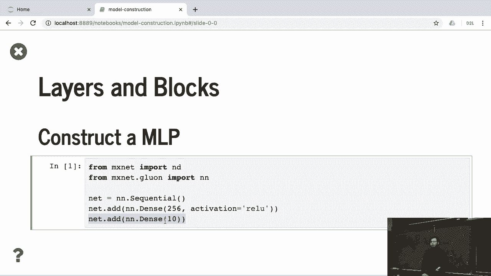

 Okay？ And the forward pass we generate random variable x。 We have two examples here and the input dimension is 20。 Each example have 20 features。 We initialize the parameter for the network and feed x with the input we can get the output， to y。 We can print here。 So because the last dense layer have 10 features we node output to wb2 which is number of examples。

 or the batch size and 10。 This number of features of the network。 Okay， that's what we already see。

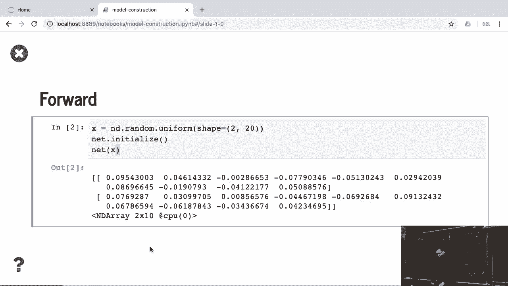

 Now let's re-implement the same multi-layer perception by the user customised block。

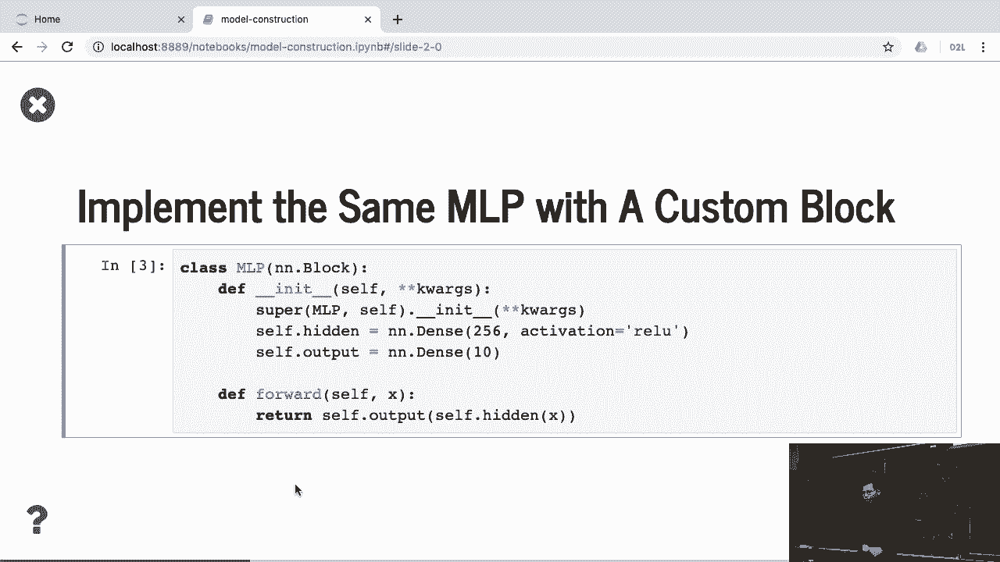

 If I use a pytorch before it's pretty similar。 Let me do it。 So what do we do here？

 We create a customised class MLP which is a subclass of a thing called a block。 Then this class have two functions。 One's got an it， one's got forward。 And the an it function that's really nice for code。 The first function we call the super class which is the unblock called unblock initialized。

 functions which is kind of initialize the data structures used by Groun and we can， the。 Groun let Haun can let you to initialize properly。

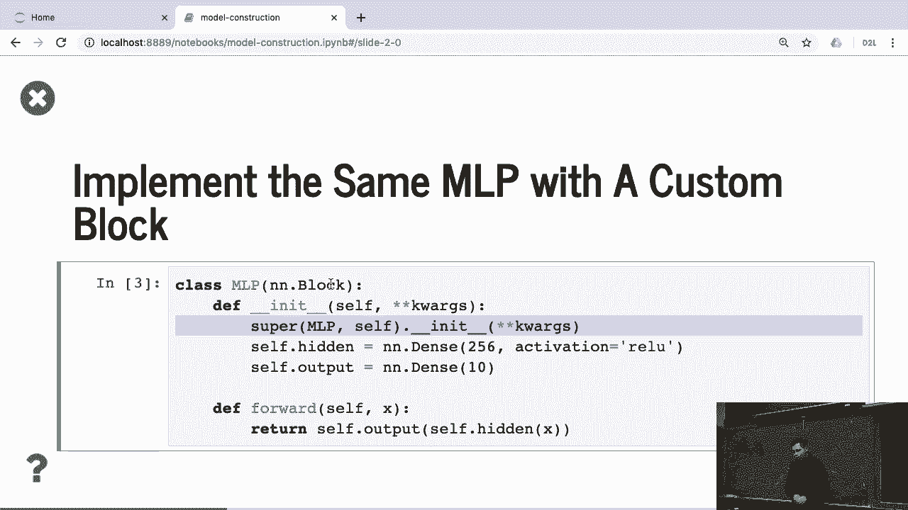

 Then the major purpose of any function is to define to create all these layers we can。 use the latter。 So here we create a hidden layer similar as what we have before and we create another。 output layer is not a dense layer。 So the fourth function we define how we compute the network。 Given the input X， this is the undi array we first give it to the hidden layer to get。

 output of the hidden layer and then get the output and then fit into the last dense layer。 get output so return the results。 There are two functions and it define the parameters。 forward function define the forward， functions。

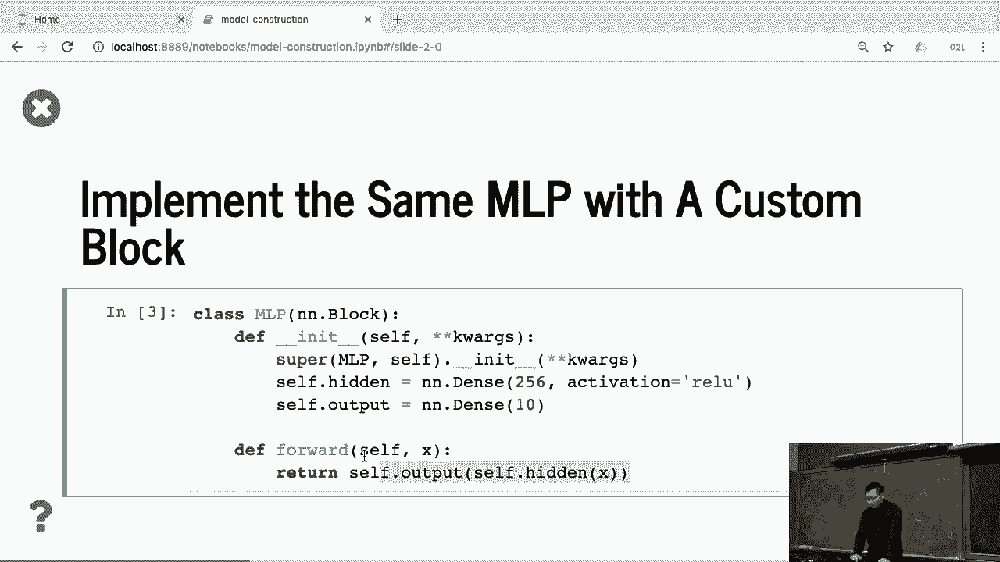

 So to use it is very similarly we create instance from MLP and then initialize the parameters。 and fit X we get the results。 So it's very similar to for sequential before。 So if you run this one we can run the net forward functions。

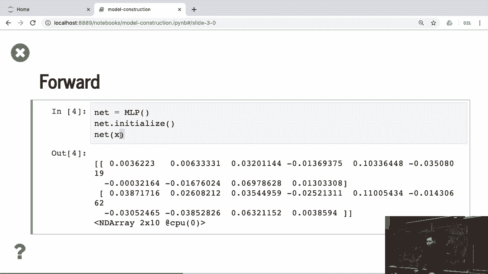

 Now using the unblock we can implement the thing very similar to un sequential before。 Here we call it my sequential。 So my sequential function is a subclass of unblock and it is initialization we don't have。 any layer yet and we define the add function every time we can add the layer or block we。 call the block。 So what do we do here？ So the unblock function has a thing called a charge which is a dictionary to store all。

 these layers we have。 So for given any block which is a layer or could be another network we are assuming it。 has a name， it's a string name and we store the string name is a dictionary given a string。 name and store into a charger。 So then in the forward function， what do we do here？

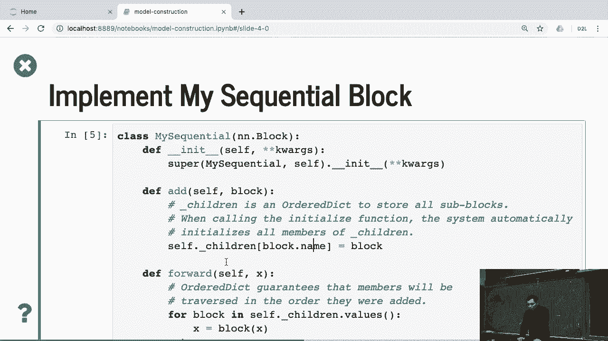

 We iterate all over the dictionary and for each block given X we just evaluate it because。 the children is all the dict in Python which means the traverse order will be same as the。 one you have to add into the dictionary。 So depending on how you add each layer here I can call this layer 1 by 1 and get the result。 and the return X。

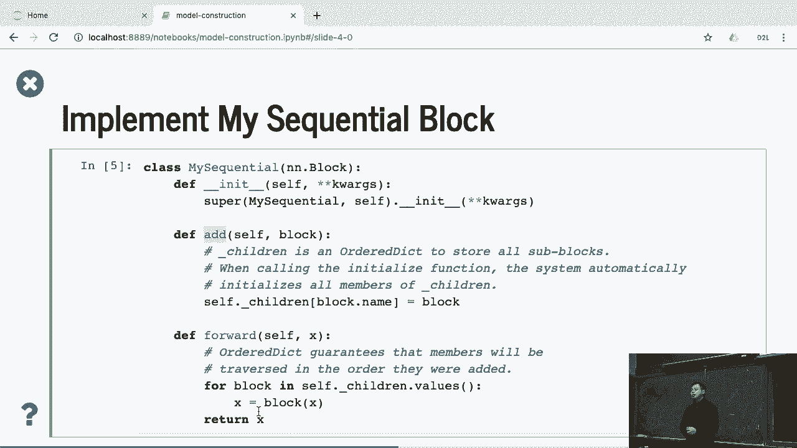

 So to use it， it's very similar to unsequential before。

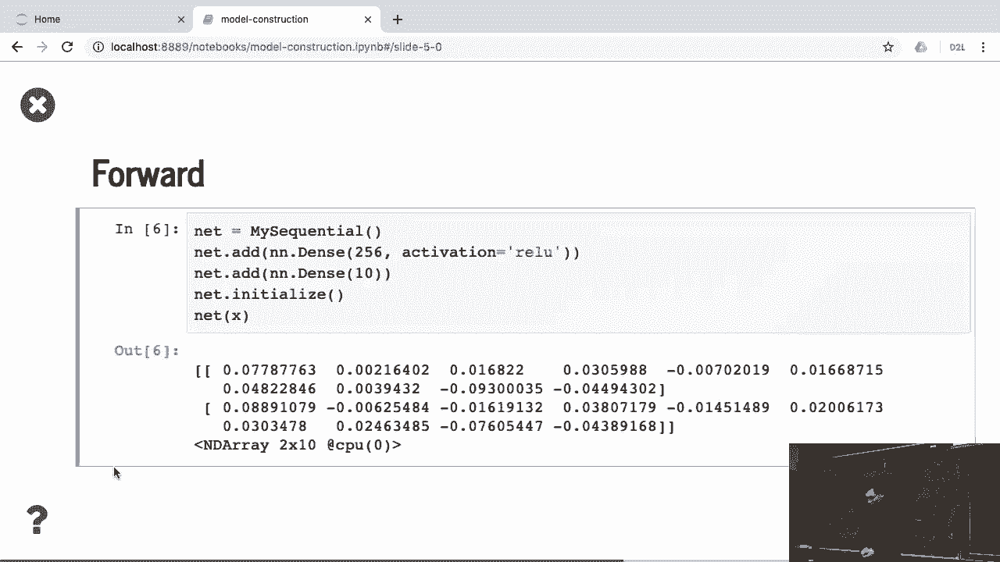

 We first create an instance here and then adding a hidden dense layer adding up layer。 initializes it and run forward function。 So basically we use unblock just to re-implement unsequential here。

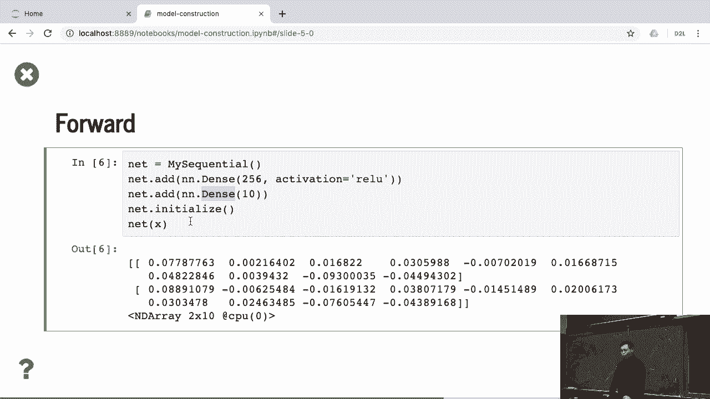

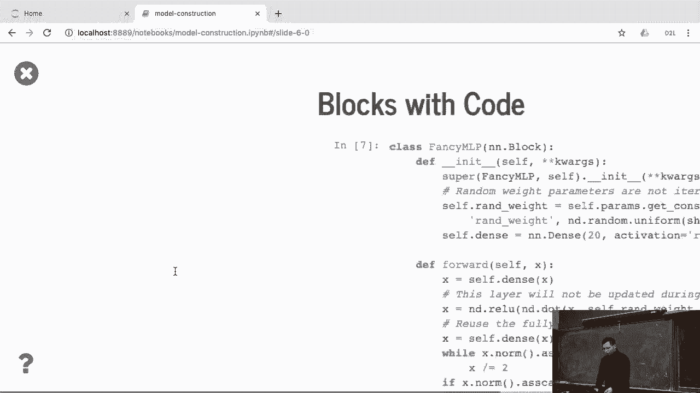

 The reason why we cannot use unblock because it provides a lot of flexibility to how to。 define network。 For example， here we do a fancy MLP if I don't know if it can train any meaningful result。 but I just want to show that you can write up tree code in the unblock。 So in the end of the function I do two things。 Firstly I create random variables。

 random parameters but I don't want to update these， parameters。 So what I do here。 the unblock have a parent， we can show the parent letter， a parent to。 store the parameters and we can get a constant means these parameters will not go into updating。 So it's going to fix during training。 So we are not going to compute gradients。

 And then it's a name we can talk about a little bit later， given the random uniform is 20 by， 20。 So this is random weight。 Otherwise like it's a normal dense layer。 like output is 20 and red as activation function。 Now the interesting thing is on the forward function。

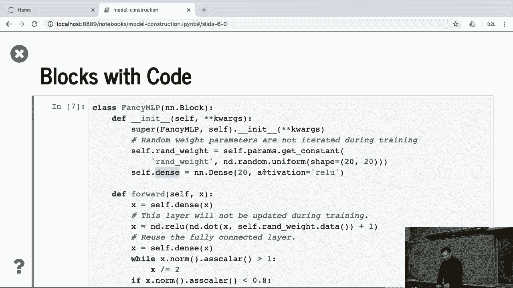

 So given x we first input into dense as normal。 Then here is another dense layer。 What do we do here？ Given x and we get the random weights and dot dot dot dot data to get the data and the。 bias is 1。 It's just a constant and the performance of red will here。 So basically this is a dense layer with the parameters， with the random parameters we generally。

 before and one bias layer。 So we are just this dense layer。 we are not getting updated during training。 Question？ No。 Then another interesting thing here。 the third layer， it just reuse the dense layer。 Which means the first dense layer and the third dense layer share the same parameter。 So when you compute the gradients， we first compute the gradient with respect to the third。

 layer and then with respect to the first layer and to the parameters the gradients just。 are some over these two layers。 And then also have some y and if I ask conditions here。 y we already show the autograph in the， notebook here。 Y in long， it's larger than 1。 I just reduce it and y if it's too small I just multiply it。

 So this full function can be writing obitricle here。 That's hard to make for the sequential interface。 Question？

 Why do you now want to update the script where you need it？ Just for show， you can do that。 Sometimes if you do fine tuning， we can show a letter which means you grab a network from。 the previous， try another dataset。 I just want to try a few top layers。 I'm going to fix the parameter at the bottom layer because my dataset is too small， I don't。

 want to overfit the network too much。 So I can fix a bunch of layers that one。 Also you want to do multi module training， you have pretty fancy network。 Every dataset。 multiple dataset， command， each dataset only trying a part of the network。 You can do a lot of fancy things。 Usually don't do that。

 Why do our blocks not carry around the information like container or the training history？

 So the reason is because block only defines the network and the parameters， that's all。 The trainer we are going to use in the network as an input and do updating。 That's just the design decisions。 The block only have parameters and the definition of the network。 The reason is because if you do inference， you only have a block。 You don't have other trainers。

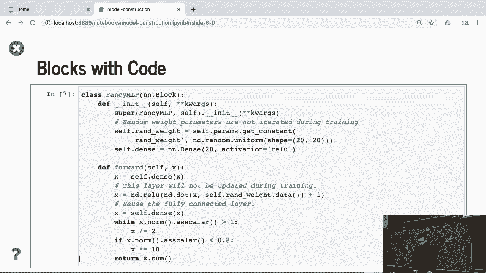

 Then the fancy MLP is similarly as before， like you can create instance， run the initializations。 and run the forward pass。

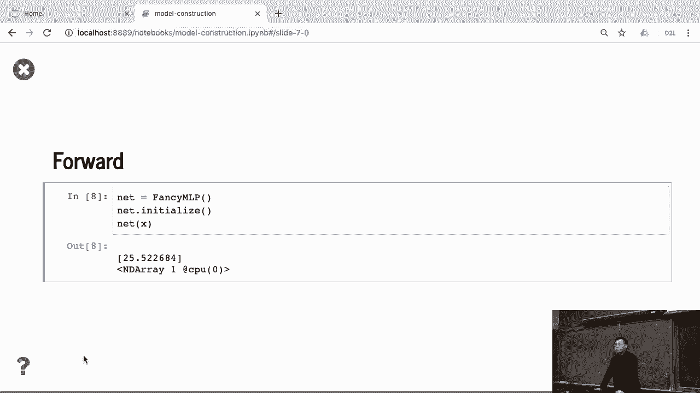

 That's as long as before。 The last one， like we can mix all the things together。 so no matter is the layer or it's， a customized block or a customized LOP or just a sequential。 all of them is a subclass， of a block。 So we can mix all of them together。 So here we define MLP and not MLP。 It has a sequential network。 Two dense layers， with it。

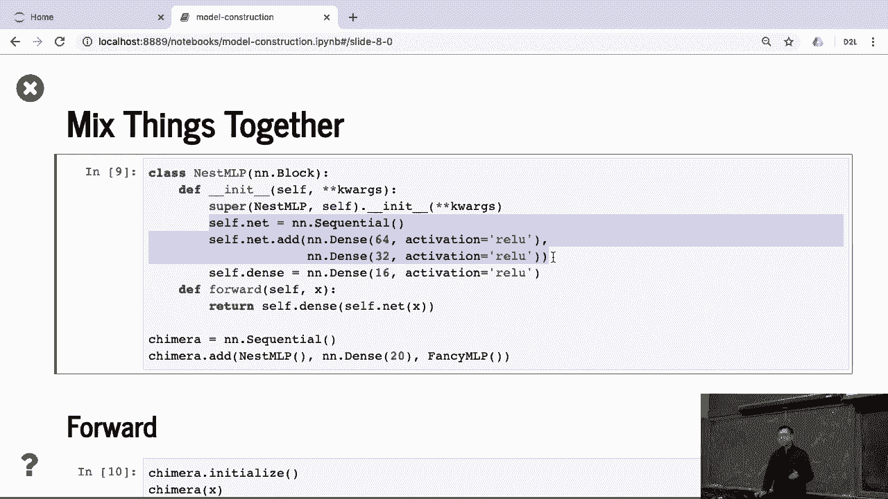

 Another is just a dense layer。 For the forward function， given x we fit into net and to dense。 So this MLP contains unsequential and also a single layer。 Then we can also do like we create a network。 It's a sequential。 And we put into the last MLP into the first block and then another dense layer in the second， block。

 And finally， we can initialize another fancy MLP as the last layer。 And this one is still like it can initialize and get x to compute results。

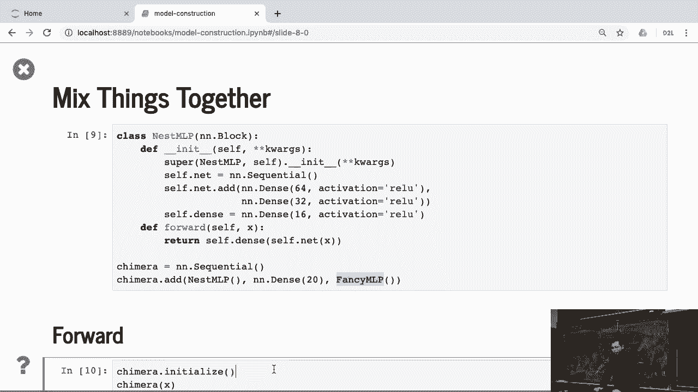

 Okay， so in practice， you can use unsequential， which is give you just put the layers in and。 get everything for you。 But if you have logic， you have a lot of fancy logic to do in the forward function。 actually， you can use unblock to implement by your own。 And the benefit here that you can easily debug。

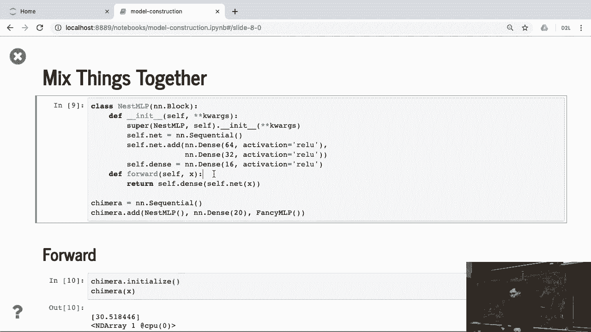

 For example， I can use y equal to I want to get the internal results， I can let self to。

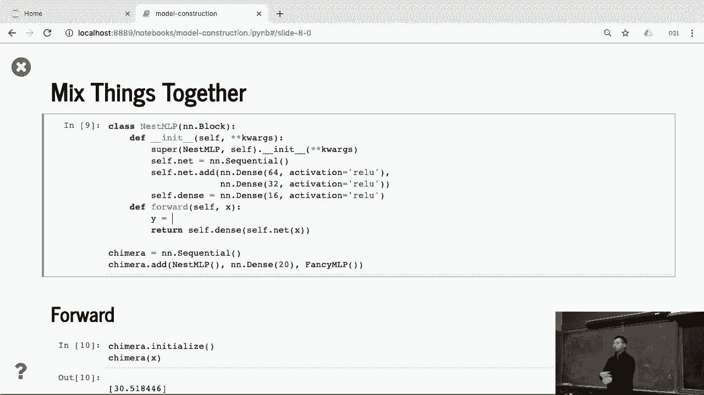

 x and I can print internal result and returns self dense。 So which means you can debugging at the internal results。 It's much flexible。 You can do a lot of things there。 Okay。

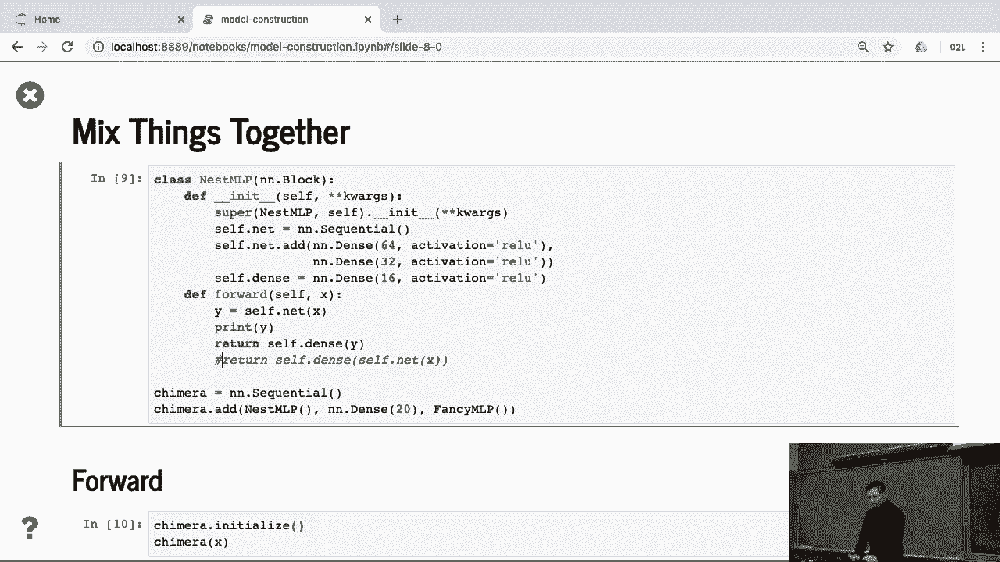

 [BLANK_AUDIO]。