# P50：50. L10_3 Managing Parameters - Python小能 - BV1CB4y1U7P6

 Once you define the network， another important thing， how to access the parameters。 So the ground block we have both the network definition and also parameters。 So we want to access and modify all the parameters。

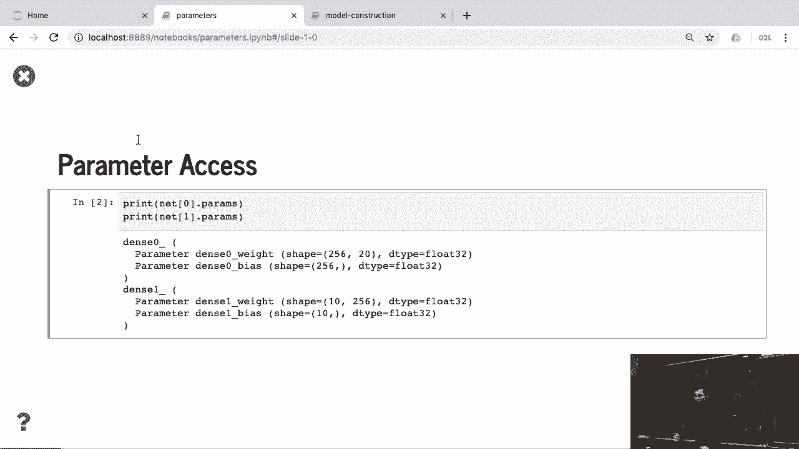

 So here we define a similar MLPS before， two dense layers， and initialize it。 and give random X and get the output。

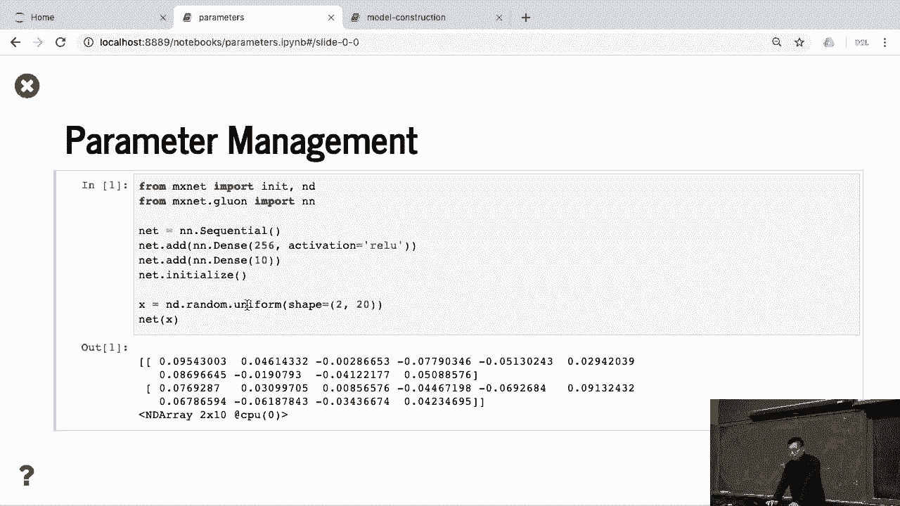

 Because we have two layers， we are using the un-sequential。 we can indexing each layer by zero and one。 So for each layer。 the dot_prance will tell you all the parameters we have。 So this is the first dense layer。 The parameter is dictionary， which is half a name called dense_zero， and the underscore weight。

 this is weight， and tells you the shape of the weight。 The input size is 20， and up size is 256。 Similarly， we have bias here。 For the second layer， we can access by net one。 but prance will still get all this weight and a bias here。

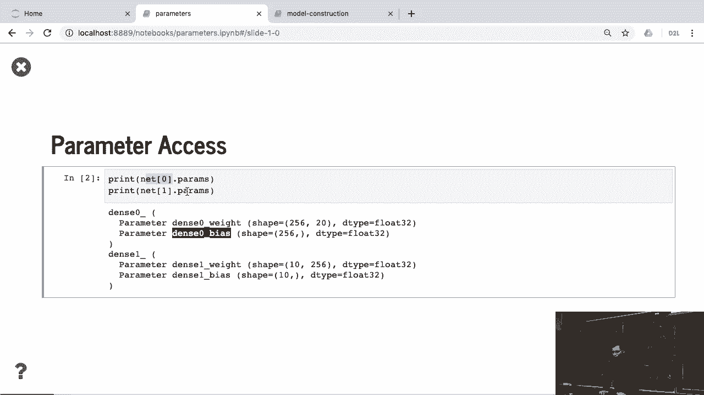

 Then， because it's dictionary， we can access the parameters using the string names。 Here I tell you the dense_zero， underscore weight， we cannot get the weight。 which is an instance of the parameter。 And if you call dot data。 actually get the under arrays of all the elements of the parameter。 Okay。

 So sometimes it's not so convenient to remember all these names。

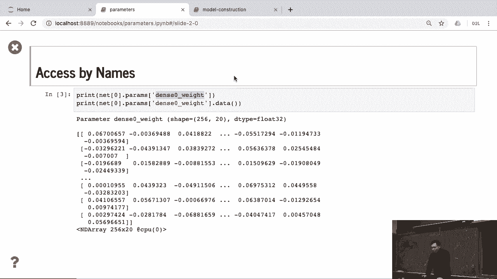

 Actually， you can access the bias using the dot bias。 So the second layer。 the second dense_zero_ bias is the parameter， and also the dot data。 you cannot get the under arrays。 All zeros。 So in default， we initialize all the bias into zero。

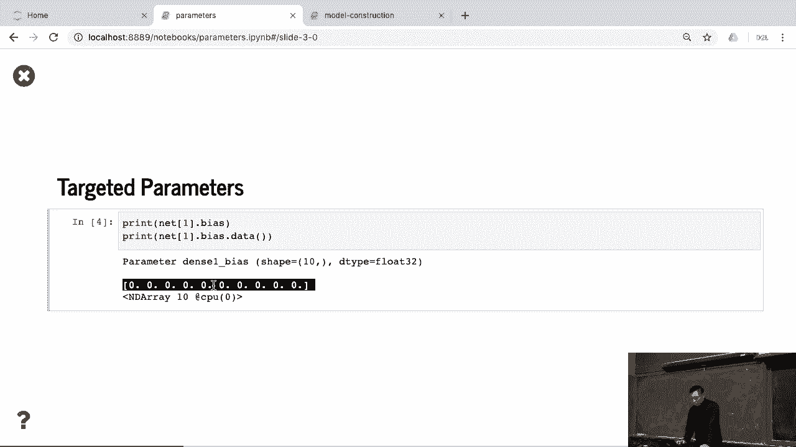

 Similarly， we can get the weight。 This is the first dense_layer's weight。 and the dot grad will give you the gradients matrix。 So this is the gradient matrix with respect to the weight。 So it has the same shape as the weight。 and in default all zeros。 So because we didn't do a backwater yet。 Okay。

 We can also get all the parameters by connect the primes。

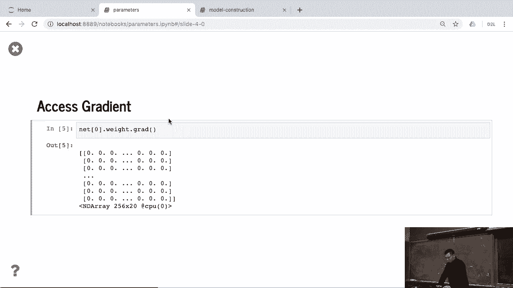

 So this is a network， we connect all the parameters， we have two layers。 Each layer have weight and the bias。 Now we get the dictionary of four items。 The dense_zero_weight。 dense_zero_ bias， dense_one_weight， dense_one_bias。 So because it's dictionary。 we can access a particular bias using the name。

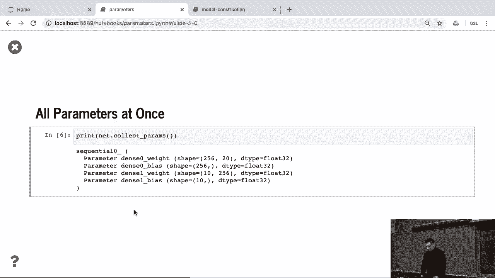

 That's a small mess before。 The useful thing here， we can access patterns。

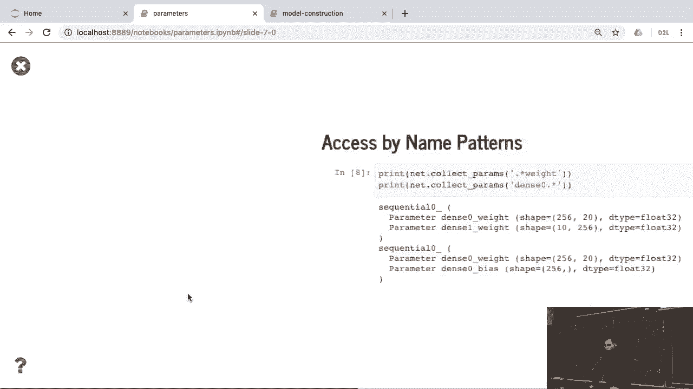

 Which means all the weights for different layers。 So this is dense_zero_weight， dense_one_weight。 The dense_zero， this is the first layer， all the primers you have。 The weight bias。 so you can get by patterns。 Okay。

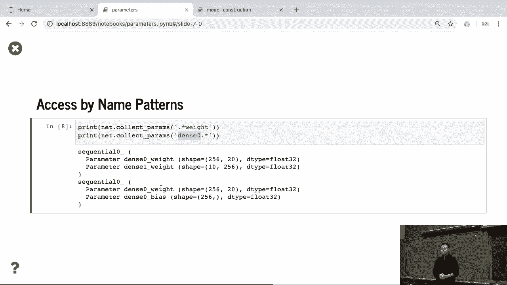

 Now， not about initialization。 At homework you may be seeing that initialization is pretty important。 If you did an initialize well， if you run multiple times you get the random。 you get lots of stable results。 So we only showed how to use the initialize default initializations。 Now you can do， like， you can use init to use a different one。 Using normal， for example。

 the normal distribution with the sigma， which is standard deviation， equal to 0。01。 And we use force init because net， we already have initializer before。 We're going to call it twice。 Sometimes usually due to bulk， we're going to generate warning message。 So you're going to tell me that I'm going to force rate init this primers。

 Now we can access the weight， the first layer， the weight and the data。

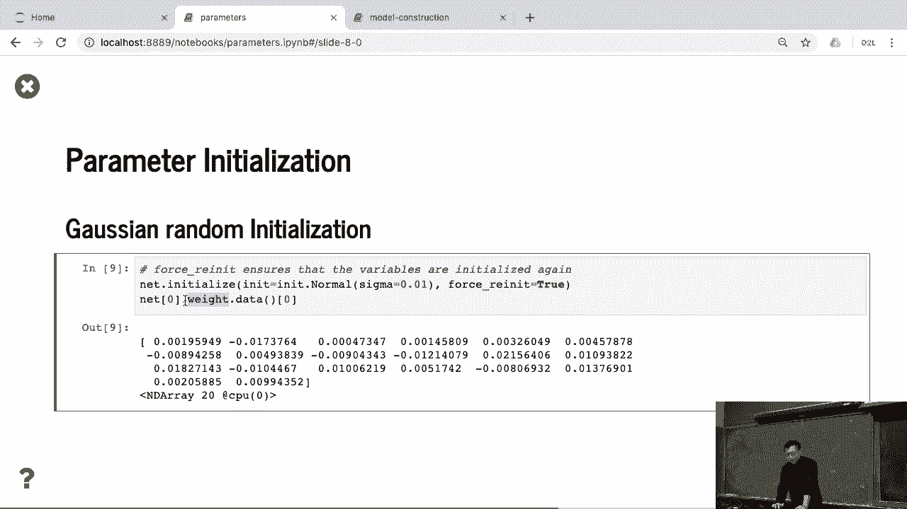

 and the first row of the data。 You can see that， like。 these random variables according to this distribution。

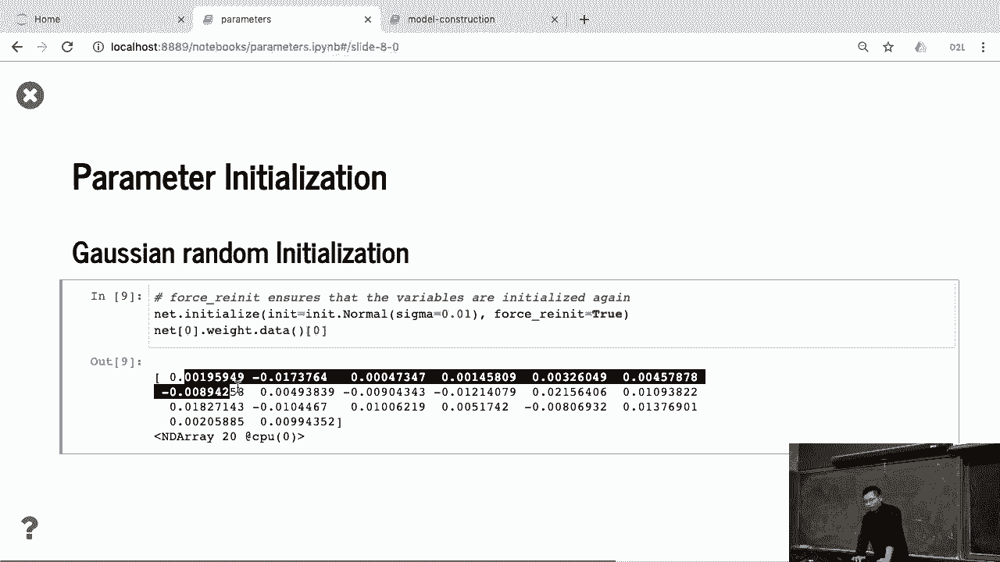

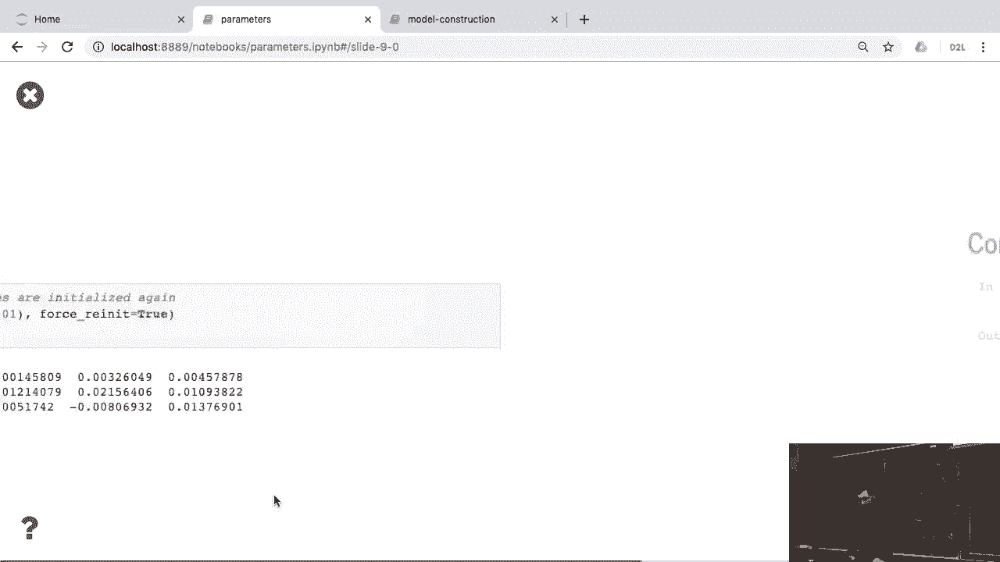

 Also we can do constant initialization， which is， it should don't happen。 You can do that， okay。 I can use a constant equal to 1。 Also you can do， for one， you can just give an DRA。 For example。 I know I grabbed this weight from a different network。 I'm going to initialize that weight using the other network。 You just grab the DRA here。

 you can also do the constants as well。

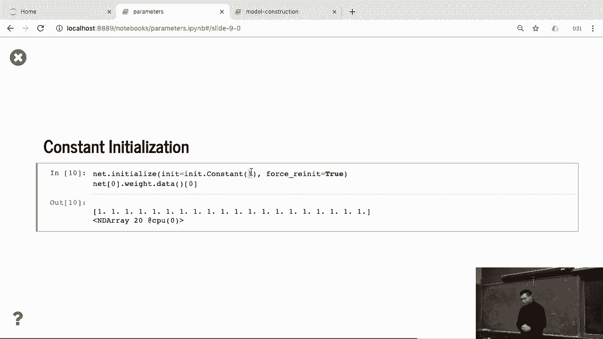

 That one that you can specify different initializers for different layers。 In default。 we're going to use constant。 But in the second layer， we're going to use constant。 And in the first layer， for the weight， we're going to use in the X-VIR initializers。 That's kind of useful if you have a network have very different parts。

 And you can initialize one part with maybe a prime method for another network。 and the other one with random variables。

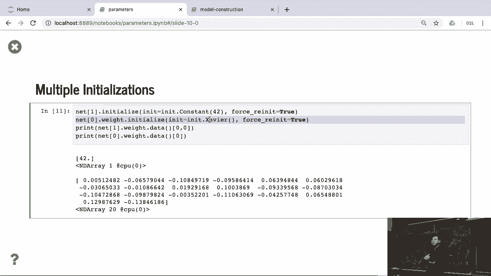

 Also you can do even more fancy things。

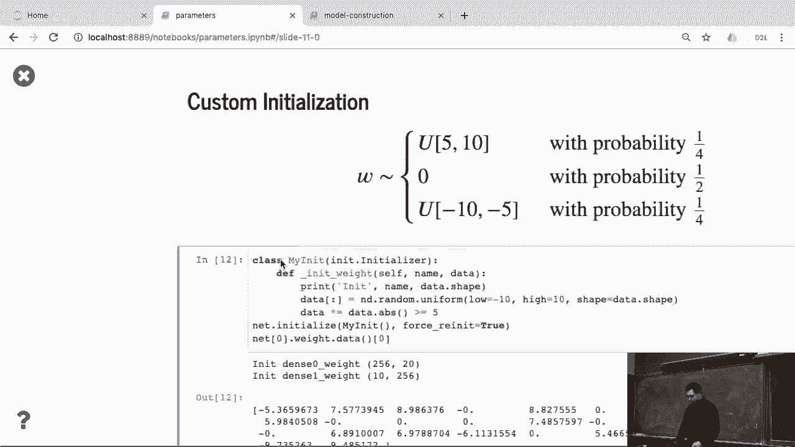

 You can write a customized function to do arbitrary things。 For example。 I create a class called my_init， which is a subset of， it's a sub-class of init initializer。 And I define the init with function。 So the name， you can ignore the name， this is the layer name。 And the data actually the data。 What it do is like this function kind of rewrite the elements on the data。

 You can do whatever you want。 For example， here I'm going to create， I'm going to initialize data。 and then I'm going to call it into this distribution。 So what we can see that I replace data with something here I cannot dive deep。 and then also do some defenses things here。 So when I initialize it。

 I can pass the instance of my initializers。 And then if I call it， I can show， okay。 this is the log message I have。 That's zero's weight， and the initializer's dense one's weight。

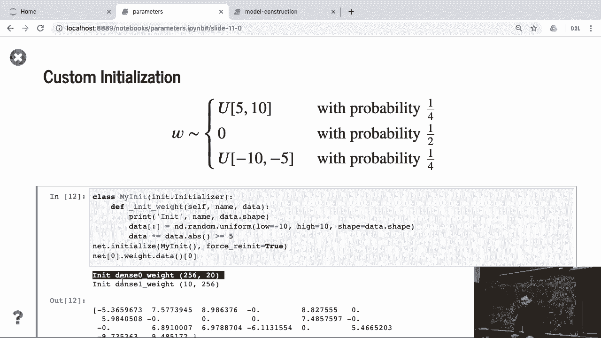

 and the causes function to pass the data in。 Okay， so by this way， you can write it up。 you can use a non-pilot， you can modify the weight you want。

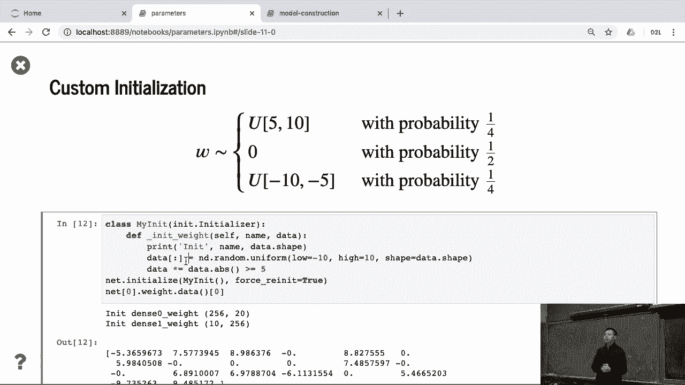

 A more stressful way that you just grab， you first initialize by random。 and then grab the data and modify it by yourself。 For example， here I do the dense layer。 get the weight， get the data， and all of them plus by one。 And then for the first element。 I change it to 42， and then I print the first row， you can see that the first element is 42。

 and all the others like at least is a lot of ones there。 Okay。

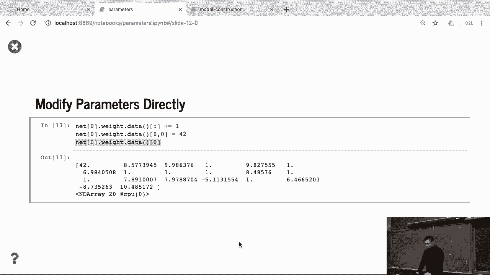

 The last thing here is that we already showed that using unblock。 we can share the parameters for different layers。 Here we can do that again。 but using un-sequential。 We first create the dense layer。 Then using the un-sequential。 we first insert another dense layer， the dense layer we created before， and this one。

 and then pass the prance equals to the shared prance。 which means I can create dense layer with the parameters， from the shared parameters。 which means these two layers， are going to share the same parameters。 To compute gradients。 we compute gradients over these two layers， and then some data together for the parameter。

 So that is actually not a copy， just a share。 And here is something you can show that。 If I modify the first， the second dense layer's weight。 actually I can modify the third layer's weight as well， because they're shared just a point。 Any questions so far？ Okay。 So these tricks let you to like can do fancy networks。

 and do fancy training letters， but in most cases， you don't need it too much。

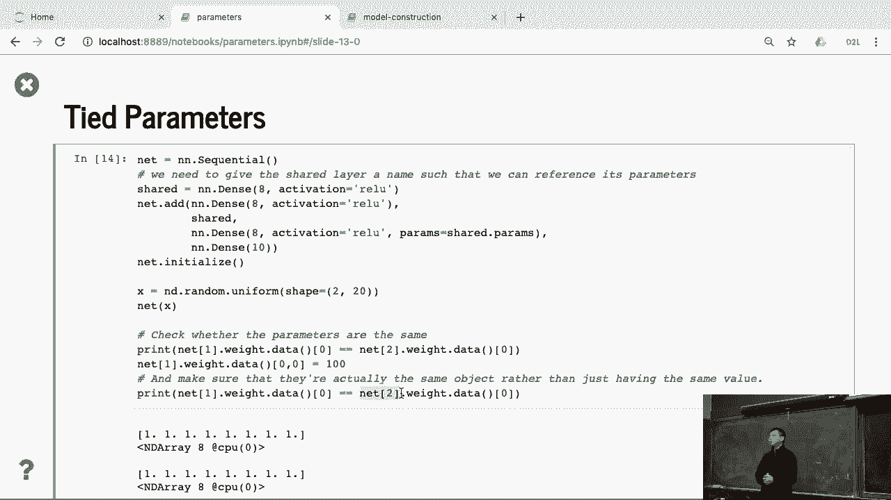