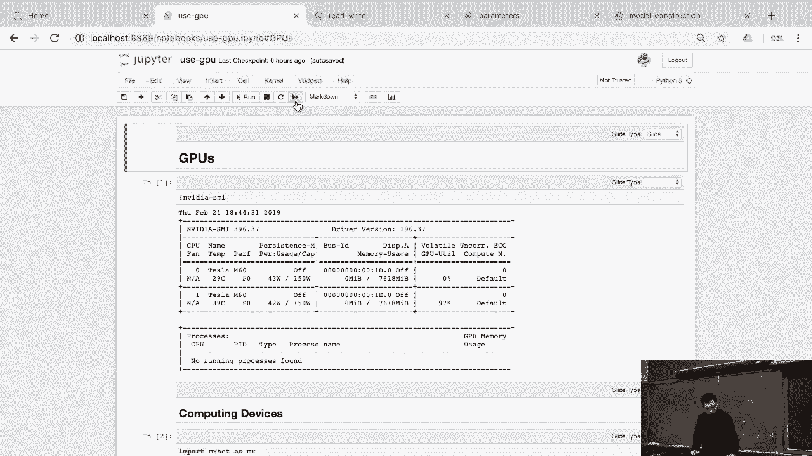
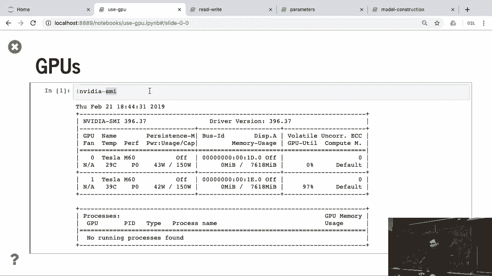
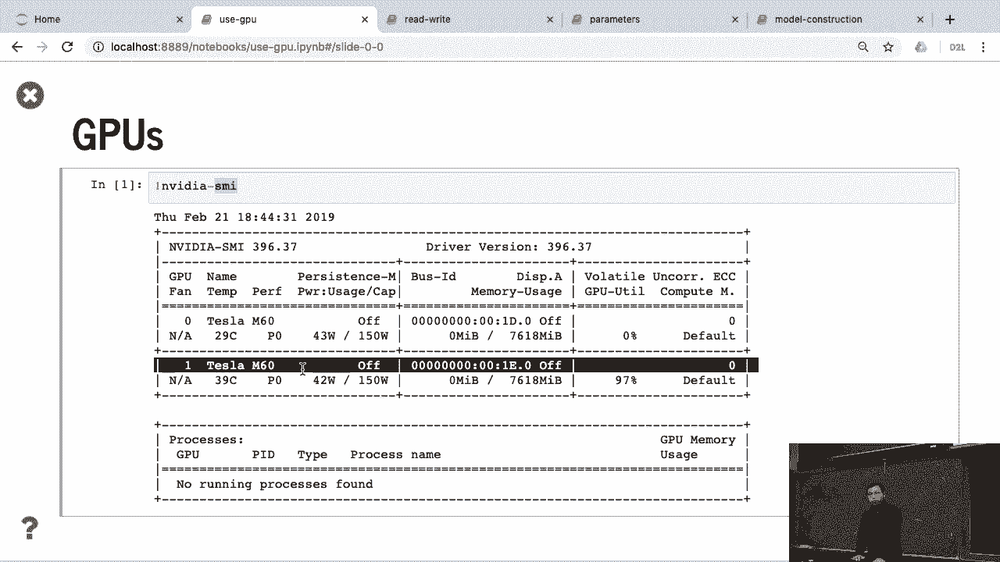
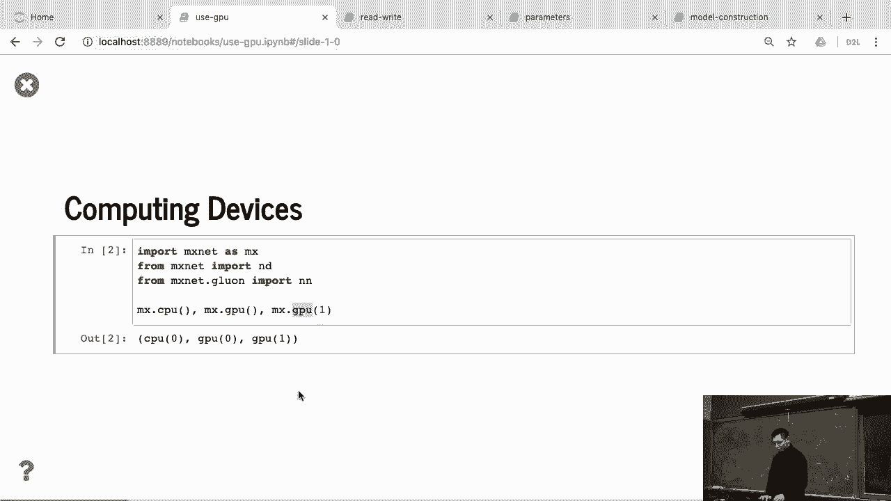
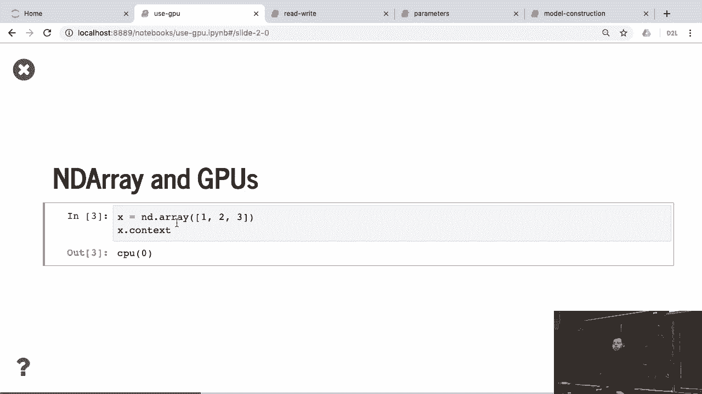
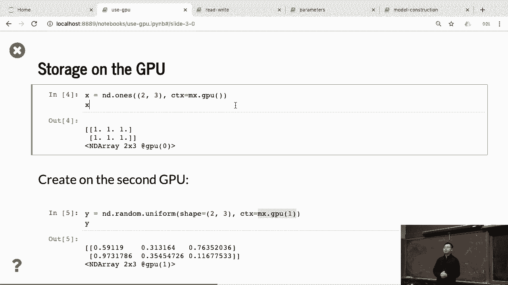
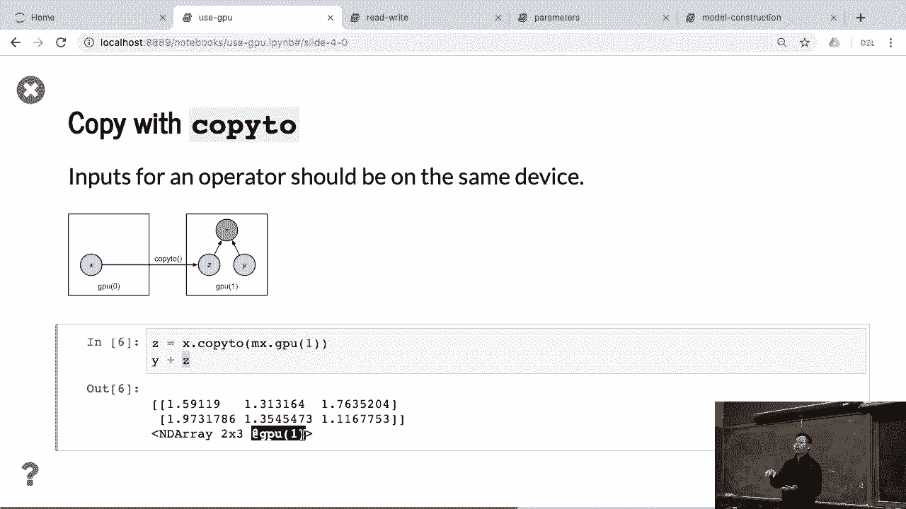
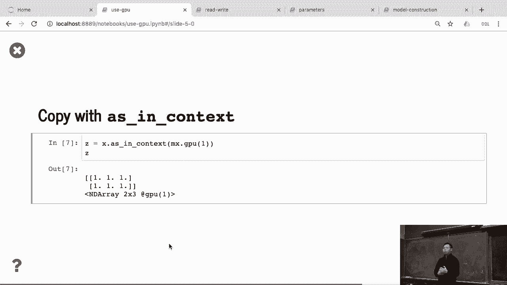
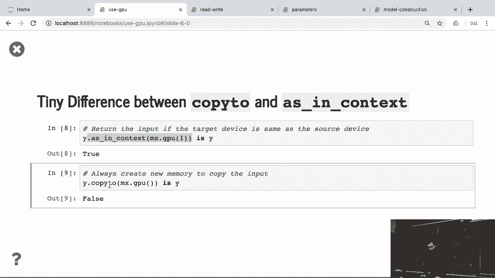
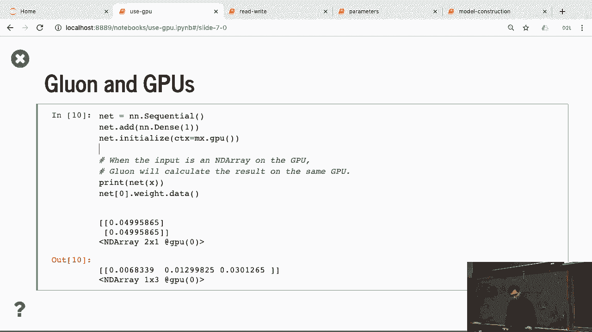

# P51：51. L10_5 Using GPUs - Python小能 - BV1CB4y1U7P6

 >> Using GPUs， my lab doesn't have GPU。

 so I cannot run this notebook。 You can either using AWS or you can use a core lab as well。 So you can top check if you have GPUs by， run this media-smi。 here I show that I have small two GPUs here。

 Okay， so for GPUs， you can introduce not a concept with core device。 They can either have CPUs or GPUs， before you can use the first GPU。 and you can specify which GPU you can have。 GPU 1 means the second GPU you have。 So here you can see that CPU is a CPU 0。 The 0 doesn't matter anything。

 so no matter how many GPU you have， you just a CPU 0， a CPU 0。 But for GPUs， this matters。 If you have two GPUs， you need distinguish the two GPUs。 So in default。 you're going to have a GPU 0， and then you give 1， I'm going to get a second GPU。

 So if I create a array， access what the device is on by using x。contact。 So in default。 it's going to sit on CPU memory。

 And if I'm going to change it， we can specify CTX is a short of context by using GPUs。 So when you do that， you can see that here's the device。 Now this x we sit on GPU。 You already see that on the whole work。 Well， you can do random numbers as well， then but on GPU 1。 Because this machine I run on the AWS machine， then have two GPUs。 We actually can run on the GPU 1。

 But if you don't have GPU， then you， can-- if you don't have so many GPUs。 you get the error message。

 One thing here， what's the data that's on GPUs？ We can make computations。 The computations we have happens on the devices， what the input data are。 So for example。 if x is on GPU 0， and the y is on GPU 1， I cannot make computation， because it's on different GPUs。 If you want to make the data on GPU 1， any copy x into GPU 1。

 The reason we want users to explicitly copy data to GPU， to the same device is not just a fault。 We cannot implement that。 It's only tell you because we can secretly copy data for you。 But if you do that， your program may be too slow， because copy data from GPU to GPU is fine。 but GPU CPU is pretty slow。 We really want you to explicitly copy data to a particular GPU。

 So you know that we're the computational running。 But maybe in the future。 GPU to GPU bandwidth is so high， and GPU to GPU bandwidth is so high， we maybe just ignore that。 You don't need to force every-- you can automatically schedule， for you。 But here。 you need to just x copy to the second GPU， z， and perform the results。

 Because y is allocated on GPU， the second GPU， you can see that both y plus z going to sit on the second GPU。 as well。 So the operator will happens on the device。 where the input has an output that will have the same device。

 as well。 You can also do as in context instead of copy to。

 Almost give you the same results。 But different here is that if y is already on the second GPU。 and as in context using the second GPU， we do nothing。 Just return y itself。 So here。 y as in context GPU 1 actually is y。 So it's fine for you to write a lot of as in context on your code。 You don't frequently copy and move the data。 If you do copy to， no matter which GPU you have。

 we always copy it。 It's just a copy。 So be careful if you write a lot of copy to it。 make your program much slower。 And using Google， what you do here。

 is that while you do initializations， I can specify the context。 So you can specify the context on the GPU you're going to have。 And also you can copy if you can initialize on CPU， and copy to as well， the latter。 But here。 the normal way that it initializes， on the particular GPU。 Then once the prime is on that GPU。

 you need to copy the x。 Make sure that x is also on GPU as well。 So before we already copy x into the GPU 0， so this happens well。 So you can see that the result is also， happens on the first GPU。 And the weight is also on the GPU 0 as well。 So if you're going to change to another one。

 you can change to another GPU。 You can x can copy to another GPU。 Primitives can also copy to another GPU as well。 So in the future。 we're going to tell you about multi-gPUs。 You can run that organ on multi-gPUs， but not today。 [BLANK_AUDIO]。

