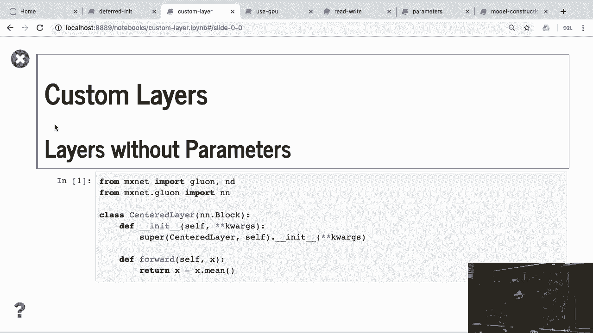
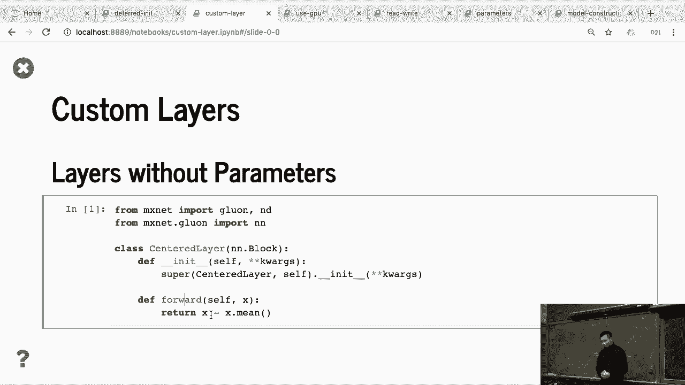
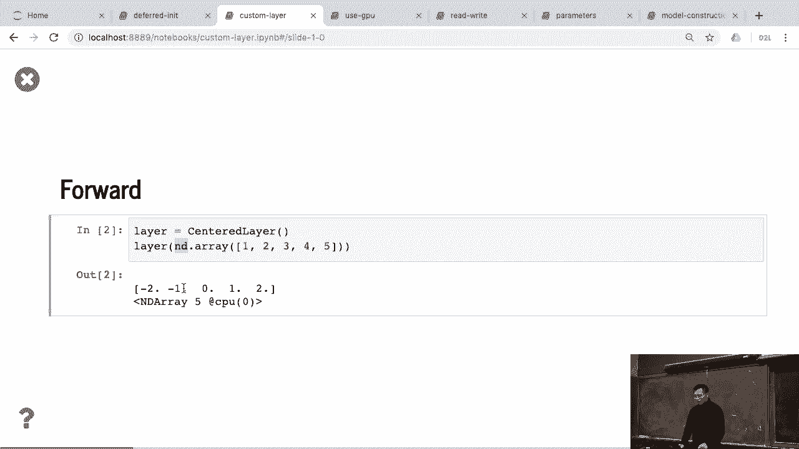
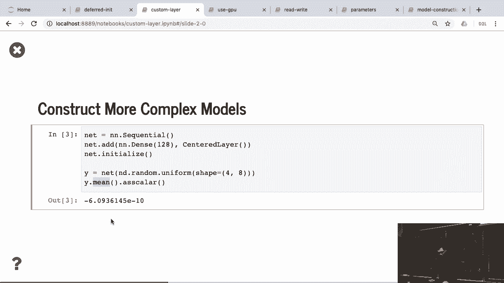
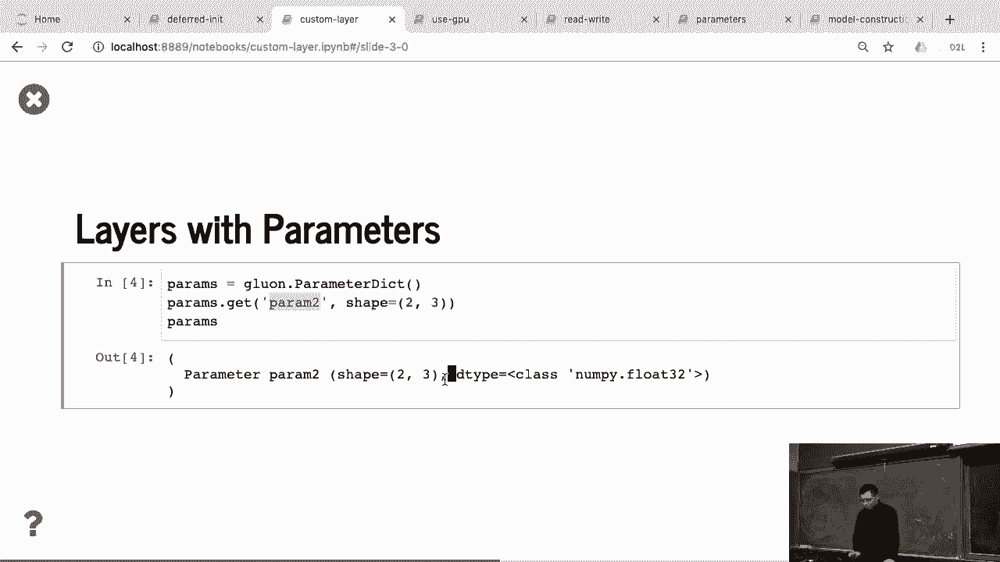
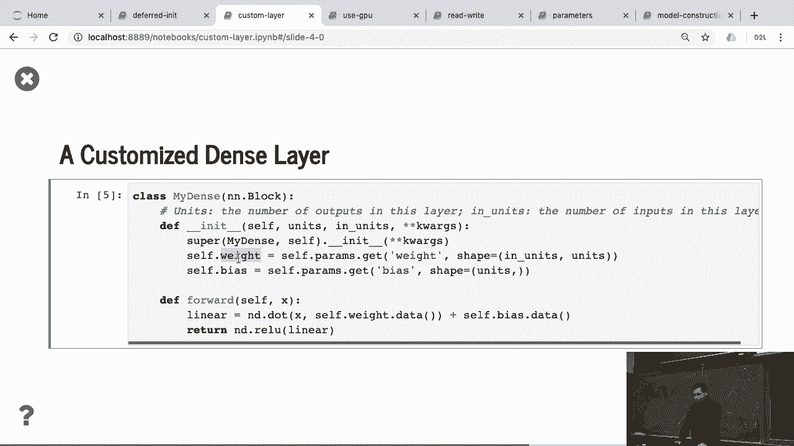
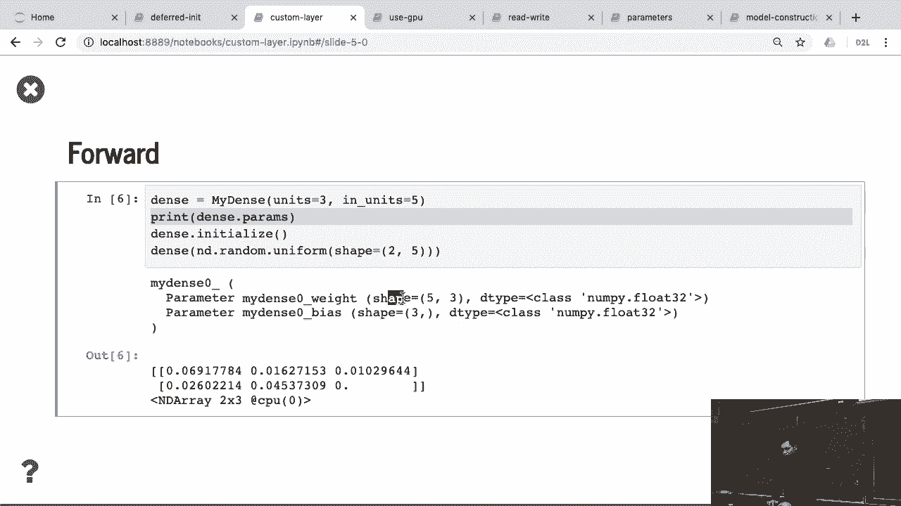
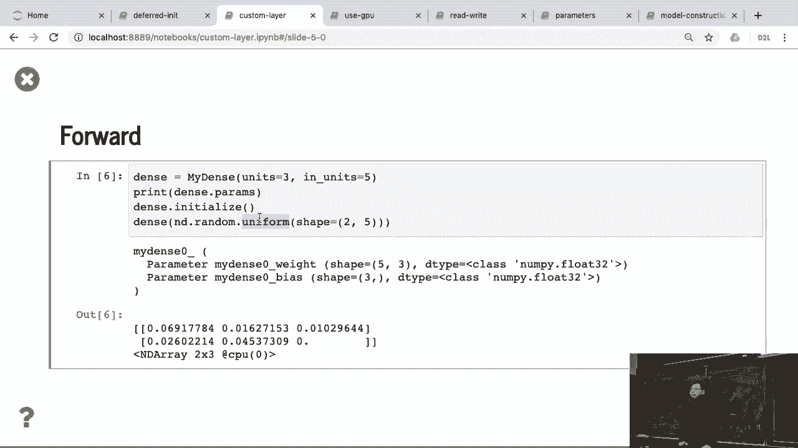
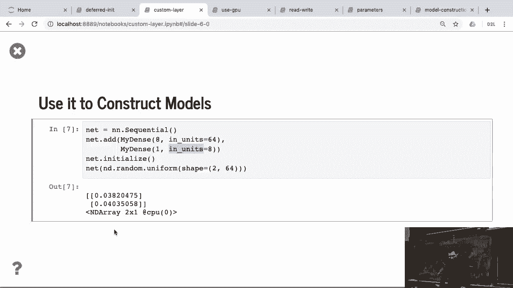

# P52：52. L10_6 Customized Layers - Python小能 - BV1CB4y1U7P6

 Okay， here's how to define a cosmous layer。

 This is， if you do a research， you may be designing， okay， I have a new idea about how to do。 fancy layers and a change in that work， so I can design new kinds of layers。 So here， for example。 I do a center layer。 What I do here， I just make the input have zero centered。 So what I do is like very similar to what， we define MLP before。

 we create a class called center layer， which is a subclass of unblock。 Similarly。 we define the init function， but， we don't have primitives for this layer， so。 we just call the unblock initializer。 And in a fold function， given x。 we generally turn x minus by its min。 So now the output we have zero centered。 Do you use it？

 It's very similar to like a cosmous MLP that we create instance and， feed the data 1， 2， 3， 4， 5。 and， you can see that output is centralized， like minus 2， minus 1， 0， 1， 2。 Okay。 and you can think it's a network or。

 you can think as a layer as well。 So for example， I can create the unsequential， give a dense layer。 and my customized center layer。 So in Grown， there's no difference between layers。 netalworks on the block。 Because in the future， we can see that usually we create netalworks not just。 a layer by layer， we organize two blocks and several blocks and a lot of follow。

 So that layers network all the other things just a sub-class of unblock。 So given a customized layer， we can initialize it and given a random x， we can get the results。 We see that the results min is actually pretty small number。 It's not close to zero。 So previously the layer doesn't have any parameters。

 Now we can create a layer half its own parameter。 What we do here， firstly。 we know that all the parameters is dictionary。 It's called parameter dict。 For dictionary。 you can create a layer given the name of the layer。 the name of the parameter and the shape of the parameter。

 So we don't need a device right now because device we cannot get the device letter。 So if you get this one and the parameter， we actually insert a new。 parameter into this dictionary and you see that this dictionary have a parameter， the length。 prime two， the shape is here。 But you can also specify the data type as well。 Now using it。

 now we can create a dense layer， my dense layer is similar to what we have before。

 You can similarly， we can have two functions， once the init function， once the forward function。 The init function， it outputs the unit， the output size， the init unit， it's the input size。 So we initialize it again， there's a two thing key thing here。 From the parameter。 we create a new parameter called weight。 And the shape is the input size， the output size。

 And save it in the self。weight。 Similarly， we create the bias from the parameters and save into the bias。 In the fault function， given x， we can do the multiplication between x and， the self-weight。data。 this because we need the data to get the parameters and， the plus the bias。 So two things here。 before different to implementing a implementation from scratch。

 that we didn't specify the initializer yet。 We just tell the system， okay。 I can create a parameter with this shape。 And which device and which initialization method we can let on。 we can specify that。 Also， we save the parameter in the weight so that either we can access。 the parameter by using name， weight， or I can just access by dot weight。 It's a member。 Okay。

 so to use it， it's very similar as before。

 Like， we create my dense layer， the output size is 3， the input size is 5。 and then I put the parameters， you can see that here's the weight。 The length weight。 and this layer name is called my dense zero。 So the parameter length。 the layer name with the parameter name。 And we have the shape here， similarly we initialize it and。

 given random input we can get the output。 Okay， any questions so far？

 We can use it to construct multi-layer perceptions， for example。

 given un-sequential past my dense layer， which is output equal to 8。 And the only thing differently here， we need to specify the input shape。 Before we don't need to do that， we can explain why later。 Also， for the second dense layer。 we're gonna tell you the input size of this dense layer。 Then initialize it now。

 because we know the network， input dimension could be 64， the X should be half the 64 here。 So the shape should match。 So the input X should match the first layer input size。 and the first layer output size should match the second layer input size。 Okay， so when you compute。 you get 2 by 1 matrix Y here。 Okay， so that's all about。

