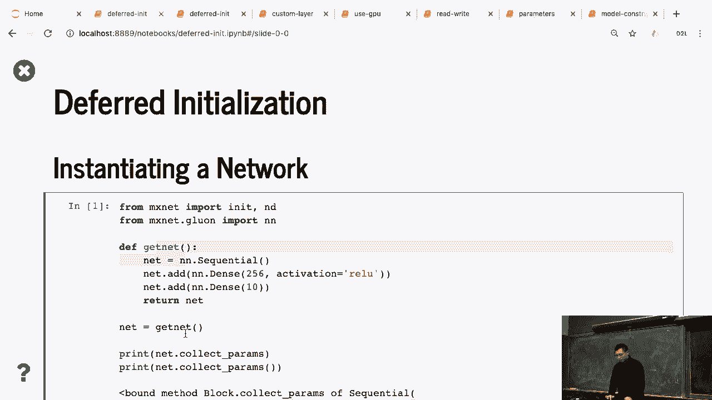
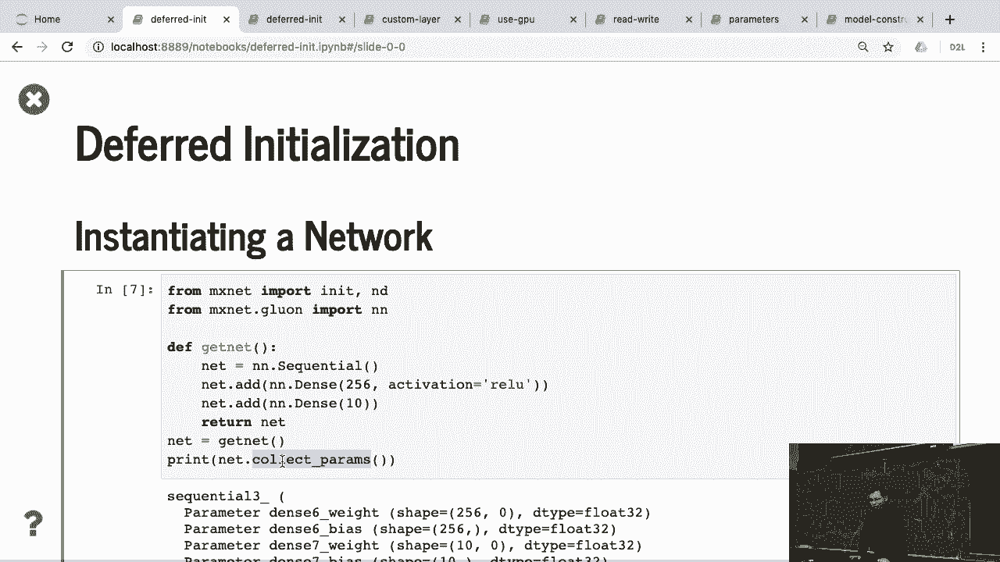
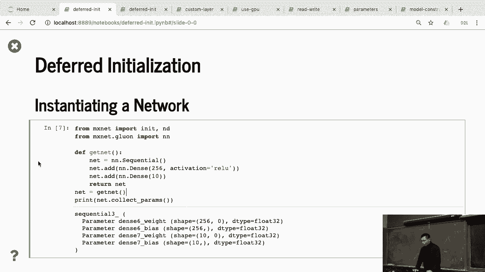
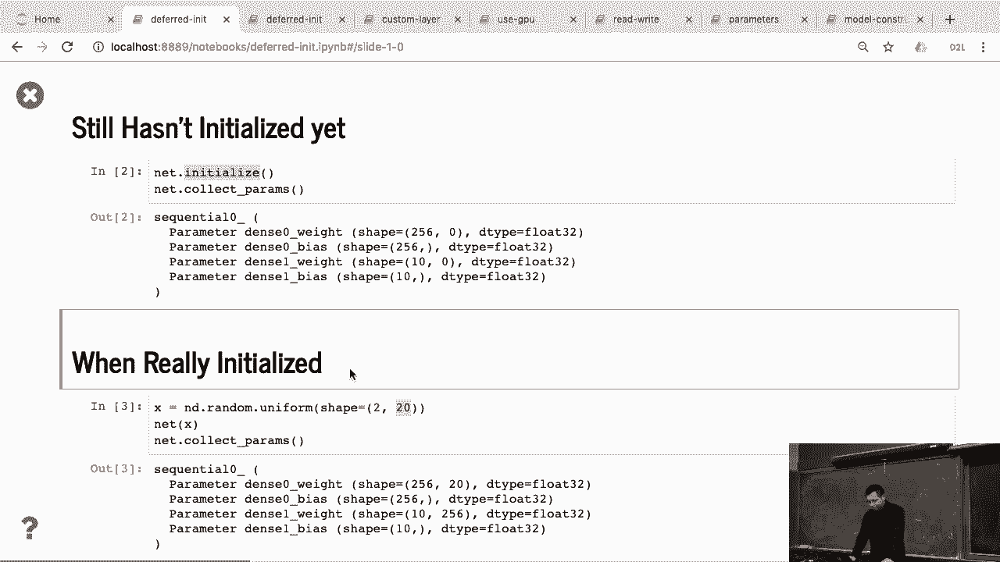
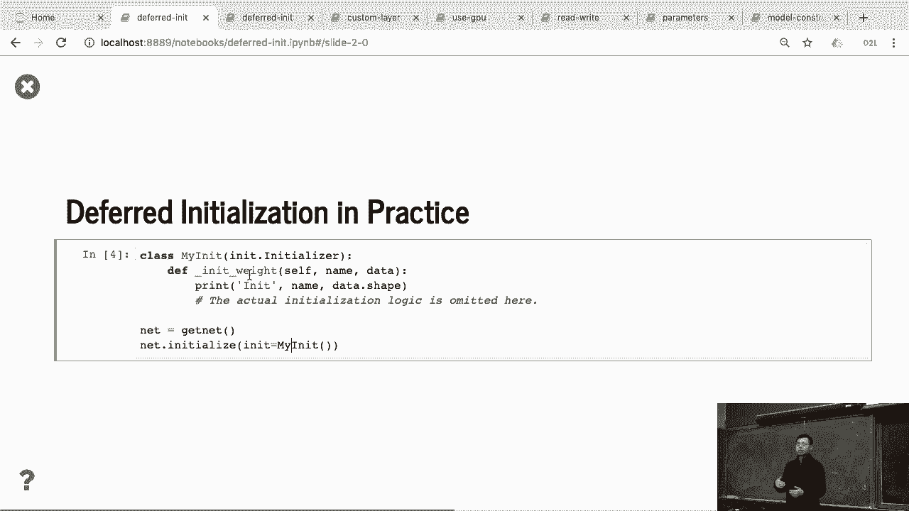
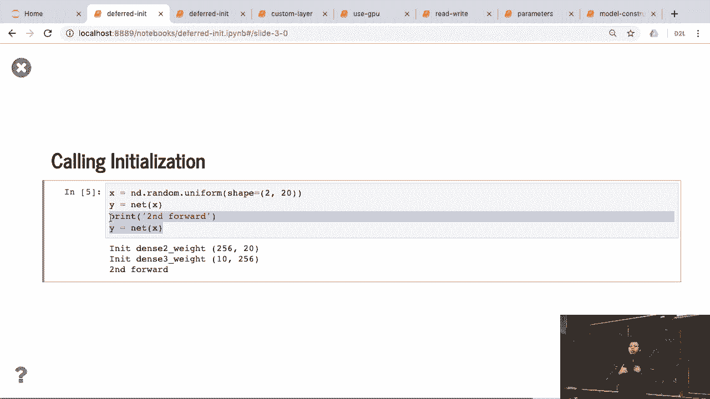
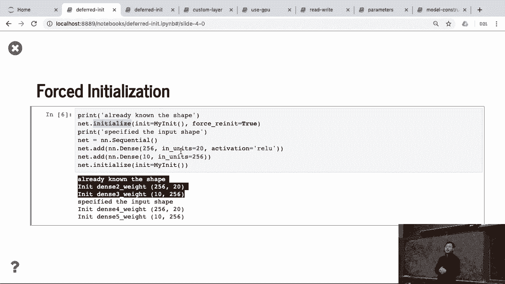
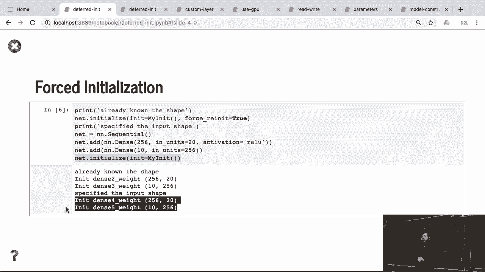

# P53：53. L10_7 Deferred Initialization - Python小能 - BV1CB4y1U7P6

 It's got deferred initialization。 So here， we create the network here。 Again。 this is the example we， used during this lecture， two dense layers。 We get network。 let me delete this one， make it shorter。

 So we create the network and print the connect parameters。

 returns all the parameters you have。 But we can see that， well， the weight here， the shape。 we know 256 is the output shape we specify here。 Because we didn't have any simple input shape。 it is 0 at this moment。 So you can see the 0 here。 Similarly， bias。 we know that no matter the input size， the bias is already as a vector， as we have the same name。

 as the output。 So bias， I know the shape。 The second this layer， again， I don't know the shape。 because I did an infer from the previous layer right now。 But bias is fine。 So at this moment。 we give some shape， but only partial information already。 So we cannot infer。 get all the shapes for all the parameters。

 yet。 Now， again， we call initialize。 That's a tricky thing。 We call it initialize。 But this function actually doesn't call anything。 You just initialize it。 You can tell me， OK。 what initialization method， they're going to use， Gaussian or constant or X， year。 or which device they're going to have。 But again， I still don't know the input size。

 So if we call the connect parameters， nothing changed。 There's still a bunch of zeros here。 So if we access the data， you get nothing， because with idonal shape。 I didn't allocate the memory right， now。 What we really do is I give the input X。 I feed X into data。 Now I know the input size。 Because X have 20， that features 20。

 so now I inferred the network， the shape is 20。 And also， I run the second layer。 I know it's 256。 So the tricky thing here， in most cases， if it didn't specify the input shape。 we cannot access the parameters until you actually， put the actual data in。 Or you can specify the input shape at the beginning， but it didn't do that。

 It didn't get access to the parameters。 So that's the key thing， maybe you're going to remember。 So let's look into what actually happens there。

 I define my init function。 I do nothing， just print when I need this function。 So again。 I get a network。 I co-initialize， give my initial function。 Nothing output it。 which means my initializer， didn't ask you the yet， because I don't。

 know the input shape right now。 Now， I general X， general X， fit X into the fourth function。 You can see that， OK， now I have the data。 Before I run the fourth function。 I just call my initializers， which is calling here， like an initializer weight。 Well。 the second time， the second of all the pass， I should not do that。

 Because we are going to update that， I cannot initialize it， again。 so that only happens on the first time。

 It didn't call that before。 If I do a fourth， re-init， then--， because if I do that。 because before I already fit data， the net already know the shape。 So if I call init again。 actually， it， need to function there here， because I know the shapes。 The other thing that you really don't want to defer the initializer， you can do， like。

 similar to what my customized dense layer。

 before， you can specify the input unit。 You can specify this dense layer， the input size 20。 and this dense layer， the input size is 256。 Now， I know the shape at the beginning。 so if I call initializer， initialize， I actually call this immediately。 That's all about things。 Even that we only do very simple things。 But at the end， we're going to talk about the hand just。

 layers convolutional networks， so defer the initialization， pretty important， because you cannot--。 now it's simple network， I know each layer size， but if I get 100 layers。 it's really hard to computerize internally。

 So usually we use different initialization。 OK。