# P54：54. L11_2 Convolutions - Python小能 - BV1CB4y1U7P6

 Convolutional neural networks。 So far what we had was we went up to the state of the art。 around maybe the year 2000。 No， sorry， the year 1990， 1992。 And so now comes this really amazing time when basically， Jan Lickar and his team at AT&T invented。 convolutional neural networks。 And we'll see how far we get with that today。

 Probably we are not going to get to Lynette today， and we might have to cover it on Thursday。 Anyway， let's get started。 So let's start with something very trivial。 So suppose you have a good camera。 So like maybe this phone here。 This phone here has a 12 megapixel camera。 It actually has two cameras inside。

 but that's a trivial detail there。 So it's 12 megapixels。 And if you have red， green， and blue。 that's 36 million numbers。 So if I want to build a multi-layer perceptron， with 100 hidden layers。 And so 100 hidden units， just a single hidden layer。 Well， then that's about 3。6 billion parameters。 which is 36 million times 100。 And everything else that comes after that is essentially free。

 But that's a large number。 So if you think about it， probably。 you want to have at least one or two observations per parameter。 So you need about 3 and 1/2 billion pictures of cats and dogs。 But that's a real problem。 because last time I checked on Wikipedia， there are about 900 million dogs and 600 million cats in the world。

 So that doesn't work very well。 Nonetheless， if you search on your favorite image search engine。 for cat and dog， and you search over your image data set， it'll do quite well。 So take clearly。 must have done it differently。

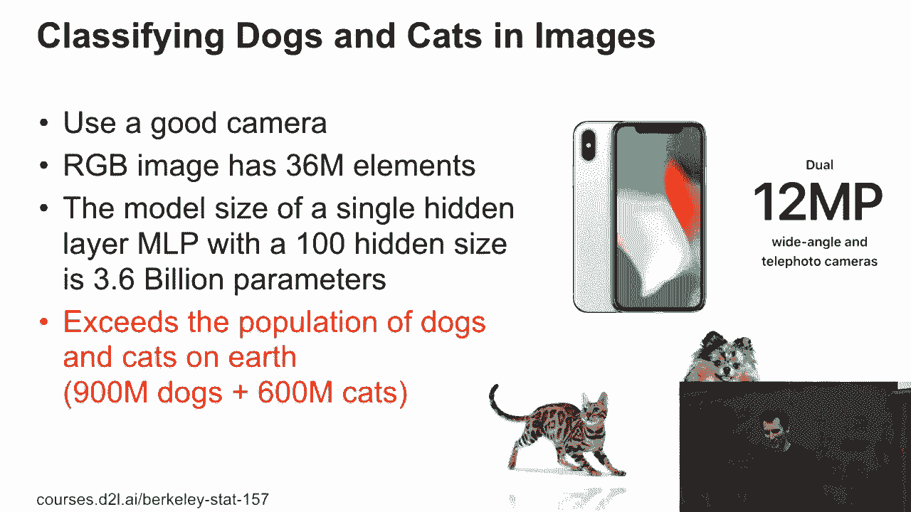

 So this is just to drive this point home。 If I have this neural network with one hidden layer。 and a single output， then that's what you would do。 And of course， h is sigma of w to the x plus b。 So 3。6 billion parameters that surround 14 gigabytes， if I store it as floating point numbers。 So 32-bit。 If I have FP16 that's still 7 gigabytes。

 that's still more than your mid-range Turing GPU。 On that note， something that apparently。 snagged a couple of people when they tried designing a network。 So remember。 let's say we have this as our input。 Some people designed that kind of architecture。 So in other words， they reduced it in the first layer。

 from whatever input dimensions to one dimension。 Then they went wide again and they went narrow again。 This is a terrible idea。 It does not work。 So as a matter of fact， I think it was Ryan。 who then somebody， came to him， asking him， and they had trouble with it。 And Ryan fixed the entire problem by just getting rid， of this layer。 And lo and behold。

 the network actually worked quite well。 So what happened is that this one hidden layer。 with just a single neuron， forced all the features， to be projected onto a single dimension。 That's a little bit too aggressive。 You probably do not want that。 You may have-- whoever did this may， have heard of information bottleneck and other things， where。

 as a matter of fact， you can have networks that， are of this form。 But they never。 ever squeeze out all the information， in the first layer because you want。 to have a meaningful intermediate representation。 And you almost certainly wouldn't reduce it to one dimension。 Typically， you have networks that just get narrow。 And then in the end， that's it。

 And none of this happens。 We'll actually see network structures of that kind。 in when we discuss various deep convolutional networks。 But the design decisions are pretty much the same regardless。 So yes。 you want to reduce the dimensionality， but not to aggressively and not by too much。 Yes？

 [INAUDIBLE]， Yes。 So the question is， will we see what the amazing architecture， was for the winner？

 Yes。 There will be a reference solution， and you can look at it。 And really hats off to that team because they actually， got out to， I think。 the top 10 submissions on Kaggle， which， out of 10，000 submissions is stunning。 So kudos。 Really well done。 In any case， let's look at computer vision。

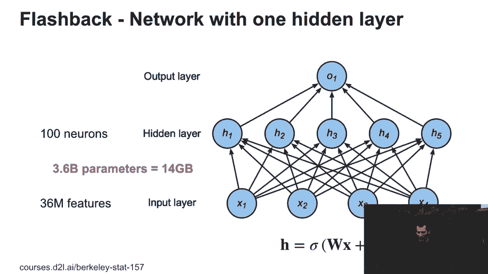

 So let's look at a very simple problem， namely， we want to find Waldo。 So what does this have to do with multi-layer， scepterons in computer vision？ Well， actually a lot。 Because if you look at the picture of Waldo here， well， there are a lot of Waldos on that picture。 And effectively， the Waldo-ness doesn't really， depend on where in the picture this guy is。

 And also， it doesn't really depend very much on the neighbors。 In other words。 those two are perfectly well-defined Waldos。 And I don't really need to know a lot of other things。 in order to identify them。 So as a matter of fact， when you teach kids how to play this， game。 whereas Waldo， you tell them， hey， here's Waldo。 Now go find。

 And then you make yourself a cup of coffee and you wait， until they come back and say， hey。 I found it。 And they're pretty good at using that very simple template。 of a single image to then scan the entire picture， to find this person。 And they use the fact that only locally this matters， and that Waldo could be anywhere in the image。

 So what does this have to do with math？ So let's actually look at how a dense layer looks like。 And what I've done is to make my life a little bit easier。 I've indexed my hidden units with hij。 So rather than just saying I have maybe， a hundred dimensional hidden units。 I've just arranged them in a grid of 10 by 10， because I input an image。

 And I can always arrange them in such a way。 And let's say these hidden units should at some point。 indicate the Waldo-ness of that particular part of the image。 And so in general。 I can write this as sum over k and l。 Wijkl xkl。 All right？ So xkl， that's the source image。 Say here's k， here's l。 And so you need to scan over the entire image， to find where Waldo is。

 And if Waldo happens to be over here， well， you still need to find him。 That's not Waldo。 it's smiley， but fine。 Not a regular drawing。 So what I'm now going to do is I'm。 going to re-index the entire expression。 So nothing has changed by just indexing it by vijab。 where ab references the offset relative to ij。 And now I'm summing not over xkl。

 but xi plus a and j plus b。 So this is just some algebraic rearrangement。 The math is still completely identical。 I might have to worry about boundaries and so on。 but all I do is I'll just set the corresponding other terms， to 0 and everything's good。 Is everybody comfortable with that first line？ No。 OK。 Questions？ What's unclear？ OK。

 So just to repeat the ij is the i player， the j-pin unit， and the i player。 No， not quite。 That's just in the first hidden layer。 So this is x。 And this is h。 And now I'm just indexing it by i and j。 So I'm just representing h。 So this hidden unit。 this hidden layer， as a two-dimensional object， rather than a one-dimensional object。

 which I can always do just by just reshaping it。 And so that first equality is entirely general。 I can do that for any multi-layer perceptron， as long as the input。 dimensions and the output dimensions can be factorized。 I could always write it so。 Mightn't make a lot of sense， but I can write it algebraically， like this。

 So is everybody OK with the first hij and the middle part， of the equality？ OK。 Is that all you want is the ci plus a， j plus b？ Yes， it has to be i plus a， j plus b。 Correct。

 Good catch。 Let's fix that。 Thank you。

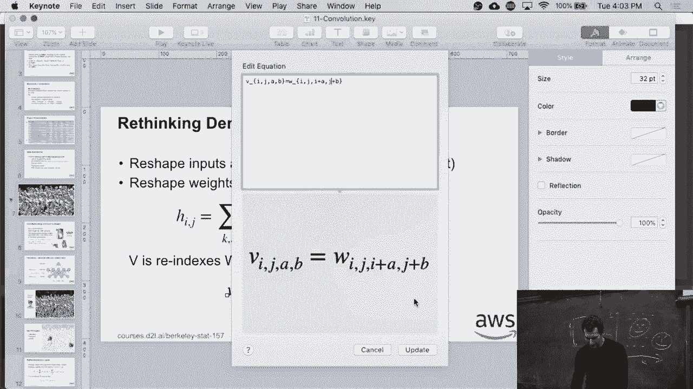

 Good catch。 So everybody's OK with the middle equation。 Now let's look at the last one。 Switching from the middle to the last one， is really just re-indexing。 All I'm doing is I'm just writing k equals i plus a， and l equals j plus b。 That's all I'm doing。 It's just re-ordering。 And since these are arbitrary matrices， w。

 I can just have an arbitrary matrix， v。 OK。 Now if you look at that， that's actually a convolution。 Except that right now this thing depends still on a lot， of other locations。 So basically。 the bottom line is really just how I re-index。

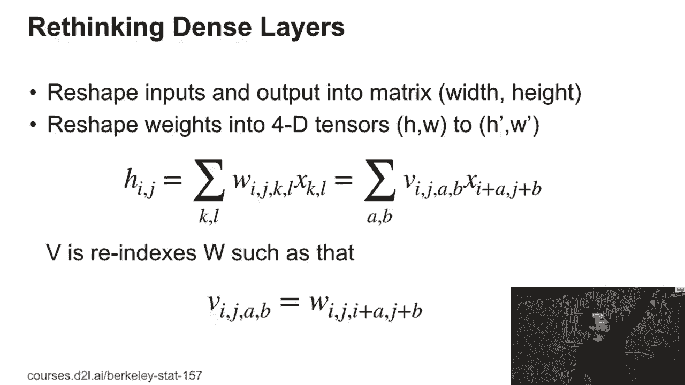

 Now let's actually apply our math。 So remember we have hij is vijab， xi plus a， j plus b。 So all I'm doing is I'm just expressing the hijs。 So let's say this is correct， i and j。 That's hij。 I'm expressing it relative to what happens around Mr。 Smiley face。 Now what I'm doing is I'm saying。 well， actually， what happens around Mr。 Smiley face here， and what happens around Mr。

 Smiley face over there。 Well， I should be applying the same filter。 So in other words， this vijab。 I can drop the index ij。 So my weight matrix no longer depends on the location ij。 but just on the shift relative to that position。 Now if I do this。 and I have a 12 megapixel image--， in other words， I have 36 million dimensions--。

 I've just reduced the dimensionality of my weight， just by 36 million。 Because I've dropped the indices referring， to the size of the image。 So that's a significant reduction of the problem。 So already now we could solve the problem。 if we took pictures of enough cats and dogs。 Before that， we had more parameters than cats and dogs。

 but we've just reduced the number of parameters by 36 million。 That's kind of nice。 And that is actually an expression， that I'm fairly sure you know， because that's。 just a cross-correlation。 Looks like a convolution。 Any questions so far？

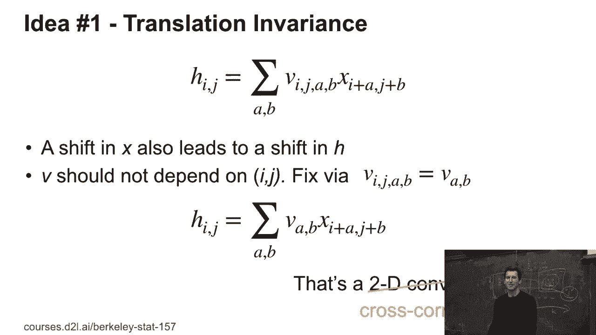

 So then here comes the next step， locality。 So if you look at Mr。 and Mrs。 Smiley face。 so you have this convolutional filter that goes over them， with some weight。 And effectively。 if you think about it， outside this box， here I don't really care about what exactly happens。 So I can just truncate this。 This all goes away。 This all goes away。 This goes away。

 And this goes away。 So in other words， I just have some filter applied locally， and that's about it。 So therefore， I can limit the valid range of the parameters， A and B， which determine the offset。 to be within some scope。 And in practice， people might make this five pixels， to either side。 So people pick a very narrow scope in many cases。 And so now what we get is that H ij is some over A and B。

 going from minus delta to plus delta， V ab xi plus A j plus B。 Any questions so far？

 So maybe all the math was just a little bit intimidating。 But the outcome is super simple， right？

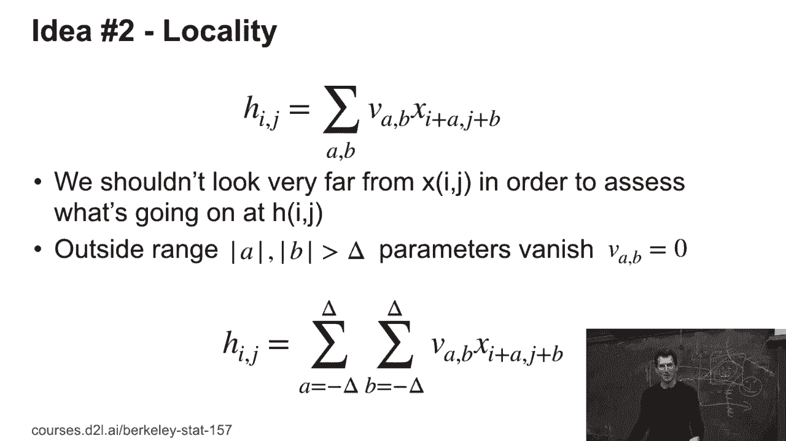

 You just convolve the input with some filter， and you get some output。 Let's go through some numbers， because this。

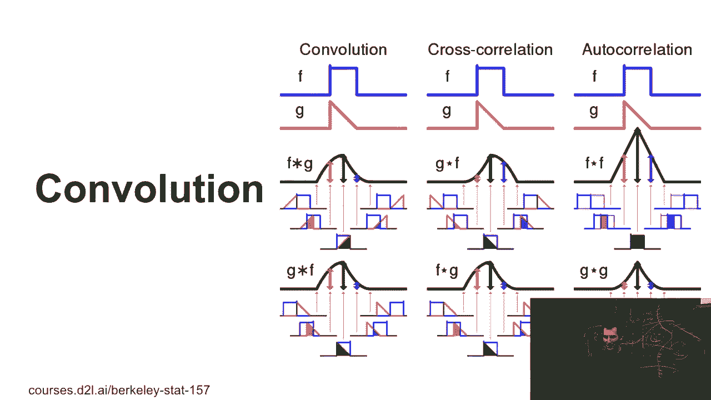

 will make it a lot easier。 So after the mathematical justification。 let's look at some stuff in practice。 Let's say I have this 3 by 3 input。 and I have a 2 by 2 convolutional kernel。 What I do is I just pointwise multiply the entries。 of the kernel with the input。 So let's say 0 times 0 plus 1 times 1 plus 2 times 3 plus 3， times 4。

 And that gives me 19。 Then I shift the kernel by 1 to the right， and I get the same thing again。 And I keep on doing this。 So therefore， I'll get as my output。 In this case， this 2 by 2 matrix。 or image， with these entries。 Is everybody kind of cool with that？ So after all this scary math。 here's what you do operationally。 You can forget about the scary math。

 unless you want to actually derive， convolutions from first principles。 Now why would that matter？

 Well， if you have translation， variance， and you get convolutions， then OK， the problem is solved。 Somebody's worried we've written that paper。 But you might have some other symmetry groups。 for which you don't know yet what the solution is。 In that case。 you can apply symmetry and invarances， and you'll get another kernel。 So if you look at that。

 that's what happens。 If you take a 4 by 4 image， and you， take a 3 by 3 convolutional kernel。 then you get this very pretty animation。 Any questions so far？ Good。

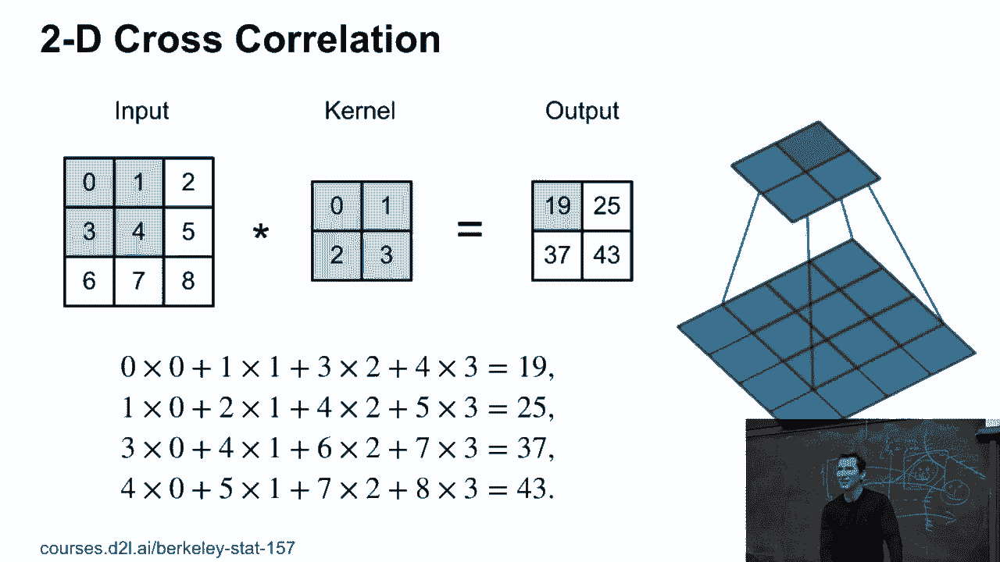

 So therefore， we have a convolutional layer。 What it does is it takes as an input， nh times nw。 so height times width and input matrix。 And you need a kernel matrix。 This may or may not be square。 Typically， people use square convolutional kernels， but there are some very rare applications。 where you might not have that。 For instance， the image might have。

 been recorded with some anamorphic lanes or whatever。 So sometimes people do that when they record for a cinema。 They basically squish things and then expand it again。 And this is mostly what people used。 to do in the old times when basically film and film width， was a real issue。 But yeah。

 so you do that。 Then of course， in the end， you add a bias to it。 Bias is just a constant。 And so you can check that if I have， an image of some height times some width。 and a corresponding kernel of some height times some width。 then the output is the image height minus the kernel height。

 plus 1 times the same thing for the width。 Well， the plus 1 is simply because if my convolutional kernel。 and the image are exactly of the same size， I still get the 1 by 1 output。 But of course， otherwise。 I can just shift it around。 And of course， only as far as I have space either way。 So if you're unsure， go home and find a piece of Lego。

 like one of those nice Lego plates where you build houses on。 You make the input size of the image。 like a nice rectangle。 You take your convolutional kernel as a filter， and you move it around。 You see how many positions you get。 Now， of course， this is deep learning。 We want to learn things。 And in this case， we want to learn WMB。 Any questions？ OK。

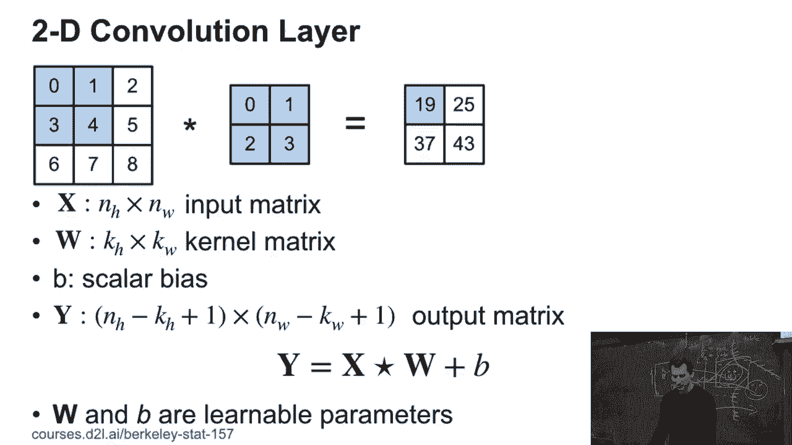

 Good。 So here's some examples。 So I can take， let's say， maybe this image here。 of some rodent-like animal。 And then if I use those filters， I get an edge detector。 I can sharpen things。 I can blur them。 So these are hand-engineered filters。 So if you use。 let's say， Photoshop or Lightroom， you can have a sharp， more a blur or other filters。

 That's what those things do。 They're basically pre-baked convolutions applied to your image。 By now。 of course， people are a little bit smarter than that。 But essentially。 that's what those simple operations do。 It's an example from Rob Ferguson's class。

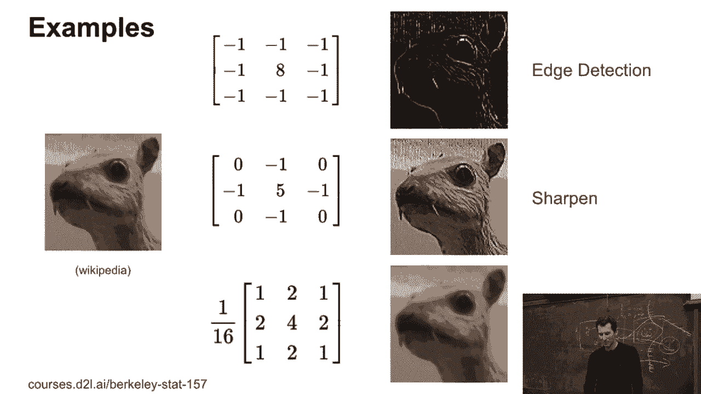

 So this is some picture， I think， from Boston。 And if you have this convolution and you scan over the image。 let's say， where the animation works。 No， it didn't work。 Then you'll get this output。 And if you pick a different other convolutional filter， you'll get something else。 So these are actual weights that the deep network learned。

 And so depending on which filter it applies， you get some other views of what that network sees。 Well， it doesn't really see， but it's， just the intermediate representation。 OK。 So just like one minor， nifty detail。 So actually， we're talking about cross-correlations。 because for convolutions， you just flip the indices， but that just looks a little bit awkward。

 And on top of that， in terms of memory access and locality， it's not so nice。 So that's why you don't flip the indices。 But there's no difference in practice。 because you can always express one by the other。 Quick question， because I said。 in terms of memory access， that's not so nice。 What do you think would happen？ Well。

 let's draw a picture。 Then it becomes very clear。 So let's say this is our image。 And I've got some filter here。 And I'm going over the image like so。 And so I'm going forward in memory。 All right， I'm going forward in memory。 making a jump forward in memory， making a jump in song。 OK。 Now。

 computers are pretty good at caching things， that you're likely to read next。 And most code。 most computer code， goes forward in memory， not backwards。 So a lot of optimizations on your computers are hardwired， to assume that the next operation is。 going to be the next element in memory， in ascending order rather than descending order。

 So in other words， if you're there， your computer is probably going to cache this element。 Once you're there， it's going to cache this and so on。 That's a really good idea to walk forward。 Same thing happens with your kernel here。 So if I have a convolution， I would end up。 walking backwards there。 And this would actually slow down things， at least， in some cases。

 If this all fits into cache and you optimize， and there's a lot of other things that you can do。 But this is one of the reasons why cross-correlations。 are your friend and convolutions may not necessarily be。 OK。 OK。 Well。 K is the convolutional kernel。 Oh， here it should be just the corresponding index。

 And that's not what we should see。 There should be no K here。

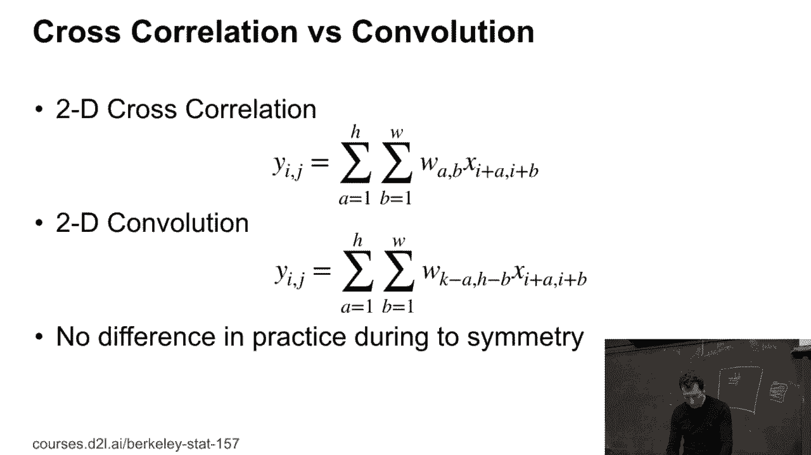

 It's a typo。 Good cache。 [INAUDIBLE]， There's another one。 So this is what happens if you do LaTeX by cut and paste， then such things happen。

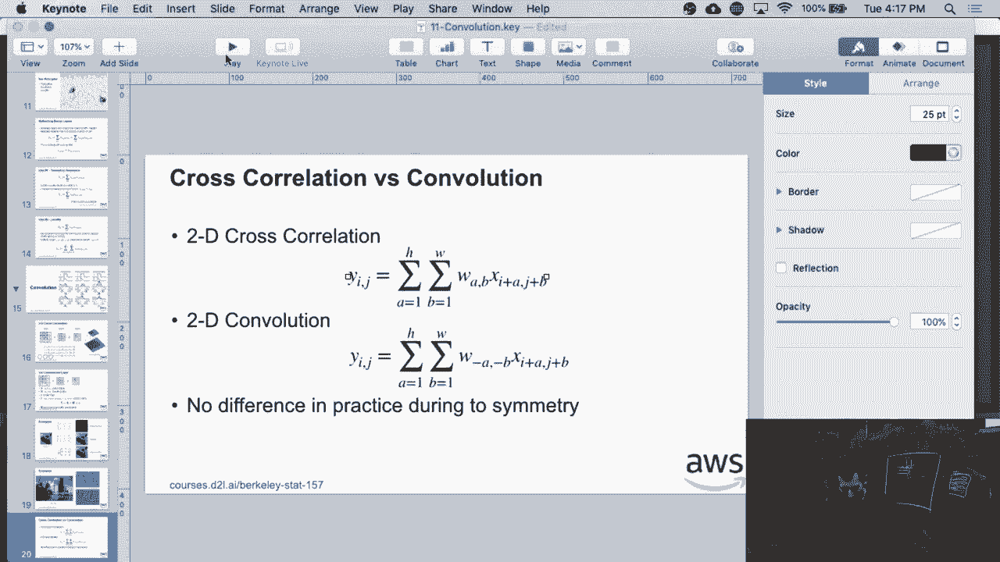

 Thank you。 Good cache。 Of course， besides two-dimensional convolutions。 they're also one-dimensional and three-dimensional ones。 So for instance。 you can use similar principles， to the analysis of text。 And unfortunately。 there a lot of the analogies， are only partially true。

 Because text is not entirely translation invariant。 Can somebody tell me why text is not entirely translation， invariant？ Well。 at least it shouldn't be。 And for most people， it isn't。 Any idea？ [INAUDIBLE]， Well。 the Markovian part isn't really the source， but it's a good thought。 So what happened？ I mean。

 you have Markovian properties also for images。 But the thing is that text has this property that there are。 sentences， there are paragraphs， so there are boundaries， that are not--。 if I take a sentence and I shift everything by one word， to the right。 then I'm dropping the first word of one sentence， and adding a new word of the next sentence。

 And now you've turned something that probably made sense， into gibberish。 So this is why translation invariance， doesn't entirely hold， but only， for instance。 between sentences， to some extent。 But also there， you have paragraphs。 you have other structure that applies。 The other thing is that sentence length is highly variable。

 You might have a short sentence like hello， or you might have a very long sentence about explaining。 how translation invariance in sentences isn't quite true。 So this is why you need a little bit of extra tuning。 People have come up with some clever ideas。 for convolutions， for sentences。 Turns out that there are simpler techniques。

 like what we'll see later， STMs or transformers， which， will address this as well。 But for voice。 that's quite true。 For time series overall， it's quite true。 And for three dimensional， well。 you might have video。 So like this thing that's being recorded right now。 you have basically width times height， times a temporal dimension。 Actually。

 you have a little bit more， you have also red， green， and blue。 So you really have four dimensions here， but it's a separate story。 So right now。 let's just assume that this is three dimensional。 Or you have satellite images or medical data。 And there， quite often， you measure over an entire spectrum， of different wavelengths。

 So for instance， a fancy， hyper spectral satellite， might record 10。 it might record 100 different wavelengths。 That will give you a much， much more detailed idea。 for instance， what the atmosphere looks like。 For instance。 bees have more than three different colors， of photoreceptors。

 Or if you have mostly men who are color blind， they might only have two out of three different photoreceptors。 So that's the dimensionality of what you're recording。 Any questions so far？ Cool。 Good。 So then let's actually try this out in practice。

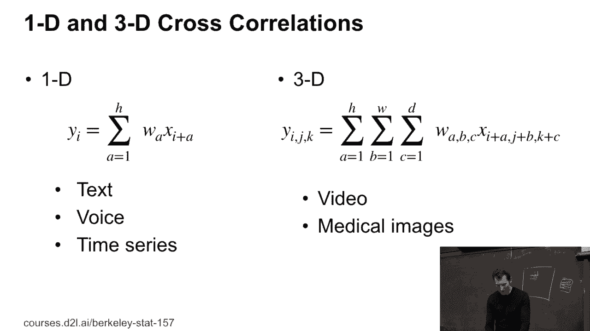

 practice。 [BLANK_AUDIO]。