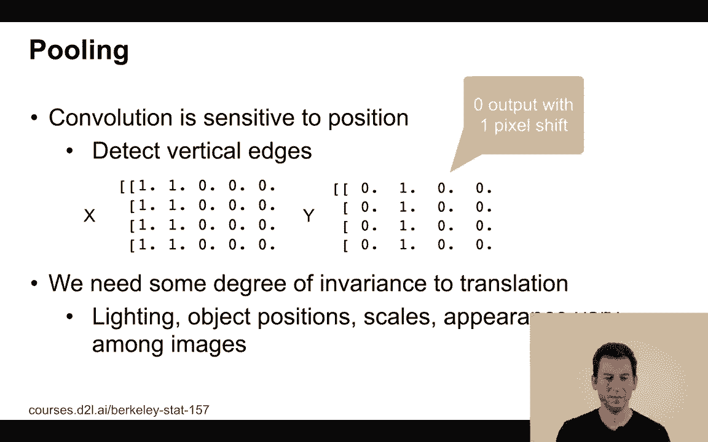
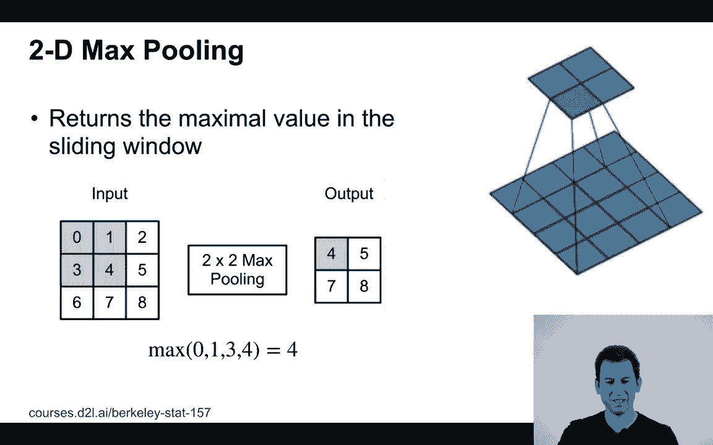
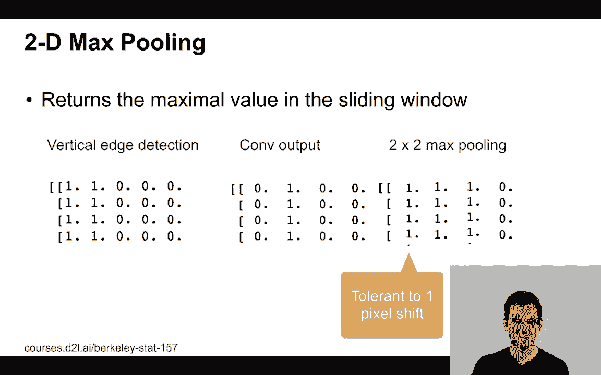
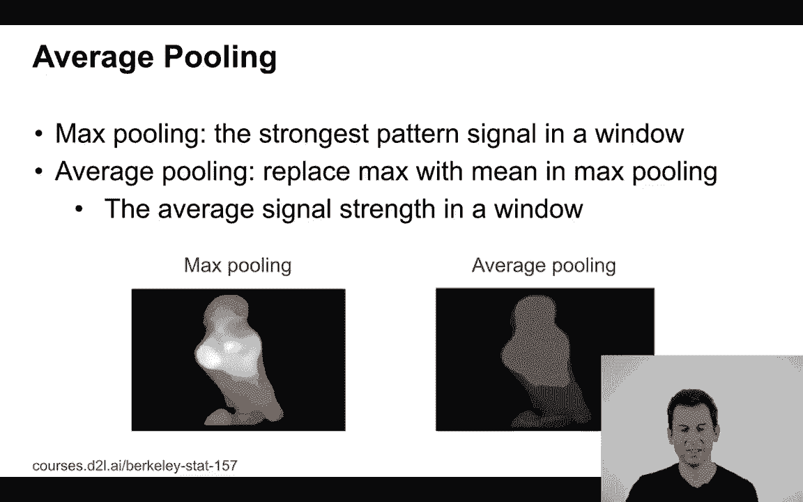

# P59：59. L11_8 Pooling - Python小能 - BV1CB4y1U7P6

 The last part of our conversation about convolutional layers is the pooling layer。 So pooling is actually a very， very simple operation and it's probably easier just to。 look at what's going on。 So let's look at an image。 In this case， admittedly a very primitive image。 it's a 5 by 4 pixel image which consists， of 1's on the 2 left columns and 0's throughout the rest。

 If I now apply an edge detector， I'm going to find an edge at column number 2。 So if I then were to shift that image by 1 pixel to the left or to the right， well。 that edge would shift by 1 pixel。 So that doesn't sound like a lot but if I want to have maybe later on features that。 are somewhat translation invariant， then I clearly can't have it if my features all。

 depend exactly on where they occur。 So we need to have some mechanism for giving us invariance with regard to translations。 lighting， object positions， scales， appearance and so on。

 And this is exactly where pooling comes in handy。 So let's look at 2D max pooling。 So max pooling does the following thing。 It takes an input。 For instance here it's a 2 by 2 patch。 Let's just take the maximum of that patch and it moves one block to the right。 It performs that again and it does that and so if we do 2 by 2 max pooling， we turn a。

 3 by 3 input into a 2 by 2 output。 So the semantics in terms of the size work exactly like what we saw before by convolutions。 except that rather than multiplying and adding terms we just take the maximum。 Or if I have a 4 by 4 image and if I perform max pooling over a 3 by 3 window， then I'll。 get a 2 by 2 output which is exactly what we're seeing on the right。

 So what you can see is in the previous example， so let's say we have a vertical edge detector。 we perform convolution and so now the 2 by 2 max pooling becomes tolerant relative to。 1 pixel shift。

 That's exactly what we wanted。 Now if you want to make sure that by pooling the output doesn't really change or maybe。 change it in a well defined way， then you can use padding and stride in exactly the same。 way as what you would have done before。 So first of all in terms of input and output channels。 they are the same because you perform， pooling per channel and in terms of stride。

 well it's just a matter of how many pixels， you shift before you apply that window again。 They're no learnable parameters but for instance if I wanted to preserve exactly the same size。 of the image， then I could for instance take a 3 by 3 max pooling and pad by 1 pixel on。 either side and I'd get the same output。 So there we go。 If I do this。

 so here's a 3 by 3 pooling and as a matter of fact， here's I get a smaller。 image out of it because well I'm using a stride of 2。 So this is padding of 1 stride of 2 which will reduce the image resolution。

 Now besides max pooling， there's also average pooling。 Now average pooling。 what you do is you simply average over the interest in that window。 So this is a very common operation that everybody knows。 For instance if I take a very high resolution image with my camera and I want to reduce。

 the resolution， I might just down race that image。 Now what the photo processing software does is actually performs average pooling where。 it averages over a larger number of pixels to get that。 This is what was commonly used in the 90s in the early convolutional networks but switching。

 from average pooling to max pooling improves accuracy which is why by now everybody uses。 average max pooling。 There's one exception namely at the very last layer when you perform global average。 pooling you actually add them together。 We'll talk about that in a lot more detail in the next lectures。

 [BLANK_AUDIO]。