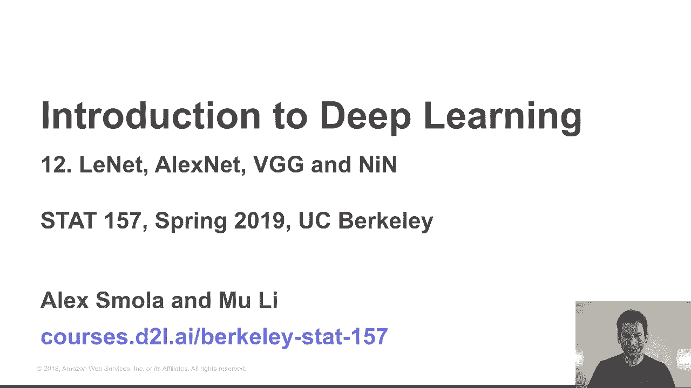
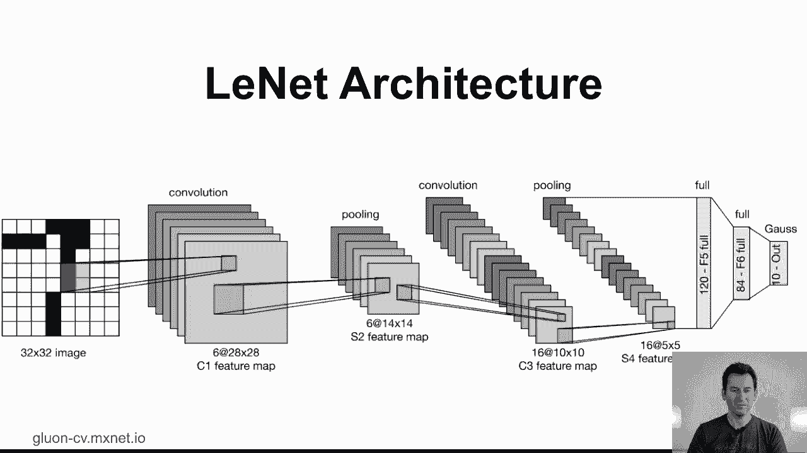
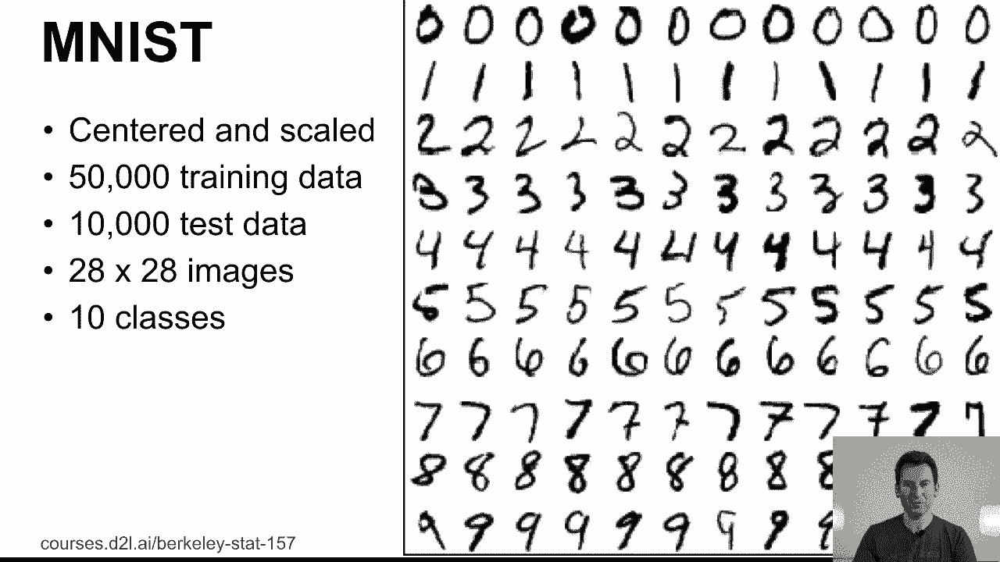
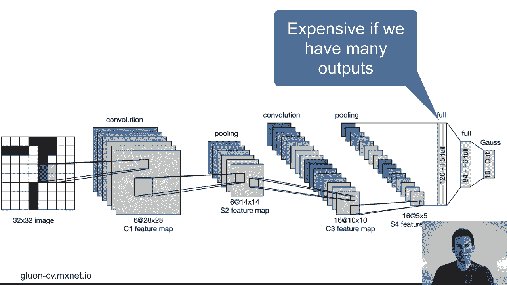
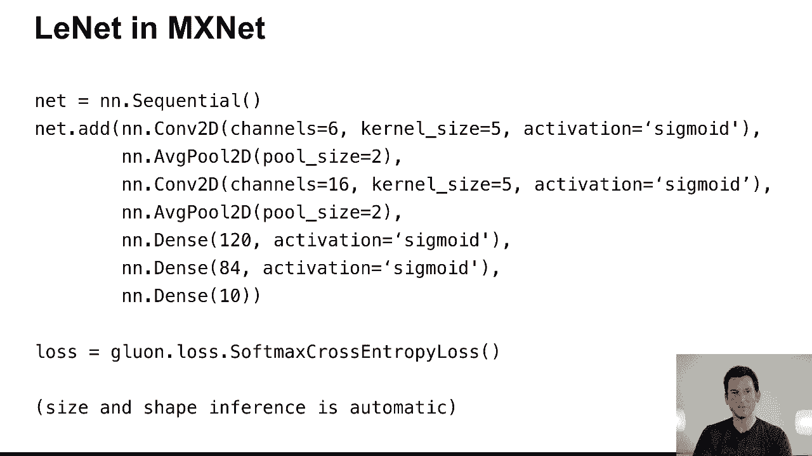
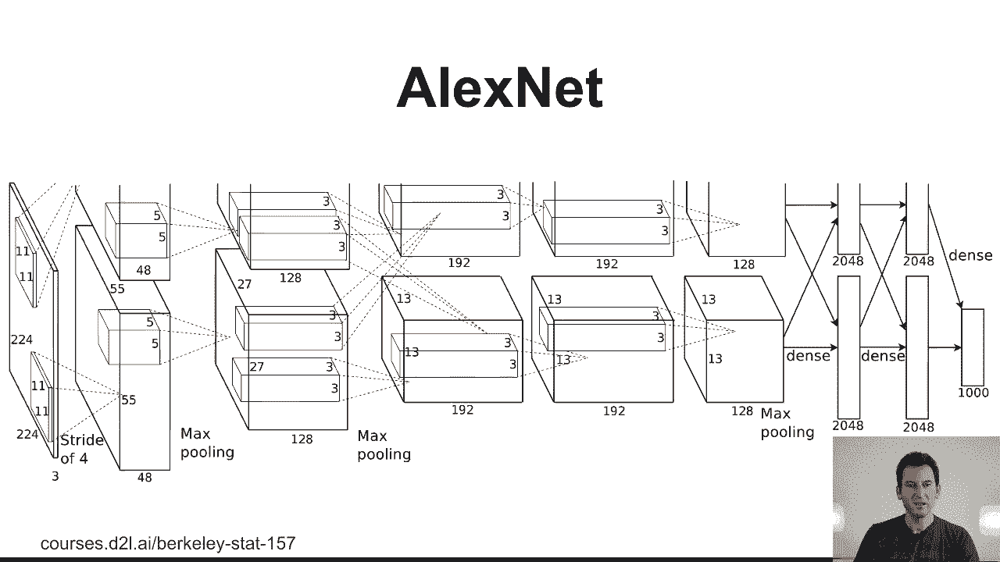

# P61：61. L12_1 LeNet - Python小能 - BV1CB4y1U7P6

在这节课中，我们将讨论卷积神经网络。在前几节课中，我们接触到了基本的组件，例如卷积、填充、步幅、池化，基本上构成卷积神经网络的所有关键组件。今天，我们将利用这些组件来设计具体的网络。

我们特别要设计的网络有Lynette、AlexNet、VGG，以及内部网络（NIN）。下一节课将讲解先进的网络，它们引领我们进入物体识别领域的最新技术，但今天，我们将简要回顾一下历史。

那我们先从Lynette说起。这是90年代提出的一个网络，Lynette V大约是在1995年由Yandli Khan和他的团队提出的。在最简单的版本中，这是为低分辨率的黑白物体识别设计的。输入是32x32像素大小的图像，然后这些图像经过卷积处理。

转换成六个28x28像素的通道，然后通过平均池化将其减少到14x14。记住，通道大小是相同的，因为池化操作不会调整通道数。接着进行了另一次卷积，最终将其减少到10x10的图像，并且有16个通道。然后通过平均池化将分辨率再次减半，变成16x5。

最后，这个网络后接120个全连接单元，再接84个全连接单元。在这种情况下，这是一个高斯RBF网络，用于将数据映射到10个类别。当时这是一次严谨的工程实现，可能花了大约三个月到半年的时间来完成，包括所需的所有工具。

那么，为什么人们在95年会关心这个问题呢？本质上是手写数字识别。当时，AT&T有一个项目，用于识别信件上的邮政编码以及支票上的金额。因此，当时的算法是确定支票金额是否正确。

然后识别它并利用它来支付该金额。显然，这并不是一件微不足道的事。例如，如果你看一下支票，你可能选择了11,725个资产的美元金额，或者你也可以选择可能是富国银行的邮政编码，或者支票底部的追踪号码。而虽然这对人类来说听起来显而易见，但实际上并非如此。

在支票上做这件事并不简单。但为了本教程的目的，我们将专注于字符识别。因此，MNIST是一个专门为此目的设计的数据集。这个数据集包含了居中和缩放后的图像，共60,000个训练数据和10,000个测试数据。

其分辨率为28x28像素。因为有10个类——毕竟有10个数字。这些数字是真实的数字，即通过查看字母并适当地对其进行分割得到的。

为了看看这个是如何工作的，嗯，我们来看一下Lynette的演示。在这里，你可以看到数字通过网络扫描，网络输出它认为数字的估计。当这些数字扫描时，你可以看到即使在不同的位移下，它仍然能够识别，比如说5和6，6。

此外，你可以在左侧看到各层的激活值。所以你可以看到，在卷积后的第一层，你基本上得到的都是边缘检测器，对吧？比如水平边缘、垂直边缘、增强对比度的东西、反转对比度等等。下一层，就是这一列。

你可以看到它是如何转化为高层次的特征，但仍然保持某种空间上的关联。然后，在这之后是全连接层的激活值。你可以看到现在的激活值要更加多样化。最终，这被转换为对某个特定数字的估计。

这篇文档了1998年的论文是一个真正的里程碑论文，我觉得它应该获得更多的认可，但并没有。我强烈推荐阅读这篇论文，里面有很多细节，包括图形转换器，至今我觉得这些概念还没有得到充分的理解。现在如果你看这个网络架构。

我的意思是，在1995年这并不是那么重要，因为当时图像的维度并不高。但你可以已经看到，随着网络逐渐接近输出部分，我们有了全连接层。如果输出很多，这些全连接层会变得非常昂贵。所以对于10个类别来说，这不是大问题。一旦我们可能需要处理像ImageNet这样上千个类别时。

这实际上会成为我们网络设计中的主导因素，我们将不得不寻找绕过它的方法。

我们稍后会讲到这些。首先，我们来看一下如何实现这一点。稍后我们会在笔记本中看到实际的效果，但现在先来看一下实现的过程。所以我们做的就是基本上声明，好的，我想在这个网络中使用层的顺序组合。然后我添加一个卷积、平均池化，再加一个卷积。

另一个平均池化操作，然后是两个全连接层和一个全连接输出。就这样。所以这个网络架构非常适合放在一个屏幕上，而在1995年，这种实现会复杂得多。请注意，很多尺寸和形状的推断是自动的，所以你其实不需要做太多。

需要指定下一层的输入维度。它们会在你从输入到输出解析网络时被隐式定义。

这就是网络。[BLANK_AUDIO]。
