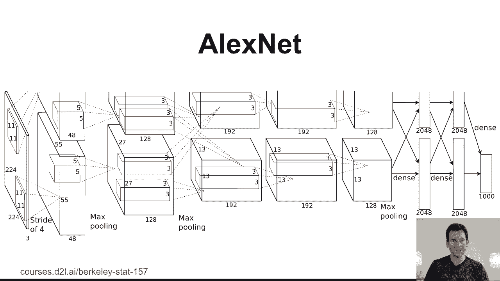
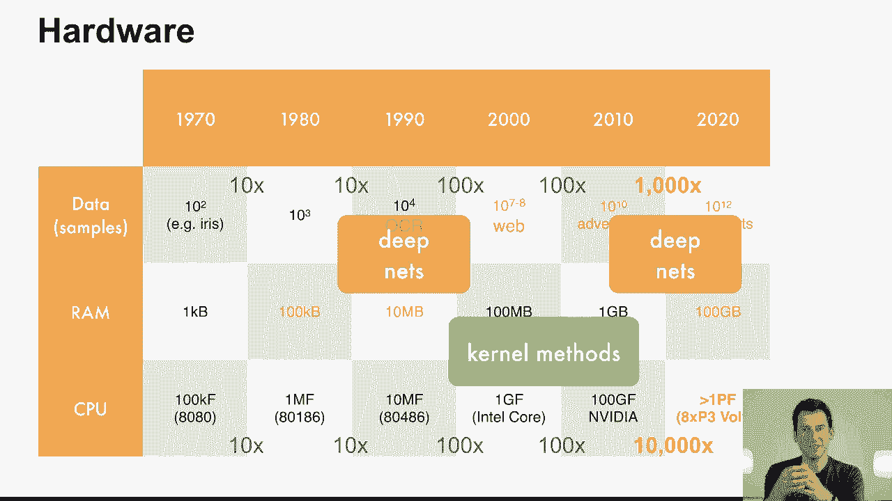
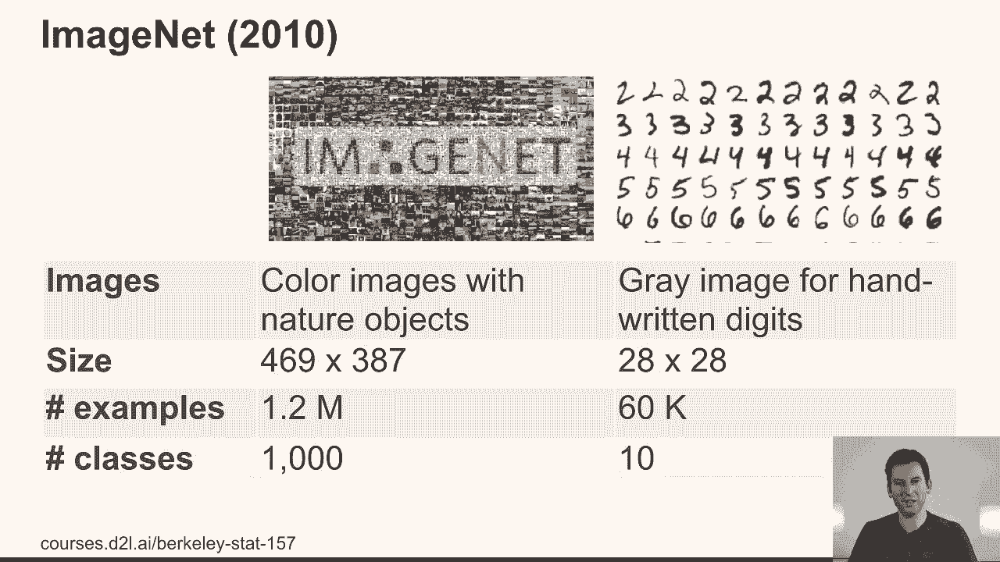
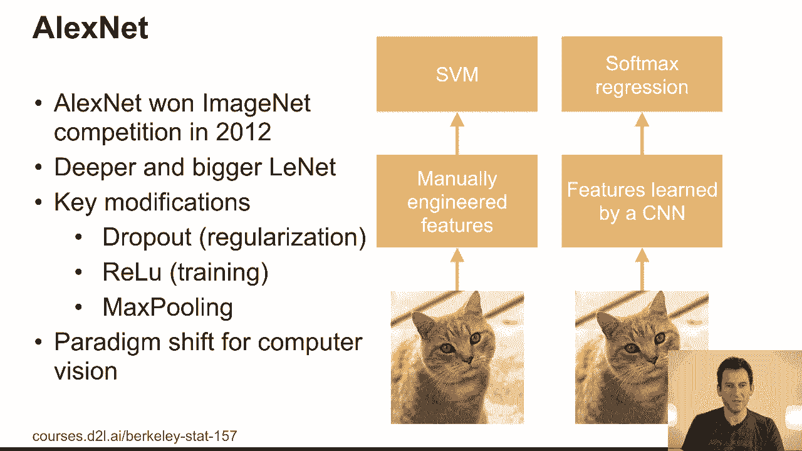
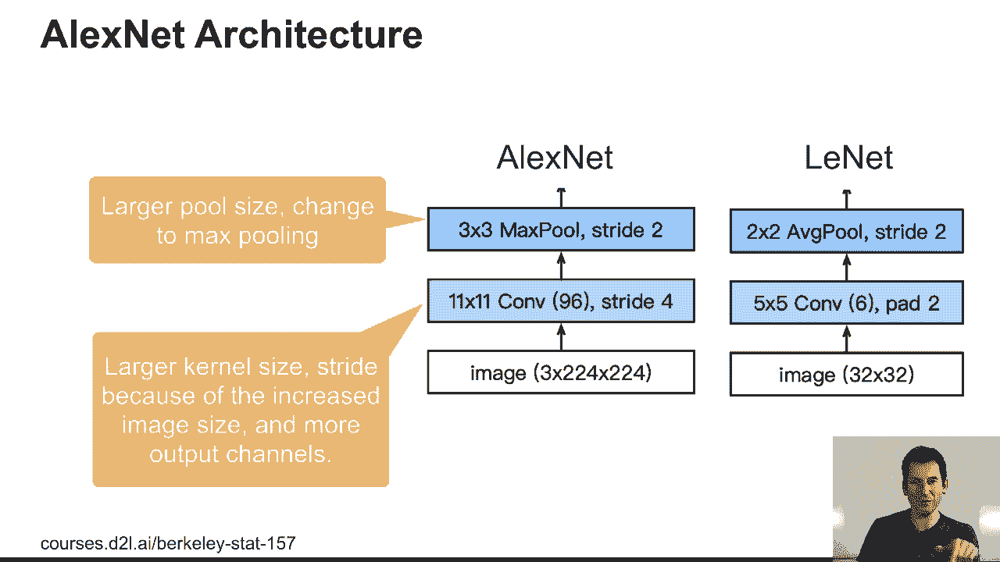
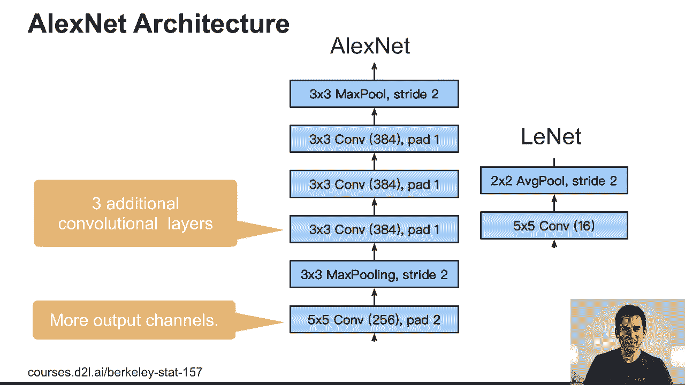
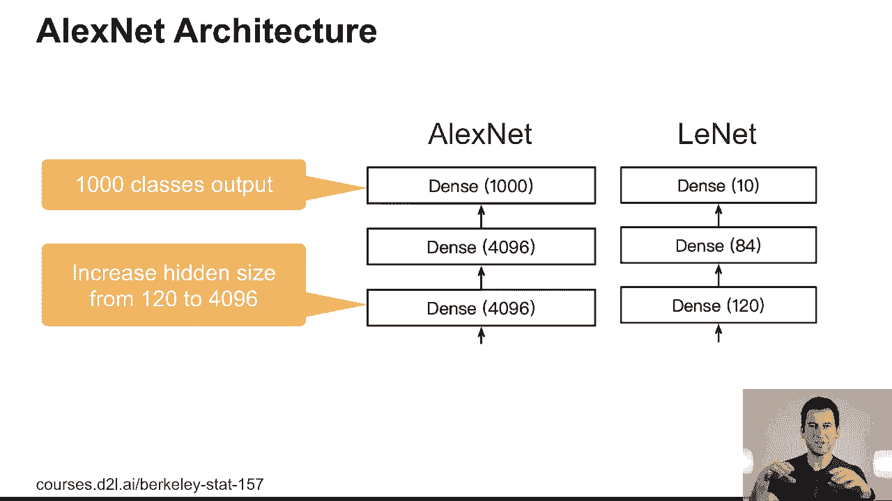
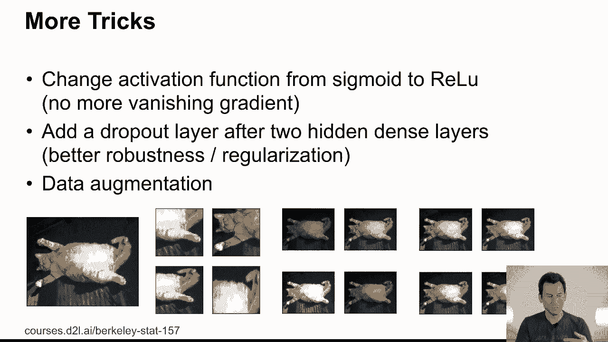
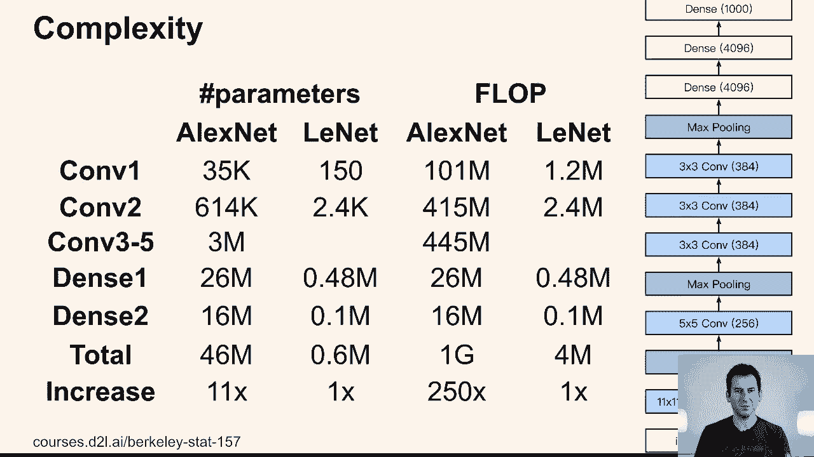

# P63：63. L12_3 AlexNet - Python小能 - BV1CB4y1U7P6

 Let's talk about AlexNet。 AlexNet is named after Alex Kreshevsky， and this network was。 proposed in 2012。 If you look at it， it looks extremely similar to Lynet。 As a matter of， fact。 when this network came out first， people didn't quite appreciate what was in there。 After all。 this was like Lynet， but just a lot bigger， more convolutions， more layers。 And yeah， just that。

 So this only changed when the AlexNet model won the ImageNet， competition considerably。 It's only then that people realized that maybe something exciting， is going on there。 So let's dive into it in a bit more detail。

 Let's take a step back in history， namely to 2001 around that time。 So， kernels ruled， the roost。 And in fact， you could just go and design a nonlinear function class by extracting， features。 You would pick your kernel for similarity。 You'd solve a convex optimization， problem。 and then you'd go and prove a theorem or two， and you'd prove that things are optimal， consistent。

 and so on。 Life was good。 Same thing was to a computer vision。 It could go。 and maybe design a non-convex optimization problem。 He'd use a fair amount of math to。 describe how a specific geometric problem would map nicely into a corresponding computer。 vision problem。 And then you'd solve the math， and whenever reality mapped nicely into your。

 mathematical approach， life was good， it would work。 And again， you'd get lots of beautiful， serums。 and whenever you managed to solve a problem in a convex manner， this was a hallmark， paper。 So that's computer vision。 Now， the CD and the Billy of computer vision around。 the time was feature engineering， and some people would have probably argued that most。

 of the interesting parts in computer vision were how to design new features。 In fact。 if you designed like a sift or a surf feature extractor， you pretty much had it made。 As， in this。 we could get you tenure。 And well， what you would do then is you would take your， images。 extract relevant feature points， then maybe you'd go in cluster and arrange them， properly。

 And then in the end， you know， you solve that by applying your support vector， machine。 and life was good。 So feature engineering was quite crucial， but it also limited the。 amount of engineering throughput that you could do because for every new problem， you。 had to do additional feature engineering。 Now， this sounds not very enlightened if we look， back。

 but there's simple reason why people at the time would design models in this way。 So let's look at the progression of data， memory and compute that was available in different。 decades。 MAF just rounded it to the next power of 10， just because we really care about orders。 of magnitude。 So data set sizes didn't really start growing a lot until around 2000， maybe， 2010。

 with the internet， cloud computing and so on becoming available， where basically。 it was now possible to store data from a lot of users， a lot of interactions， a lot of， instances。 And this is why the amount of data jumped from 2000 to 2010 by a factor of 100。 and then from 2010 to 2020 by a factor of 1000。 Now， in terms of memory， well， things。

 didn't improve a lot， but in terms of compute， we had a breakthrough probably around 2010。 when people switched from single or small numbers of cores to massively multi core architectures。 like GPUs。 So before that， dual core， maybe quad core architectures were kind of the standard。 of what you would have on your desktop。 And only now， you know， you're starting to be。

 able to buy 1632 core machines at reasonable prices， or of course， if you go to the cloud。 you get up to 100 cores， but still， if you go and use a GPU， you might get， you know， thousands。 This led to correspondingly much higher performance compute。 For instance， on a P3 server， you。 might have eight vultas， and that gives you， you know， over a petaflop of compute。 Now。

 interestingly， deep networks were popular around 1990， when compute was， well， there。 was some there， but memory was tiny and the data sets weren't that big。 So that's when。 deep networks were really good at inference time。 So then around 2000 up to 2010， kernel。 methods were the right thing to use because the data sets weren't too big yet， and you。

 could store non trivial parts of the kernel matrix in memory。 Remember， a kernel method。 requires a kernel matrix， and that tends to go super linearly in the amount of data that， you have。 And so as long as you have enough memory and compute isn't so much of an issue， things are good。 What happened then is that compute took a quantum leap forward。 So mind， you。

 the first successful modern implementation of deep networks happened on GPUs with AlexNet。 so that was 2012。 And so it's very clear that only once compute was available， it was a。 practically feasible option to switch to nonlinear， non-convex， highly compute intensive， settings。 and that's exactly deep networks。 Now， let's look at the data。 So imageNet came。

 out in 2010， and it was a big data set at the time。 1。2 million examples， 1000 classes。 so compare that to 60，000 observations， 10 classes for MNIST。 Also， the resolution was。 considerably bigger by maybe a factor of 1000。 So it went from 28 by 28 to 469 by 384 dimensions。 and the images were in three channels， namely， Ray Green and Blue， whereas before that we。

 had great scale。 So that changed things a lot。 Now， until 2012， around that time when。 AlexNet won the imageNet competition， the default strategy for solving computer vision。 problem was to go and pick manually engineered features。 You would then go and apply an SVM。 in the end， and this was replaced by features that were learned automatically followed by。

 a softmax。 But AlexNet wasn't just a bigger and better， Lynette。 there were a number of other key changes。 One was dropout regularization， which。 allowed people to design much deeper networks。 As you move to deeper networks， of course。 just regularizing with regard to the input doesn't help so much， you need to also regularize。

 the inner structure of the network。 So this is essentially taken off regularization applied。 to all the layers of the network， or at least in multiple places whenever you use dropout。 whereas otherwise you would just smooth things with regard to the input。 The second thing was ReLU。 so rectified linear units。 In other words， you replace the sigmoid。

 nonlinearity by just the max between x and 0， which had as a consequence that the gradient。 would no longer vanish because you had at least one half space where the function was the， identity。 The last thing was max pooling， which replaced average pooling。 And then the。 result of that was that now features were rather a bit more shift invariant because you。

 could now move your attributes a little bit and max pooling would still pull the relevant。 attributes through。 So this led to a paradigm shift in computer vision and after computer， vision。 well， that's then when people went to speech recognition， natural language processing。 text generation， a lot of other things that deep networks afterwards proved a metal。 But。

 it started with computer vision。 So let's look at the architecture。 So in AlexNet， you。 can already see that already the intake is quite different。 So the images are much larger， I mean。 than 32 by 32 pixels， which are just 28 by 28 padded with seros on the outside。 You had 224 by 224 with R， G and B， red， green and blue as the channels。 This was followed。

 by convolutions with a vastly larger number of channels， 96 versus 6。 And then of course。

 you know， the pooling operations。 So if you look at the bulk of the network， again， you。 have a lot more channels， 256 versus 16。 So that's 16 as many。 And then you have a lot。 more convolutions later on。 So those convolutions ensured that you have a much more expressive。 degree of nonlinearity as you move through the network。 And this， of course， allows you。

 to recognize a lot more classes。 To look at the end of the network， well， you're dealing。 with 4096 as opposed to 120 hidden units。 And those nonlinearities were necessary in。 order to have enough information for like 1，000 output classes as opposed to 10。 So you。 might wonder why did they pick 4096 as opposed to maybe 8000 or maybe 3000。 Well， the idea， was。

 I suppose that if you have 1000 classes in the end， you need more than 1000 dimensions。 to describe them well。 And the upper natural limit was also the size of the GPUs。 So remember。 Alex Net had to be actually split between two GPUs initially because there wasn't enough。 space in terms of memory on a single GPU。 And a lot of the engineering in order to make。

 Alex Net work at the time was to write code， which would synchronize those two GPUs。 Now。

 there were a few more tricks。 So one thing， the most important thing really was data augmentation。 So let's have a look at the picture of this cat lying on its back。 Okay， Qcat。 And if we。 crop out a part of it， we'll still be able to recognize this as a cat， at least humans would。 So the idea was that rather than training on the original images， you would train on those。

 cropped parts， which then can be used to infer， you know， what the class is。 The other thing is to。 have transformations in terms of brightness， color space and so on。 All those things improve。 the robustness to changes that you might have between training and tests， images。

 Now， to wrap this up a little bit， if you look at the complexity of such networks， well。 Alex Net is a lot more complex。 In terms of computation， well， it's 250 times more expensive。 in terms of parameters only 10 times more。 And this was another key change that the trade-off。 between computation and memory changed quite a bit。 And Alex Net is actually known for being。

 rather extreme in terms of its memory usage。 So nowadays that ratio would have been probably。 even much more skewed towards compute， because compute devices have become a lot faster and。 therefore people like to exploit that。 So that's the trade-off that's actually happening right now。 because memory scales with the amount of silicon， compute still scales with the amount of。

 compute units that you have。 And if you have more dumb units， then you can go from single core。 to multi core， which is what you have on GPUs， to for instance， systolic arrays， which you by now。 have on custom chips like TPUs。 So this explains a little bit how we got from Lynette to Alex Net。 which is the considerably more complex version of a convolutional neural network。

 What we'll see in the following is how to make those networks work even better， get high accuracy。 and how to address some of the problems created by just scaling up Lynette。

