# P64：64. L12_4 AlexNet in Python - Python小能 - BV1CB4y1U7P6

现在我们看过网络之后，让我们来看一下 AlexNet，这是一个相当先进的网络，看看它在实践中表现如何。首先我们需要导入网络、所有的 MXNet 工具等等。好的，和之前完全一样。我们只是获取导入的蓝色框和 DRA 损失，数据迭代器等。

然后是其他一些便利操作，例程。

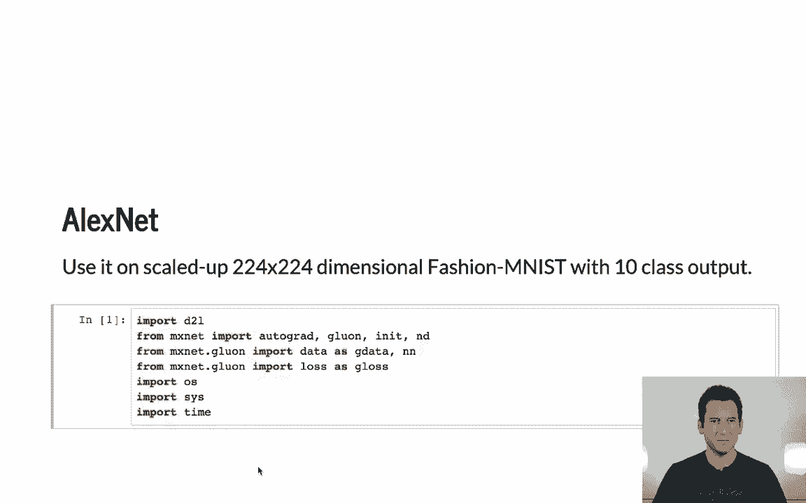

好的，然后我们需要定义网络本身。这里再次是一个简单的顺序网络。我们添加卷积层、最大池化层，然后是池化层下方的其他卷积层，再接着是三个连续的卷积层，然后是一些池化操作来减少维度。最后是臭名昭著的两层全连接层，最后一层全连接层将其映射到十个维度。

因为我们没有使用 ImageNet，而是使用 Fashion 数据集。所以让我们看看这在实践中是什么样的。

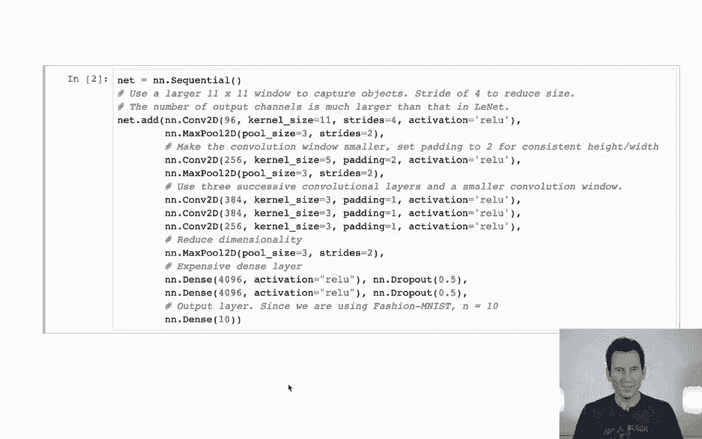

所以我要传递一些大小为 221 x 224 像素的数据。

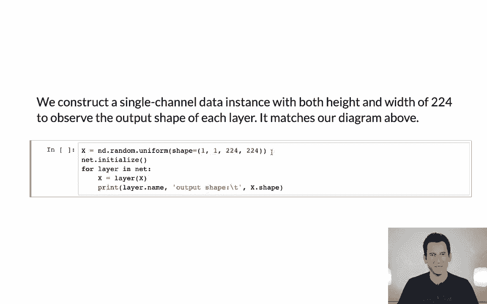

我要将其传递给网络。看啊，我得到的第一层是 54 x 54 的尺寸，96 个通道，然后是 26 x 26，256 个通道。接着我再次进行最大池化，减少尺寸，然后继续进行。

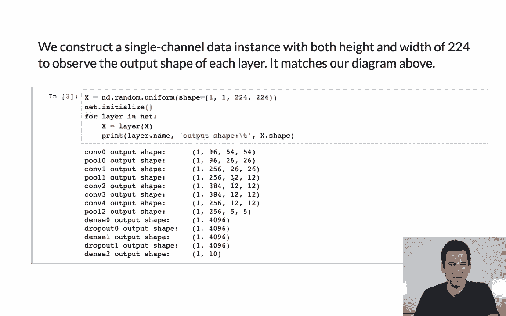

卷积层，接着我在这里进行另一个池化操作，将其缩小到 5x5，然后我继续进行。

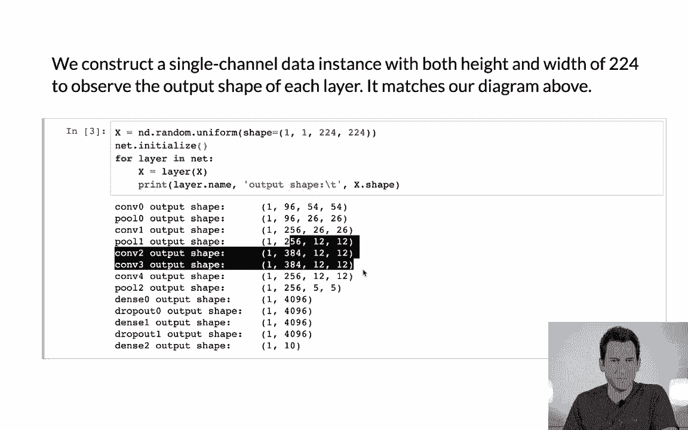

我有我的全连接层。

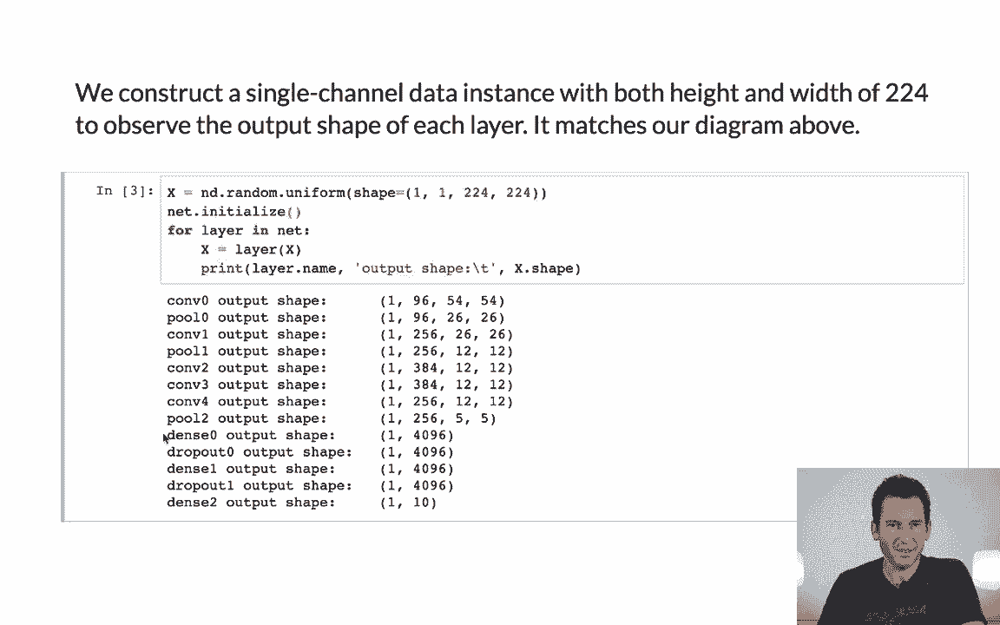

所以这会导致相当大量的参数，之后需要存储并进行计算，最终得到 10 个类别。

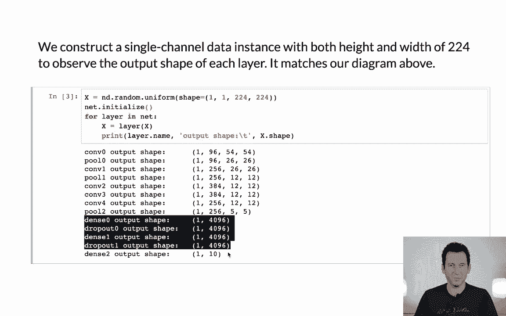

所以这就是 AlexNet，但它是十个输出版本的。

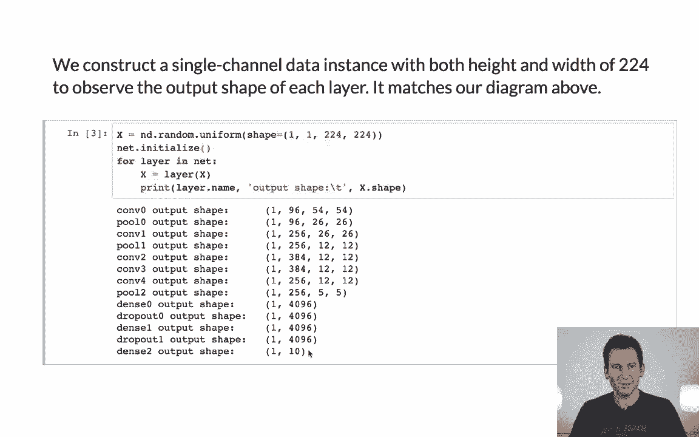

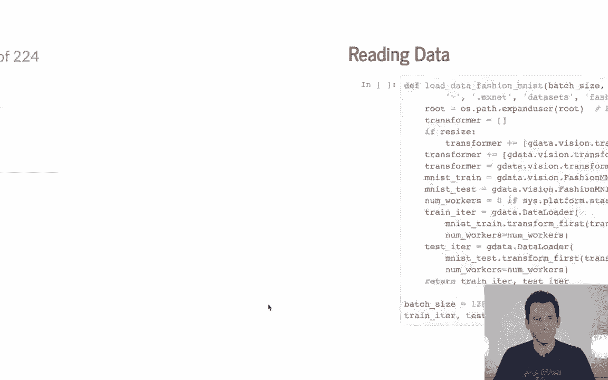

我首先需要的是数据迭代器，而这个数据迭代器看起来与我们之前看到的有所不同，因为我们希望将图像实际调整为 224 x 224 像素。所以为此，我需要使用数据转换器。这些不同于层中的转换器，它们只是用于数据转换的工具。

迭代器。所以我做的是基本上使用 Gluon 数据视觉转换器的数据。这些转换器提供的操作之一是调整大小。我还可以进行裁剪等其他操作，但在这种情况下，它将图像调整为 224 x 224，然后我将其转换为张量，以便我可以应用任何操作，并且为了提高效率，我将其组合在一起。现在我需要定义我的数据源。

这只是这个迭代器训练和测试中的一种常见方式。接着我开始构建我现在的多线程版本，如果是在 Windows 系统上，工作线程数为零；否则我们需要四个线程，因为在这种情况下，Windows 并不喜欢多线程，*相当*不喜欢。所以现在我基本上有了 MNIST 训练数据。

我先进行转换，然后我需要选择一个小批量大小并告诉它进行打乱。基本上这就是我的数据加载器所做的。所以就是这样。我对于测试数据得到完全相同的结果，所以我必须测试迭代器，最后，嗯，我基本上返回我的迭代器。

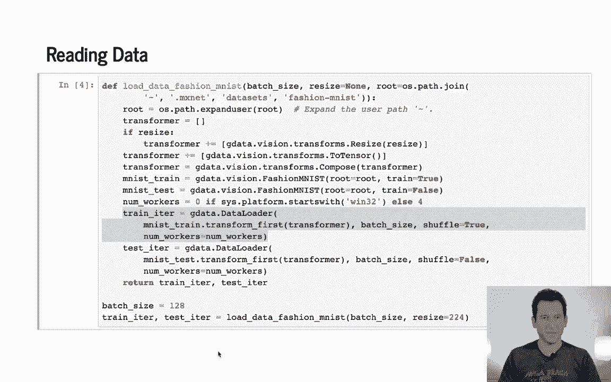

这就是我获取数据的方式。现在训练脚本与我们之前在Lynette中看到的完全相同。

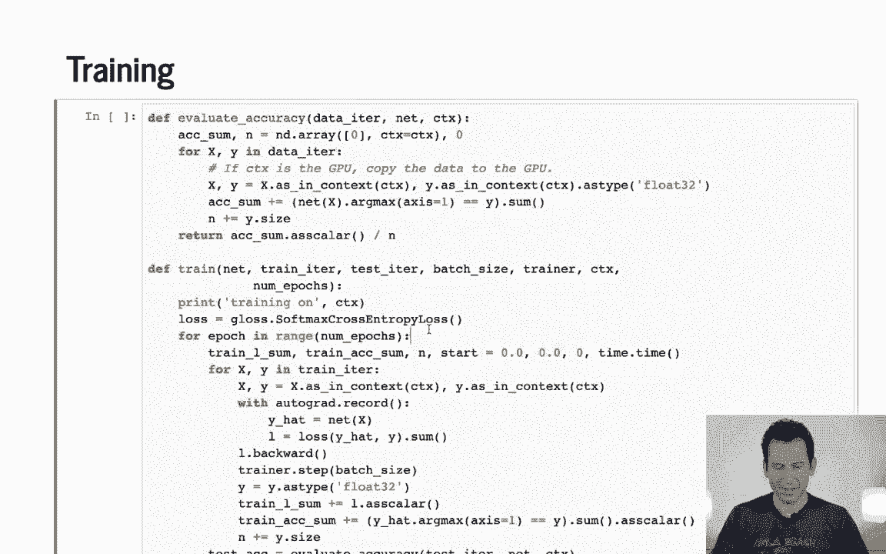

我再次把它拉出来作为参考。在Lynette的例子中我们详细看过，但基本上为了计算准确度，你将数据移到GPU上，如同上下文中那样。然后你检查在该设备上输出的最大值是否符合要求。

协调匹配你希望的坐标，并且你只是进行汇总。对于训练，你做的事情与之前非常相似。你只需在数据集上迭代若干个周期。然后你去重置一些账务记录，因为你最初做了这些，然后随着你继续迭代。

你使用训练数据来计算损失的输出。所以这就是网络的损失函数输出。然后你计算梯度，L。反向传播，并执行更新步骤。所以这是非常直接的。最后，你只需将结果转换为标量并报告出来。

所以这是非常直接的。注意，当我们遍历数据集时，我们在进行时计算训练误差。而对于测试集，我们在完成一遍数据集的遍历后计算测试准确度。

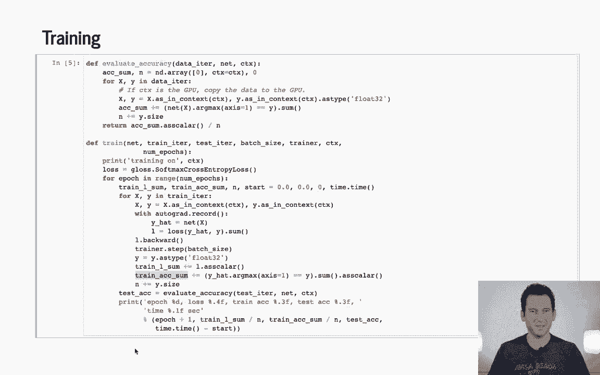

这实际上会变得有趣并且在我们接下来的步骤中变得相关。

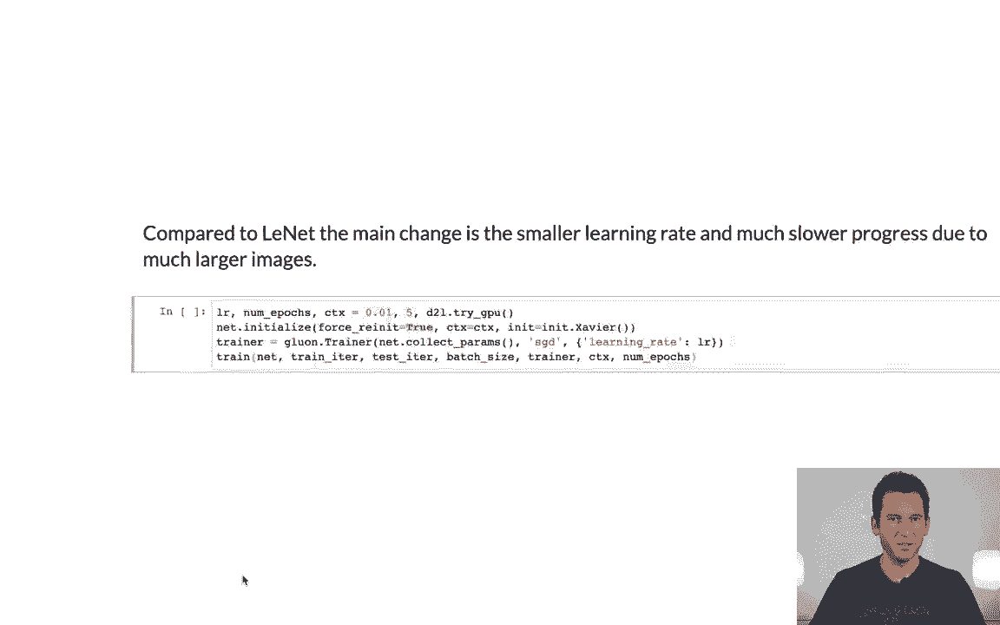

那么让我们看看这如何运作。现在它需要稍微长一些时间。

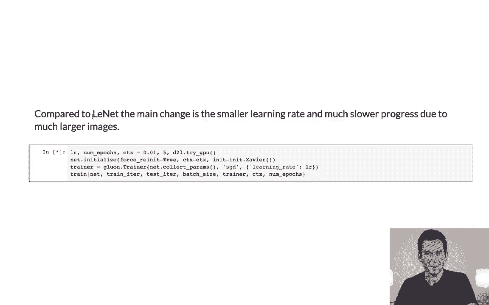

所以记得之前在Lynette上遍历数据大约需要两秒半。作为参考，在我的笔记本上，处理一遍数据集大约需要一个小时。而在GPU上，现在处理一遍数据集只需大约18秒，如果我们有五秒钟的间隔，我们大概需要等一分钟左右才能看到所有的结果。

这里有一个相当重要的细节。现在学习率是0.01。所以比我们之前使用的要小得多。这是因为随着网络复杂度的增加，学习率需要变小，以便能够顺利地遍历数据并确保我们不会出现平均化的问题。

另一个有趣的事情是我们的训练误差实际上是训练准确度。在这里，准确度低于我们的测试准确度。相当有规律地如此。看起来有点奇怪，对吧？你可能会认为训练误差应该大于测试误差，但实际情况恰好相反。这是因为如前所述，我们在遍历数据时计算训练准确度。

数据集。因此，随着我们的分类器性能的提升，当然你也会预期训练准确率会提高，但由于我们是对整个数据集的每次迭代结果取平均，而这是准确率计算中的一个非平凡部分，而测试准确率只在一个阶段结束时计算，所以训练准确率低估了实际的准确性。

你稍后会看到。好了，经过五次迭代，我们得到的误差大约是30%。所以这还算不错。为了做得更好，我们需要更加先进的网络架构，我们将在接下来的内容中探讨。

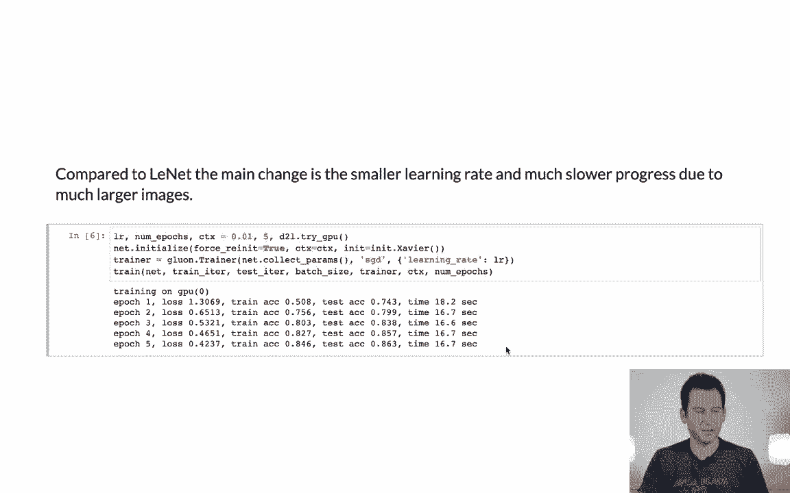
