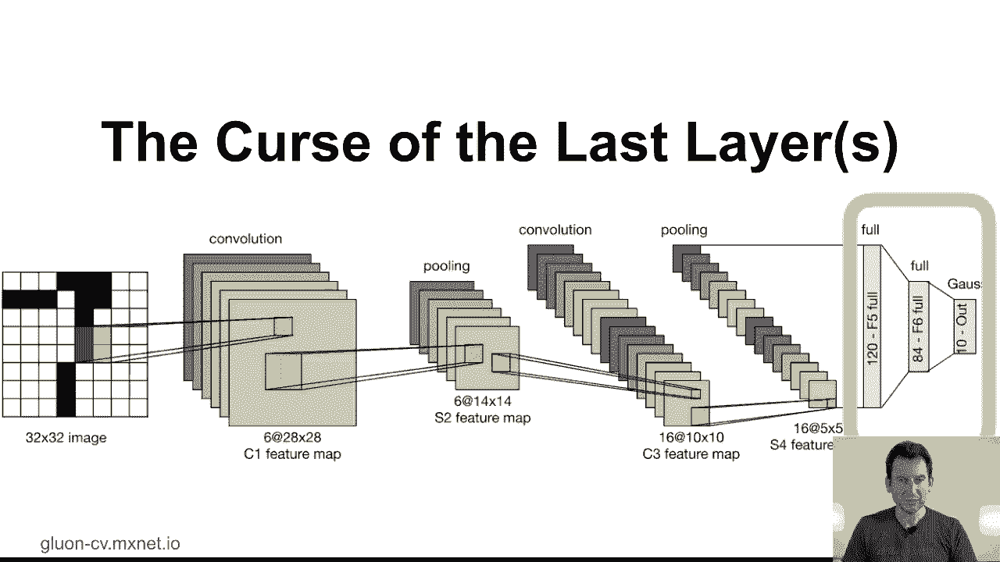
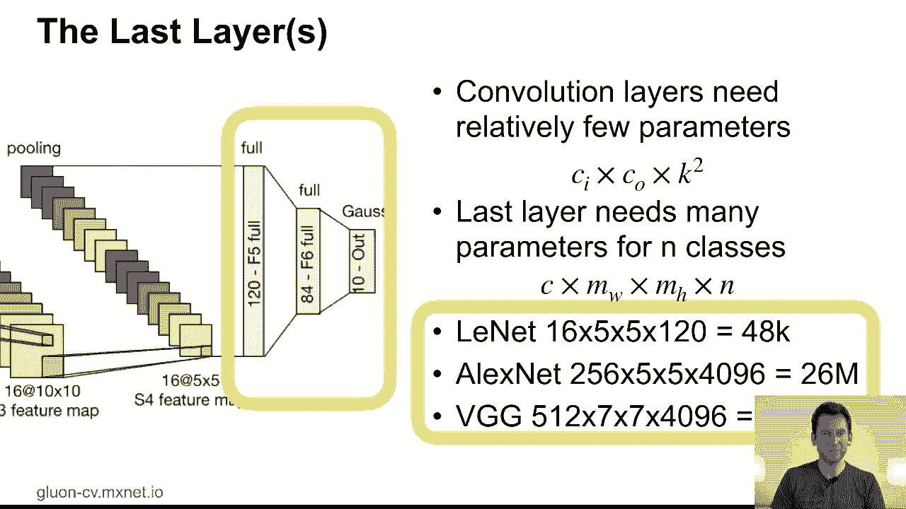
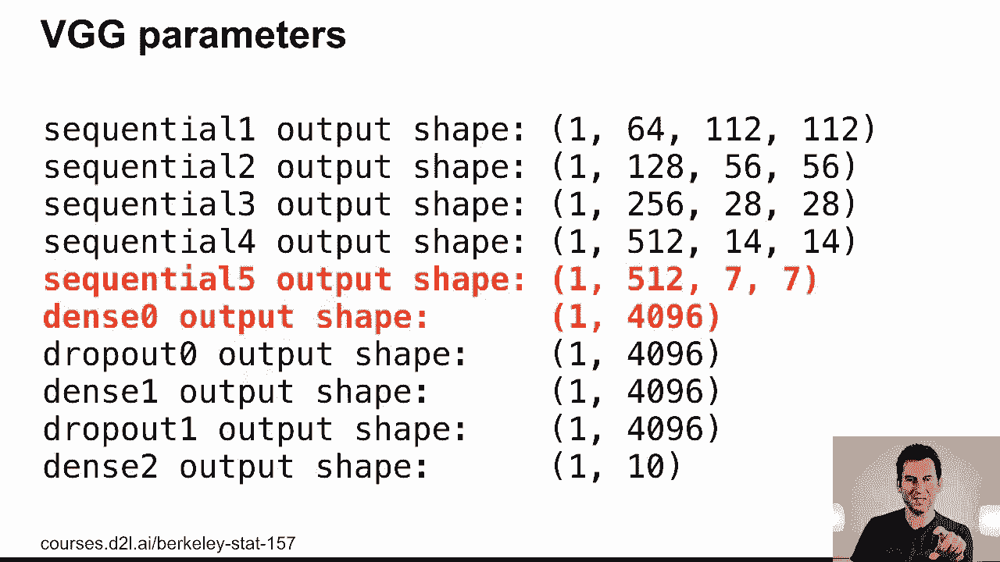
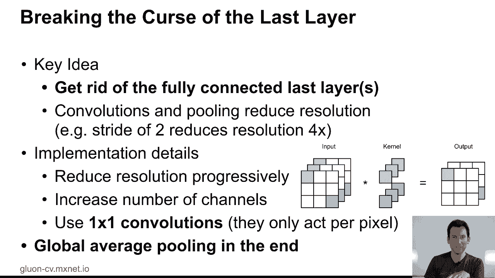
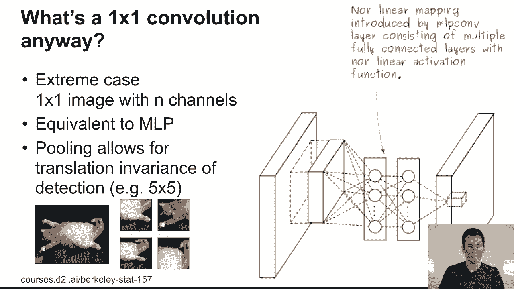
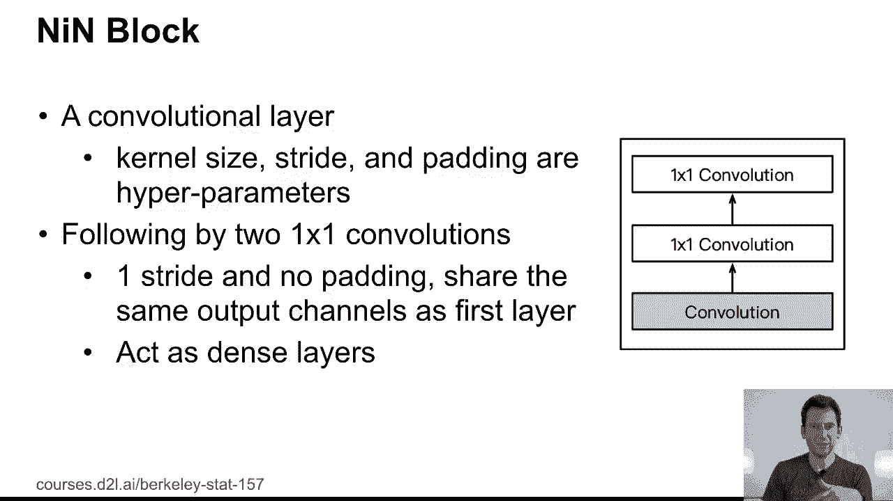
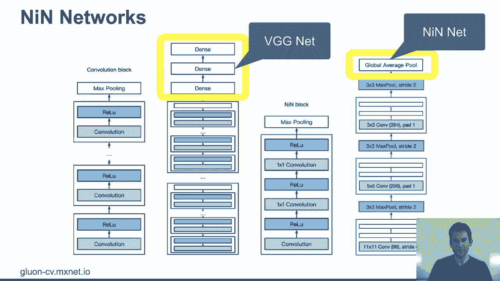
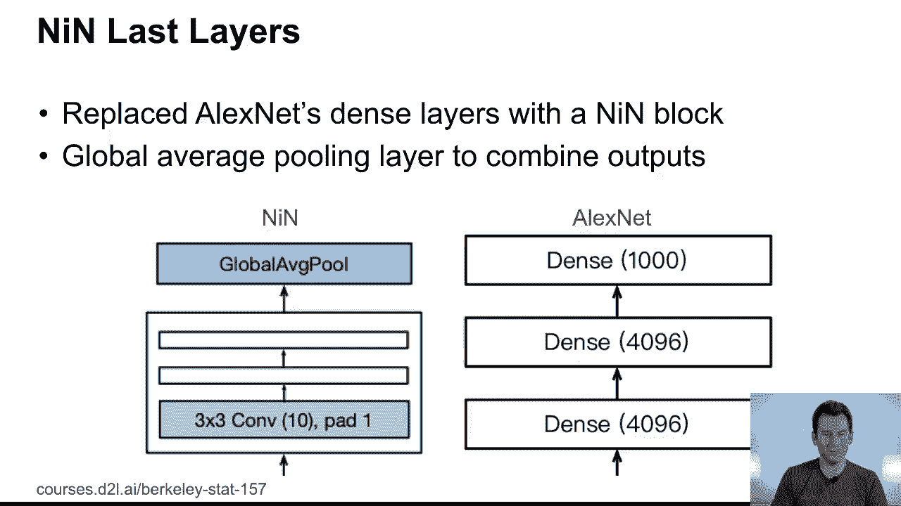
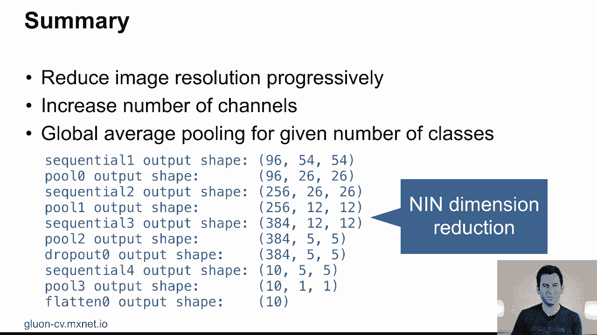
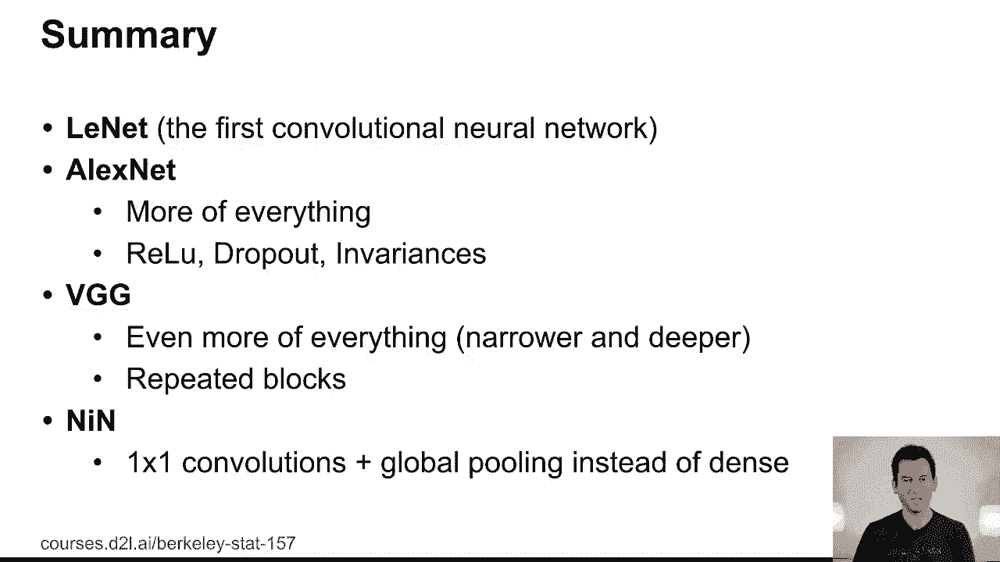

# P66：66. L12_7 网络中的网络（NiN） - Python小能 - BV1CB4y1U7P6

那么我们来谈谈如何将这些网络做得更小一些。网络中的网络是一种方便的策略。你看那张图片，你基本上可以看到，在我的卷积网络中插入了一个多层感知机作为中间层。

听起来这像是一个抽象、特殊而奇怪的想法，事实上，当这个想法发布时，人们并没有完全意识到它的影响。

让我们看看为什么这实际上很重要。如果我们看一下Lunette中的最后一层，嗯，它们其实并不大，对吧？主要的基本上只是，120个隐藏单元，84个，然后是10个。所以相对于之前的部分，这并不算什么大问题。

但如果我们转向AlexNet或VGG，那么这些东西就变得相当庞大了。所以如果你看看最后一层，它是从卷积层连接出来的，嗯，你会看到，卷积通道的数量乘以最后分辨率的宽度和高度，你知道，在你进入全连接层之前得到的分辨率。而在Lunette中，它有48,000个参数。在AlexNet中。

这有2600万个参数，大约是，3/0数量级的更多。在VGG中，这个数值又是它的四倍。所以那是相当糟糕的。而卷积层实际上还算比较合理。你知道，输入乘以输出乘以卷积核的大小，如果你有一个3的卷积核，那么。

你知道，9，所以它是输入和输出的9倍。这相当不错。但是那些最后的层才是真正让生活变得困难的地方。所以问题是，当然。你怎么能解决这个问题？问题在于，最终，你需要生成一个与你的类别数量相匹配的维度。所以在某一时刻。

你需要从一个二维的、乘以通道数的表示，转化为一个向量。挑战在于，如何做到这一点？

那我们就更详细地看看吧。如果我打印VGG的大小分布，你可以看到，当我从，顺序第5层开始，这基本上是最后一个卷积块，所以是512个通道，7x7的尺寸，到一个4096维的输出。嗯，这占用了大量的内存。

现在，解决这个问题的一种方法是去除那些完全连接的最后一层。嗯，这在理论上听起来很简单，但在实践中如何实现呢？

问题是，卷积和池化操作会减少分辨率，所以你会不断地处理这些东西。但在某一时刻，你仍然需要映射到这个，类别数量的维度对象。而同时，你也需要有一定程度的非线性。

目的是混合和转移不同通道之间的信息，将其转换为适用于类别数的表示。这正是逐一卷积派上用场的地方。正如我们之前看到的，它们仅在所有通道的每个像素上进行操作。因此，这实际上是将多层感知机应用于每个像素的激活值。所以如果最后你可能只剩下一个5x5的激活，嗯，分辨率。

这真的让你能够获取到大量已经按通道整理过的信息，非常清晰地呈现出来，告诉你需要多少个类别。现在，在最后一层，它们实际上直接去掉了它。所以与其纠结于最后一个全连接层，它们只是执行了全局平均。

按顺序拉取以处理问题。

这效果相当不错。所以如果你再看看，嗯，逐一卷积实际上就是一个多层感知机。这就是解决问题的方式。

这导致了一个叫做NIN块的东西，即网络内网络块。所以基本上你会有一个卷积，接着是两个逐一卷积。这些操作就像你拥有一个全连接层一样。你重复这一过程几次，然后你就得到了如下的架构。

所以NIN网络包含了多个卷积，后跟逐一卷积，最大池化以减少分辨率。你重复这个过程三次，以得到一个有意义的网络内网络结构。这样完全摆脱了全连接层。这就是网络内网络的贡献。它们的表现不如VGG好，这也是人们最初忽视它们的原因之一。

但它们是通向Inception或ResNet等技术的关键组成部分，而这些我们将在接下来的几节课中讲解。

但最终进行比较时，与全连接层不同，你只用了这些多层感知机，然后是平均池化。

总结一下，你得到的是这种维度压缩。所以你可以看到，你从96个通道到256个通道，再到384个通道，这些通道会进一步减少，直到你得到一个5x5的结果。然后你降到10维，因为这是一个10分类问题。

你执行全局平均，降采样，丢弃剩余的几个维度，然后就完成了。这就是你需要的所有内容。

总结一下，今天我们讲的内容是Lynette。这是第一个卷积神经网络。然后我们讲到AlexNet，它更大更好。VGG则更大。然后提供了一个构建性的替代方案来应对这些庞大的全连接层。下节课我们将看到如何将这些思想结合起来，得到Inception。

然后通过进一步细化函数类别，我们将介绍resnet和resnext。但是这是下节课的内容。

[BLANK_AUDIO]。
