# P68：68. L13_1 Inception (GoogLeNet) - Python小能 - BV1CB4y1U7P6

 So welcome to the second part of the convolutional network， Zoo。

 So today we are going to go quite deep into， ConvNet that will get us to the state of the art。

 So this is really going to get us from 1995， where we were last week to now 2018。

 And we'll go through a number of networks。 I'm not sure we'll cover everything this week。

 We may have to postpone some of the things until next week。

 But we've got a fairly ambitious program ahead of us。

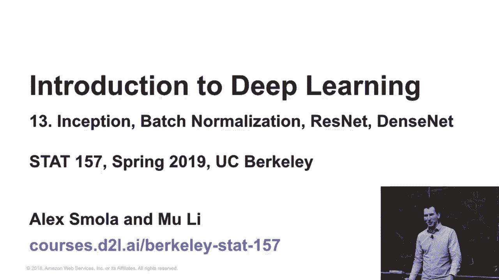

 So let's start with something very simple。 Well， it doesn't look so simple。

 but that's still one of the， simple networks inception。

 So let's review a little bit what we did so far。

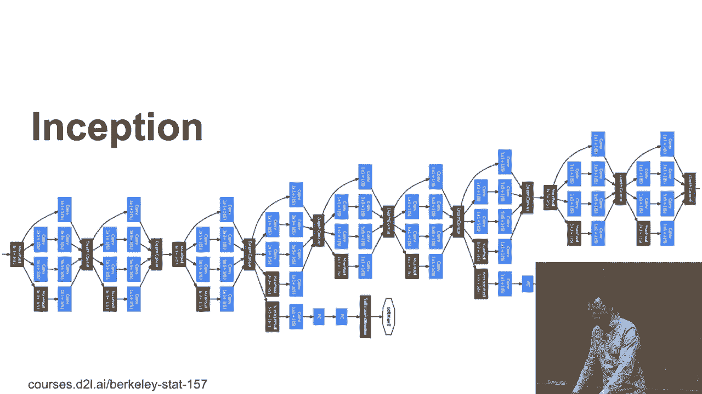

 So we had Lynette and Lynette had like 5x5 convolutions。 And then AlexNet used 11x11， 3x3s and 5x5s。

 And then VGG used some other mix of those。 And then NIN used mostly 1x1s。 And yeah， it's a mess。

 So like which convolution should you use？ So the ones， the 3s， the 5s， or max pooling。

 or multiple 1x1s。 And yeah， I mean you can't decide， right？

 So this was essentially the dilemma that they faced in trying。

 to figure out how to build a good convolutions block。 The issue is the following。 If you pick 5x5s。

 you end up with a fair number of parameters。 You end up having to do a lot of multiply ads。

 And both of those things are really awkward， right？ And they need a lot of parameters。

 They are very slow。 A lot of parameters typically means it won't generalize that well。

 But it's on the other hand very expressive。 On the other hand， if you pick one by one。

 then it's very well controlled， and doesn't need much memory。 But at the same time， well。

 it maybe doesn't work so well。 So what are you going to do？

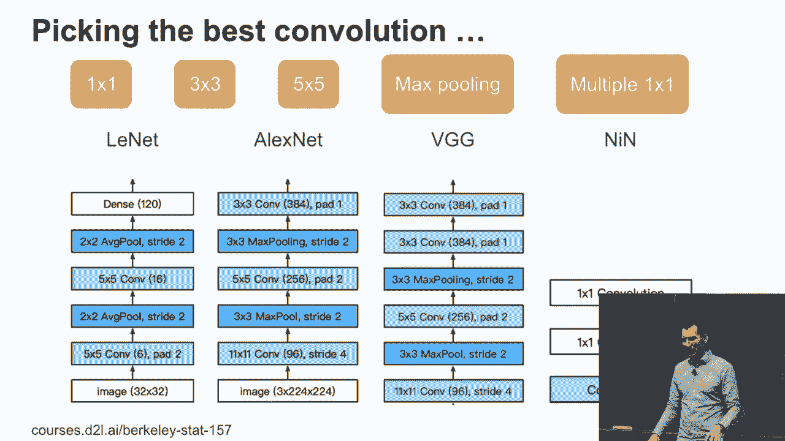

 And so then， why not just not decide？ And that was the brilliant idea in the Google Net paper。

 And it's also called the inception paper or the inception network。 After the movie。

 like we need to go deeper。 And that was literally their motivation for coming up with that name。

 So here's the inception block。

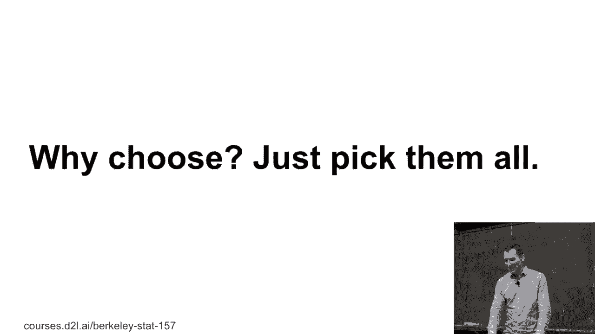

 And it's really the， well， we don't know what to do， so we'll do all of it。

 So it has one by one convolutions because， yeah， why not？

 It has one by one convolutions followed by three by three convolutions。

 It has one by one followed by five by fives。 It has max pooling followed by one by ones。 Right？

 And you just combine this all and the hope is， well， you know， if you throw it all in the wall。

 something will stick。 Okay。 Now to make sure that this all has the same dimensionality。

 you need to use the appropriate padding。 So that's why there's three by threes have padding of one and the five by fives have a padding of two。

 So at least， you know， in terms of sizing， the inputs and the outputs have the same size。

 And then you just stack it all together。 So you now have a veritable smorgasbord of， you know。

 different channels doing different things。 And the hope is， you know。

 one of those channels is going to work for the cats and one of them is going to work for。

 I don't know， songbirds。 Yeah。 This is the inception block。

 Now you might wonder why on earth is this specific block a good idea？ Well。

 they probably tried out about four or five and this one worked best。

 And we'll actually revisit that question a little bit later， but for now。

 let's just assume it's the， well， we tried out a lot of stuff and this one worked。 Okay。

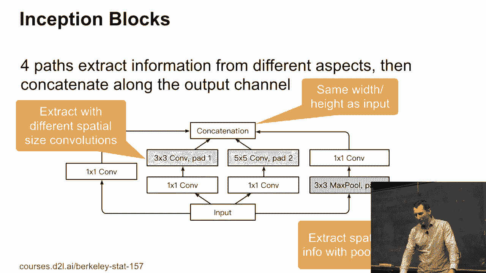

 And so， for instance， if you look at the first inception block， well， it uses， you know。

 64 channels for the one by ones。 128 for the three by threes。

 32 for the five by fives because they have a lot of parameters already anyway， right？ So it's。

 you know， 25 times 32。 In the other case， it's nine times 128， right？

 And then you have just a few other， you know， max pooling dimensions thrown in because， well。

 you want this all to add up to 256。 That's really what it is， right？

 So there isn't anything terribly deep in there。 The input dimensionality doesn't really。

 the input number of channels doesn't really matter that much。 It's just， you know， you know。

 features in， right， channels in and then you get some appropriate number of channels out。

 But what it does is that you now have in aggregate a number of parameters and number of floating-point operations。

 that's actually not higher than doing something a lot more simple。

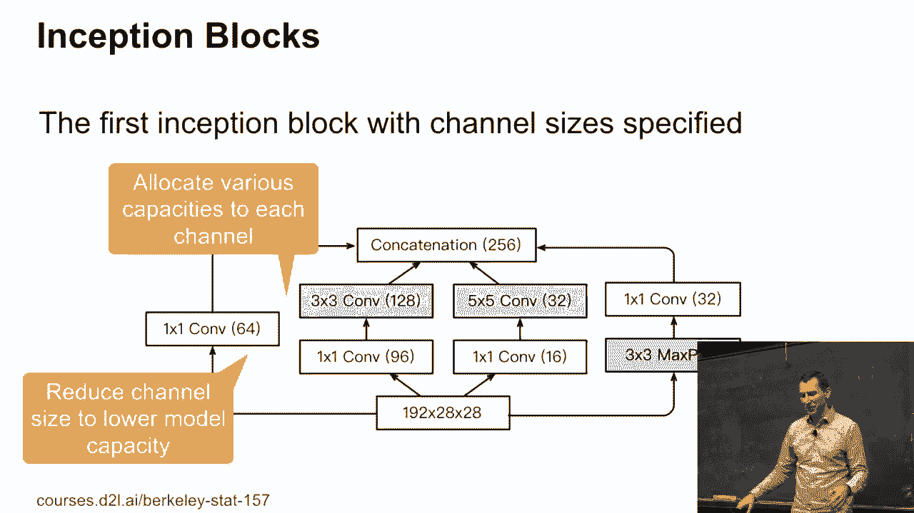

 So that's really the key benefit of that。 So if you do a parameter count and if you say， well。

 if I wanted to have， you know， 256 output， there's， well， 256 output channels。

 then with inception you only need 160，000 parameters and it costs 128 mega-flops。

 So there is a three-by-three， which costs you， you know， about three times that and a five-by-five。

 you know， about eight times that amount。 And in terms of floating-point operation that scales up correspondingly。

 So the assumption still is， you know， if I can get the same thing done with fewer parameters then。

 you know， they work better。 And yeah， that's essentially what motivated the inception block。 Yes？

 [ Inaudible ]， So why is it， why is it simpler？ Well， let's， it's a very good question。

 Let's just look at， look at the algebra， right？ So for a particular， you know， layer， I have k by k。

 So since they are like three-by-three or five-by-five， whatever， I'll just write k squared。

 Times c in， times c out， times then I have basically m h times m w。 Well， this one's fixed。

 This one's fixed。 Well， that one to some extent I can play with。 So now what you get is， you know。

 c i times m h times m w， times， now a sum over， you know， the various path j， k j squared。

 times c out j。 And so by judiciously allocating compute to different channels。

 different numbers of channels， for different kernel width。

 you can end up in a better spot than picking something homogenously。 But it's a very good question。

 Any other questions？ And again， the reason why on earth you would do this， well。

 because maybe there is some， you know， longer range information that's out there that a five-by-five kernel is going to catch。

 That's three-by-three might not。 So therefore， you know， having those features is useful。

 but maybe I don't need a lot of them。 And maybe I can get away in many cases by just doing one-by-one operations。

 and so fine， I'll do one-by-one operations。 That's the motivation。 Okay。

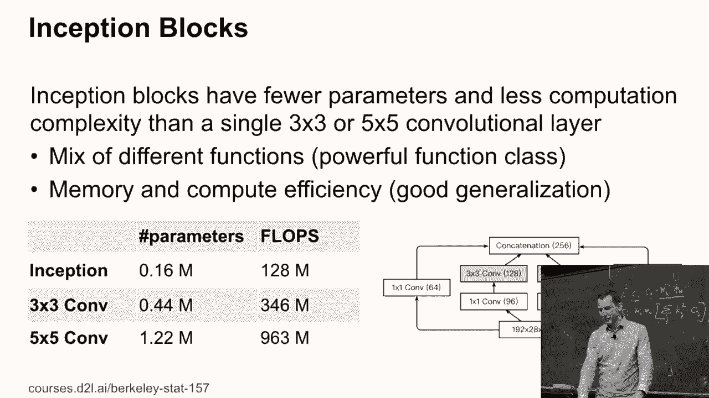

 So here's the network in its full beauty。 This is a little bit easier to grok than from the original paper。

 These are really the five stages of that Google Net or inception network。 So the stage one。

 and we're going to go through this in a bit more detail as we go along。

 but let me first walk you through the pieces here。

 So stage one behaves very similar to a lot of other confnets。

 and it starts with a fairly broad convolution and pooling。

 And let's just make sure that I have some basic amount of， you know， translation invariance。

 and that I am able to reduce the dimensionality reasonably quickly， fairly early on。

 So that max pooling halves my resolution。 Then stage two is again very much trying to get， you know。

 some overall spatial correlation and then some pooling operation in the end。

 So this is fairly vanilla relative to all the other networks that we've seen so far。

 and that the other ones that we're going to see today。

 And now is where all the interesting things start happening because we now have those， you know。

 inception blocks。 Two of them， then max pooling， which again reduces resolution。

 So the three-by-three max pooling each of those operations half my resolution。

 So what I'm doing is I'm shrinking resolution， but I'm also increasing the number of channels。

 Because now while I have fewer pixels， they have more valuable。

 more higher order information than I'm going to use later on。 Then I have this， you know。

 backbone of five inception blocks one after the other。

 This is where most of the interesting nonlinearities happen， and I shrink again。

 and then I'm picking another two。 Why did they do a split of two， five， and two？ Well。

 they probably tried out a whole bunch of networks。

 and that's the best thing that they could come up with。

 There are some follow-up papers like a Mibonet， which is then beyond Google Net version four。

 where they essentially use the genetic algorithm to just randomly try out whatever stuff。

 And I guess if you have a lot of compute available and I guess cost is no object。

 neither for getting there or for then running the computation。

 then you can get really good accuracies with that。 Anyway， so you know， you try out stuff。

 I tend to favor the architectural changes because they give you a durable advantage rather than just for the one specific thing。

 But， you know， if you want to win a benchmark， you probably want to do a little bit of both。

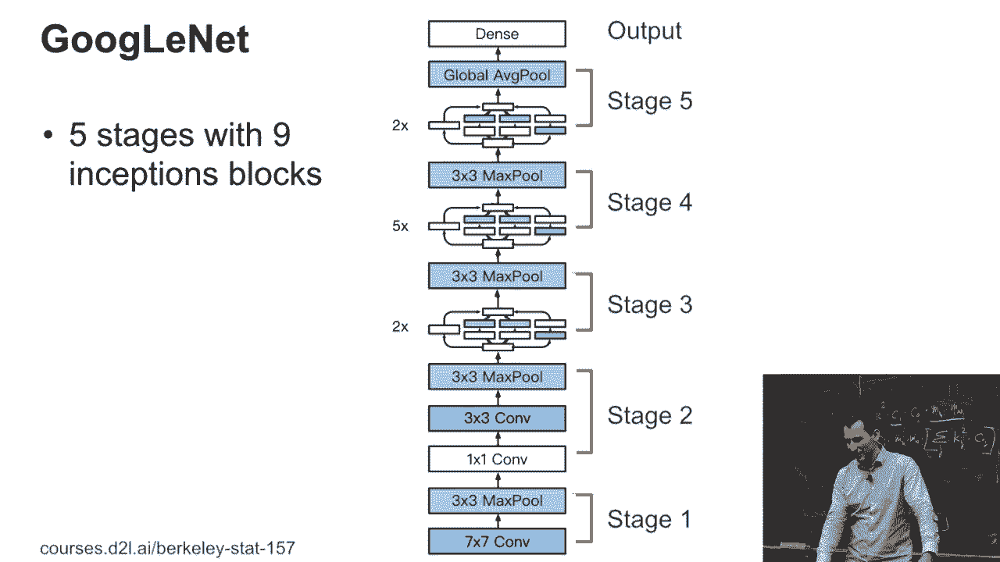

 So， let's look at stage one and two directly。 So in AlexNet， well。

 it's basically a very wide convolution 11 by 11， and this one's a little bit small。

 it's only a 7 by 7。 And you have one by one， and then again， three by three and pooling。

 So it's not too dissimilar from AlexNet， the only difference is that you have a bit more channels and you have a higher resolution。

 So in AlexNet， you ended up with a 12 by 12 in the end。 This is 28 by 28。

 so it's still keeping a fair amount of the information that you would have had otherwise。

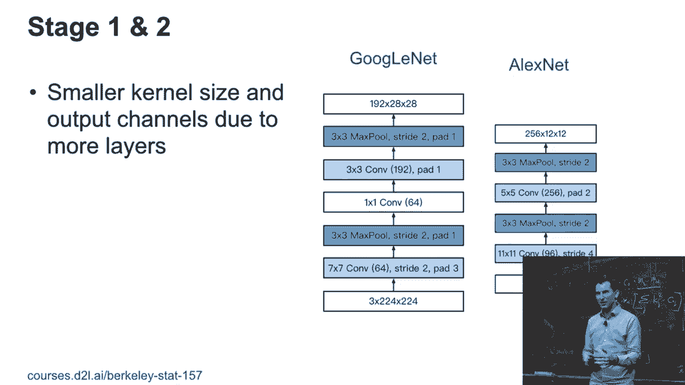

 Stage three， well， fair amount of stuff is already happening。

 and so the allocation is different between channels even between the first and the second block。

 So you can see for the first block you have， you know， 256 features and the， sorry。

 channels and the second one you have 480， and only then you actually go and reduce the resolution。

 So you start out with 28 by 28， then you get 14 by 14。 Okay， any questions so far？

 The different versions of those networks are usually due to a different size trade-offs and whether you use。

 you know， two， three， four， five stages or blocks。 So there's essentially the architectural variety。

 so we'll see that with ResNet quite a bit。 And we'll look at the simplest ResNet， namely ResNet 18。

 but there's not like a ResNet 150。 And at some point you just run out of compute budget and that's when you stop。

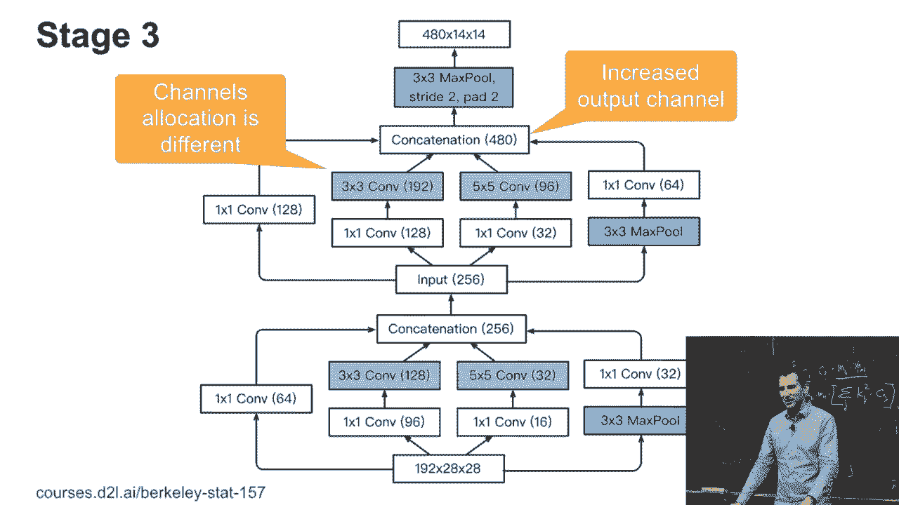

 Okay， stage four and five look very similar。 So again。

 you increase the number of channels to 512 up to， you know， 832。 Why that？ Before the max pooling。

 because the max pooling shrinks the resolution， so we better store as much information as we possibly can on a per channel basis。

 Right？ And then in the end， well， you have basically a 1024 channels and that just so happens to be the same thing as what you would get for。

 you know， the number of classes that you want to predict。

 And then you just perform a global average pooling。 Now。

 is it a great idea just to do global average pooling over a 7 by 7？ Well。

 you could argue about that and maybe a fun thing to test out。 And if it works。

 it's definitely a paper or maybe somebody has already written the paper。

 It's to perform attention pooling over the 7 by 7。 Okay。

 if nobody's done this yet or if nothing's published， it means either it doesn't work。

 which is entirely possible because people don't publish results。 Hey。

 I tried these five things and none of them worked。 Or if nobody's done it yet， well， okay。

 this is like a paper on the weekend。 Okay， so this is Google net。

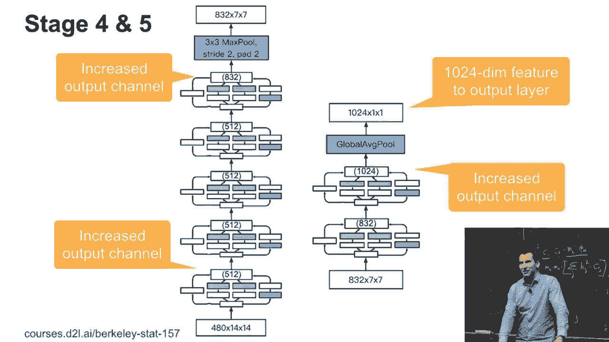

 Any questions so far？ Okay， now the thing is of course there isn't just Google net。

 There's Google net V2 and V3 and V4。 And those different variants are then improvements on the overall architectural pattern。

 So V2 adds something called batch normalization。 And we'll cover that a little bit later。

 Then V3 adds different shapes of convolutions。 So this is going even crazier on the， well。

 do we need three by threes， one by ones of five by fives？

 You could also add a one by five or a five by one or a one by seven or some other shapes。

 And overall， making each of those blocks even deeper。

 And this is exactly where if you then try out even more things。

 you might end up with something like a meebonet which has a lot of different ones。

 And inception V4 then copies from resnet and essentially imports the resnet ideas into inception。

 But still it doesn't work as well as resnet directly。

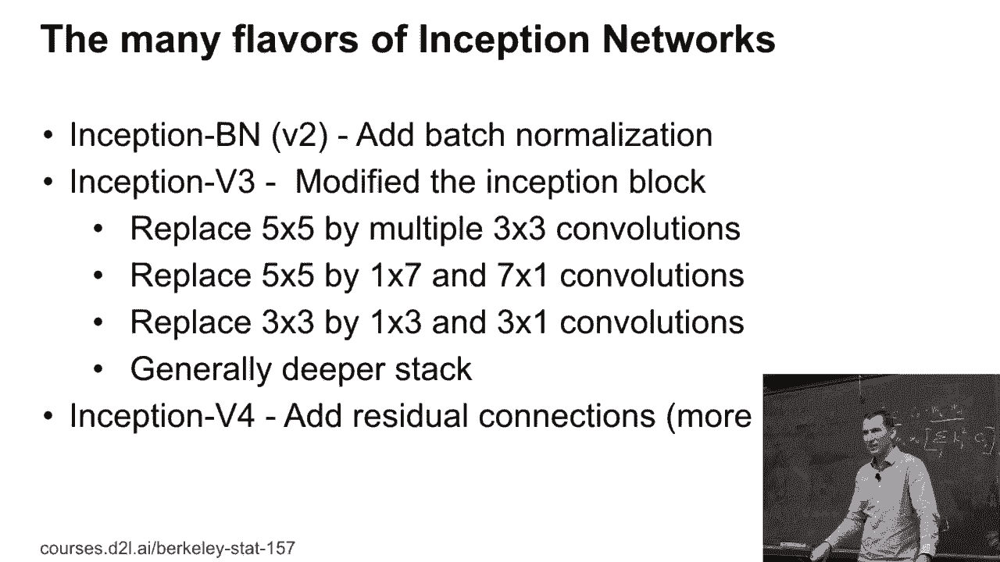

 So let's look at what changed。 So on the left-hand side is version three for stage three。

 And if you， you know， squint and you compare left and right， you can see， well。

 the right-hand side replaced its five by five convolutions。 And five by five convolution by two。

 three by threes。 So that's actually what you would expect。 So if you remember the system on paper。

 system on semonian paper， where they looked at， you know。

 whether wide and shallow or deep and narrow networks are better， deep and narrow one。

 And so they just， that's where they replaced the five by five by two， three by threes。

 And that's about it。

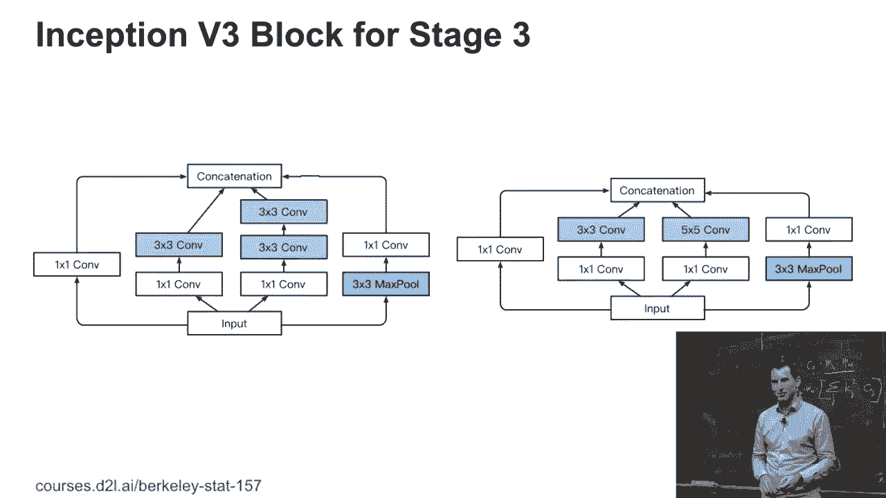

 So that's a fairly benign change。 Now let's look at stage four and this is where they went hog wild。

 Again， it's the five by five that were replaced and they were replaced by one by sevens and seven by ones。

 And if you look at what happens， right？ So this is actually the first time that people then use asymmetric convolutional shapes for real。

 This is a three by three。 Seven by one is quite narrow， right？

 But this requires only seven parameters。 This requires nine per channel。

 So it's actually cheaper to do this than that。 And so this increased computational budget。

 if you will， or if you look at the five by five， that's 25 parameters。

 Those four layers of seven by one and one by seven convolutions alternated cost you 28 parameters。

 So the cost is very similar。 So you have very similar model class in terms of number of parameters。

 but it's much more expressive。 Question？ Why do I need to combine a one by seven with a seven by one convolution？

 Why can't I just get away with it and say， well， I have a one by seven convolution， that's it。

 Why do I need both？ Yes？ >> [INAUDIBLE]， >> Correct。 That's exactly what's going on。

 So a one by seven might do this。 And a seven by one is going to do that。

 So if I only have a seven by one， and I'm only going to get features that are vertically contiguous in some way。

 Whereas this one will catch only features that are horizontally contiguous in some way。

 And so if I only include this， I'm going to get a network that's particularly well suited for one type of features。

 but pretty awful for the other。 And in general， I won't want that。

 Unless this is actually my goal in the network design that I know that I have a certain type of features of which I'll see a lot。

 Okay， good answer。 Any other questions about this network？ So one thing to， well， keep in mind。

 So when they wrote this code， this was using not TensorFlow， but the precursor called disbelief。

 And writing networks in disbelief was not a nice thing to do。

 So you had to work out exactly what all the input and output dimensions are。

 And it's basically a lot of manual code generation。

 So basically the representation was a lot less concise than what we take for granted nowadays。 Okay。

 stage five went even crazier。 So rather than those three by threes。

 it used one by threes and three by ones。 And likewise in the other part。 Okay。

 so I guess you can see a pattern of what the modification steps were。

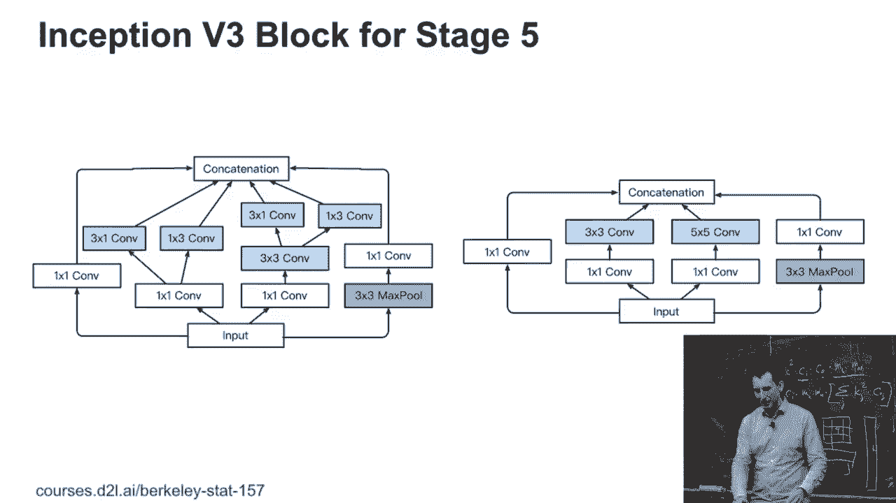

 And with that， we are at the point where we are now getting closer to what's actually state of the art performance。

 So if you， this is a plot of accuracy versus throughput for a fairly large number of models。

 This is from the Gluon model zoo。 And what you're seeing there is a large number of architectures implemented and trained in the same way。

 The size of the dot corresponds to the amount of memory footprint that I need in order to execute a particular model。

 So small dots are very efficient models and this thing called mobile net and mobile net V2。

 And they turned tend to be smaller actually quite disappointingly。

 Mobile net version two is overall worse than mobile net version one。

 Now you might wonder why did they get mobile net version two published。 Well。

 so you see those green dots on the right hand side。 So this is， you know， this nice perita curve。

 Well， these have some， they have a vertical line below。

 That vertical line indicates the difference between the published result and the result that we got with the same architecture。

 In other words， a lot of the gains that mobile net two reported。

 at least relative to what's published， are due to better training。 Okay。

 So better training algorithms for the same architecture can make quite a difference。

 An inception V3 actually does quite well。 It's a little bit better than what's published。

 The best ones are those， you know， res nets and then afterwards stands net and。

 so I squeeze an excite net。 And we'll talk about them as we， you know， go through it。 Yeah。

 and essentially if you want to do well， you want to get your paper published。

 You want to land your dots somewhere to the right of the convex envelope。 Right？

 Why is it that convex hull rather than just individual points？

 How can I get anything within that convex hull？ Remember。

 this is accuracy versus throughput in that curve。 Why can I get any point on that curve。

 even if it's not a specifically well-defined architecture？ How would I do that as an engineer？ Okay。

 Let me give you a hint。 Let's say I have two networks。 Network A and network B。

 Network B is the first network。 Network A is the accurate one， right？

 And I want to have some network C which sits here。 How can I construct network C from networks AMP？

 So this is accuracy。 This is speed。 Well， what I can do is， I can just， you know。

 let's say this point C here is in the middle， right？

 I send half the dot to the network A and half the dot to the network B。

 This is my new mixed network between AMP。 All right？

 Now this mixed network has the nice property that the accuracy will be， you know， half the。

 accuracy from here， half the accuracy from there。 So this gets me this intercept。

 And since the time it takes， the process will also be half the time here and half the time there。

 Well， the run time is there。 Now， there are ways how I can push this curve out quite a bit further to the right。

 It's more or less the same accuracy but much higher speed。 And that I can do by， for instance。

 reducing the bit resolution。 By going from 32 bit to 16 bit or then to 8 bit。

 If my hardware supports it and is particularly fast at it， I can get considerable speed up。 So。

 for instance， if you look at the Nvidia Turing GPUs， if I use it， so basically I need。

 to use one of the GPUs， the RTX GPUs， not the GTX ones， so basically one that has the tensor， cores。

 They are twice as fast for int 8 as they are for FP16。

 And they are up to 5 or 6 times as fast for FP16 as they are for FP32。

 So I can move by a factor of 5 to the right hand side if I go from 32 to 16 bit。

 And I can move by a factor of 2 again to the right if I go to 8 bit。

 It's not quite that simple because you need to care about accumulation and other details。

 So there's a little bit more work to be done， but by and large that's the idea。 Yes？ [inaudible]。

 Okay， so I don't know whether we'll have time to go into this in detail as part of this class。

 This is probably more of an advanced topic。 But right now all the models that you guys are using are using single precision。

 So basically floating point numbers， just regular floats。

 So they use 32 bit and you already saw that even for 32 bit you can get numerical instabilities。

 and overflow and other things， right？ So you probably all remember， you know， for instance。

 for logistic regression log X is a really， bad combination and you need to do something to make sure it doesn't go too bad。

 Now what you can do is you can go from 32 bit to 16 bit。 And of course if you do that。

 you don't really have a lot of availability anymore for a larger exponent。

 This is by the way the difference between FP16 and BP16。

 So BP16 is the thing that at some point Google advertises the new great floating point format。

 And what they did is they did the right thing， namely rather than picking the one format that's really good for computer games。

 This is where FP16 was defined。 They picked something that used more of the bits out of the 16 bits for the exponent。

 And with that you can cover a larger dynamic range at the expense of the accuracy within that range。

 But that takes care of will flows and so on a little bit better。

 If you don't have that you just have to be a bit more careful。 Going down to int 8。

 so basically one byte， sized， you know， weights and parameters and activations and so on。

 You need to do a lot of intermediate steps。 So this is why you don't quite get a doubling in performance if you just have the resolution。

 But you can get pretty close to that。 And you have to be careful not to lose accuracy。

 So if you build an embedded device you want to run things in the mobile phone or you want to run things in the cloud with very high throughput。

 Int 8 is your friend。 And you'll do that for the model that you've。

 where you're pretty sure that this is what you want。 Any other questions so far？ Okay。

 so this is the famous inception network。 Now let's actually see what this looks like in practice。

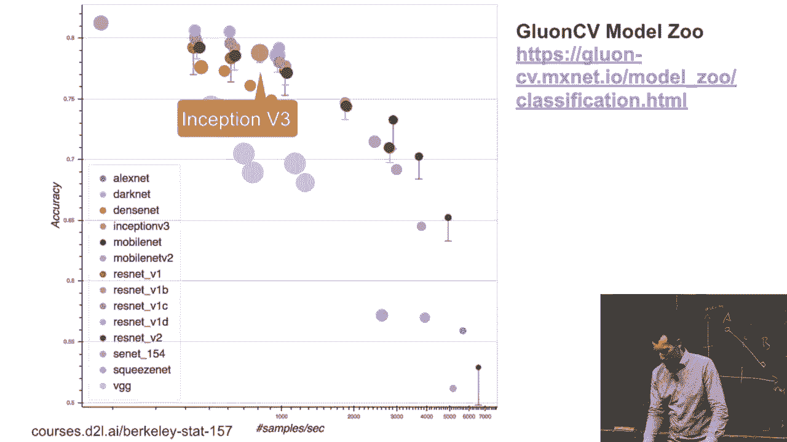

 [BLANK_AUDIO]。

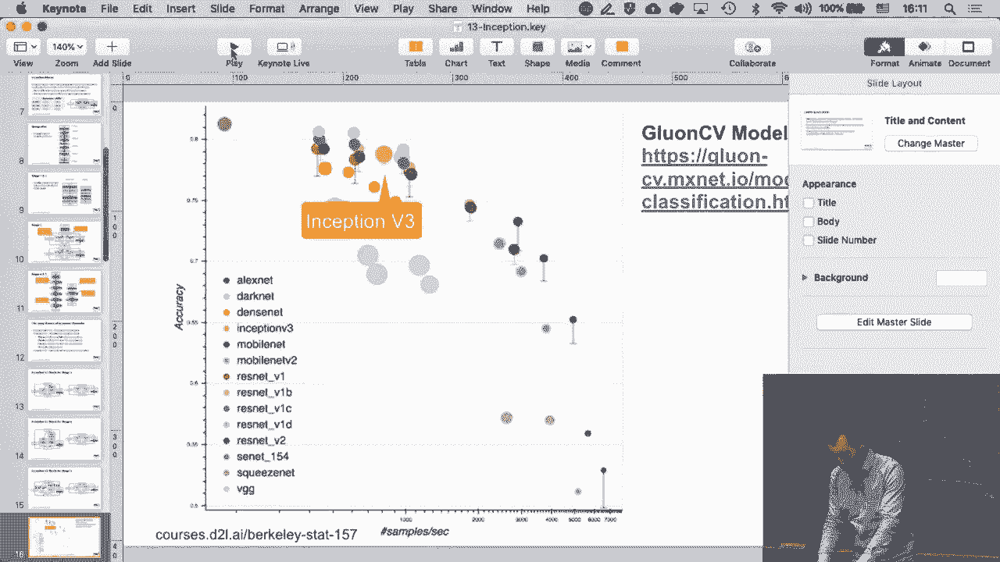