# P69：69. L13_2 Inception in Python - Python小能 - BV1CB4y1U7P6

 Okay， so this is now my notebook running on a gpu。

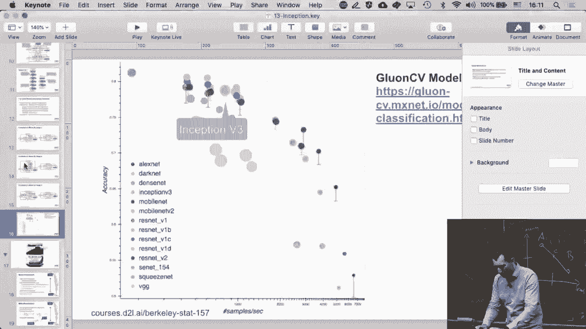

 It's one of the p3 to x large servers。 And let's actually go and implement an inception network。

 And run it。 So the first thing i have to do， Is of course import all the appropriate libraries and i've。

 Done that already before so i can skip this。 But here's the basic inception block。

 So this is the basic inception block now written out as code。

 And here we are going to encounter for the first time a， Parallel composition of various paths。

 So this is now where we don't have just a simple add a block， Add a block， add a block。

 But we actually have to do a little， Bit of work to instantiate this。

 The first thing i need to do is i need to initialize the， Components。 So i need for path one to。

 The convolution of size one by one。 For path two i need a one by one and a three by three。

 For path three i need a one by one and a five by five with， Again， appropriate padding。

 For path four i need a max， Pulling and a one by one。 So these are all the parts up here。

 That i first need to define。 Now i have some parameters， Namely c one， two， three and four。

 And these are the parameters， That govern the sizes， basically the number of channels for the。

 Various paths。 So if you go back。 These are the full paths。 Past one， two， three and four。

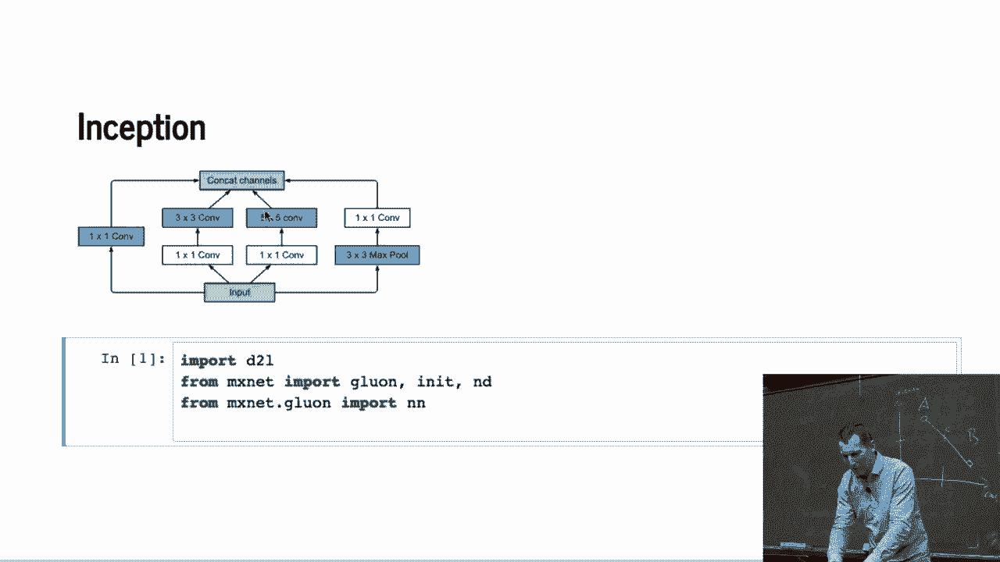

 There we are。 Now what i then do is i just code up， And i then do is p one， one of x。

 That's path one of the input。 P two is p two of two of p two， one of x。

 Because i'm actually concatenating those two pieces， right？

 So i first apply a one by one and then a three by three。

 For path three i do the same thing for one by one and five by five。 So i have to add four， max。

 pooling and convolution。 Now i have those four paths separately。 And now i can concatenate it。

 So in the concat of p one， two， Three， four along dimension one just stacks everything up。

 So i have to add the output of that layer。 So once you think about it this way it's actually fairly。

 Straight forward。 So if i wanted to modify that， Architecture of the intercepts and blocks。

 that would be very easy。 So remember this will return a block with these parameters， Right。

 with basically c one， two， three and four and some other parameters that i， Might have。

 So now we need to define the various， Blocks。 So block one is just sequential。

 Composition and i know why because i didn't actually run this。

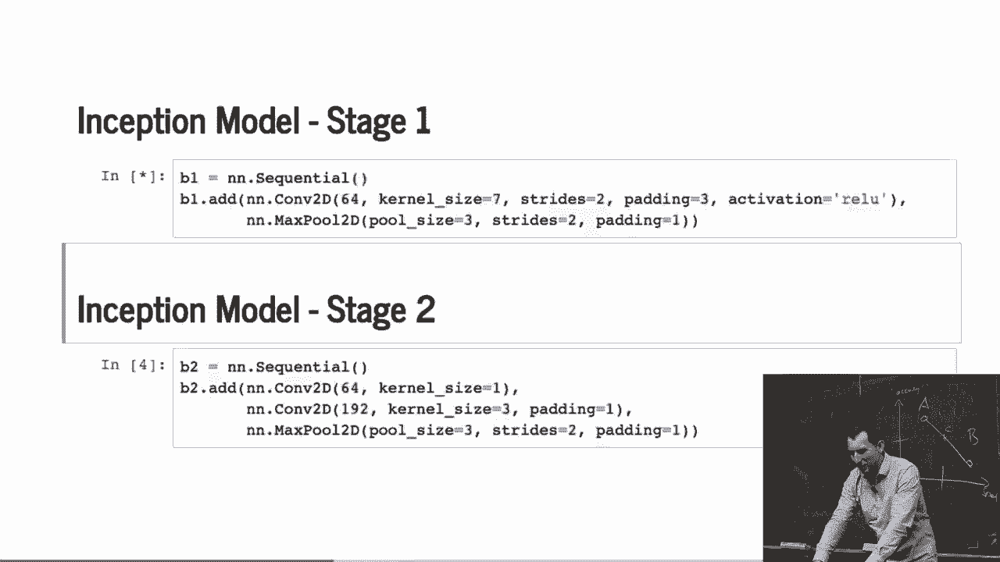

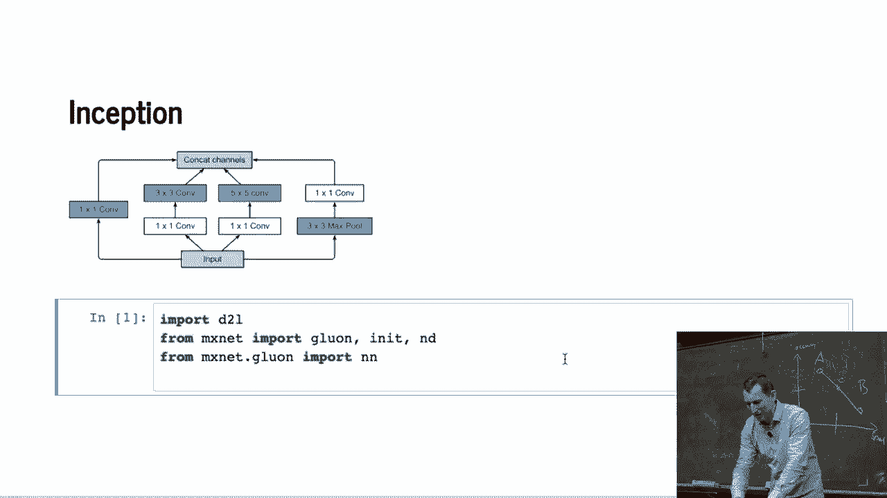

 So i have to execute it。 I saw they ran it before。 Turns out they didn't。

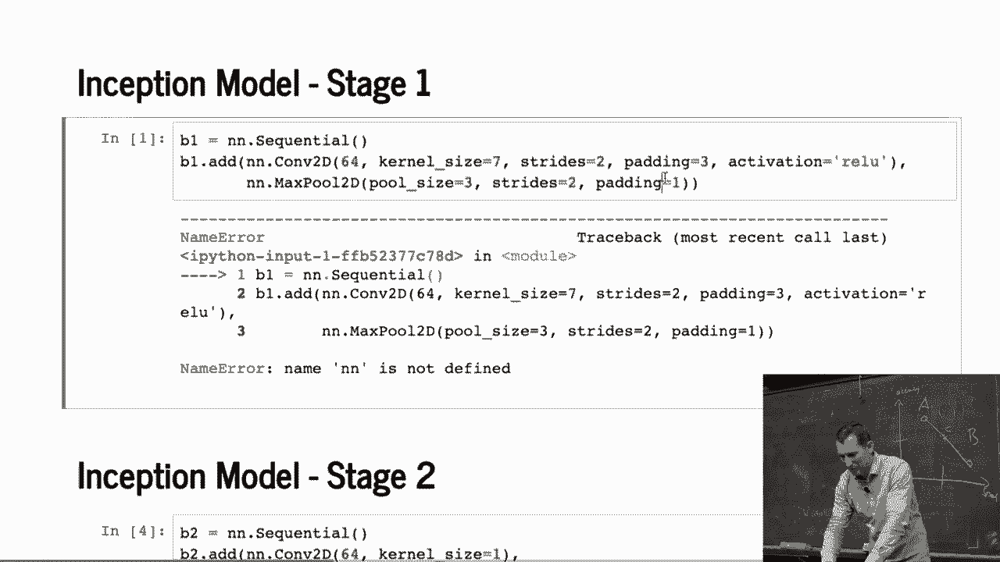

 Okay。 So just you know the standard， Convolution and max pooling。

 stage two is another few convolution and another， Max pooling。 So that again reduces the。

 Mentionality。 So right now i'm just defining， Each of those blocks separately i haven't actually put them all together yet。

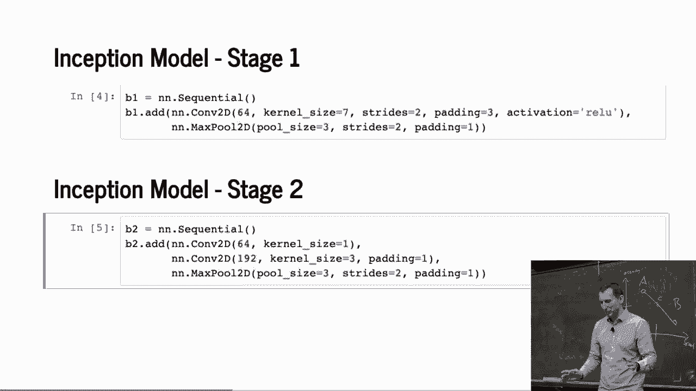

 Okay。 Stage three。 Well that's two， Inception blocks now， followed by max pooling。 Stage four。

 well some more of it and now let's look at the actual numbers。

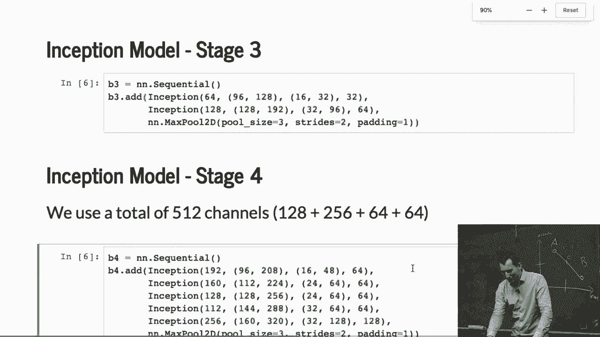

 So these last numbers are the output channel， Dimensionality for each of those paths， right？

 See how they increase。 The other thing is that the ratio between these different。

 Stacks changes over time。 So first of all the， Dimensionality actually of these one by ones increases quite a bit。

 And also of the one by one followed three by three followed by one by ones。 Five by fives。

 well not so much。 And the one by ones not so much else。 Just in the end。

 well i get something that creates a fairly， Largish Dimensionality。 All right。

 And then i reduce the resolution。

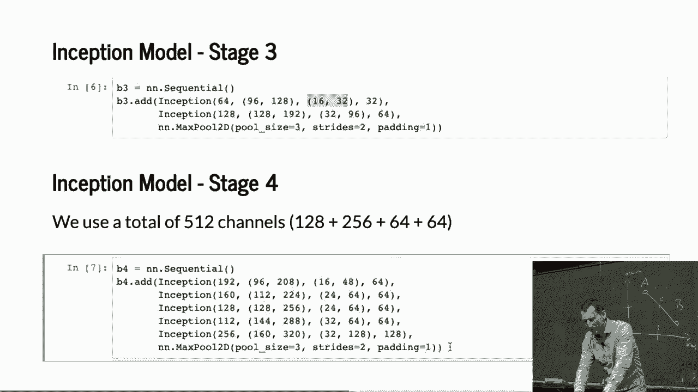

 Okay。 So now i need the last block。 And that just you know adds two more。

 Conception stages in the end and global average pooling。

 And so now what i have is a network that i can create by。

 Having those five blocks and then the end just a dense layer with， 10 dimensional output。 Okay。

 There we go。

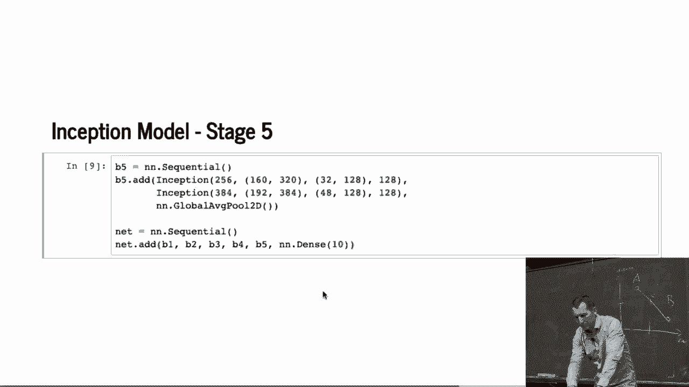

 Okay。 So let's actually see what happens if i pipe some， Things in the middle。

 So to make life easy i'm just， Picking 96 by 96 pixels because if i pick something that's too high。

 Dimensional then it's going to take a long time even on a small， Dargish set。

 The reason why i only have one， Dimension here that has to do with the fact that this is fashion。

 Emmys so they are black and white images。 If i had cfire for instance they would be colored。

 So after block one i'm left with 24 by 24 after block two i'm 12 by。

 12 then 6 by 6 3 by 3 1 by 1 and then 10 dimensions。

 So what you can see is that the fact that we started out with a。

 Higher resolution to begin with with a lower resolution to begin。

 With only 96 by 96 let's only 3 by 3 is in the end。

 Remember on the slides we actually have a 7 by 7。 Okay。 So now that we have this we can run it。

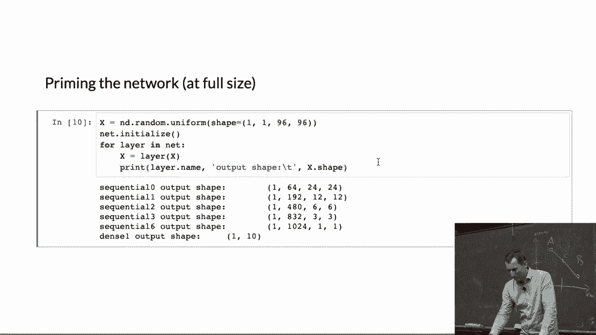

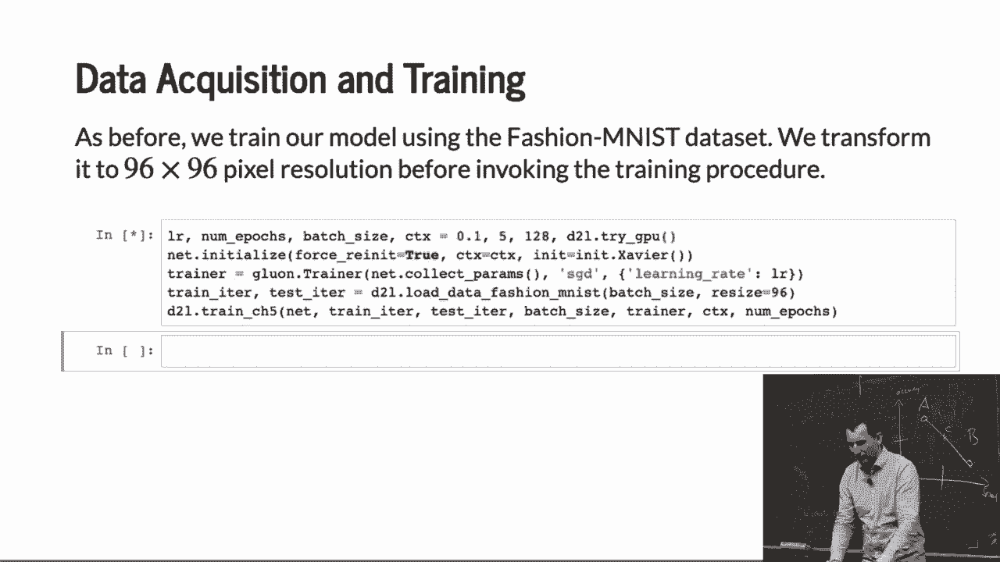

 Okay。 It's fun out that hey we have a gpu and now it'll take。

 About 20 seconds or so for each of those paths to go through。

 In the meantime let's just you know review what's going on。

 So net initialize the premise of the network。 You have to do that before you run。

 Now force re init simply because before that we already you know。

 Sent some random garbage data through it and we， Initialize it at random so we just want to make sure everything's fine。

 One important pitfall。 Force re init re initializes the values of those parameters。

 What it does not do and i found out the hard way myself is it does， Not reset the dimensions。

 So once you've bound the network to a particular input size you， Stock with that。

 I mean you can take pieces of the， Network in the rearrange and do all those interesting things but at。

 The end of the day if you've once bounded to let's say 64 by 64。

 Resolution images force re init will not allow you to then have it。

 To automatically adapt to 128 by 128。 For that you need to start with an architecture from scratch。

 The reason for that is actually quite simple in hindsight。

 Namely if you you know if you reset the you know parameters。

 Since the network doesn't know which of the dimensions were given。

 By the user and which ones were automatically inferred it cannot。

 Just go out go and throw at everything that you know was。

 Automatically inferred and re instantiated。 That's the main reason。

 So that's minor pitfalls or just be aware of it。 In any case this is inception and well we get a fairly。

 Respectable accuracy of you know about 。88 right so that's about， 12% error and fashion images。

 This is not bad。 Okay。 Any questions？ Okay。 So i guess it should become kind of。

 Routine by now how to train you know your favorite architecture。

 Because i mean that code is identical to the code that we've。

 Seen before just yep we have a different architecture。 [BLANK_AUDIO]。

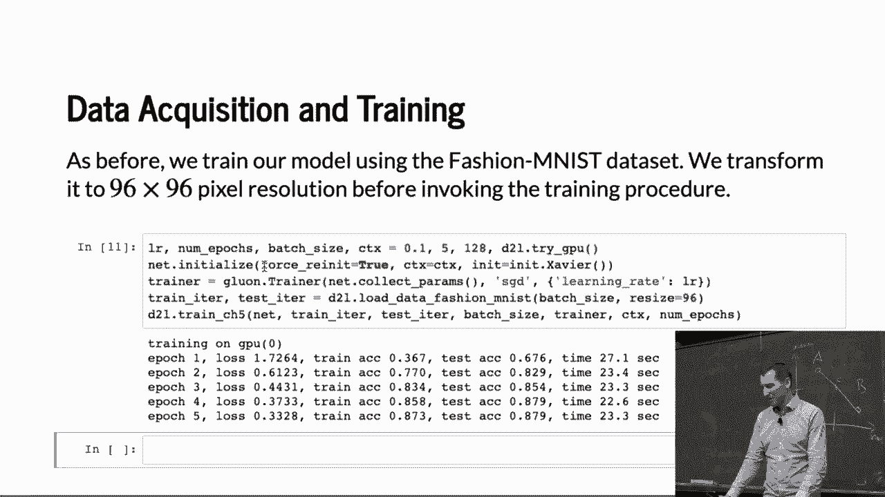