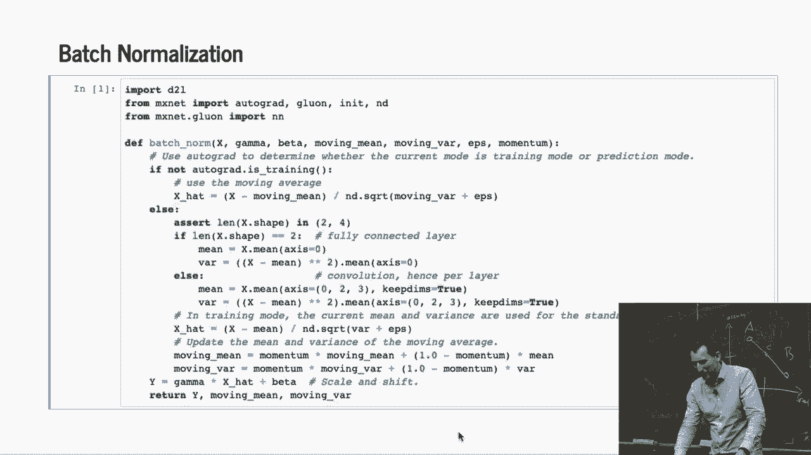
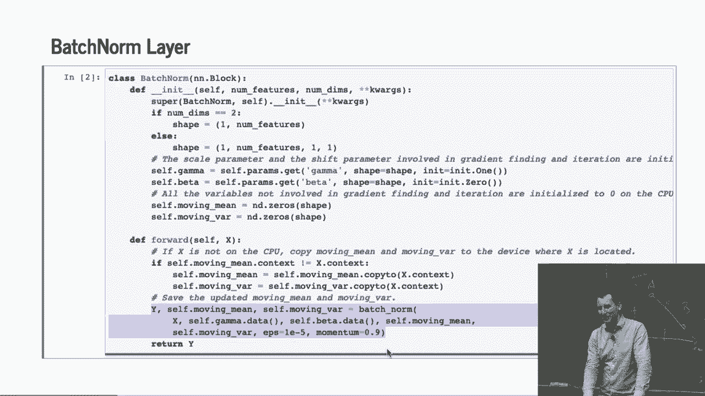
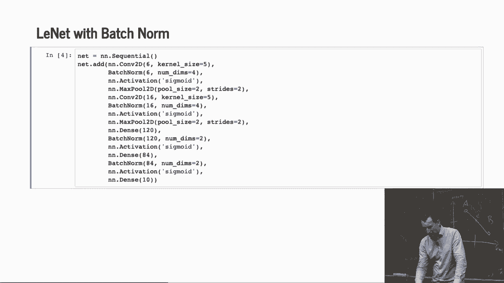
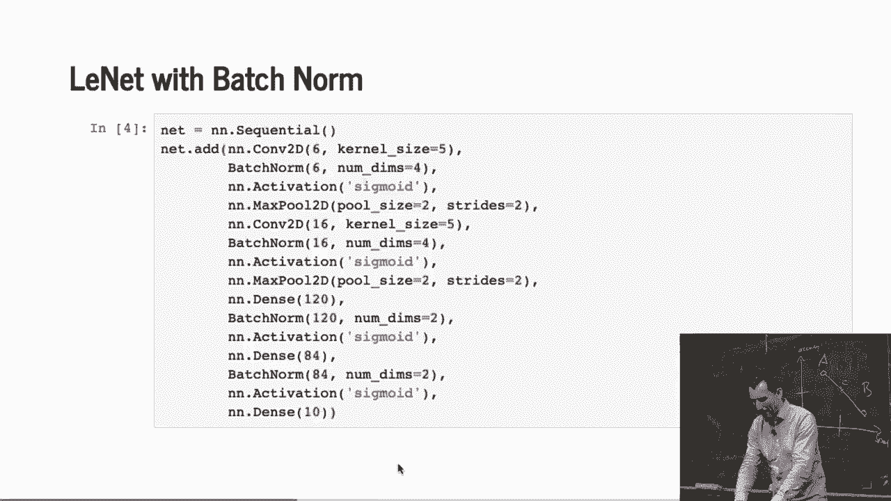
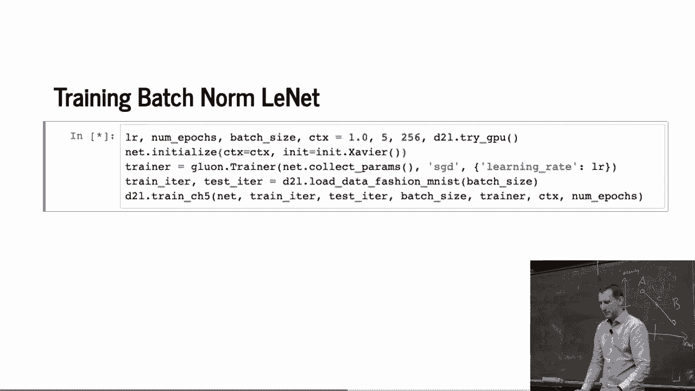
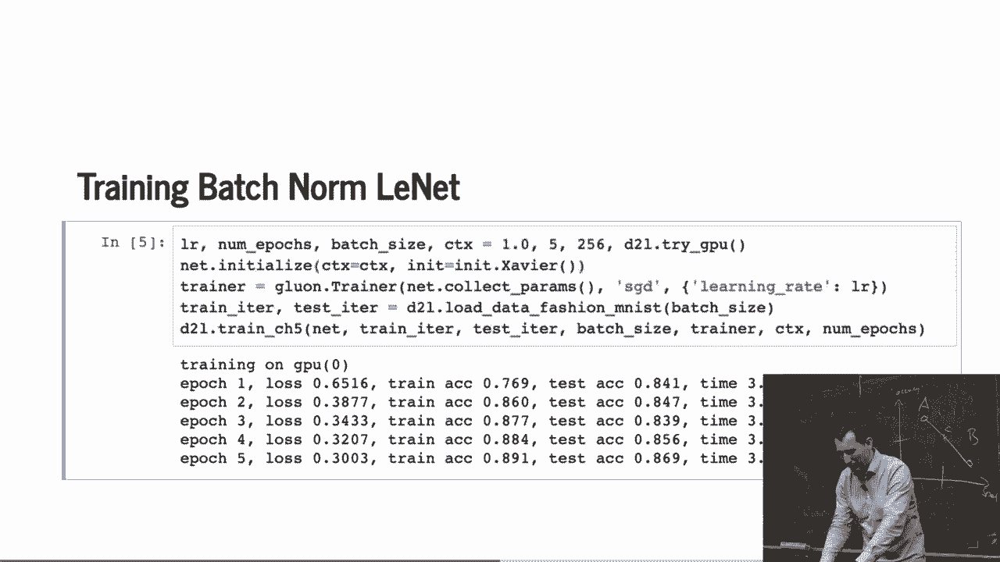
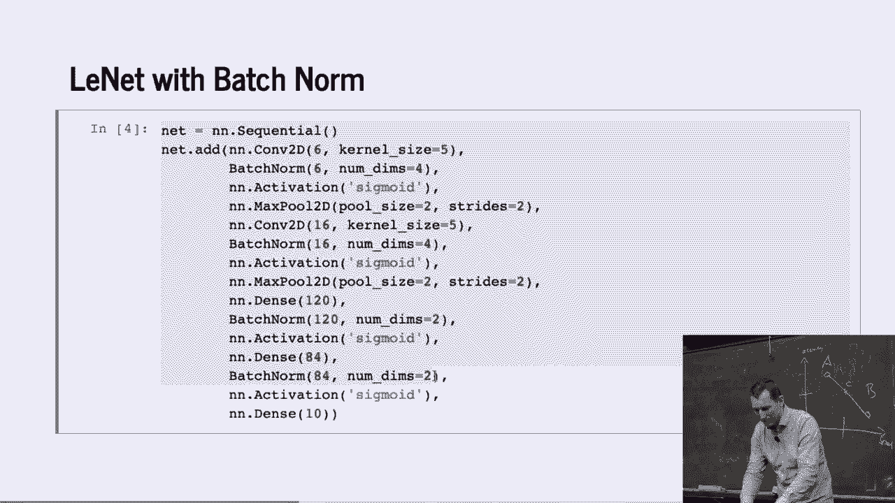
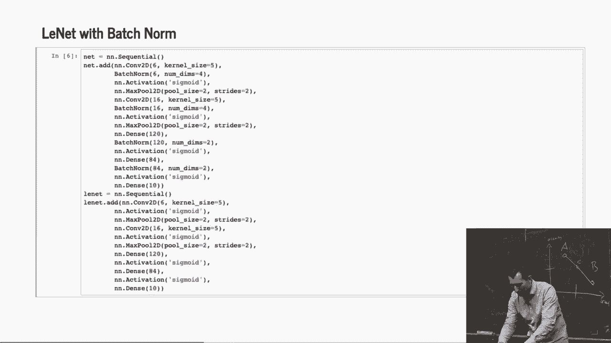
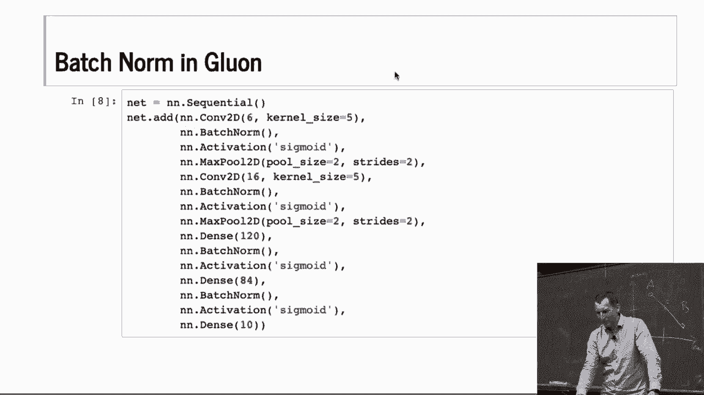
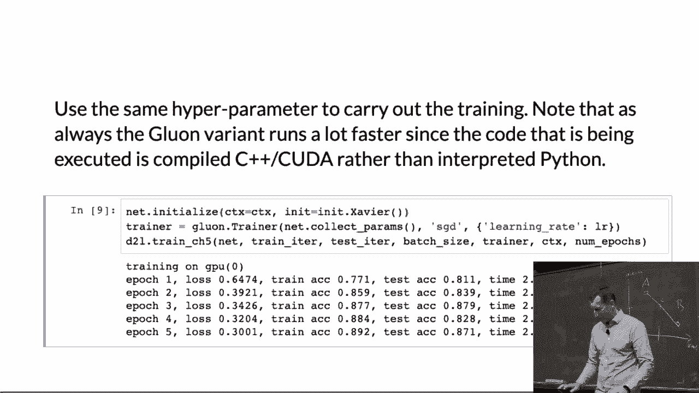

# P71：71. L13_4 Batch Normalization in Python - Python小能 - BV1CB4y1U7P6

 So let's jump right in。

 This is the definition of a batch norm。 So neural of that is just an import。

 So to the question about what's going to happen if we are， training or not？ Well。

 very simple way to find out whether we are training。

 or not is to find out whether autograd is turned on。

 Because I'm only going to use autograd during training。 So therefore。

 checking whether autograd is on in the network， well， tells me whether we are training or not。

 So if we are training， if we are not training， then what I'm。

 doing is I'm just subtracting the moving mean and rescaling， by the moving variance。 And afterwards。

 we actually perform the appropriate， updates here。

 So after processing a couple of observations on the test set， things are pretty much stable。

 So now let's assume we're not training。 Then one good way of finding out whether we are using a。

 convolution or not is to check the shape of x。 Because if we are using a convnet， well。

 then I'll have， channel by channel。 So I have channel by width by height。

 That's for a 2D convolution。 Whereas if I have just an MLP， then I just have a number， of features。

 So therefore， I'll either have two or four dimensions。

 It's the one extra dimension is from the batch， right？ From the mini batch。

 To have mini batch times number of hidden neurons for an MLP。

 or mini batch times channels times width times height。

 So that's why we are checking for two or four。 So now， if we have two dimensions。

 then I just go and， compute the mean and the variance。 And I rescale。

 That's the batch norm for a multilayer perceptron。 Now， if we have a convolution， then， well。

 I need to， compute now the mean while preserving all the other， axes， namely， 0， 2， and 3。

 And I keep the rest。 So basically， before that， we just had access 0。 Now we have access 0， 2。

 and 3。 And then I just go and normalize appropriately。

 So that's x minus mean divided by the square root of variance， plus epsilon。

 So it's the same expression as what we had here。 But just that it's not the moving average。

 but the other one。 And then in the end， we output gamma times x plus beta。 And that's it。

 And then we just output y。 And the moving mean and the moving variance， because， well。

 we want to store that somewhere。 OK。 Everybody cool with that？ Good。 So let's move on。

 because once we have that。

 everything else is easy。 So now we need to turn this into a layer definition。

 Sorry， somebody is urgently trying to reach me。 And I really don't have time。 So the， well。

 basically initialization， of the batch norm layer。

 The first thing is it checks what the number of dimensions is。

 And then it allocates the corresponding scale parameter。

 and allocates parameters for mean invariance。 So remember when Mu covered how to define blocks and layers。

 and parameters， this is exactly what we needed。 So now we are going to put that to good use。

 And then you need to introduce a forward function。 This forward function now just does nothing else。

 but just apply the batch norm。 So the first thing that it does is it。

 makes sure that the data gets to the right device。 That's all it is。

 Just copies the parameters to wherever the data sits。 And that'll happen once， and that's it。

 Because it now reassigns it， right？ And then， well， it just applies the batch norm。 That's it。

 And that's all we need in order to implement the batch， norm from scratch。 Any questions so far？

 So let's see。 This now-- oh， because I didn't actually， execute batch norm before。 Now we can do it。

 So this is Lynette， but with batch norm。

 So what I'm basically doing is before the activation--， so before the sigmoid or relo or whatever。

 I'm just adding batch norms。 Without that， it would be a completely generic Lynette。

 but now it's a Lynette with batch norms。 So I can do that。

 Then I can train it。 It's going to take a few seconds。

 And we'll see how it does。 It's fairly accurate。 So even already， it can get started with。 Yep。

 Given that it's such a simple network， it works quite well。 Actually。

 let's compare for the heck of it what it looks。

 like if I didn't have batch norm。 so what I'm going to do is just going to add--。

 yeah， maybe I need to just quickly quit out or--， actually， let me zoom out。

 So I'm going to remove all the batch norms。 OK。 Let's do that。 And now， all I have to do is I just。

 change wherever I had Lynette。 I changed now to Lynette。 Glue on trainer。 Lynette。 And there we go。

 So remember before that， we had an accuracy of 0。869。 Now， it took about 3。6 seconds。

 Let's see what happens now。 OK。 So it runs faster because it doesn't invoke the batch norm。

 That's to some extent because we ran the batch norm by hand。 And it works a lot worse。 OK。

 So batch norm is good for you。 But of course， you wouldn't want to go and implement it。

 from scratch like so。 Let's-- OK。 Well， let's see。 Of course。

 you can't really look at the parameters very well， because we just re-initialized the network。

 So you just have to trust me that this is what you would have。

 gotten if we had looked at the parameters before。 But yeah， I mean。

 they're just corresponding offsets。 Now， let's actually do this entire thing in Glue on。

 And the only difference is that now rather than invoking， batch norm。

 I just invoke in in batch norm。 And I don't actually need to feed it any other parameters。

 because it's smart enough to figure out from the context， what the corresponding sizes are。

 So that requires a little bit more code。 But it doesn't actually change anything conceptually。 OK。

 And then let's run it。

 And so remember， before that， without batch norm， the code ran at about 2。3 seconds per loop。

 Now it takes around 2。4 seconds。 So it's maybe about 5% slower。 Before that。

 it was about 50% slower。 You can see that it gives us the same accuracy。

 as what we implemented by hand。 Just that the overhead was is a lot tinier。

 So the overhead is about 1/10 of the overhead， that you would have had by using Python。

 It's good enough for experiments， but now you can do things much more easily。

 And this brings us to the end of the batch norm。

