# P72：72. L13_5 ResNet (Residual Networks) - Python小能 - BV1CB4y1U7P6

 So let's talk about resnets。 So if you had to pick like a worry free off the shelf network right now。 I would probably recommend that you go and pick a resnet or a resnet。

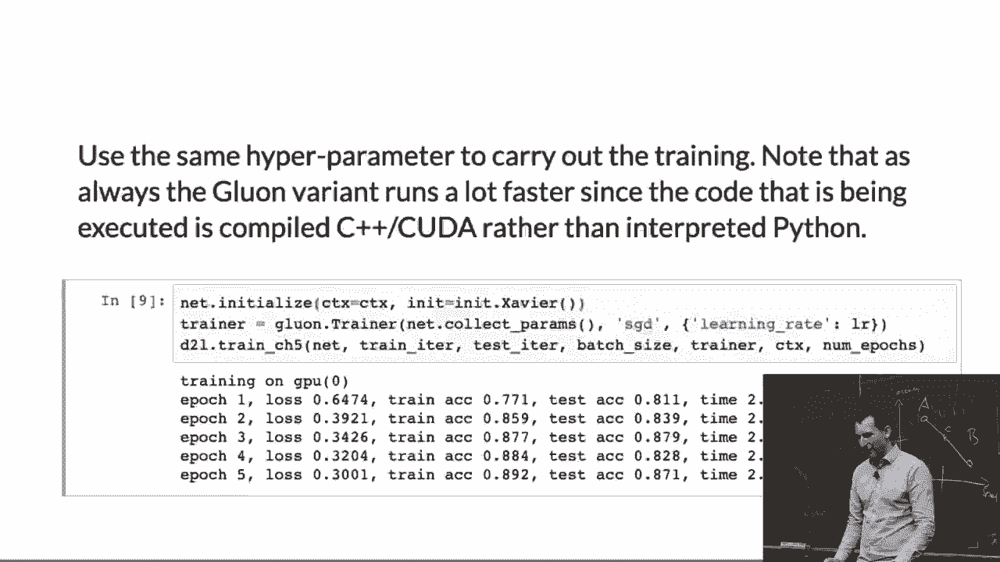

 And there's a reason why they worked significantly better。 And again。 the initial motivation was a bit strange about gradients not making it through the entire stack and whatever。 Here's what's really going on。 So suppose I have a deep network right。 And then I decide I'll go and make it even deeper right。

 So we can make it deeper by just you know adding another layer。 And adding another layer I get a slightly different function class right。 If I add another layer I get a slightly different function class still。 And you know of course I have more parameters so I can you know do more interesting and diverse and powerful things。

 But basically my function classes you know get bigger get more powerful but they're also different。 So if you look at the picture on the left you can see a set of function classes each of which is a little bit bigger than the。 previous one so thus a little bit more powerful but they're all a little bit different。 Now let's assume that the truth is out there right this blue star is the truth and I want to approximate that truth。

 And as you can see as you start adding you know layers and layers you're going to get closer and closer to that blue star。 And once you've reached about that third network from you know the dark black to you know the darker gray you can get kind of closest to that blue star。

 And then as you start you know increasing the function class further you start moving away again。 And that's really undesirable and you know there's no guarantee that you might not eventually also come back again right。 After all I mean you don't know exactly what happens if you add another layer。 You see don't know where that blue star is。 And this is awkward because this makes it very hard to reason in some meaningful engineering way over how many layers should I pick。

 How complex should my function class be。 Now on the other hand if you look at the picture on the right things are much nicer。 And typically if you open many paper on statistical learning theory they pretty much all assume that you have a nested function class。

 So if you take any non-parametric statistics class here in the stats department I'm willing to bet you that almost all cases unless they come with specific rules。 That it's not the case assume that you have the situation on the right。 Unfortunately with deep networks you have the situation on the left。 So how can we make it a little bit closer to the one on the right。

 On the right hand side the function class still get larger。 As a matter of fact I drew that right plot by just taking you know the picture on the left and making it smaller right and just centering it。 That's the same powerful you know power of function classes just that they're nested。 So as I move from one to the other they become more powerful more expressive I can reach a larger function class。

 And so now as I you know keep on adding I move closer to my blue star。 They're not necessarily convex but you know that's just what it is。 So I want to have the situation on the right how do I get there。

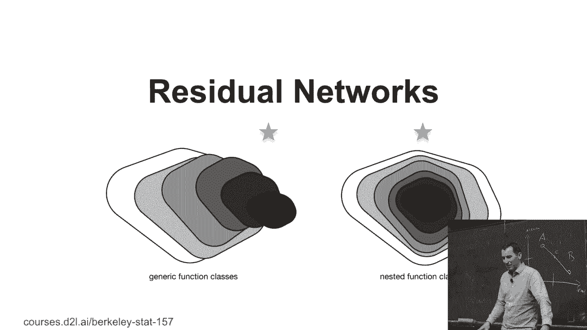

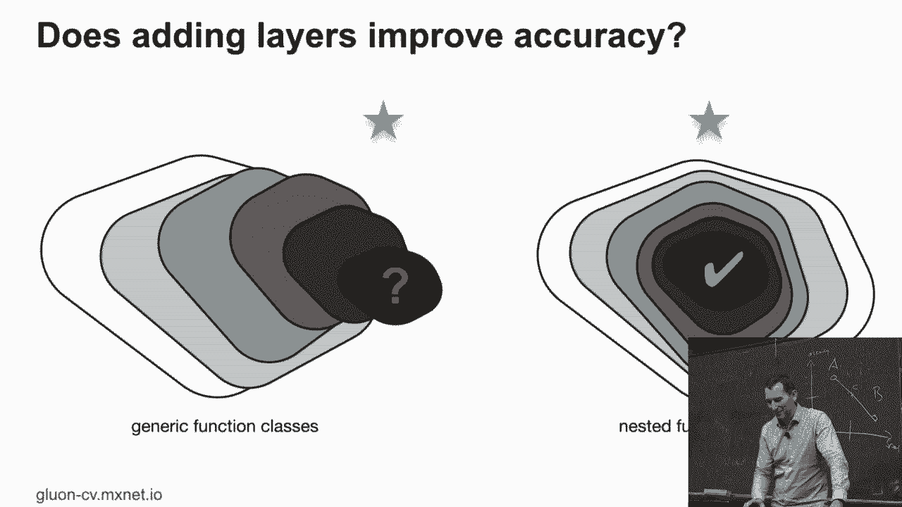

 And this was the ingenious idea by here at all 2015。 Namely rather than parameterizing around the function f of x equals zero being the simplest function。 That's basically for all the weights are zero。 I parameterize around the function f of x equals x。 Because if you know all the way parameters and everything is zero。

 If I add the input to the output then I get the identity function as the simplest function。 That's quite brilliant。 So it's like a daily expansion for neural networks right。 At least that's a similar flavor。 So now as you increase your parameters you're starting to deviate from the identity function。 So now I don't have to learn the identity function that does nothing to my data anymore。

 So it's essentially assuming a different inductive bias。 It also means that as I add another layer the identity function still goes through。 And it will still leave the outputs of the previous layers unchanged。 Just that I could now do additional things to my output。 Of course it's not exactly how it works。

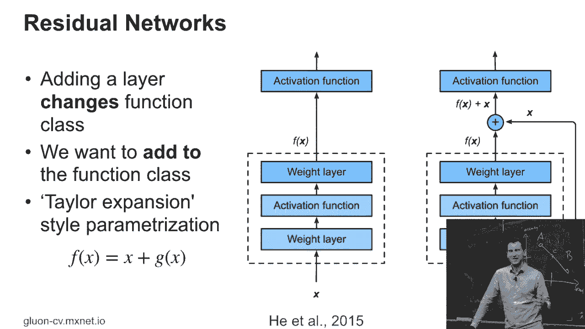

 That I didn't exactly implement those nested function classes。

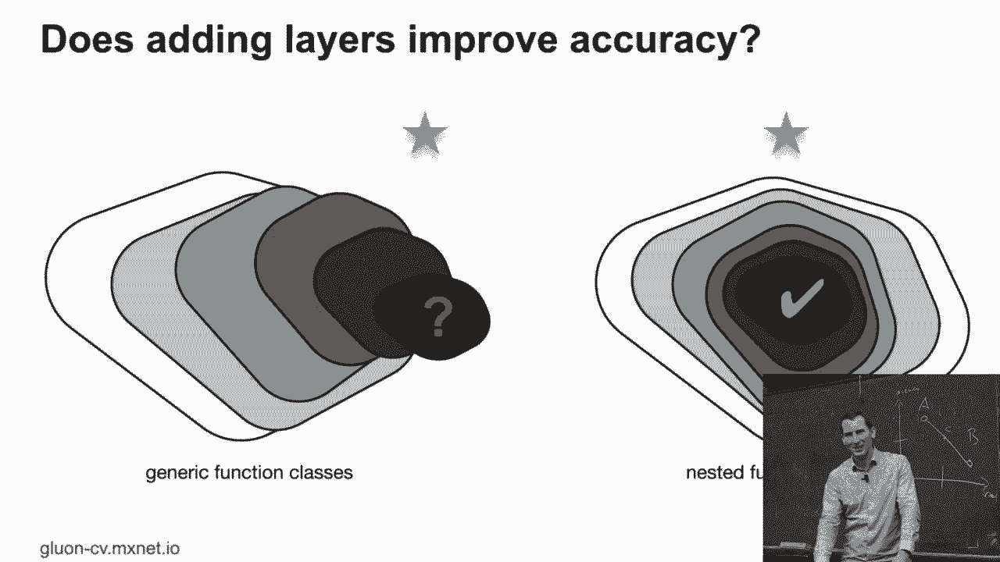

 But it did something that was pretty close to that。

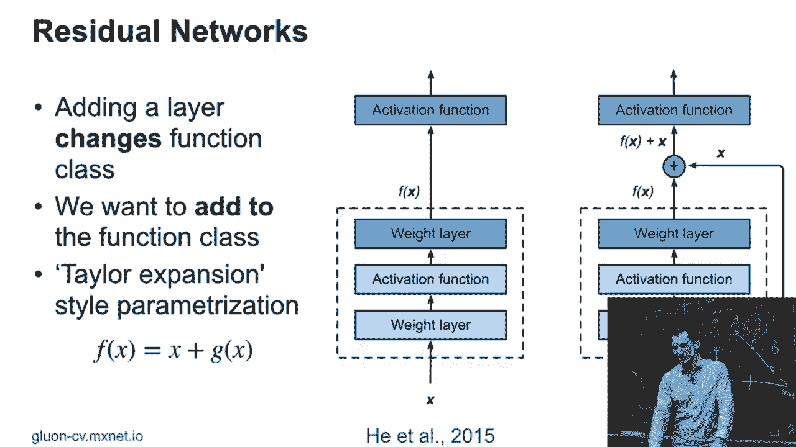

 And so this is what a resnip block looks like in detail。 So you have a convolution， a batch norm。 So this is the batch norm that we talked about before。 Rectified linear unit， another convolution。 another batch norm。 And to that you then add the input。 Or you run a one by one convolution on the input and you add that to the output。

 But at the very least you're making it fairly easy for the network not to change things if not changing things is the best thing to do。 And so here's the code。 Code is fairly straightforward。 This is now skipping a lot of details of setting the variables。 This is just a forward function。 And what I get is y is batch norm one of convolution one of x。

 And also then I apply a relu and then I apply another batch norm two of conv two of y。 And then if I'm in the situation where I have the path on the right here。 Then I just apply conv three to x and I add the two results together。 Of course I need to pick my convolutions in everything in such a way that the dimensionality still match up。

 But we already saw how to do that。 For inception now we can use it for batch norm。 And basically to get a basic relu block。 Any questions here？

 That's really the heart of how a resnet works。

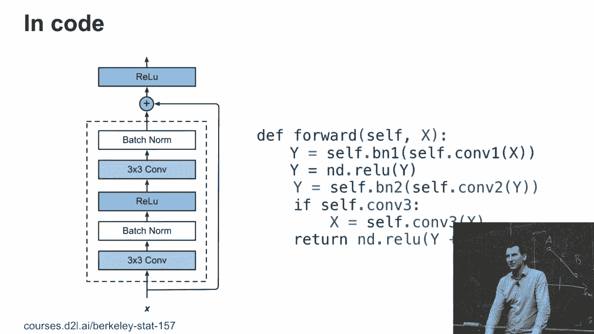

 Now you might think that this is straightforward。 Well people tried all those different flavors of batch norms。 They tried and you know where to place the batch norm where they place the addition。 So in some papers they used the batch norm after the addition。 In some cases they used， you know。 had the addition at the very end。 In some cases they promoted the order off you know relu conv in batch norm。

 And so they tried out all three different permutations。 So the sequence between the blocks is the same but the order is changed。 And yeah there are papers for all of those。 And for some combinations in some days。 in some settings， some of those things work better。

 Now this sounds thoroughly unsatisfactory but this is unfortunately the， you know。 CD underbelly of deep learning training。 But in some cases you just have to try out things。 And then at some point somebody does this， figures out okay this is a good architecture and then people pretty much stick with it。

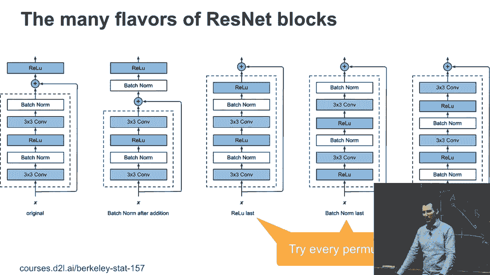

 Okay， so here's the resnet module。 So this looks， you know， quite familiar to what we saw before。 Just that now it's using， you know， resnet blocks rather than inception blocks。 So you might have。 you know， one of those blocks which down samples， so stride two。 And then you have a couple of the other resnet blocks。 And that works well。

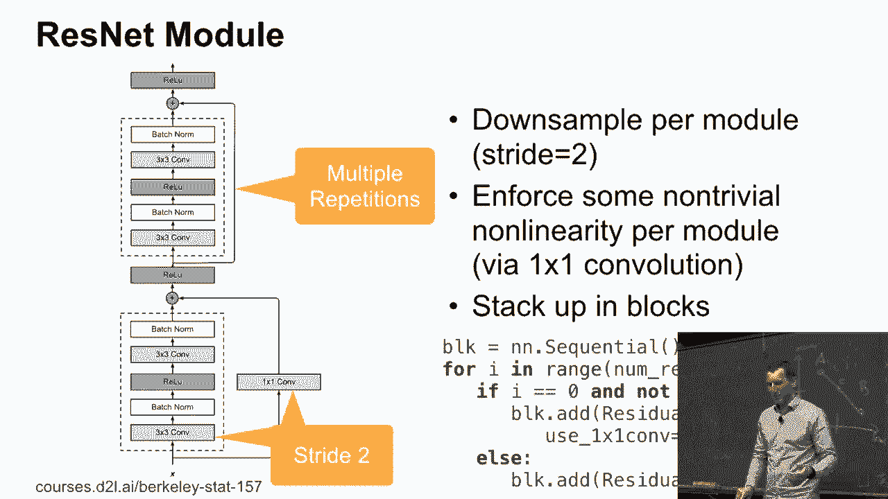

 And here's the entire network in its full glory。 So that's resnet 18。 Goes up all the way to res in 150 so that's 150 layers。 And the bottom looks， you know。 kind of very scarily similar to whatever we saw before。 Wide convolution， batch norm， pooling。 And then you have a whole bunch of resnet blocks of different size。 And you train it。

 And we will train that next week， not today。

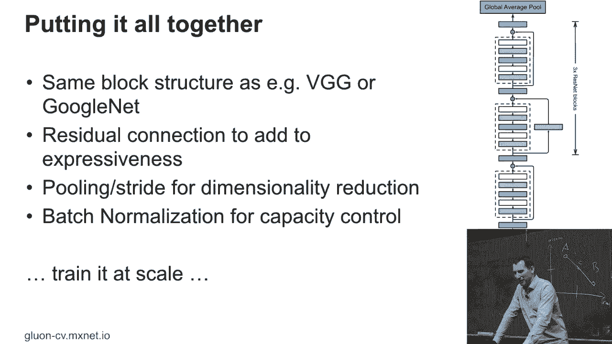

 What this gets you to is this thing up here。 This is now resnet 152。 And it's pretty much state of the art。 It's slower。 It's much more accurate。 It's actually smaller in terms of footprint than the inception network that we saw before。 That would have been the orange circle to the right。

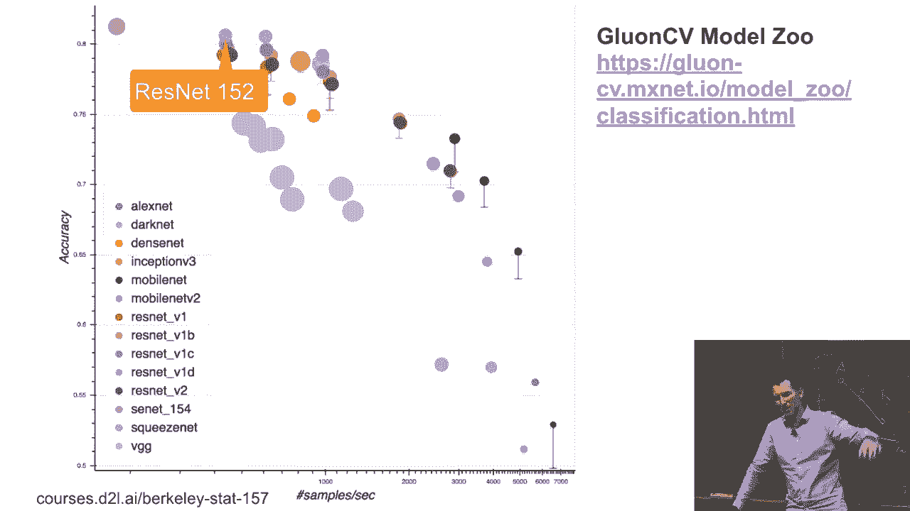

 I'm going to conclude with something that you think can go even further， namely res next。 And it has a neat idea in it。 And yeah， coming here was one of the co-hosts on that。 And essentially it relies on the following observation。 If this is our resnet block， right。 so we have a one by one， then maybe a three by three， then we have a one by one。

 So we have 64 channels， 64 channels， and then we have 256 channels， right？ Or， you know。 some tries like this。 So you might ask yourself， well， is this a really good idea？

 And it turns out that you may be able to do better by just partitioning things such that my inter-channel interactions。 now happen only by groups of， let's say， four。 So what I'm doing is I'm basically taking the network on the left and slicing it up into 16。

 or in this case， you know， more networks， that just have four channels or， you know。 some large number of channels each。 And then in the end I stack everything together。 And so this。 of course， means if we look at that， so initially we have， you know。

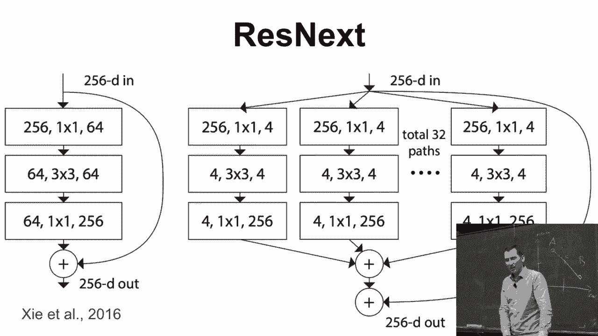

 height times width times input times output channel， you know， parameters。 And the computation is。 you know， of course， you know， output height and width times， you know。 the corresponding height and width of the kernel plus input times input times output channel。 We can break things up by， you know， one by three and one by five and five by one。

 So that's what we saw before for inception。 Or we can break up the channels。 And so if I break it up into B groups， then I have C_i over B groups for the input。 C output over B groups for the output， times B， because then I have B groups。 So in other words。 I get a reduction by a factor of one over B。 And as a result。

 I can use more dimensions and I'm in good shape。

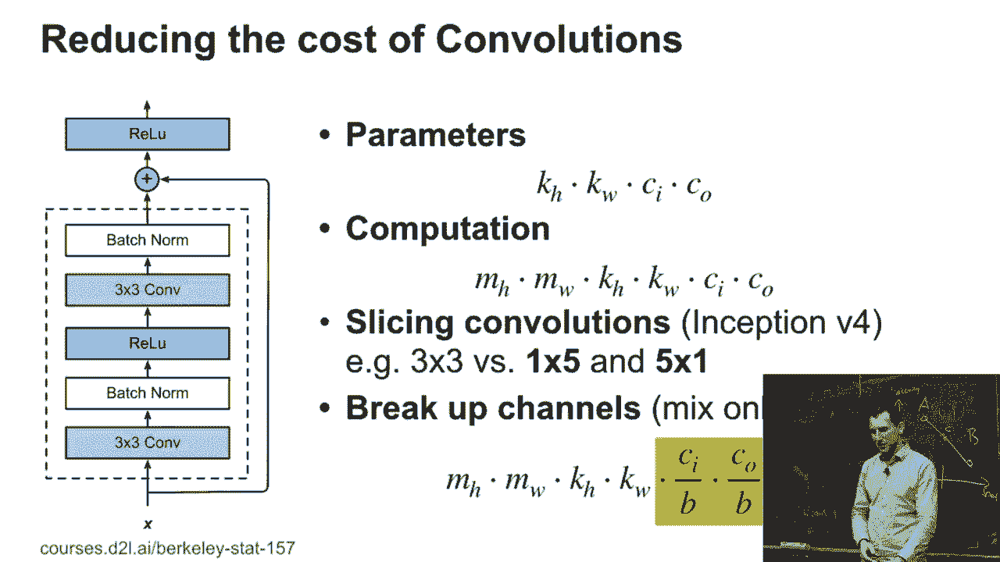

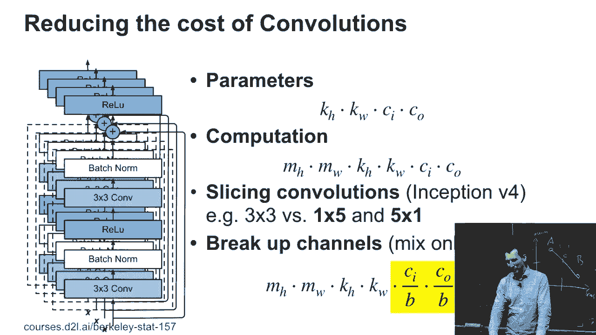

 And that's really all that there is to it。 So this is very easy to add to any code that you might have。 Basically what you do is you just set in the 2D convolution the variable groups to， you know。 whatever number of groups that you want。 That's it。 Now if you compare Ristner and Ristnext。 the computational budget is very， very close。 All right。 Number of parameters is， you know。

 within like a few percent of each other。 Number of flops is very close。 but it works a little bit better。 And with that， I'm going to conclude because， yeah。 we're out of time。 So any questions？ Okay。 So next week， we're going to cover different networks。 some way in code。 The other thing is， there's this thing called an exam， right？ Right。

 So a couple of things for the next one。

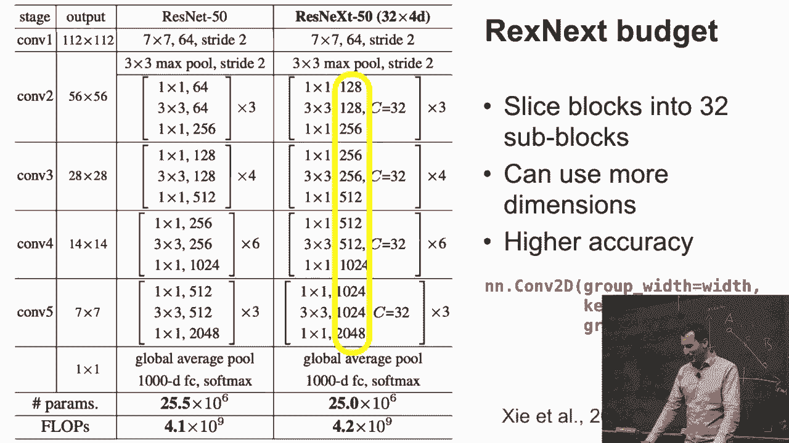