# P74：74. L13_7 超越ResNet - Python小能 - BV1CB4y1U7P6

嗯，你可以问自己的一个明显问题是，ResNet之后会是什么，对吧？

这就是ResNEXT。我想我们上次简要地讲了这个内容，但讲得有点简短。所以我现在要再详细回顾一下。记住，在ResNet中，你基本上有这堆 1x1 和 3x3 的卷积。实际上发生的情况是，如果我这里有一层，那里有另一层。

然后在单个像素内，对吧，你有这一整堆，你知道的通道。你想把它变成另一个堆通道。现在，如果你这么做，那就基本上需要一个 C_i 乘以 C_o 的操作，这是昂贵的。你能承受的维度基本上与 C_o 成正比。显然也与 C_i 成正比。

但实际上，你知道，你有两个可能想要单独控制的旋钮。即参数的数量，这取决于这个。而输出维度的数量，这已经取决于那个。所以ResNet是分离这两者之间依赖关系的非常巧妙的方法。所以你做的是，实际上，如果这是我的矩阵，你知道，C_i 乘以 C_o。

而不是取整个矩阵，你基本上通过一个块对角矩阵来近似它。现在每个块内的东西是稠密的，但其余部分则是不同的。所以，你可以承受一个更大的矩阵，对吧？你可以把它做得更大，比如，如果我再加上两个块，可能。并且替代地，参数的数量减少了。

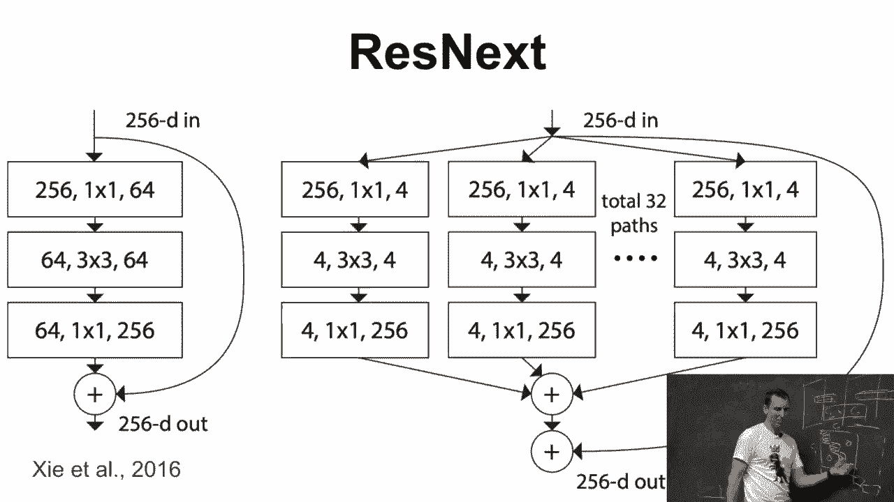

所以如果你再看一下，基本上，通过将卷积分解为单独的子通道，你获得了你知道的、更节省内存的工具。

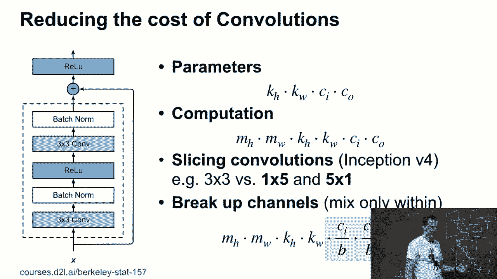

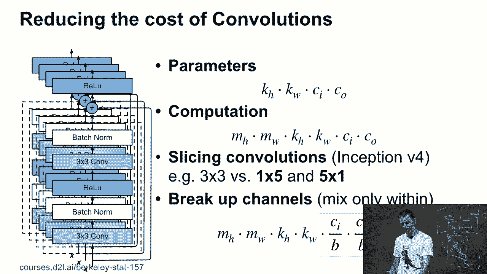

然后如果你继续进行详细的计算，这是他们在ResNet论文中所做的。他们使用的设计非常类似于ResNet，这也不是什么大惊喜，因为这篇论文的作者之一在两篇论文中都有出现。他们基本上把ResNet设计成了基本上。

参数数量和浮点运算次数相同，但只有更多的通道。但是同时没有更大的参数数量或浮点运算次数。是吗？

>> 这样做和说有一个组合，具有一个大的输出通道，但卷积矩阵是稀疏的，有什么区别？ >> 好的。所以稀疏卷积矩阵。是的，实际上这是一种特殊的稀疏矩阵，对吧？如果你想一想，问题是，嗯，好吧，Alex刚刚写下了一个。

非常奇怪的块对角稀疏矩阵。为什么我们不能有一个通用的稀疏矩阵？

事实上，你可以这么做。问题是，GPU 在处理稀疏矩阵时非常糟糕。**好吧**？原因之一是，GPU 不喜欢指针查找。所以，如果矩阵并不是特别稀疏，那么你其实更应该直接使用其余部分的零。于是你可能会只保留 10% 非零项。

仍然比将它写成密集矩阵更快。而这种权衡发生的地方，**无论是 1% 还是 10% 还是 30%，都取决于**你执行程序的 GPU 或 CPU。换句话说，除非你非常稀疏，否则通过稀疏化是不会提高速度的。

另外一方面，要控制结果就更难了。所以你会发现，**预定义稀疏 D**，然后在 GPU 上优化它，会更好。现在，你没有理由不能在这里再加上几块对吧？

也许类似这样的块稀疏。其实会有一个有趣的研究项目，可能可以加入，知道的，再加一组块稀疏的互联方式。事实上，我将向你展示一个非常类似的策略，在接下来的几张幻灯片中。所以这是 shuffle knit。但这是个好问题。是的？[听不清]，对。

所以如果我知道我的稀疏位置，并且如果稀疏 D 的预测是这样的话，**我就不需要二级索引结构来存储稀疏索引**，那我就能在 GPU 上高效地执行这一步。而如果每次都需要遇到一些意外，通过稀疏查找来做的话，那么我的 GPU 就会很慢。

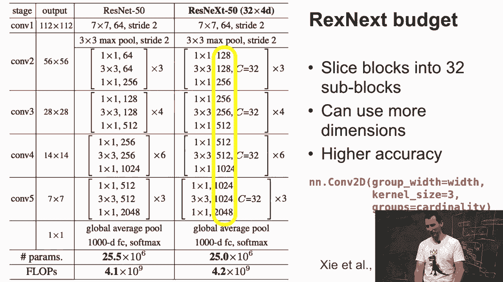

所以我们来看更多的想法的“动物园”。这其实只是给你提供了**冰山一角**。

所以一个想法是，毕竟，ResNet 有效。那么为什么不进一步尝试呢，对吧？

所以如果你考虑一下，知道的，ResNet 从参数化，知道的，f of x 等于零，到 f of x 等于 x 作为一个简单的函数。**但是你基本上可以得到像高阶泰勒级数类型的展开**。所以你要做的基本上就是定义 xi+1 为 xi 和 fi of xi 的连接。

所以结果是，那个向量会不断增长，并且在其展开式中基本上会包含越来越高阶的项。于是你从 x1 是 x，x2 是，知道的，x 和 f1 of x 开始。这里的类型是 x，f1 of x，f2 of x，和 f1 of x。接着我就感到无聊了，因为展开式会变得越来越长，对吧？基本上，x4 就是，知道的，这个项加上它的所有项的 f，对吧？

所以这就变得乏味了。现在，这就是 DensNet 当时所做的，那个时候看起来这是正确的方向。实际上，令人惊讶的是，如果你真的很好地训练了 ResNet，或者训练了 ResNet，它的表现会超过 DensNet。那么他们是怎么做得这么好的？我想他们因为 DensNet 获得了最佳论文奖。那么他们的训练实现更好。

所以有时候，不是网络本身，而是你如何训练它，才能在基准测试中获胜。这一点，往往不是人们在阅读论文时能够清楚理解的，对吧？因为，怎么可能知道呢？有时候，训练过程的描述非常模糊，只有通过查看代码，你才能真正搞清楚，明白吧？

所以Densnet有些用处，但也没那么重要。

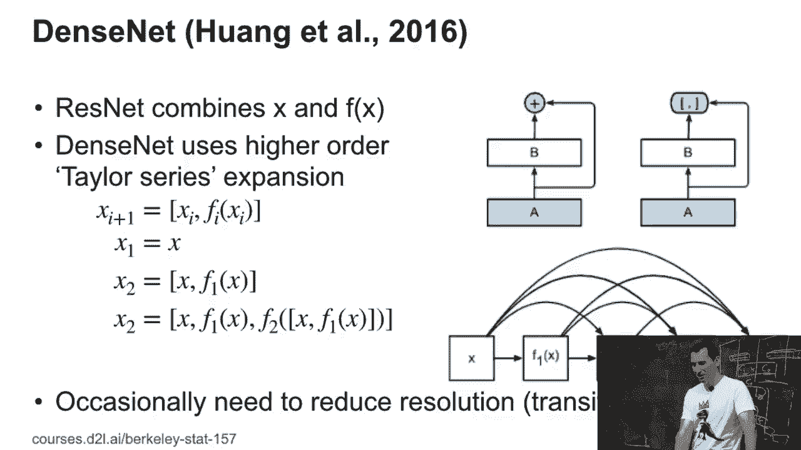

这里有一个更令人兴奋的例子，叫做Squeeze Excitnet，或者SCNET。这使用了一些我们稍后会详细讨论的内容，特别是一个叫做“注意力”的机制。注意力机制本质上是一种方法，它不是对一组向量进行平均，而是使用一个单独的函数来控制如何计算这个平均值。

我就先说到这里。现在，我们稍后会在更详细的部分讨论这个问题，特别是当我们讲到注意力机制时。Squeeze Excitnet的作用是，如果你考虑各种通道，也许有一个猫的通道，有一个狗的通道，也许还有一个恐龙的通道。那么，如果你知道你正在识别一只猫，那么你该怎么办？

你会加重猫通道的权重，同时降低其它通道的权重，对吧？

但这其实有点傻，对吧？因为，怎么可能知道我正在识别一只猫，直到我实际上认出它来？

就像一旦我知道答案，问题就变得容易多了。另一个问题是，我在卷积神经网络中进行的信息传递速度有点慢，对吧？所以，如果你想想看，我们可能会有一个三乘三的卷积层，再接一个三乘三的卷积层，然后是池化层，依此类推。

所以，可能需要四五六层的处理，直到来自这个角落的信息传递到另一个角落。这很糟糕，对吧？因为也许，如果这里有一球牛奶，我知道，嗯，那边有猫的几率会更高。所以，从上下文中我就能知道。所以，我的猫检测器可以利用牛奶球的存在来推断出这一点。

好的，假设这里有一只猫。那么我们该怎么做呢？其实你可以非常简单地通过整个图像的一个乘积，按每个通道来处理，配合一些其它的向量。这样你就会得到一些数字，得到每个通道的数字。这是一个非常简单的对象。

与所有卷积操作和其他步骤相比，它做起来相对便宜。现在，你用这些数字通过softmax对通道进行重新加权。因此，如果这个非常便宜的过程告诉我，某处很可能有一只猫，我就可以提高猫通道的权重。我敢打赌这里没有猫通道，但如果有的话，应该就是这样。

它会这么做。可以简单地说，CNET实际上提高了准确度。所以它们目前是模型库中最好的。是吗？>> 那这个加权函数。它在各层之间是相同的吗？>> 不是，我每一层都有一个加权函数。所以基本上它是与卷积操作并行计算的。

然后来自两个路径的结果被合并了，对吧？

你基本上是在执行像素级的向量乘法，你知道的。那个用漂亮颜色写的权重向量与原始张量相乘。>> 所以Y是全局加权吗？>> 因为我有一个全局的权重，作用于一个通道中的所有像素，对吧？所以从这个意义上说它是全局的。这允许我快速将关于世界发生的事情的信息传递到图像的其他部分。

快速传递到图像的其他部分。>> 那么这个加权函数。它的形式是什么，才能正常工作呢？>> 好的，首先让我快速写一下。假设我有X，它可能在我们的通道中。我现在不考虑批次（batch），它的大小是高度乘以宽度，对吧？

所以现在我将用某个加权矩阵来乘这个。这个加权矩阵也将在Rc乘以高度乘以宽度中。然后我得到如下结果，Y是XHWC的高度和宽度上的总和，嗯，CHW乘以WCHWCYC。所以这些现在是，你知道的，YC当然是在Rc中。

然后我去执行更新，YC变成YC的softmax。好吧，Y变成Y的softmax。最后，我可以用它来重新加权X中的每个元素。所以每个X中的元素将变成XCHW并输入到YC XCHW。>> 所以这个W就像是一个卷积，它的大小等于整个图像和一个通道，嗯。

这个通道。并且它不完全是因为实际上你每个输出通道得到一个结果。>> 对。>> X乘W的结果就像是。>> 不完全对吧？

因为你每个通道只有一个输出。如果是卷积操作，你将只有一个Y。>> 这将完全违背目的，因为那样你只会得到一个数字。是的，这就是重新加权整个激活的次数。所以现在，你仍然没有对任何通道做出偏好选择。

所以它不完全适合卷积。它更接近内积。>> 对。>> 这个答案还不错。>> W是可以学习的。>> W是全都学习的。>> 而且它相对于其他所有东西来说，参数量相对较少。所以总体成本相对较低。使得训练稍微贵一些。

但总体成本相对较低。然后你可以获得更高的准确率。>> 现在这里有最后一点，这个问题的方向是，嗯，我们能做点什么吗？

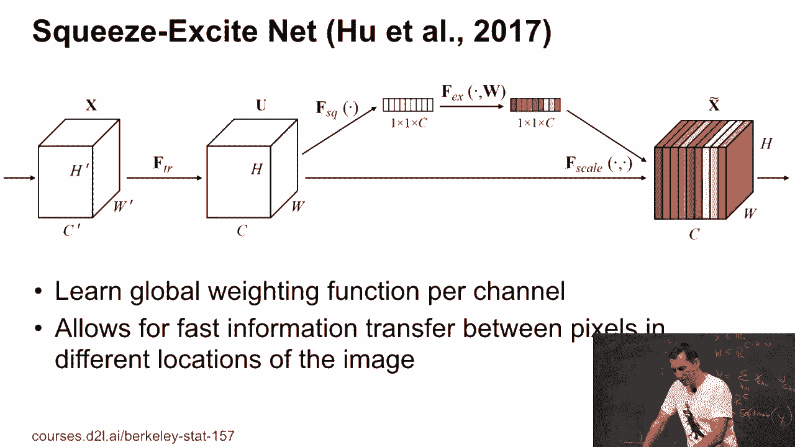

更加结构化或更加稀疏结构的网络，对吧？所以如果你考虑ResNext，ResNext将通道拆分成子组，然后在每个子组内做你的操作，之后你需要进行组合。现在，这不一定是很好的，因为你可能最终会得到那些。

本质上非常长的管道，特征仅在每个管道内部混合，而不是在它们之间混合。我是说，毕竟，你去掉了跨通道混合，以便获得更快的计算速度和其他优势。现在，有一种方式可以把它带回来，就是在卷积之间重新洗牌。所以在这种情况下，如果我们有三个通道，那么我基本上去选择。

你知道，从红色、绿色和蓝色中选一个，然后把它变成一个新的块，然后我基本上以一种有意义的方式将它们交织在一起。这会给你带来更多的准确度。所以ShuffleNet就是从中得到的结果。所以他们将洗牌操作应用于ResNext、ResNext和ResInet以及DI。是吗？

>> [听不清]。

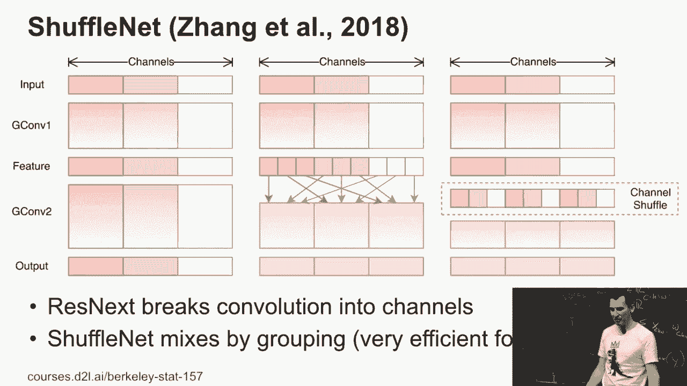

>> 是的，基本上你在ResNet中所得到的结果，如果我们看那个的话，对吧？

所以你基本上是让那四个网络并行工作。它们的做法基本上是在每次卷积之间混合各个网络之间的特征。所以它们本质上在里面添加了一个新的排列矩阵。所以这样一来，它只具有单位权重，因此没有什么需要学习的。是吗？

>> [听不清]，>> 它并没有学会如何洗牌。没有。这是一个有趣的问题。

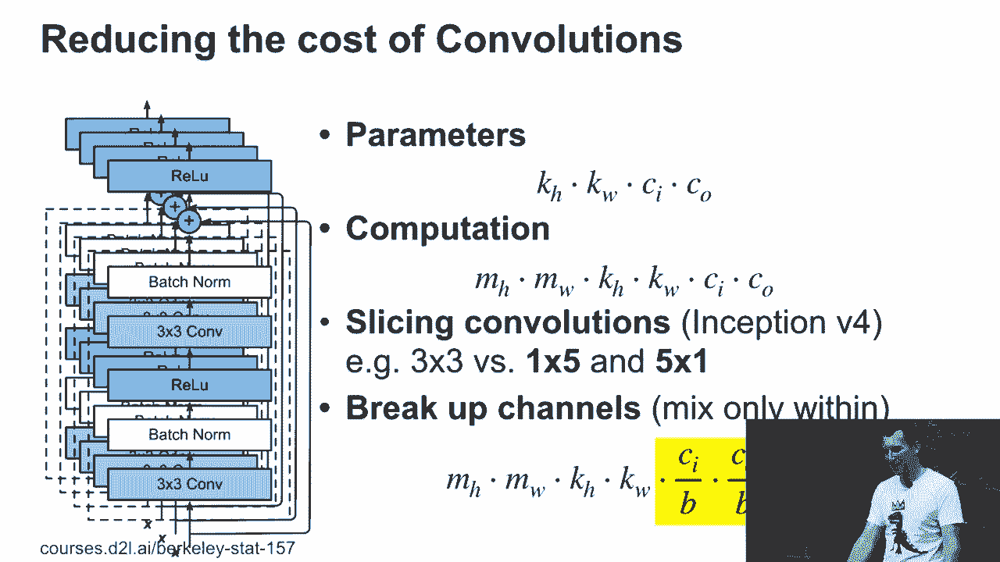

也许有人能找出实现这个方法的方式。我的直觉是，从排列到我们已有的东西，可能需要两份或三份副本。但总的来说，你知道，通道副本的对数可能会有所帮助。但我不知道这是否会相较于其他架构带来实质性的区别。所以鉴于通道的数量并不是那么大，我是说，可能是32个。你能获得的提升并不多。是吗？ >> [听不清]，>> 为什么它非常高效？嗯。对于移动设备，手机而言，我是说，你不希望有很多的计算。

而Risk Next是那种可以在较少计算量的情况下获得高准确度的案例之一。而Risk Next甚至在这种情况下提供了更高的准确度。所以现在你必须在准确度与速度之间做出权衡。你可以尝试通过拥有一个庞大且**高度准确**的网络来赢得基准测试。请注意，实际上有一篇ShuffleNet的论文，目标是**高准确度**。标题稍有不同，但基本是同样的作者，非常相似的网络架构，但准确度更高。或者你可以选择这种准确度与速度的权衡方式。

然后你会推动速度。而且 shuffle net 相较于例如 mobile net，通常会更快一些。所以你可以做很多其他的技巧，但这些大概就是在计算机视觉领域内有效的技巧。可能到明年这个时候，应该会有三四种更多的技巧。

这些是有效的部分的幻灯片。

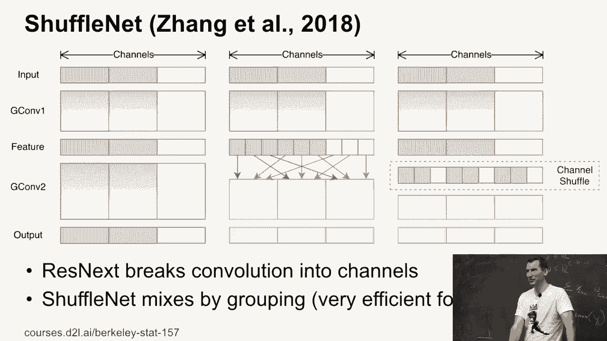

然后，最后一项是可分离卷积。如果你愿意说的话，这就是 mobile net 中的内容，实际上是 risk next 的前身。所以 risk next 有多个通道组。可分离卷积基本上是将每个通道单独处理。所以，如果我有 20 个通道，那么我可以得到 20 个独立的卷积。而在 risk next 中，

也许我会将这20个通道分成五组，每组四个。在 shuffle net 中，我会做后者，然后在它们之间进行混合。好了，这就是关于，嗯，覆盖了更有趣部分的内容。

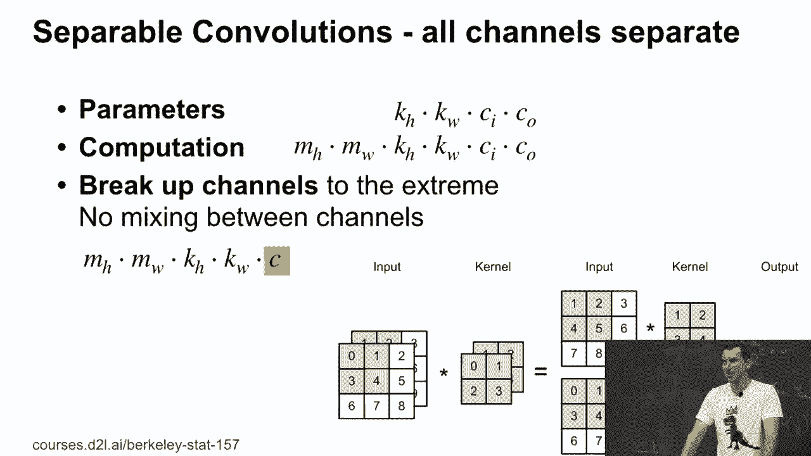

模型库。总结一下，我们谈到了 inception 和 resnet。inception 的关键点本质上是你可以混合不同类型的卷积，并且可以使用批处理归一化。resnet 则使用了尾部扩展的概念，resnet 将卷积进行了分解。

所以它基本上是可分离卷积，但控制上有更多的选择。然后，还有一整套你可以做的额外技巧。可能 C net 和 shuffle net 是模型库中更有趣的部分。现在，关于理论的部分有问题吗？好的。很好。

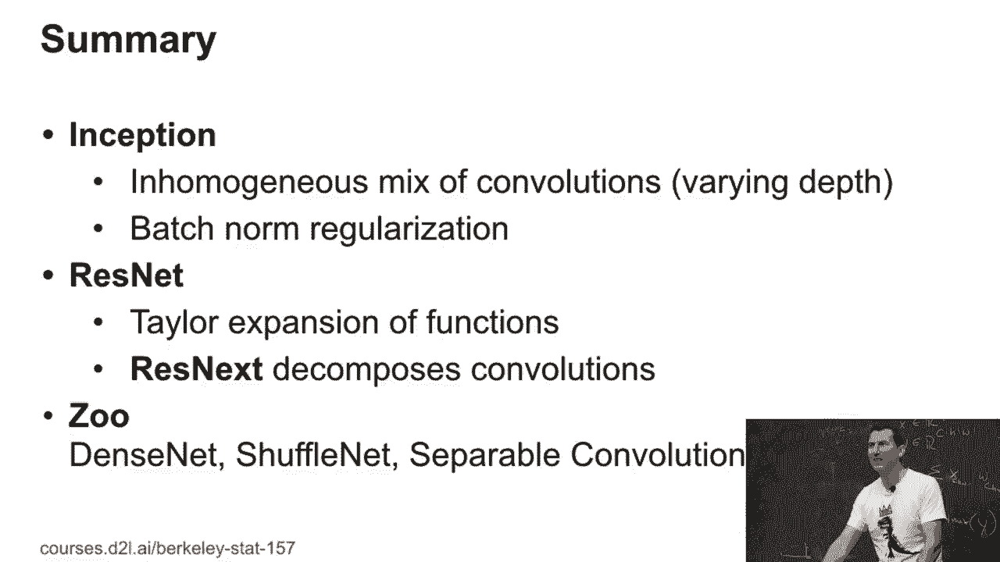
