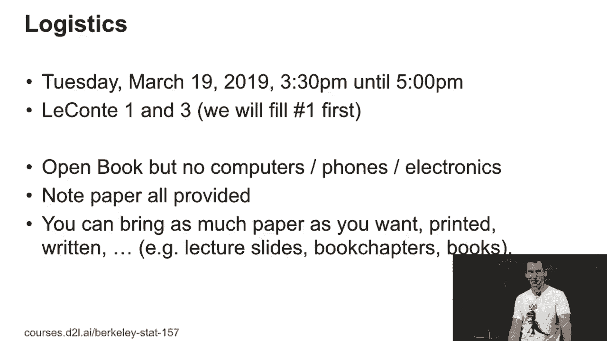
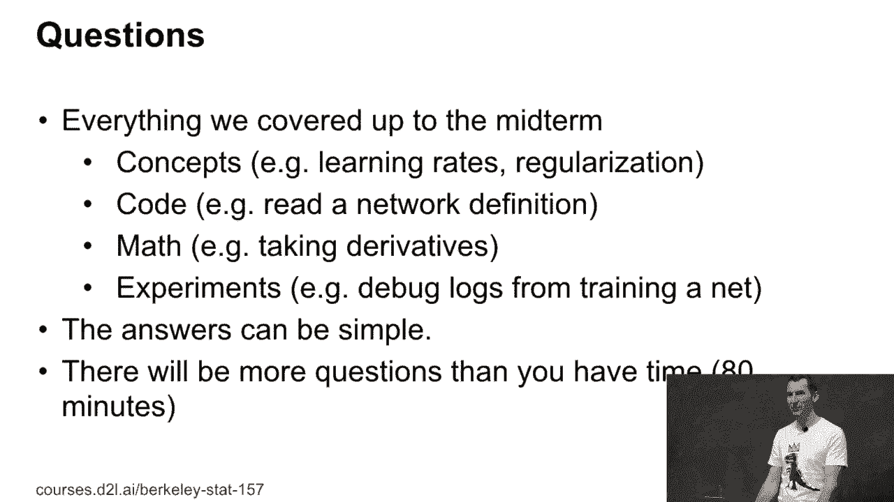

# P76：76. L14_1 Midterm Logistics - Python小能 - BV1CB4y1U7P6

 So a little bit of exam logistics just in case you're concerned because this is important for next Tuesday。 So everybody knows that next Tuesday is the exam， right？ Good。 So that's why there's no homework to you for next Tuesday。 So you get to prepare。 So it's from 3。30 until 5。 Realistically we'll probably start at 3。

40 because it'll be a bit of a matter of getting everybody out just like here as well。 Since we may need two rooms， we have lecant 1 and lecant 3。 We will fill lecant 1 first。 I guess everybody heard that， right？ So we're going to fill lecant 1 first。 If we fill lecant 1。 we will have overflow in lecant 3。 So as in here， but go to the other lec。

 But I hope nobody will push it to that limit。 So the reason I said why we cannot allow computers or other things。 and I know it's a horrible way of killing trees， right？

 Because you might have to print out notebooks。 It's just that there's no way of drawing an efficient boundary between what you got on your phone or when you open up Facebook Messenger or VChat or Skype or anything。 And then ask your friends to， well， how to solve it， right？

 This is why the only safe way to ensure that is by just disallowing in electronics。 Sorry about that。 Note paper is all provided so you don't need to bring it on exam sheets。 As a matter of fact， you're not supposed to add your own paper to the exam， right？

 But you can print as much printed stuff。 You still need to find it so there's the how much paper you bring versus knowing where to find it thing。 right？ So if you have too much paper， it doesn't help you。

 Good。 So this is logistics。 What are we going to cover？ Okay。 So I'm going to give you an answer that may or may not satisfy you。 Namely。 everything we covered all the way up to the midterm。 So that includes this lecture。 this Thursday's lecture， and that's it。 So， you know。

 what questions are we going to post because I mean the home works were fairly code heavy， right？

 And obviously， you can't bring a computer means you can't run code on your piece of paper。 So what are we going to ask？ Well， we might ask you about concepts， right？ Like learning rates。 regularization， maybe overfitting， you know， stuff like that， just， you know。 being able to explain and understand and detect things or covariate shift， right？

 The second thing is you will need to be able to understand some code， right？ So for instance。 you might see some， you know， network definition or something。 We'll require some basic math。 So if you know what a convolution looks like or how to take derivatives or how the change rule works。 that's probably a really good thing。 After all， this is the stats class， right？

 So we need to have some math questions in there。 And the last thing is， well， again。 because this is experimental heavy， right， so we might maybe show you some experiments and ask you。 well， hey， what did go wrong there？ And so for that it helps if you did the homework and you ran the experiments and you figured out what worked and what didn't work。 right？ So that's essentially the gist of what this is going to be about。

 The answers will typically be fairly simple and straightforward， so you won't have to write， write。 or piece as an answer for every one of those。 As a matter of fact。 you probably will not have enough time to go through all the problems。 This is intentional。 so don't freak out about the fact that there are going to be more problems than you can get through。

 I'm reasonably confident that very， very few will get through all the problems。 It's designed that way such that if you find a problem that you think is utterly horrible。 you skip it and you move on to the next one。 So this is a safeguard mechanism to make life easier for you。 Okay。 Now， the last thing is obviously in the end we'll look at the distribution of scores when we assign grades。

 right， and we'll try to make it right for everybody。 And I'm being purposely awake here for the very simple reason that every once in a while you hear that at some university。 a lecture goes and makes it a little bit more explicit。 And then the students make the secret pact that everybody hands in the blank sheet and then everybody walks out with an A。

 Right？ So that's the reason why I'm just saying we'll make it right。 Okay。 Good。 Any questions？ Yes？

 >> How do you just be studying for it？ >> Oh， well。 you should look at the lectures that we covered so far。 And you should have a good understanding of what was covered。 So I would， for instance。 go through the slides or maybe through the corresponding book chapters。

 You may find the book chapters easier to read。 This way you don't have to listen to me or -- but you can just read it。 You can rewatch the videos。 You should probably go over the homework solutions。 And they will give you some hints of， you know， especially for the more experimental parts of how to do things。 Or if you did well in the homework， then you probably don't need to go through the reference solutions。

 We will try to make the questions of a flavor that's as related as possible to the homework。 But since the homework is of a different nature， right。 because you can actually get to work with that on a computer in a bit more time。 the questions will not be identical。 Right？ That's just an inevitability。

 So there's some -- there's UCO very shift。 And unfortunately it's an inevitable one because the format is different。 Right。 Any other questions？ Okay。 Good。 So that seems like the explanation was very clear。 Yes。 How many questions？ I think the plan is something in the order of ten questions。 But that doesn't really mean a lot because questions could be short or could be longer。

 We will give you point estimates for every question such that you get some idea of whether you're stuck at a really trivial question or whether you're stuck at a really difficult one。 So this way you can calibrate your time。 Any other questions？ Everything clear？ Good。

 So I said make sure you go to LeCont one first and you fill that up。 And once LeCont one is filled up， we'll spill over in here。 Examine time is going to be probably in the order of 80 minutes。 Okay。

 Good。 Great。 So that's -- that。