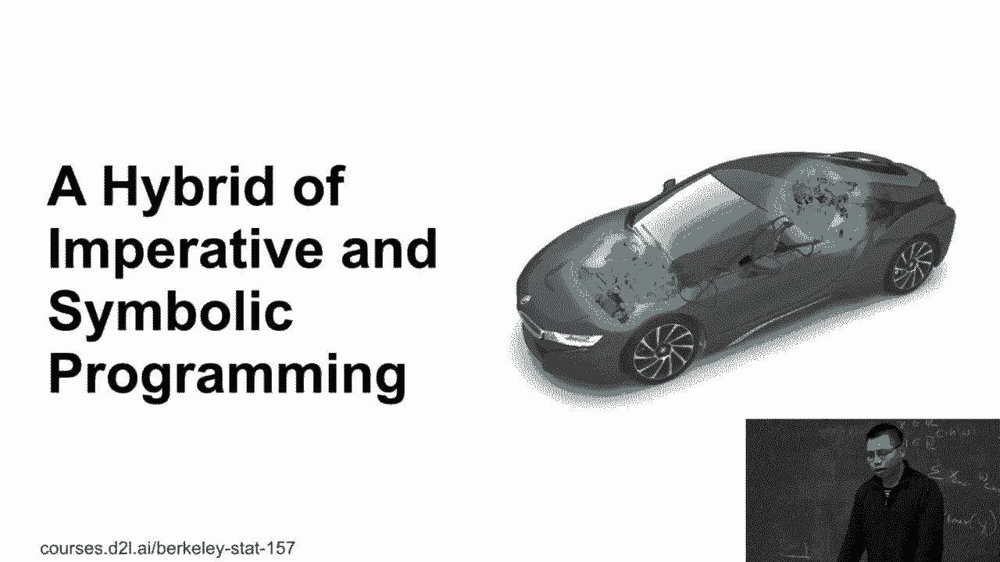
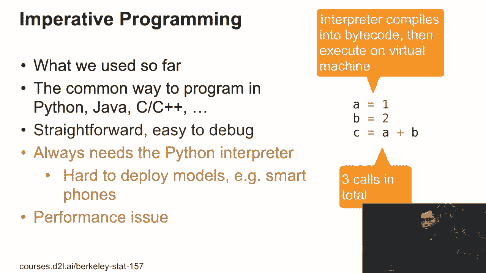
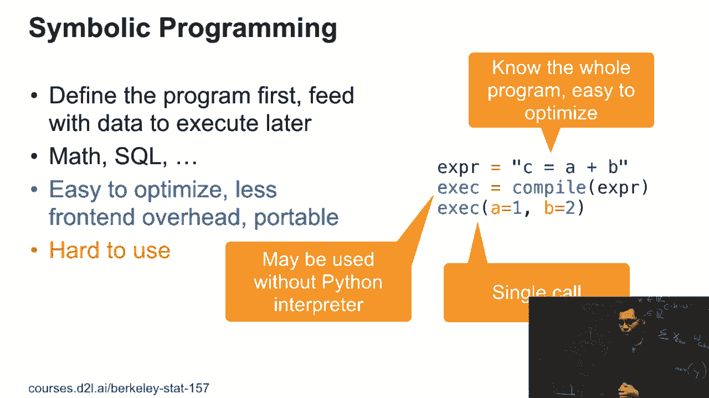
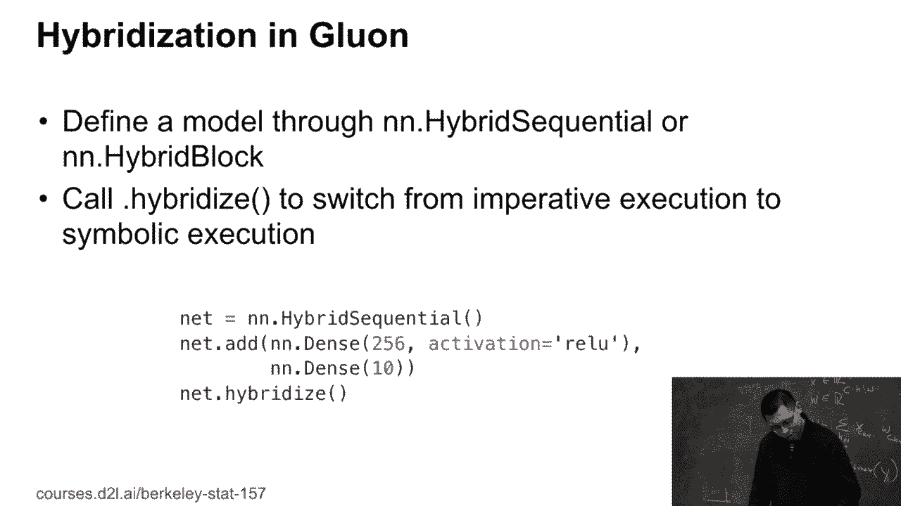

# P77：77. L14_2 混合化（即时编译） - Python小能 - BV1CB4y1U7P6

>> 是的，让我们继续。我喜欢谈论很多关于网络的内容。如果你做过作业，你会发现网络变得越来越复杂，你将需要更多时间来训练网络。所以在这次讲座中，可能，太棒了，本周四我们将讨论如何让你的程序在 GPU 上运行得更快，或者使用多个 GPU。

所以这不幸的是，因为硬件增长得并没有那么快。即便是媒体管理器每年都能加速两倍，但网络本身可能每年增长四倍，变得更复杂，数据集也在增加。这让我们感到非常困扰。

我们更难尽最大努力从硬件中获得性能。也许十年后网络会变得更加稳定，变得更难保持快速。那时我们就不再需要管理所有的事情了。所以第一个话题是如何混合训练，结合所有命令式和。

子绑定程序。我们之前谈过命令式编程。到目前为止，我们都使用了命令式编程。这是做事情的常见方式。第一步是使用 Java 或 C++ 进行产品化。所以这里的示例仅有三行代码。首先我们将值赋给 a 和 b，然后计算 c 等于 a 加 b。

所以每次我们执行每个，Nine，我们实际上在这里运行代码。所以这非常直接。如果一切顺利，很容易调试，只需要打印`Byde`，就是这样。但如果之前做过作业，你会发现这里有一些问题。首先，如果你使用 Python，根本没有所谓的 Python 解释器。每次你运行一个，Life 代码。

解释器首先会将你的代码编译成字节码。然后这个字节码会在 Python 的虚拟机上运行。所以每次编译和在虚拟机上运行都有开销。所以在这里我们有三个开销，因为我们向 Python 虚拟机发出了三次调用。

而且因为它有解释器，你需要在 Python 中运行代码。如果手机没有 Python，或者它无法运行 Python 代码，那就很难在手机上运行你的 Python 代码。所以命令式程序的主要问题就是性能和可移植性。在另一方面。

另外，我们提到了一个叫做符号编程的东西。如果我们之前使用过 tasafro 或 keros，它实际上就是使用符号编程。在这种编程模式下，我们首先定义程序，然后给定数据以请求好。所以在大规模计算中我们就是这样做的。我们首先定义方程式，然后输入数据来运行。如果我们之前使用过 SQL。

我们首先定义一个SQL合成，然后将数据表传入以获取结果。所以这里我们给出了一个示例。我们首先写一个字符串表达式，关于c等于a加b，然后我们编译这个表达式以获得可执行对象，然后我们给a和b赋值，然后进行计算。

所以这里的问题是人们不喜欢这种编程方式，因为它们相当难以使用。如何调试这些代码呢？如何打印呢？我们稍后会展示如何调试这些代码的示例。这里的好处是速度。因为当你要编译这些代码时，你知道整个程序的情况。

你可以进行很多优化，因为你知道整个程序。例如，如果我知道a和b会在完成c之后使用，那么我们可以删除a和b来释放内存，因为GPU内存非常昂贵。同样，如果我们有一个非常长的程序，并且我们实际上是要计算c。

但实际上，如果我们在任何地方都没有使用c，那么我们就不需要让你查看a加b。这就是我们可以做的优化。另一点是，因为我们可以先拥有程序，然后编译并运行代码。所以它有一个单核。无论程序多长，我只做一个单一的操作。

组合并运行一个单一的函数调用。此外，如果你使用符号方式，我们也许可以不那么以Python的方式来呈现程序。我们可以通过中间表示来呈现，然后它可能和Python关系不大，我们可以在没有Python的情况下运行代码。

这意味着我们可能在运行C++代码。到目前为止，我们看到两种编程方式。

一种是易于使用，一种是速度更快，实际上我们可以将两者结合起来。到目前为止，我们看到如何通过使用点式顺序或非点式块来定义网络，使用混合顺序或非点式混合块来使用假设模型。这里的一切都和之前类似，只是说我们将网络定义为点等于非点。

混合顺序并添加两个密集层，就像之前一样。这里唯一不同的是，如果我们调用net，不进行混合，我们可以从执行模式的影响切换到符号执行模式。就是这样。那么让我给出一些具体示例，展示如何实现这些操作。

