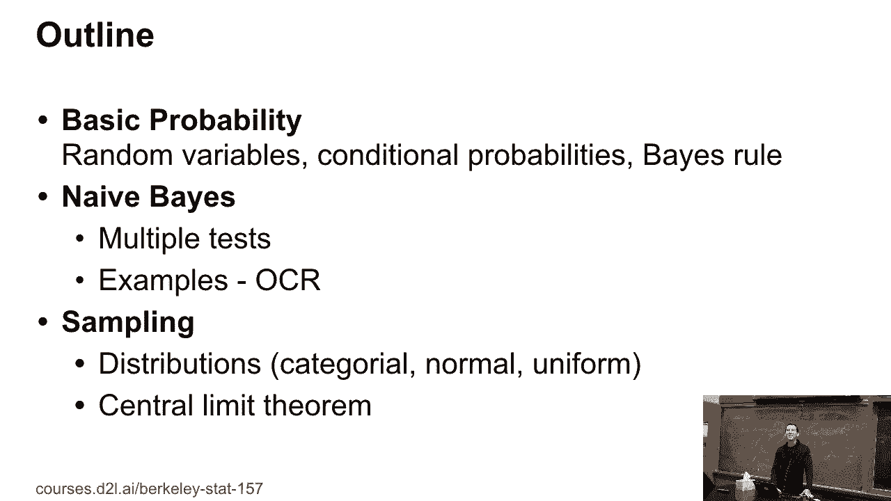
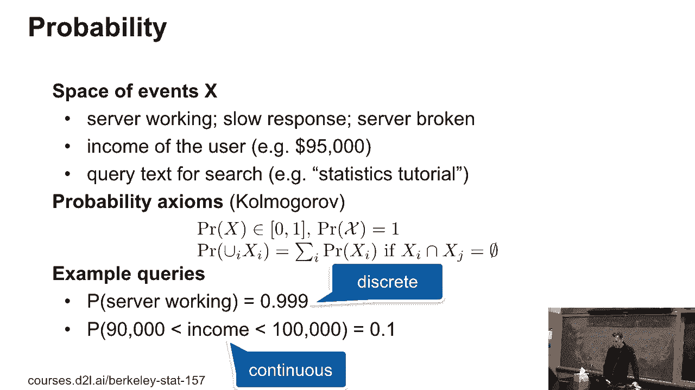
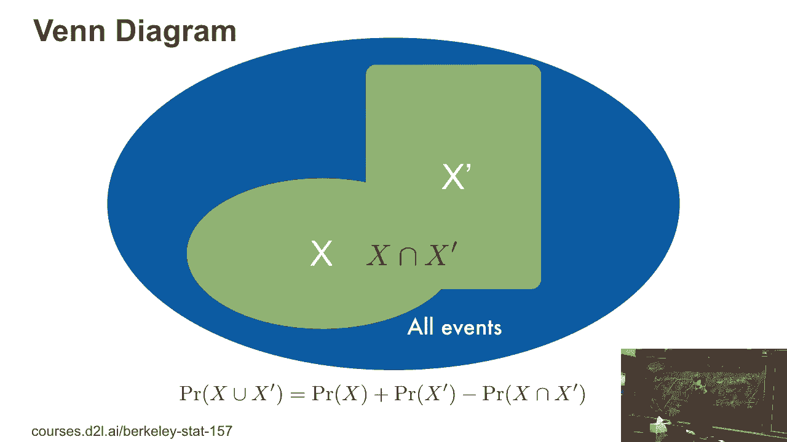
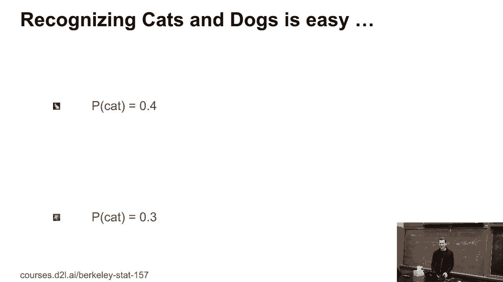
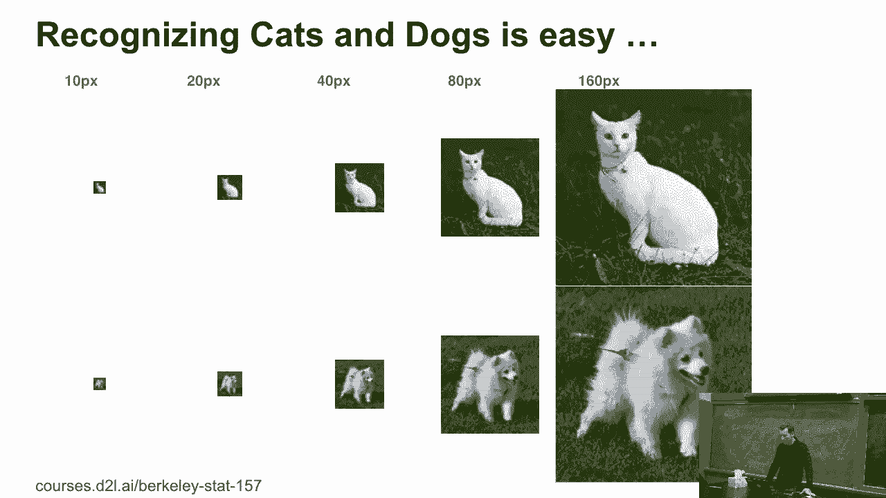
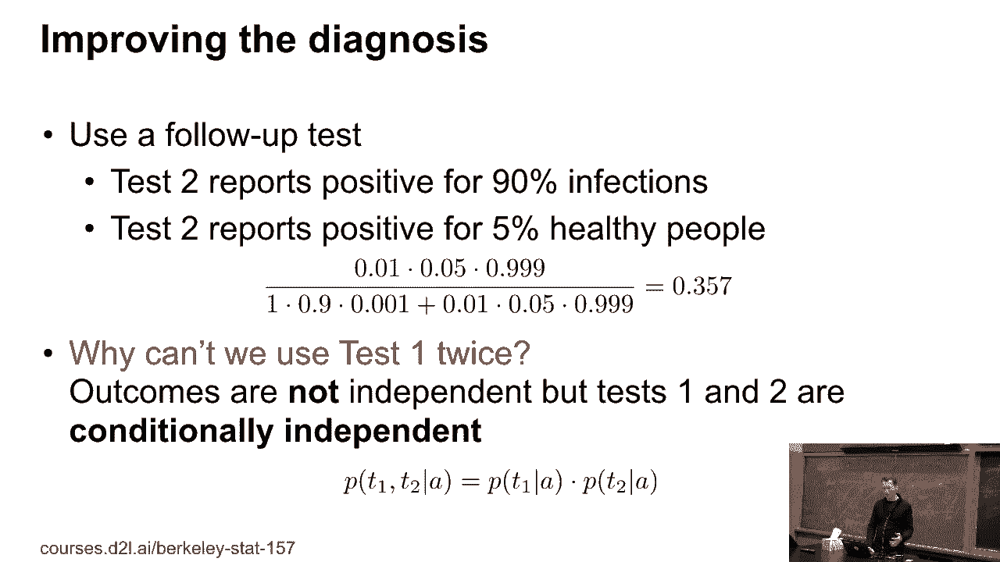

# P8：8. L2_3 基本概率 - Python小能 - BV1CB4y1U7P6

好的，今天我们要做的事情，大概会在周一继续，是我们将学习基本的统计学。谁之前上过统计课？太棒了。但毕竟，这里是统计系，你应该有所期待。不过我们还是会做一些相当基础的内容，比如朴素贝叶斯，还有采样等。谁知道什么是中心极限定理？好的。

谁在实践中测试过它？

好的，我们今天或星期二会做这个。几行Python代码。这实际上是它的一个好处。所以我猜这是显而易见的三轮车笑话。

好的，没问题。我们可以很快地浏览这个事件空间。你可能有个工作，或者其他什么的。你会用到通常的Kolmogorov-Faxiums。我猜大家都知道它们。一个事件的概率应该介于0和1之间。不能大于1，也不能是负数。某个事件发生的概率是1。好的。

哦。如果不同事件是独立的，那么相应概率的总和就是事件联合概率的总和。然后显而易见的是，我可以有离散和连续的情况。如果一个服务器不工作，它的概率可能是99.9%。但如果问我我的收入是91,000美元的概率是多少。

而5美分的概率基本上可以忽略不计。但如果问我的薪水是否在90,000美元到100,000美元之间，那就是一个更合理的问题。假设概率是10%。嗯，别担心，亚马逊支付得比这个高。但这只是为了说明问题。

这是强制性的事件图。如果我有三个事件，概率，表示这两件事同时发生。那不是它们的交集。好的，一切都很简单。因此，联合概率就是一个事件的概率加上另一个事件的概率，减去交集的概率。所以这一切都相当漂亮，涉及集合和度量等内容。

你可以参加一门完整的测度理论课程，真正地做这些事情。

但这是深度学习课程。所以我们不需要在这里深入讨论很多细节。几个有用的概念，比如独立性。例如，两个用户的登录行为大致是独立的。不同颜色的崩溃也是大致独立的。可能不是完全独立，取决于，嗯，你懂的。

假设你遇到一批坏的硬盘，然后它们同时都坏了。但如果条件是这批硬盘有问题，那它们又会是独立的。所以，如果我们有独立的事件，可以写成：P(x 和 y) = P(x) * P(y)。这很简单，但也很无聊。依赖事件，电子邮件。

希望能在讨论区或 Google Groups 上回复你的问题。顺便问一下，那个电子邮件现在能用了吧？之前有一个稍微谨慎的设置，基本上是 Google Group 的设置，导致所有的邮件都被退回，现在已经修复了。但希望我的回复不会与您的问题无关，至少不应该是。

如果我做得不错，网络上的搜索查询可能是相关的，比如，如何创建 AWS 账户，如何启动深度学习模型，如何安装 NVIDIA 驱动程序，如何打开 Drupal，所以你可能会 Google 搜索这些内容。我希望你不必这么做，因为我之前已经解释了一些事情，但，嗯，新的流媒体，我是通讯方面的人。显然。

另外，俄罗斯轮盘赌。如果你开枪并且活下来，那么下一个事件就不是独立的。明白了吗？假设有人强迫我玩两次俄罗斯轮盘赌。在我成功活过第一次之后，第二次拉扳机前，我需要做些什么来增加生还的机会？有什么建议吗？好吧。[听不清楚]，好的，所以你转动了转轮。

那为什么这个主意好呢？因为如果你第一次有1.5的机会——是的——然后转动转轮，你就有1/6的机会。没错。所以第一次你有1/6的机会，因为第一次拉扳机时，转轮处于任意位置。但现在，只有五个空位。而且，好吧。

最多在开枪六次后，你就死了，无论如何。而如果你再次转动转轮，那么它再次是1/6。这是一个例子，说明让事情独立会改变结果。还有一个很有趣的问题叫做蒙提霍尔问题，稍后可以 Google 查一下。

这非常好地解释了条件概率等等内容。你可以很轻松地让那些不了解统计的人感到困惑。无论如何，这意味着 P(x 和 y) 并不等于 P(x) 乘以 P(y)，这种情况几乎无处不在。实际上，这非常棒，因为这让我们的生活变得更简单。是的。[听不清楚]，有趣吗？[听不清楚]，哦。

这只是服务器不同位置的例子。它们有时被称为 Colo，Colo 源自共同放置各种服务器的意思。所以，举个例子，电话公司可能有一个大型的交换机和很多电线。然后他们告诉你，你可以把服务器放在他们的地点。接着他们又告诉另一家公司同样的事情。

所以多个服务器是共同放置的，因此被称为 Colo。是的，抱歉。这是服务器领域的行话，抱歉。现在，让我们做点非常简单的事情，好吗？每个人都知道猫和狗长什么样。好吧。[笑声]，好，那么哪个是猫？哪个是狗？上面的是猫。好的，你看到了切片吧？好的，所以——现在就像一个案例。你知道，这是任何人的案例。

对吧？

好吧，是的，我花了点时间找那只看起来像猫的白色狗。[笑声]。这只猫看起来很不自然，但无论如何——[笑声]，是的。

那么这里发生了什么呢，对吧？好吧，发生的事情是其实有两种不同的情况。对，可能我对事情感到非常不确定，比如抛硬币或买彩票。或者可能是由于条件反射，嗯，我实际上可以缩小这些概率。所以我只需要更多的上下文。

更多的附加信息帮助我将概率缩小到一个程度，嘿。任何人都可以说，嘿，这只猫是只狗，对吧？那么，我们为什么在乎呢？嗯。因为我们将用它来构建，知道的，分类回归器，其他估计器。这就是这门课程的全部重点，对吧？在信息理论中。

这就是所谓的信息永远不会有害原则。所以这是关于条件熵等的一个很好的结果。如果你上过信息理论课程，这将是其中第一个帮助恢复的内容。但我们在这里不会深入探讨，但这真的很有帮助。现在。

基本规则，我想大家都知道。那么让我们快速复习一下。你推导它的方式，当然是，p(x, y) = p(x | y) * p(y)。根据对称性，它也必须是p(y | x) * p(x)。好了。明白了吗？所以然后你只需要解出p(x | y)。看看，结果出来了。

你得到的是p(y | x) * p(x) 除以 p(y)。好了。听起来很无聊，对吧？我可以用它来——我保证这是一个测试，或者反向条件化。让我们实际用一下这个。让我们来看一个艾滋病测试，好吗？

假设大约0.1%的人口感染了。那么，美国的数字较低，但我们假设如此，因为数学看起来更简单。而在撒哈拉以南的非洲，感染率会高得多。假设我有一个能够真正检测到所有感染的测试。

但它有一个假阳性率，对于所有健康人的1%，它会检测到，表示他们得了艾滋病。那么，如果检测结果是阳性，某人实际上得艾滋病的几率是多少呢？好吧，为什么不试着在纸上算算呢？其实挺直接的。[视频播放]，所以有个有趣的小故事。

医疗专业人士在这方面并不太擅长。所以在我曾经待过的大学，医生会建议人们不要做艾滋病测试。因为他们说，嗯，如果结果是阳性，你会度过一个非常糟糕的星期。所以好了。现在看下答案。我们来看看，艾滋病的概率，假设检测结果如何。

这是测试结果的概率，给定这个人是否患艾滋病的条件，乘以他们患艾滋病的概率，再除以该特定测试结果发生的概率。这就是贝叶斯定理。所以我们知道分子。因为我们知道P(t=1 | a=1)等于1。并且我们知道艾滋病的概率是0.001。好的。

我们不知道分母。所以现在我们需要将其扩展到所有的情况。即这个人感染艾滋病的情况下，测试结果为阳性。在所有没有感染艾滋病的情况下，测试结果为阳性。所以第一个项仍然是0.001。基本上就是所有感染者。

然后99.9%，对于他们来说，我得到了1%的机会，测试结果为阳性。所以这个人实际上感染艾滋病的概率大约是9%。这完全是反直觉的。假设发生了这种情况。那么医生接下来会做什么？他会再做一次测试，对吧？所以我们来做一下。第二次测试可不太可靠，对吧？

在90%的感染者中是阳性，5%的健康人中是阳性。如果你再次计算数字，你会发现现在实际感染的概率大约是36%。即使在经过两次测试后，情况看起来仍然相当不错。问题是，为什么我不能用第一次测试两次？毕竟第一次测试非常可靠，对吧？

它检测所有疾病的假阳性率非常低，相对于这个测试。所以为什么我不能用第一次测试两次？有什么想法吗？没错。你完全正确。所以运行两次第一次测试只会给我相同的结果，不管我做多少次，对吧？

而这不是我想要的，对吧？因为我想确保它。可能得到第二个独立的结果。好吧，实际上，我并不关心独立性。我关心的是条件独立性。我关心的是，给定一个人是否患病的条件下，结果是独立的。但如果第二次测试与任何事情完全独立的话。

否则，这将只是一个随机数，对吧？所以这是条件独立性。我们将在本课程中深入探讨的概率内容大致就是这些。但仅仅提醒一下，有一些小细节。可能会迫使你合理设计估计器。

好的，还有你的目标函数等等。

所以基本上，要小心你在做什么。在我们使用这个之前，让我们先--。
