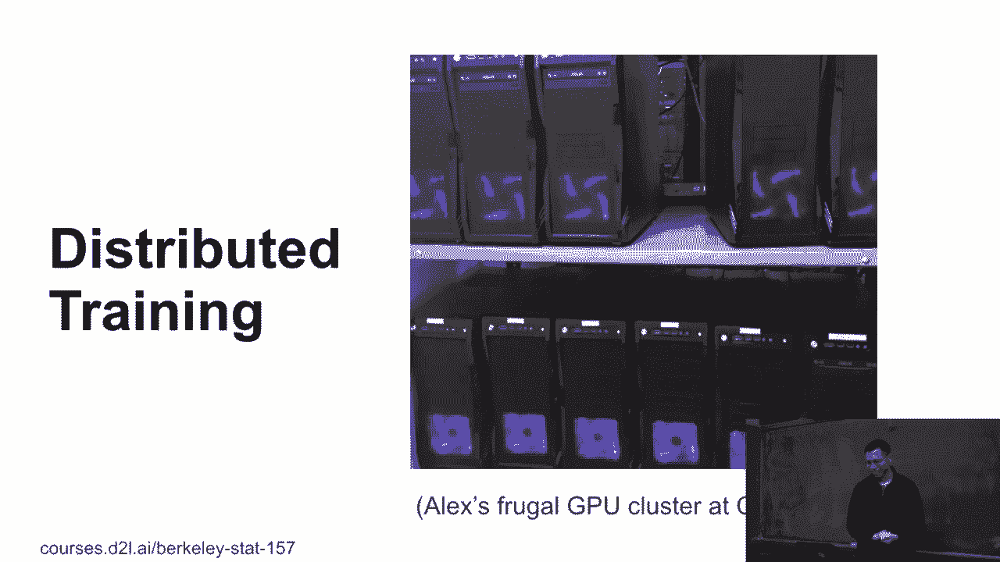
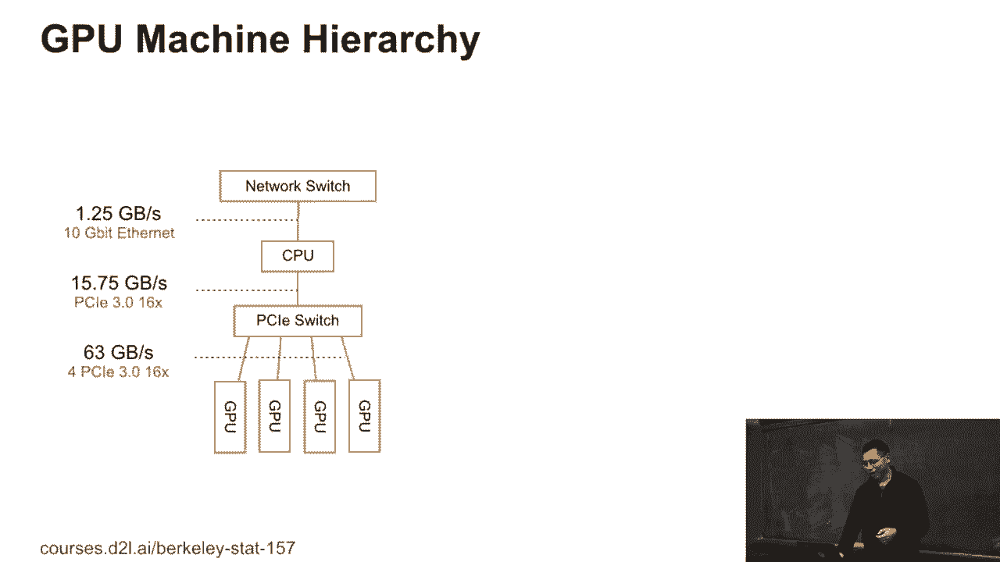
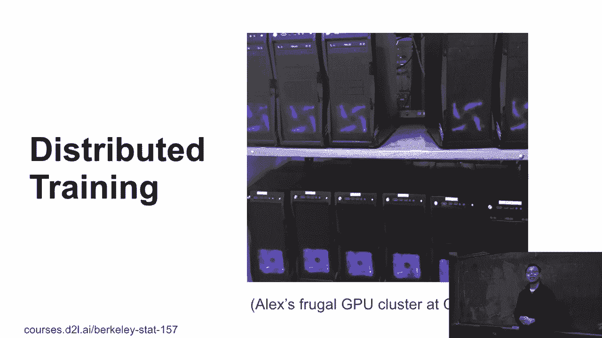
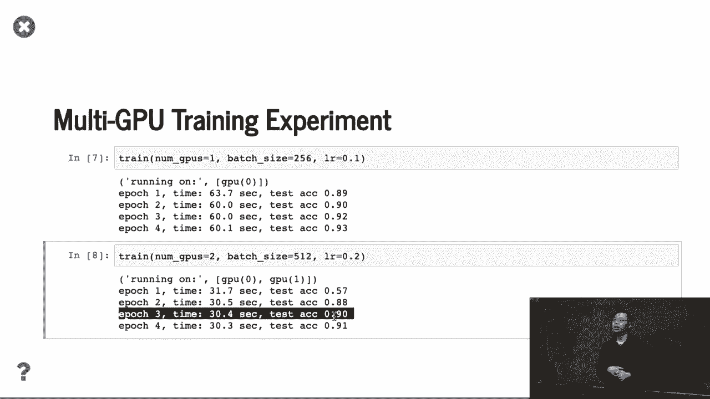

# P80：80. L14_7 多机训练 - Python小能 - BV1CB4y1U7P6

好的，接下来我们将讨论从单机多GPU到多机多GPU的过渡。这是一个相当便宜的GPU集群，Alex大约四年前有过类似的经验。这个机箱花费了40美元，我们从Facebook买了CPU。Facebook有数据中心，他们每年会将不再需要的旧CPU在eBay上出售，售价20美元。

所以我们购买了，类似于巧克力，价格大约200美元，10块巧克力。然后我们购买了非常便宜的主板，价格也很便宜。所以这是一个相当便宜的集群。整个集群有16台机器，可能只花了大约20000美元，我们当时可能剩下了一点零钱来支付所有这些费用。你知道的。

那是四年前的事情了。如今你已经无法从中获得任何优势了。

好的，这就是单GPU或单机多GPU的情况。接下来，面对多机时我们该怎么办呢？我们大概假设数据位于分布式文件系统中。在共享文件系统上，或者在任何你能让每台机器都能访问的地方。然后我们有多台机器。每台机器上有多个GPU。

而且，参数可能不再集中在单机上。它们可能跨越多台机器。我们可以将参数和计算分配到不同的机器上。例如，如果我使用ResNet，如果你使用ResNet-50，它有50层。我们可能只用四台机器，每台机器可能只处理12层。这样，每台机器就得到了一部分模型。

然后我们将通过网络读取数据，并发送和推送梯度。在网络中我们有。好的，这只是一个例子，但对于其他部分，和单机多GPU训练非常相似。记住，我们可能在这里有层次结构。所以GPU与单机的通信非常快。这里，针对PCIe。

你可以在单机上获得每秒63GB的GPU带宽。然后GPU到本地CPU的速度是最低的，为每秒16GB。但机器与机器之间的速度相对较慢。这里，可能是我三年前的博士答辩。这种速度大概是每秒1.25GB。你可以看到，GPU到CPU的速度较慢。

而CPU到远程CPU的带宽，每次都会降低大约10倍。所以我们需要关注所有的层次结构。我们可以做的是，在本地运行，我们将参数存储在GPU上，然后通过GPU之间的通信聚合梯度，并将其发送到远程的CPU。因此，这就是我们能做到的唯一方法。所以我们可以把这些参数看作是。

我们称其为主服务器，这些类型的键值存储，我们在这里有两级结构。好的，到目前为止有任何问题吗？好的，太难了吗？>> 事实上，我只是出于好奇。我想象，在多机设置中，出现问题的可能性是非常低的。比如说，GPU出故障或者计算机磁盘关闭了。>> 是的。

>> 我给这种情况做了数学建模，并且处理了CPU的部分。所以是的，我没有在这里放图像。所以我们需要稍微回顾一下。

这就是一个机房，就像这个建筑里的办公室，但它是一个SEMU。然后有多个机器，GPU消耗大量电力，像是便宜的，差不多2到300瓦。在NEPs之前，每个人都在做实验，每个人都在全天运行，所有GPU都在使用最大功率，然后我们就没电了，这意味着整栋楼都没电了。

事实上，NEPs的那一天，大家都在做实验，争取发表论文。那些频繁做检查点的人员提交了论文，而那些没有频繁保存结果的，什么也没剩下。所以，是的，你会看到GPU可能烧坏，就像CPU比GPU更不稳定。

GPU比CPU不稳定。并且这个数据更好，尤其是在课堂上，我们使用的是服务器网格GPU。你承受更高的温度。但是这里我们使用的是消费级GPU。很容易就会坏掉。从系统后端看，是的，我们有很多事情要处理，所有这四列内容都需要应对，使用单机风格。

我们可以把工作负载转移到另一台机器上，但最好的选择是，你为每个APOC做检查点。因此，每两分钟你就保存一次结果，如果发生错误，就从最新的检查点重新开始。好的，接下来让我们展示一下迭代如何进行，或者多机器的运行方式。

假设这里我们有两个工作节点。再次说明，这是单批次。如果你有100个样本，每台机器将获得50个样本。然后，像之前一样，我们需要进一步将数据分成两部分并复制到每个GPU上。所以每个GPU仍然像之前一样，每个GPU得到25个样本。类似地，在主服务器上也是如此。

我们首先将参数复制到每台机器，然后每台机器再将其复制到每个GPU。因此我们这里有两个层级。记住这一点。所以每个GPU现在获取部分数据，获取整个参数，然后计算绿色框框的梯度部分。然后，我们在单台机器上汇总所有GPU的梯度。这就是我们之前所做的。然后。

每个机器将会把梯度推送到远程机器进行更新。最后，每个参数都可以在这里更新这个参数。好的，这就是整个循环。唯一的区别是，这里我们有两个层级，我们先在本地做，然后再远程做。我们首先要在机器上对梯度进行求和，因为如果梯度是100兆字节的话。

你按GPU发送，每个GPU发送200兆字节。如果你将梯度汇总在一起，你只会得到100兆字节。这就是唯一的原因。这就是我们所说的同步梯度（synchronize.gd）。同步梯度意味着每个工作都是同步进行的。每个批次，每个GPU运行相同的工作负载，并且在同一时间开始和停止。

假设我们在使用 GPU，每个 GPU 每次可以处理大量的样本，然后进行同步。gd 等于普通的中批次 gd，批次大小为 n 乘 b。也就是说，通常如果固定 n 乘 b，无论有多少个 GPU，我们总是能得到与单个 GPU 相同的收敛结果。好了，这就是同步 gd 的好处。

在理想情况下，如果我们要使用 n 个 GPU 进行训练，我们应该能达到单个 GPU 的 n 倍加速。但是你需要支付很多额外的数据通信开销，已经有很多东西需要处理。我们已经展示过了。然后，关于性能，让我们再谈一谈性能。我们这里有两种主要的事情。

第一个时间被称为 T1。它是计算每个 GPU 上大样本梯度的时间。也就是说我们花费在计算上的时间，包括计算前向路径和反向路径。假设梯度的派生是 m 个派生量。每个工作节点会在每个批次中发送和接收梯度。

所以 T2 是指在网络中发送和接收 2m 个派生量的时间。那么，实际的时间是每个批次支付的最大时间，即 T1 和 T2 中的最大值。这适用于单 GPU 训练和多机器训练。我们已经展示了，对于非网络的情况，T1 非常小，因为计算相对较小。

计算速度相当快，但是通信的时间相对于 T1 来说较大。也就是说，它是每分钟的通信时间。那么我们可以在这里做的事情是增加 B 或 N，这样就可以得到更大的批次大小。而且这里的好处是，无论批次大小如何，我们总是会进行数据的发送和接收。

相同数量的数据。所以 T2 不变，T2 与我们所用的批次大小无关。所以我们总是可以增加批次大小 B 使得 T1 略微增大。如果 T1 更大，那么我们几乎可以获得线性加速。但是我们发现，如果可以增加 B 或 N，我们就可以达到一个非常大的批次大小，可能会因为训练的网络带宽而受到影响。

这意味着我们可以花费更多的数据 epoch 来获得我们想要的准确度。这里我们展示一个图表，假设我们固定了 GPU 的数量，批次大小越高越好。首先，你可以看到蓝色的线，它表示训练效率，这是每个批次中。

训练的 epoch 可能会停止。如果我们增加批次大小，可能需要更多的数据 epoch 来达到最终的模型。而蓝色的，黄色的线表示的是系统性能，因为每次我们增加批次大小时，T2 不变，但 T1 增加，因此我们就隐藏了所有的数据通信开销。

这意味着它对系统性能有利。获得线性加速或完美加速会更好。因此，最佳选择通常是在两者之间做一个权衡。好了，有问题吗？

>> 前一行是，T1 和 T2 是否并行发生？ >> 是的，它们是并行发生的。所以水的最大值是 T1 和 T2 的最大值，而不是 T1 加 T2。 >> 但它是如何并行发生的？ >> 你需要先获得参数，然后需要计算梯度。 >> 好的，这是一个很好的问题。记得在我们之前已经计算了 10 次乘法并发送到 CPU。

我们可以将其并行化，因为一旦第一个完成，我就发送数据，同时第二个也可以发送。这样它就可以并行运行。所以这就像是一个数据管道。好吧，关于多 GPU 或多机器训练，有很多实际建议。首先，你需要更大的数据集，不要使用 M-list。

如果单个 GPU 训练需要两分钟才能完成，那么就很难扩展到多 GPU。所以如果你尝试使用 10 个或多个 GPU，你将不得不支付机器间通信的开销，这将成为主导。其次，对于硬件，你需要选择具有良好 GPU 和机器间通信的硬件。

如果你使用云服务，你就不需要担心这个问题，因为云提供商通常会为你处理这些事情。但如果你要在本地操作，比如我们，亚历克斯和我在购买 CPU 时，首先买了一个通用的主板，但发现便宜的主板在 GPU 通信方面做得不好。

然后我们花了一周时间换了另一个，然后一个一个替换。之后我们发现机器间通信不够好。你需要购买很多交换机来连接这些设备。如果你能从硬件上解决这些问题，那么你就不需要太过于关心软件。

这就像是必须的。我需要减少对此的担忧。第三个是通常人们不会太注意这一点。嗯，如果你增加 GPU 数量，而 CPU 的速度跟不上，那么如果你在一台机器上加载了很多 GPU，CPU 将成为瓶颈。

尤其是我们稍后会讨论这个问题，看看是否有时间。稍后我们将展示数据加载和数据准备占用了大量 CPU 周期。这意味着你不能够快速生成数据以适应网络，也就是说瓶颈在于 CPU。因此，你需要基准测试每秒钟可以处理多少张图像，并与其他进行对比。

你可以在 GPU 上计算多少图像和梯度。你还需要选择一个好的模型，它具有良好的通信开销。这是计算问题。我们之前谈到的 FLOP 和通信开销。通信开销就是模型的大小。所以我们有的原始方法。例如。

在Septune中表现得不错。更高的浮点运算能力，但模型尺寸相当小，大约10MB。ResNet也不错，ResNet50有550MB的数据，也还行，但稍微低于0.2。AlexNet是最差的。AlexNet在最后有很多密集层，模型大约需要700MB，比Septune中的其他数据大了十倍。

但AlexNet比ResNet更快。这意味着通信与计算的比率，AlexNet比ResNet差100倍。不幸的是，系统社区，系统研究社区将AlexNet作为基准。因为它的工作负载相当复杂。像你有这么多事情要处理，但它并不那么快。

系统社区说，哦，这是个好事。这个难题我们可以解决。我们可以做极快的网络通信。我们可以为此设计芯片。为密集层设计的Sun芯片，为卷积层设计的Sun芯片，花了三年时间做这个。这是因为NVIDIA总是使用Alexnet作为基准来展示我们的新GPU。

在AlexNet上运行速度快了两倍。但他们不知道计算机视觉社区已经使用AlexNet四年了。抱歉。于是，芯片供应商花了很多时间优化AlexNet，他们全力投入，但现在没人再用了。好的，所以如果你选择硬件、选择数据集、选择网络，那么你将选择NUNI速率。

你会选择优化方法吗？你想使用更大的批量大小来提升系统性能。你想要。嗯，因为较大的批量大小会使训练速度变慢，我们有很多技巧可以做到这一点。我们可能在这堂课上不会讨论这些，但通常我们可以达到可能一千，甚至一万的批量大小而不会降低训练性能。

做到这一点有很多技巧，比如线性节奏热身，很多花哨的技巧。这就是全部。是的，举个例子，性能、逻辑数据集、良好的硬件，数据真的非常快速。还有好的模型，好的优化方法，你需要很多东西。所以如果性能不是特别好，你也可以通过这个顺序来调试。好的。

有什么问题吗？好的，看看你们有没有得到结果。嗯，你可以看到我们使用了ResNet。我们首先使用单GPU批量大小，它会很大。这个小的ResNet我们可以使用较大的批量大小，0.1的线性权重。每个周期需要60秒，准确度在这里，我们切换到两个GPU，批量大小翻倍，线性速率也翻倍。

你可以看到加速几乎是原来的两倍。这是因为每个周期，每个批次可能只需要0.1秒，我们可以在批量大小内并行运行两个。这样是合理的工作负载。如果整个数据周期需要两秒，那就太难优化了。而且测试准确率其实并不兼容，最后虽然稍微加速了，但……

这里几乎是兼容的，但也不是完全兼容。总体来说，C410 仍然是一个小数据集。你仍然可以稍微调节一下，但通常是多 GPU，在 C410 上你可以获得很好的加速效果。

[BLANK_AUDIO]。
