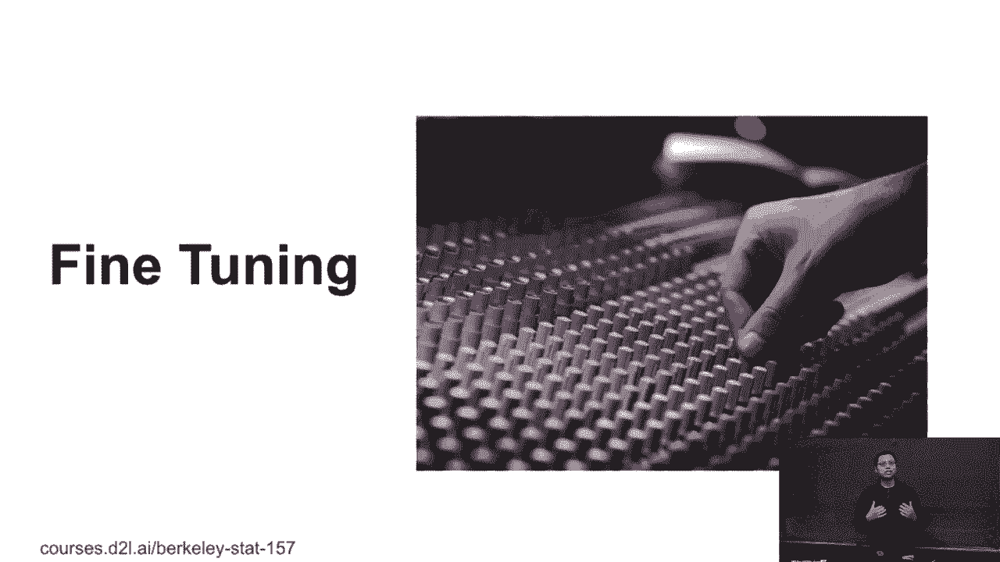
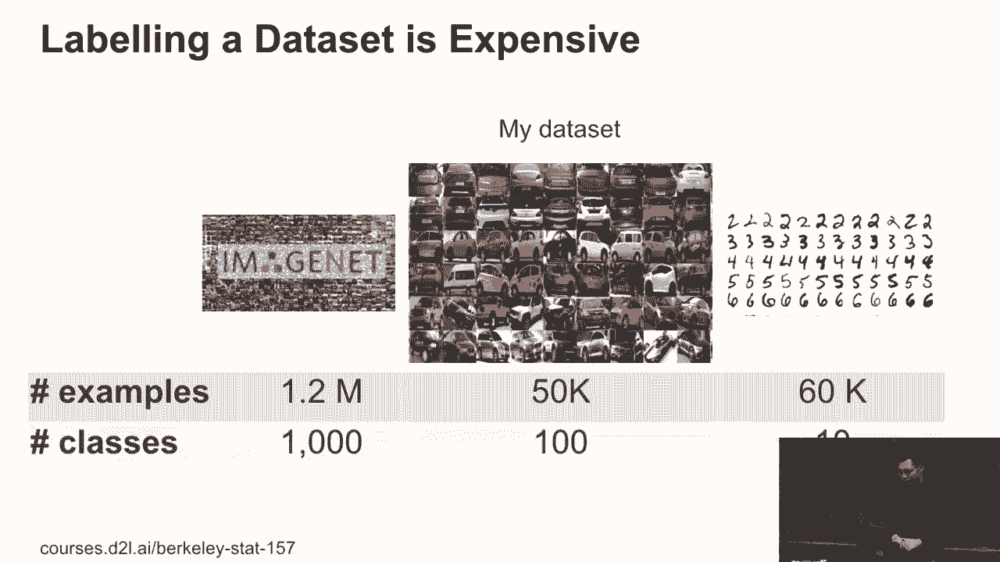
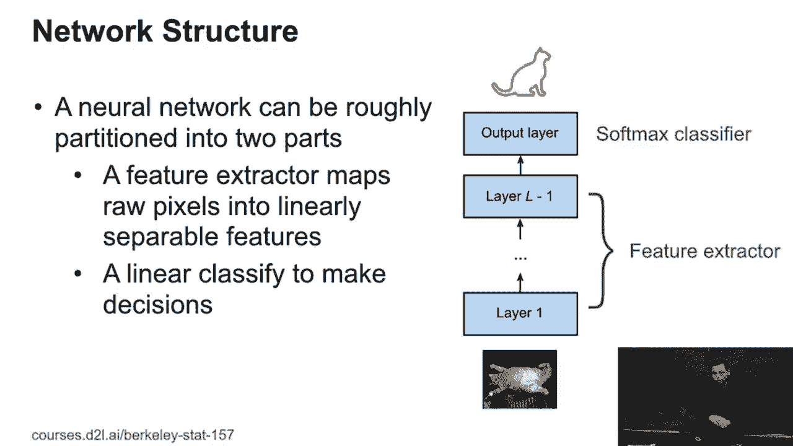
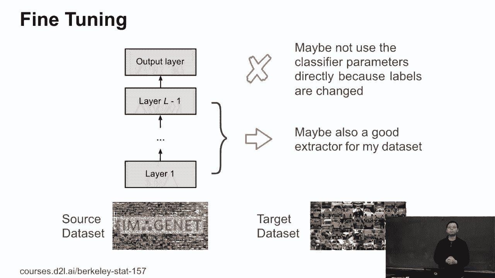
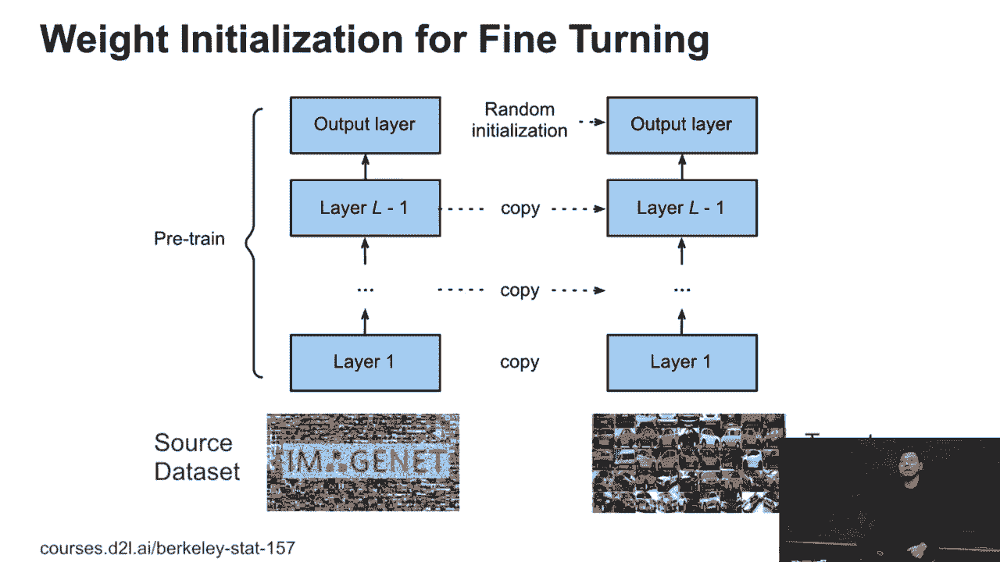
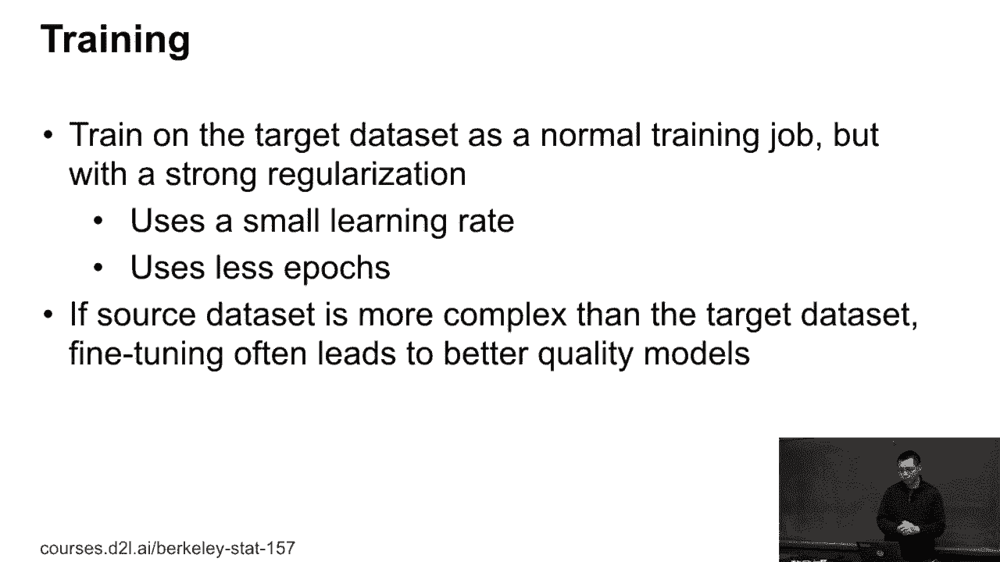
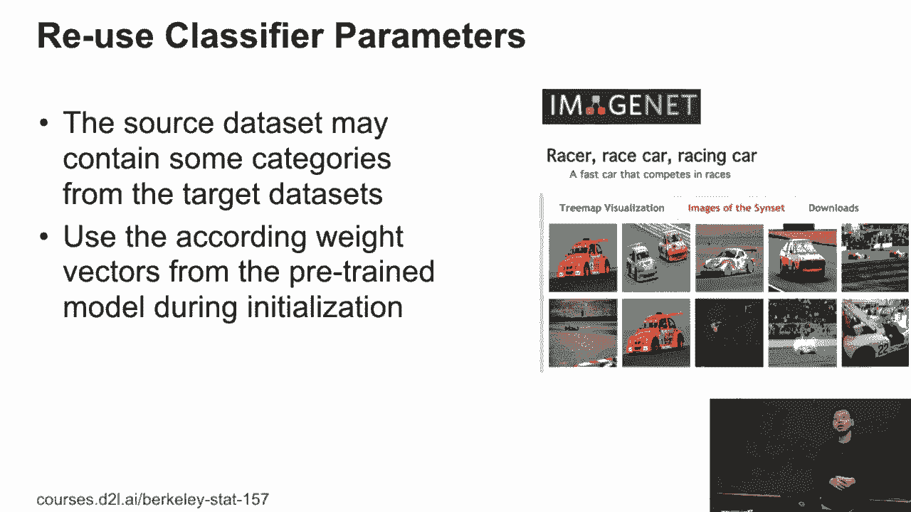
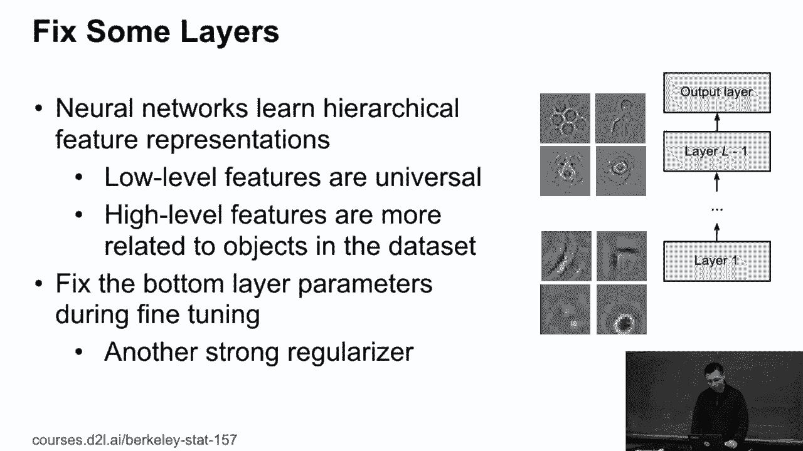

# P82：82. L15_2 Fine Tuning - Python小能 - BV1CB4y1U7P6

 We're going to first finish the fine-tuning part。 So fine-tuning is probably the most important。 scale in computer vision。 That is， in most cases， you're going to use fine-tuning。

 if you're using computer vision applications。 The idea here， we talk about two data sets。 One is M-NIST， one is ImageNet。 M-NIST， I have 10 classes。 Each class have about 6，000 images。 So it's pretty small。 It's a larger scale data set 30 years ago。 but it's pretty tiny data set right now。 The state of art， 10 years ago， is called ImageNet。

 But still， it's still a larger data set nowadays。 It takes 1。2 million images and 1，000 classes。 If you want to build products using computer vision。 you probably are going to connect your own data set。 My data set will be sitting in the middle。 For example， I'm going to build a data set， to identify all these cars， which maybe。

 I'm going to connect 100 kinds of car models。 And for each car， we're going to connect 500 images。 for each car， which means 10 times smaller than ImageNet， but still larger than M-NIST。 So this is the realistic data set you can connect。 Usually， this data set， you're going to Google。 crawl your company's own database if you're working on a company。 And then you try to label these 5。

000 images。 You can do by yourself。 It takes a week， usually。 If you're very fast ahead， you can。 label one image per second， like 3K image per hour， which， means take 10。 20 hours to label the data set。 Then if you label by yourself， the model。 you're going to try and can at most match your ability。 And then you can try and do， OK。

 I have five guys， to label the ImageNet。 The data set， I can improve that just a little bit。 But the problem is here， unlike you， can label ImageNet a data set scale at the beginning。 because take a lot of time and a lot of money。 You cannot promise your manager say that， OK。 I can connect a data set， simulate ImageNet， give me six months， and give me one minute dollars。

 I can because I can hire somebody to label for you。 And after six months， I can train a model。 that tells you if my model works or not。 Well， maybe after six months， it's， start up。 you maybe turn to another product to consider。 So now you need to start with the media size data set。 But the problem here， all these models， we talk about is designed for ImageNet。

 which means unfortunately just overfitting to the ImageNet。 All these resonant different kinds of inceptions， we pick up the design the network based on ImageNet results。 So if you fit to another data set， maybe it doesn't work。 And maybe it's too complex， for example。 because your data set is 10 times smaller， and that's resonant is 10 times more complex。

 than your own data set。

 So we want to have a solution for that。 So here's one idea。 We mentioned in the AlexNet before what the convolution， you're not going to be doing is here。 you fit into raw pixels。 And then to convolution layers one by one， we do feature structures。 At the end， except of the last layer， we finish the feature instructions。

 And now we hope that all these features， we map the raw pixels into features。 That's pretty easy to separate in a linear space。 That the last layer is a dense layer。 We give a linear classifier to get very good results。 So we can think about a network we have two parts。 One is the feature structure to map raw pixels。

 into highly separatable features。 And the last layer is just a classifier。 to get the label you want。

 So then if I do have a network， try now image net。 So this is the blue one。 If I want to apply to my own data set。 So I try now image net， I call the source data set。 my data set， I call it the target data set。 So maybe the network trend on the image net。 for the feature structure， is also， applies to my own data set。 They are just the images。

 So maybe the content are different， but they are pixels。 So maybe the image net feature structure。 is still good， can apply to my data set directly。 Can still get the reasonable feature。 instructions feature representations。 Not very good， but still usable。 The last layer。 which is very related， to the image net labeling， which maybe cannot apply。

 So because the last is just a linear layer。 If you have 1，000 classes， you have a 1，000 output。 which， means 1，000 vectors。 Each vector present one class。 If my car data set doesn't have all the labels for an image net。 I maybe cannot use the last classifier directly。 But at the least。

 I can reuse most of the results we have。 If the network have 100 layers， I can reuse 99 layers。

 Then for fine-tuning， the idea is， that to try my own data set， I can。 grab a model which already have pre-trained weight， on the image net。 So which means I don't modify the whole network structures。 Then to initialize my models， I'm。 going to copy the weight from the image net， pre-trained models for all the layers。

 except for the last one。 Which means I copy all these parameters。 from the feature instructors to initialize my weight。 For the last layer， I cannot reuse it。 I just randomly initialize it。 So that is fine-tuning。 Which means I grab a pre-trained model。 and copy most of the parameters to initialize my model。 Question。

 What happens to performance of the image net， if you just shuffle around the labels？

 Maybe it just changes everything you're able to--， the ninth example， label 3。 OK。 You want to change your labels for image net that you want to--， and what I'm asking is if you do。 a regular initialize around the output layer， it's not necessarily guaranteed that it'll transfer well。 OK。 So whether or not you can try out different relatable images。

 after you copy parameters to try and get better performance。 Yeah， sure。 We're going to talk about leather， yeah， a few slides。 But the basic idea is you random initialize classifier。 We can definitely talk how to transfer the label as well。

 And then， well， the training will be a different because we， are not start with a random point。 We start with a very good point。 And in normal case， we can train as a normal training job。 But we can do label things here。 Because the image net pre-channel models。 maybe it's still too complex for your own data set。

 We want to place a larger regularization to hear， to avoid overfitting。 For example。 we can use a little bit smaller than a rate， because it's already very close to the final results。 We don't need to work very long any time。 Also， we can use less epochs， which。 means we pass iterate like not 100 times， maybe only 10 times。 So in practice。

 if the source data set is more complex， than your own data set， usually fine-tuning。 give you better results compared to your transform， scratch on your own data set。 Also。 it's converged faster because we start， with good initializations。 And so that is highly recommended if you're， trying to try your own data sets。

 So that's a basic idea for fine-tuning。

 Yes， we can do a lot of things here。 For example， even for cars， image net have a car。 It's called the race car labels here。 Because if the source data set contains the labels。 from the target data set， we can just， grab copy the feature weight accordingly。 to the fine-tuning model。 So that's easy to understand。 But usually， you're not so lucky every day。

 because image net contains a lot of， for example， 100 different， dogs， 100 different cats。 Well。 in practice， you don't care， about which actually tiny dogs you have。 Also。 image net have a lot of animals， you never see nearby， which is very natural images。 So you probably don't care about these animals， even you don't know how to name them。

 But in practice， yes， you always try to figure out， if your source target data set， the label set。 partially contained on the source data set， is to make your convergence even faster。

 On the other hand， we still train all these layers， but we can fix some of them during training。 So here， usually， if you train a deep convolutional neural， network。 you can see that the low layers， try to find the local features， like age， some more shapes。 some more colors， and local colors。 And the bottom layers try to find more global features。

 For example， there's a dog， some global patterns， and the human。 Maybe the bottom right is。 I don't know， like， I or something， maybe I。 So the low level features， which is the bottom layers。 maybe universal， which means your own data set maybe also， cares about the shapes， local shapes。 local colors， local patterns。 The high level features is more close to the category。

 of objects you have， so maybe you need to change the little bit。 So the here idea is that you can fix the bottom layers， parameters during training， which。 means if you have a 50 layers resonant， you can fix the bottom 10 layers。 In fact。 you just try 40 layer resonats， which means you reduce the motor capacities。

 so you are not less likely to be overfitting。 So that's the idea。 Question？ [INAUDIBLE]， Oh。 this is a visualization trying， to give image and see what the output。 activations like the patterns here。 So not just to plot the activation we have。 Actually。 you did the little bit of things， to visualize the patterns。

 But that's-- each one figure is one channel output。 It's one pickup， one layer pickup， one channel。 and trying to visualize what this channel is trying to identify。 [INAUDIBLE]。 Its output is not a kernel。 OK， so let me--。

