# P83：83. L15_3 Fine Tuning in Python - Python小能 - BV1CB4y1U7P6

 Okay， here we show how do we actually do fine tuning。 That's important because the next homework。 not due after spring break， you're going to have fun with the break and we're。 going to handle the homework after spring break。 But the honk we're about fine tuning。 because that's pretty the key。

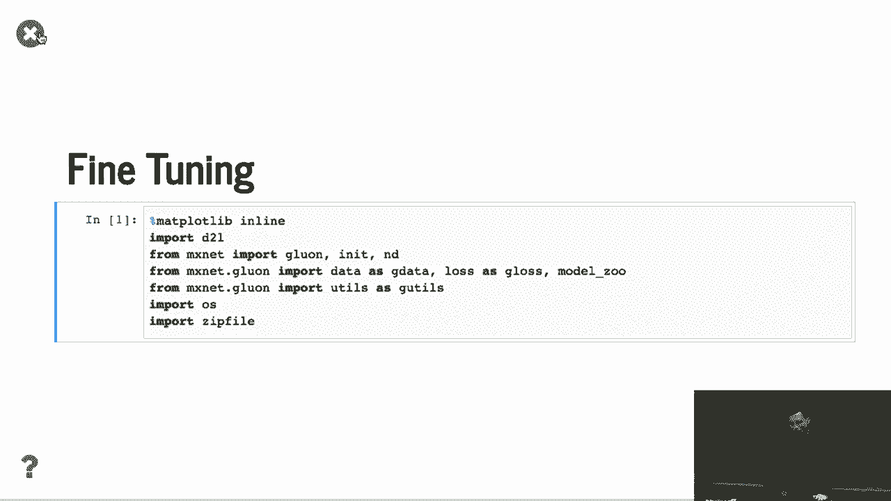

 scale you're going to have for communication。 Okay， first of all， import the library。 and we double small dataset。 It's called Harddog recognition。 Well， you can see that it's on the。 it's on right on the web。 What we do here， we just Google Harddog。 and Google some other things similar to Harddog and present。

 and just spend the afternoon to get the dataset。 So you can see that we download the dataset。 just extract all these images。 You can see the folder contains a training folder， a test folder。 the training folder have two subfolders， a harddog， not harddog。 Even folder contains a bunch of JPEGs and test datasets similarly。

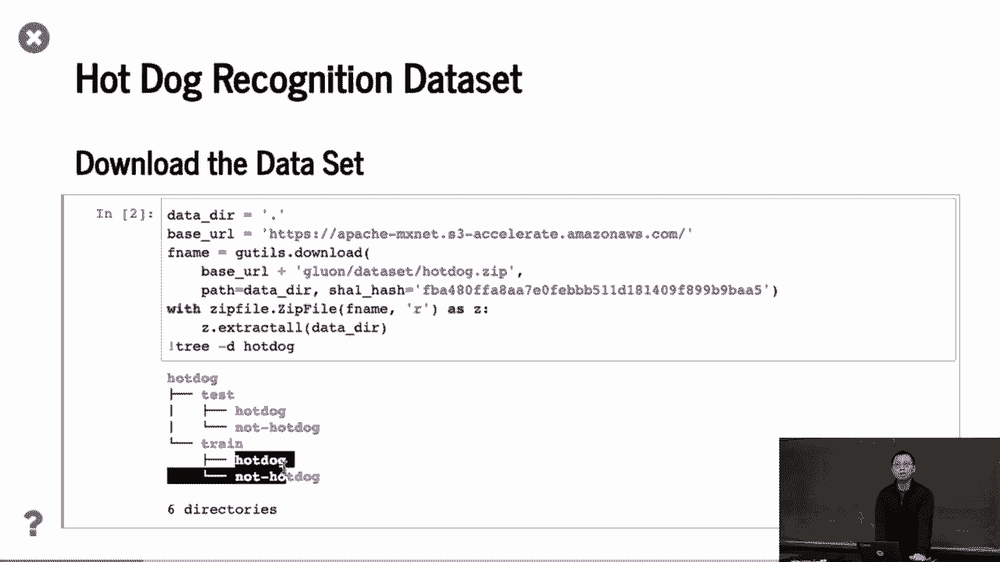

 Then， well， we can do here。

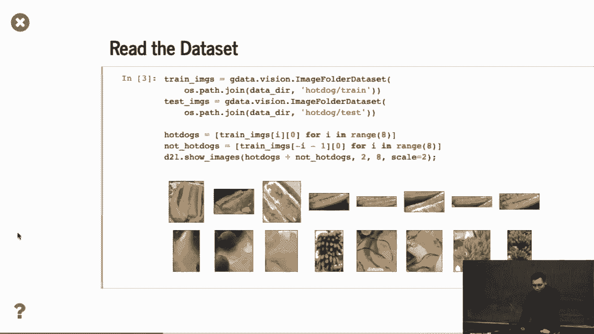

 we can train the image， we already know that image folder dataset through the harddog。 train and also test the images that we visualize all the things。 So you can see that the first row is harddogs。 The second row is not harddogs， pretty similar。 The bananas。 (laughter)， Well， something else， like you also。

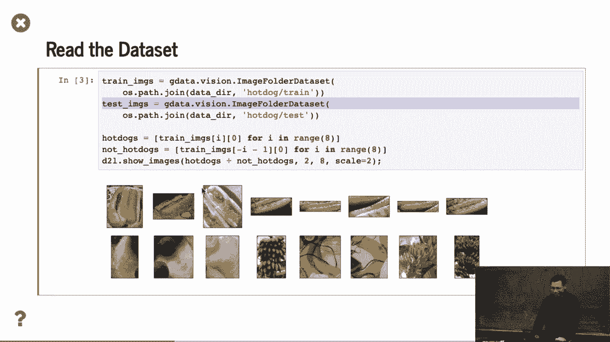

 but pretty similar things。 Okay， then， the image augmentation is here。

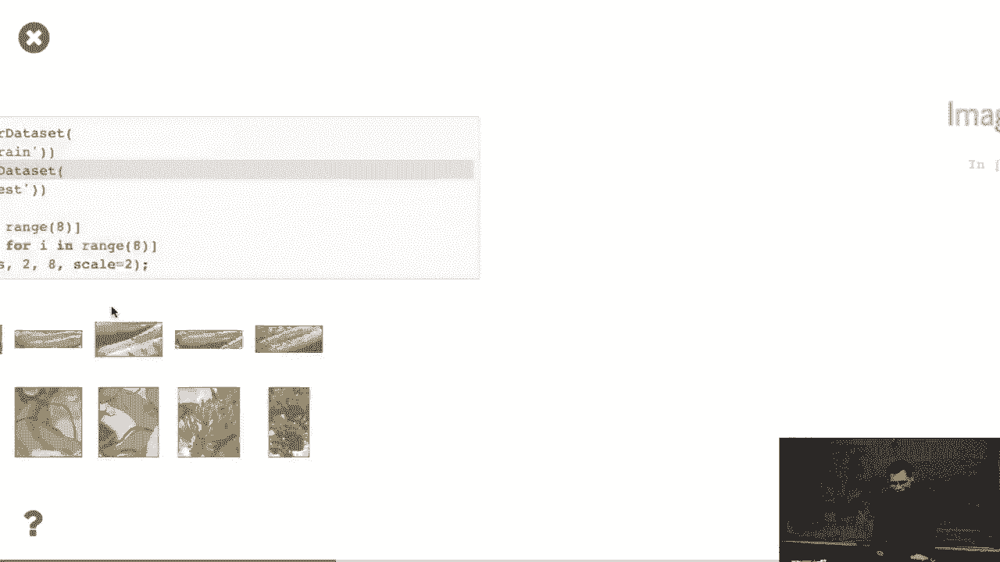

 We already talked about that before。 Firstly， we normalize the RGB channels。 So we have the meaning of the RGB channels and the values of the RGB。 So this value is from the image net。 Just on the starting from 80 years ago。 people are using these values。 We never sought to verify these values， but just a copy here。

 Because the pre-channel models are trained with these values， so you don't want to change it。 That the thing。 But I heard this from image net， but I don't know actually。 Then， transformations。 what they do， you randomly size， because it's larger images to--， 4。2。4。4。 This is the default one we train with image net。 Also do a lot of leap of flipping and two tensors。

 converting to the layers convolutional neural network 1/2， and normalize to RGB channels。 For the test dataset， we just resize to a reasonable shape。 256 is also like from image net。 At the original day， Alex said what Alex is doing is like--。 they first resized the image to this shape。 So that we just keep this value here。

 And do a central crop， which means we are not doing random， crop。 We just crop the central area to get the validation。 So the reason is because we don't want to have any， randomizations here to get the reliable results。 Then， lastly， two tensor and normalize the output。 So， OK， question。

 What does assuming the hot dogs in the center are they painted？ Yes。 so the question that if the hot dog is not centered， is maybe in the corner， what happened？ Well。 this is not image classification program。 Then this object detection we're going to talk about。 in maybe 10 minutes。 So image classification， we assume。

 damage contains the main projects on the center。 Maybe not exactly on the center， but it only。 contains the main objects。 Yeah， I mean for the documentation of how you should。 have labeled like states the same。 If the hot dog is in the corner you crop， then the。 like boat should be like bolts。 OK， so the reason is because the random resized crop is。

 kind of guaranteed that you don't pick up two small areas。 Even if you're not luckily the crop you have doesn't， condense an object。 you think about just a random noise。 It give a fake， fake， input training image into a network。 It's just a noise。 Usually the neural networks stay way enough to handle all， these noises you have。

 Even for image net， I don't know image net， what the error rate， because you are labeled by human。 There are lots of arrows usually。 Image net is pretty good。 And the other data side maybe contains a lot of arrows。 The reason is because you send images to。 a connector， a turd， and ask the other guy to label for you。

 They usually something just close their eyes to label things。 The reason is because， well， you are。 be paid for how many images you are labeled。 It's really hard to guarantee the quality。 So it's our job。 We care about the application to guarantee the quality。 But if we didn't do a good job， the data， said we had a lot of noises in that thing。

 I remember they did benchmark 10% to 5% wrong labeling， in the data set。 That's pretty normal。 Then。 well， here's the thing。

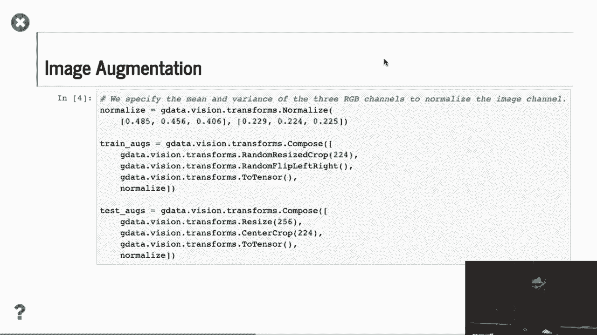

 We download the pre-trained model from the model zoo。 So model zoo vision。 ResNet is the second version of ResNet， 18。 We specify pre-trained equals 2， 2， which。 we get the network and download the pre-trained weight， from the web。 So this one。 we are contains both the model definition， and all the pre-trained weights。

 So you can see that the pre-trained weight， has a dot output， which is the last layer。 You also have the features， which is the backbone feature， instructors。 So what do we do here is that because the hard-out classification。

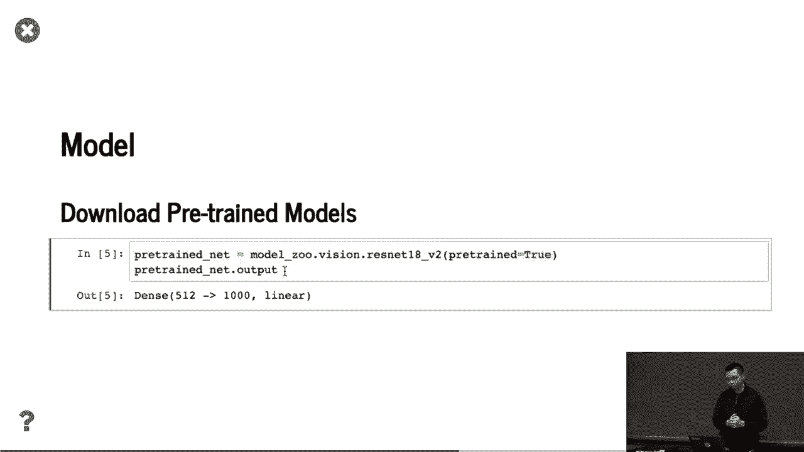

 we only have two classes。 So we， again， we grab the same model from the model zoo。 but without all this pre-trained weight， we specify the number of classes equal to 2， which。 is the same feature instructors， but the last layer， only have the hinders size equal to 2。 Then what we do here， we copy the weight from the features。

 which is all these layers except for the last one， to my fine-tuned net。 Then for the last classifier， we just， randomly initialize it。 It's a get layer initialize with the random initializer。 And one thing you maybe do。 you can skip it if you want。 The thing is like for the last layer。

 we set the linearity multiplier to 10， so which means if we give linearity 0。0 to the net walk。 then the last layer is we're going to train， with the larger linearity rate by 10 times larger。 which is what？ Do you know the reason why？ The question is like。 why we will have a larger linear rate， for the last layer？

 Because the previous layers have been pretty well trained。 You want to move larger pairs for the last layer。 It's quickly new。 You want to have a larger linearity， able to have a fast purchase。 Yes。 because the feature instructors already， are in a good shape。

 It's already very close to the final position。 But the last layer is randomly initialized。 You want this far away。

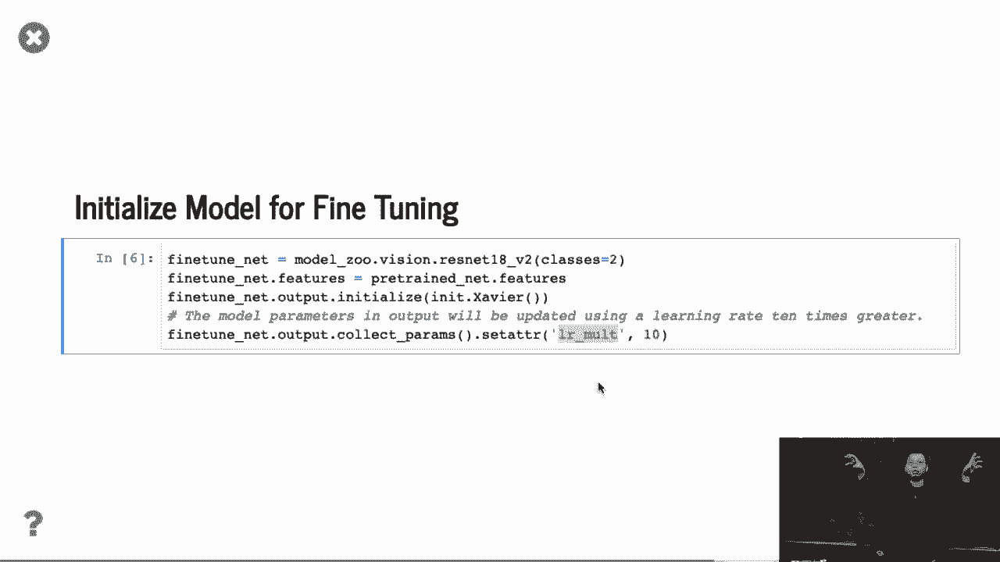

 You want to converge faster at the end。 OK。

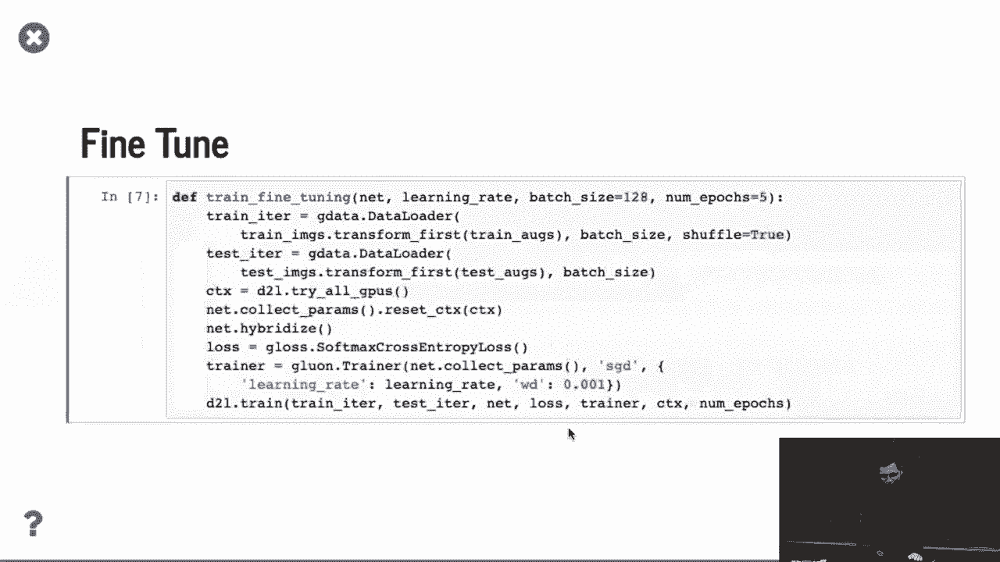

 Then fine-tuning， nothing， no different compared， to what we had before。 We get the data loader。 get the context， trying to use all GPUs。 That's one thing。 We talk about using all GPUs。 And we said to all the GPUs we have， because we copied the parameters initialized。 from the CPUs in default and hybridized make it faster， get the loss function， get the trainer。

 So that is nothing particular new。

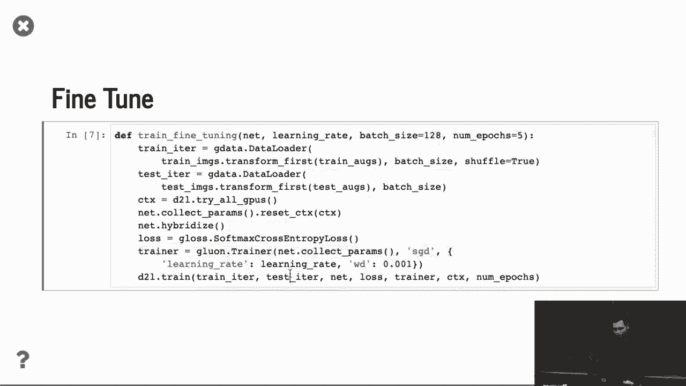

 We can specify the linearity here。

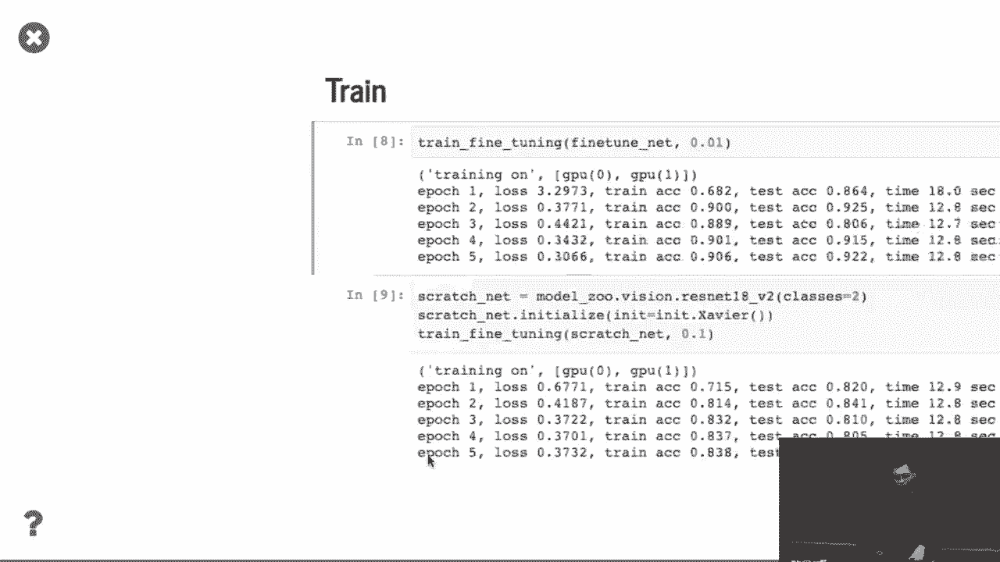

 And I showed the results pretty quickly。 For fine-tuning， we start with a very small linearity， 0。01。 And you can see that well， converge。 Well， it's hard to say fast or slow。 but let's see transform scratch。 So this is scratch net。 We just grabbed the network。 Randomized-- I randomly initialized all the parameters， and the trend with a larger linearity， 0。1。

 So you can see that compared the training accuracy， so this is 0。9， 0。9， and this is 0。8。 And especially over here， the test accuracy， is much higher， which test accuracy even higher。 compared to the training accuracy。 Because training， we have a lot of data limitations。 which is decreased accuracy。 And for here， it's 0。1 difference here。 Also。

 even if we are using smaller linearity， it actually converge faster than comparing。 to the training for scratch。 Because while we are already on the original shape。 it's much easier to converge。 OK， any questions？ Good。 For the homework， we're going to try。 grab ImageNet， to train 100 dots like a subset of ImageNet。 [BLANK_AUDIO]。

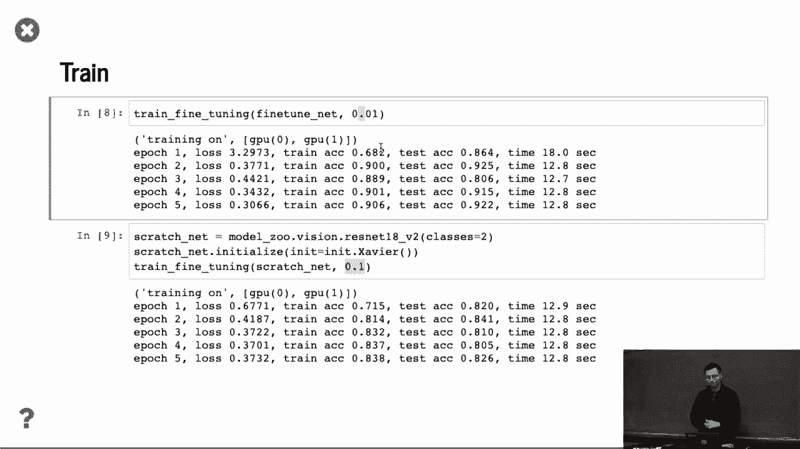