# P86：86. L16_1 物体检测 - Python小能 - BV1CB4y1U7P6

所以在图像分类中，我们试图识别图像中的主要物体。通常我们假设这张图像只包含一个物体，一个大的物体。但对于物体检测，我们尝试在一张图像中抓取所有这些有趣的物体。所以这里有两个点，一个有。此外，我们不仅知道有什么物体，我们还想知道这些物体的位置。

所以在这里我们使用的是矩形框。它被称为边界框，用来定义物体的位置。

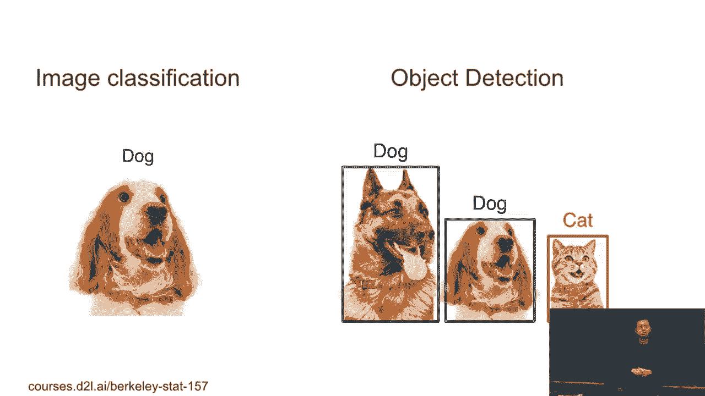

所以这实际上，特别是对一组自动驾驶汽车来说非常感兴趣。我们想拍摄街道的照片并尝试识别所有的汽车。你会看到有一个人，那个自行车，他们在这里识别了两辆自行车。这里有一个交通灯。所以这是我们感兴趣的一个物体——一辆车，人类，交通灯。

还有一些我们不太感兴趣的物体，特别是对自动驾驶汽车来说。因此我们只识别少数几个物体。我们可以看到，实际上这相当困难。首先，交通灯并不容易识别，即使是人类。还有他们在卡车后面找到了一个车。对于人类来说，这也很难注意到。所以嗯。

你可以看到最初是如何标注数据集的。让我们想想标注的过程。现在你看到一张图像，你知道图像中的物体。但现在你交给标注员或者你自己。这就是你想要标注的图像，你需要在图像中标出许多东西。特别是那些小车、小物件、交通灯。标注物体检测其实是非常困难的。

所以这也让它变得更难。现实情况是，你并不是提供一张静态的图像，你只是提供一段视频。如果车在街上行驶，你希望继续识别所有这些物体，并且处理损坏的情况。所以这意味着我们不能提供吞吐量，尤其是当你开车时。

你不希望拥有非常强大的GPU，因为你会烧掉你的油或者烧掉你的钱，实际上。并且这会让车变得非常热。你不能让车过热。那你就需要在车内装空调。问题是，GPU是在街道上训练吗？不是在观众中？你觉得舒服吗？

训练和推理对于GPU来说都非常高效。一旦网络足够大。所以如果你把GPU放进车里，你会遇到温度问题。如果你想降低温度，你需要空调，这会消耗更多的油。但如果你不关心温度，GPU会烧坏，而司机还在开车。

在路中间。它已经烧坏了，无法继续运行。所以这意味着物体检测会更困难。你需要非常关注推理速度。好了，先从基本概念开始。框，边界框和锚框。这个是我们从图像分类中得到的新概念。

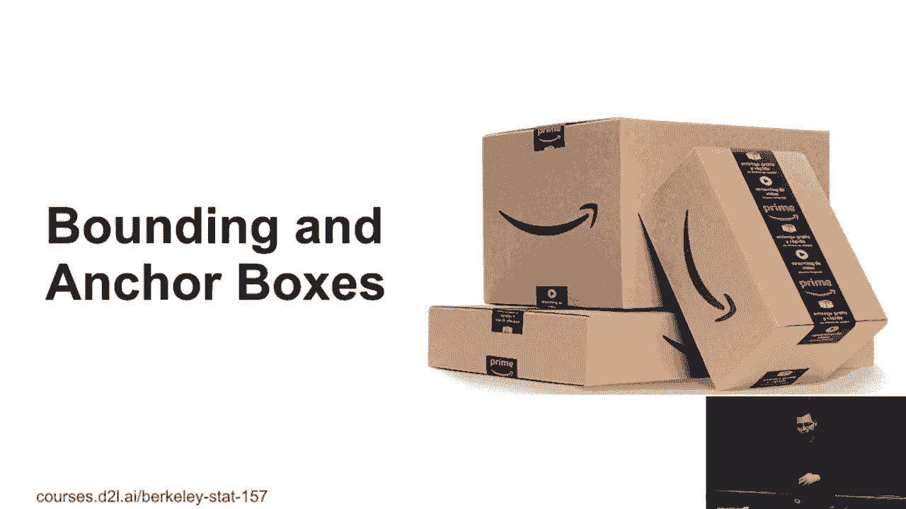

围绕框可以通过矩形定义。你可以，嗯，至于为什么会有这样的东西，我不确定，你也可以有一个循环，更简单。这里，围绕框可以通过四个数字来定义。比如说，你可以通过左上角 x，左上角 y，右下角 x，右下角 y 来定义。举个例子。

在这张图片中，原点位于左上角。所以零，零在左上角。你可以看到我们可以通过 60 来定义这个框。x 轴是 60，y 轴是 45，右下角的坐标也是如此。好的。另一方面，你也可以通过左上角 x，右上角 y，围绕框的宽度和高度来定义。

框和围绕框的高度也是如此。但无论如何，这只是四个数字。

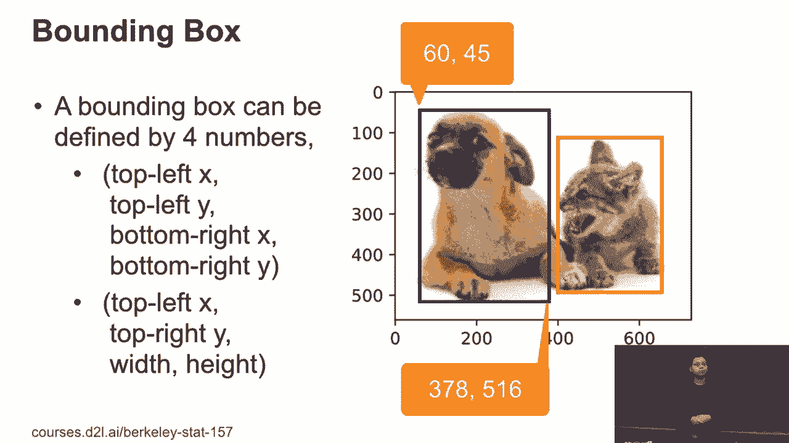

好的。那么，目标检测做的事情看起来是，现在每一行的底部，不仅仅是图片和你拥有的对象。现在，每一行都在识别图片中的一个对象。例如，你可以指定图片文件名和对象类别，以及对象的围绕框。这意味着如果你有很少的图片。

你可能有十倍以上的对象，每个对象就是你拥有的训练样本。例如，最大的公共数据集叫做 coco。三年前，如果是 coco，你得到的第一个结果是数据集，如今，你得到了电影。所以，我确实有，嗯，有学生问，好吧，如何在 coco 上训练网络，然后用电影数据集进行测试，怎么开始。

嗯，所以 coco 数据集有 80 个对象。这个是比较日常生活中的对象。与包含很多你从未见过的动物的 ImageNet 数据集相比，更加有用。此外，图片数量较少。目前只有 3,300,000 张图片，比 ImageNet 少。但平均而言，我们每张图片中有 4 个对象。

所以我们在这个数据集中大约有 150 万个对象。通常一百万是个不错的数字。一百万大小的数据集通常可以处理合理的深度学习模型。如果是两百万，十百万，四个图片有一千万张图片，那就很难训练了。如果只有十万个图片或者样本，那就太少了，你需要进行微调。

所以更多的图片很好，让一台单独的 GP 机器花费几小时到几天。这个是可以管理的。

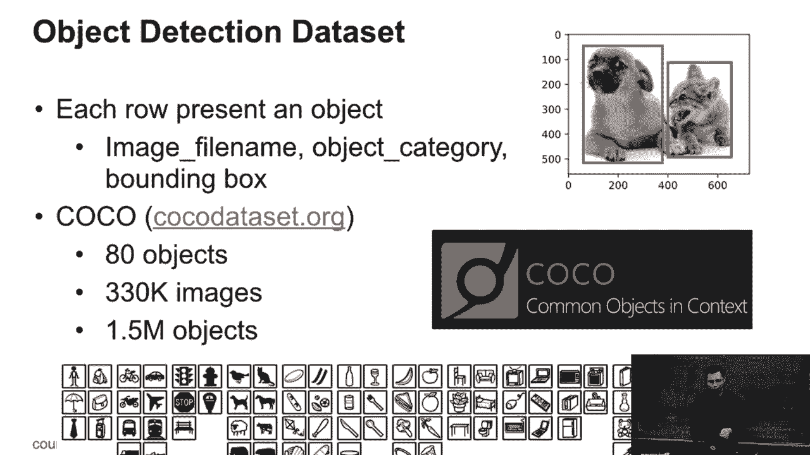

好的。接下来，另一个概念叫做锚框。嗯，这个名字比较随意。但你可以理解，这里的想法是，在所有检测算法中，如何与分类不同，我们想要预测的是边界框。你在这里做的是什么？

该算法通常首先提出多个区域。我们将每个区域称为锚框。例如，这里我们有一张图片。我们在单个像素处展示了四个锚框。每个锚框的大小、宽高比都不同。所以，锚框将提出多个锚框。然后，对于每个锚框。

我们将预测这个锚框是否包含物体，还是仅仅是背景。如果我们预测包含物体，那么我们将预测如何将这个锚框映射到真实的、标注过的、实际的边界框。所以这是一个选择。因此我们只需预测四个数字的偏移量，即另四个数字。

数量转移这个锚框到边界框。因此，不同的检测算法有不同的方式来提出所有这些锚框，并且给定一个锚框如何预测标签，如何预测类别，如何预测物体类别，如何预测偏移量。但一般来说，它们都是按这种方式工作。有什么问题吗？

取决于算法。例如，我们将讨论 SSDs。对于每个图像，提出 10,000 个锚框。对于不同的算法，通常，我们将讨论第一个 RCM 系列。它也提出了成千上万个锚框，但会进行优化以减少到几百个。即使是快速算法也在尝试减少锚框的数量。

你会看到，提出的越多，覆盖率可能会越高，因为提出的越多，覆盖所有物体的可能性越大。但是你提出的越多，竞争也就越激烈。所以这是一个权衡问题。我们没有每个框的真实标签，但我们有标签。

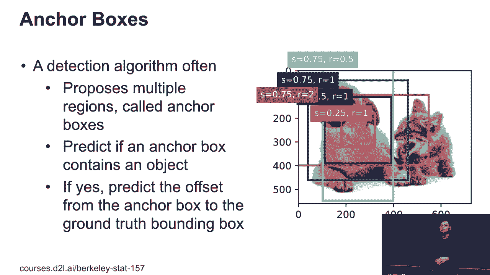

所以这里，其他的东西都是框。但通过边界框，我们指的是真实值，这是人工标注的。

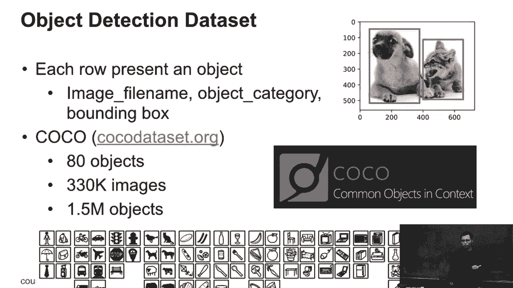

锚框仅由算法提出。那么接下来我们将讨论如何将锚框映射到真实值。如何连接它们？

还有其他问题吗？锚框会发生什么？好的。所以给定锚框，你有四个数字来表示锚框。这四个数字。一个边界框也是四个数字。所以你想预测如何将这四个数字变为另四个数字。我们只是偏移这些数字。锚框加上偏移量等于边界框。

或者说边界框的数字减去锚框，你得到偏移量。>> 有没有什么东西会让它变得过于回归？>> 是的。因为它是一个实数，挺奇怪的。我们最终是在做回归。好的。还有其他问题吗？这个概念有变化吗？

就像是设置或那些东西。好吧。那么，所有这些困难都集中在框上。我们无法再深入讨论框。

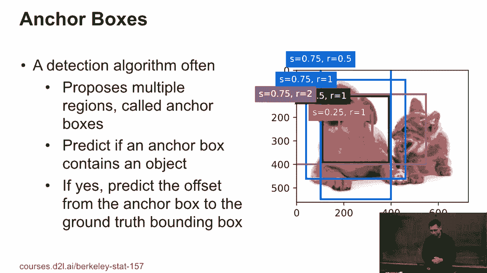

首先，如何衡量两个框之间的相似度？在分类中，我们知道它是真还是假。但对于框，我们通常会使用 IOU，它叫做交并比。其原理是计算两个边界框的交集，并将其除以并集。

这两个边界框的并集。所以这是我们得到的一个值，介于零到一之间。零意味着这两个边界框完全不重叠，而一或零意味着它们完全相等。所以越接近一，这两个框就越相似。所以IOU被称为，嗯，我们是被物体检测社区接受的。

它实际上是JACART指数的一个特例。所以给定两个集合A和B，可以通过计算集合A和B的交集大小，以及集合A和B的并集大小来计算该指数。所以如果我们将边界框看作是一组像素，并且每个像素元素都在该集合中。

你可以认为这里是一个简单的应用。

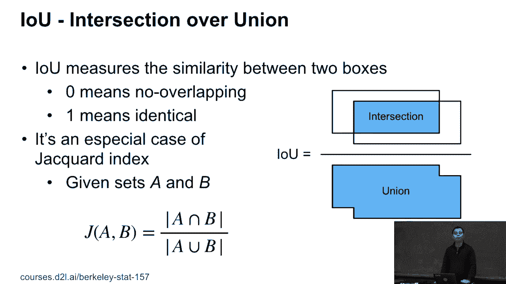

另一个事情是，嗯，在训练过程中，算法提出了一堆锚框。然后你需要为这些锚框获取标签。所以我们在映射中将所有这些标记的边界框映射到锚框上。因此，在训练过程中，每个锚框都是一个训练示例，我们需要将其与物体关联。

锚框要么作为背景出现。因此，在边界框中我们没有背景。但锚框因为我们是随机选择的，所以可能没有物体。因此它只是一个叫做背景的特殊类别。并且所有这些都与边界框和物体相关联。

所以现在我们可以讨论如何将边界框与锚框关联，但你可以看到我们可能生成更多的锚框。而其中只有一小部分包含了我们有的物体。更多的物体只是背景。而且，如何处理这个问题呢？这就是一个不平衡的分类问题，如何使其可训练是相当困难的。

好的，那么在这里我们来看看如何将锚框与边界框匹配的典型方法。每一行表示一个锚框，每一列表示一个边界框。所以在这里我们有四个边界框，但有九个锚框。通常锚框比边界框大，我们的锚框数量比边界框多。

所以这里的每个元素是锚框与边界框的IOU分数。明白了吗？

那么我们首先做什么呢？我们找到最大的分数。例如这里最大的分数是锚框二和边界框三。因此，我们将边界框三分配给锚框二，这意味着锚框二包含在边界框上的物体，并且偏移量是如何的具体偏移。

这仅仅是这两个框之间的差异。我们做完之后，就会在集合中移除边界框三和锚框二。所以我们只标记它为空白。这样下次我们就不能考虑所有这些IOU值。接下来，我们将在所有这些蓝色单元格中选择最大的那个。那就是锚框。

锚框七与边界框一匹配。这是我们可以得到的最大的IOU值。然后我们将边界框一分配给锚框七。好的？然后我们移除边界框一。移除边界框集合中的三个框，以及锚框中的两个和七。接着重复这个过程，得到边界框四与锚框五的匹配。

我们会重复直到没有边界框剩余。然后其余的锚框我们就标记为背景框。这样我们就完成了标注。好，大家有什么问题吗？问题。>> 如何知道你标注的框是正确的吗？ >> 嗯，你不知道。这取决于它们是如何标注的。例如，你是想知道我们会使用所有这些框吗？

我们会将所有的边界框与锚框进行匹配。如果不能匹配，那么你提出的边界框可能就不是一个好主意。但边界框是会变化的。比如有一个主框可能会测试两个，或者可能有一些是较大的。如果你正在绘制标签的4K图像。

比如4K视频中，图像中可能有10到50个物体。好的。

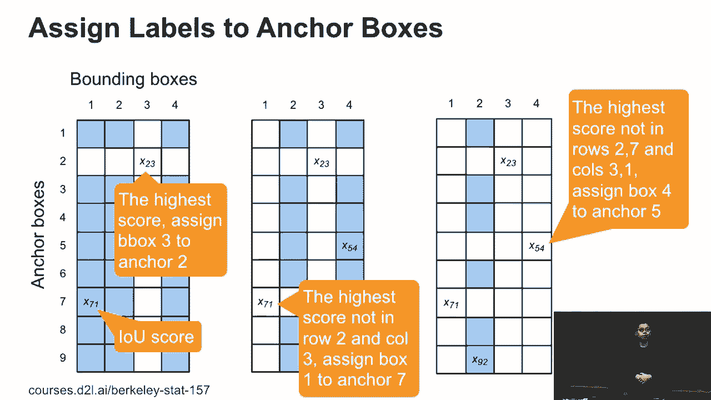

然后其他的内容像是现在在预测中，每个锚框我们会生成一个边界框预测。所以这意味着还有偏移量。这意味着我们可能会得到很多非常相似的边界框。例如，在这个文档中，我们生成的每个框实际上都是带有偏移量的锚框。

它非常接近后面的框。但我们在这里有三个预测，这意味着概率。在这个概率下，算法认为这是一个正例框。所以我们想减少所有这些重复的框。一个典型的方法叫做最大值抑制（MS）。这是另一个检测集的技术术语。实际上它是一个简单的算法。

我们做的事情与之前的非常相似。那么我们在这里做什么呢？

给定一组预测，我们选择概率得分最大的那个。这意味着我可以几乎确定它是狗还是猫，取决于情况。例如，我们会选择概率为0.9的蓝色框。然后我们会移除所有这些其他具有IOU的预测。

根据一个阈值进行比较，比如我选择的theta等于0.5。你应该能移除所有其他两个狗的预测。我会移除它们，然后在剩余的框中选择最大的一个。然后移除重复的框。接着我们重复这个过程，在这里我们选择或者不选择。

移除所有这些预测。所以最终你会看到我们将得到两个边界框。好的，有问题吗？问题？>> [无法听清]，>> 你是说0.9是什么意思？ >> 是什么意思？ >> 哦，你是说这个特定的例子吗？ >> 是的。 >> 我可以在几分钟内展示给你。我不记得了，但我可以向你展示，这实际上来自源代码。我想是0。

我想这里是5。

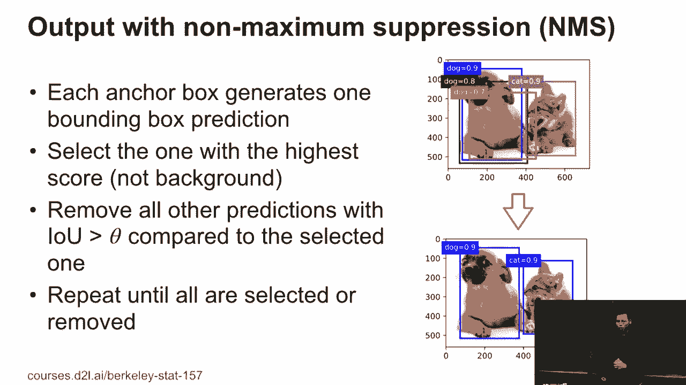

好的，所以。

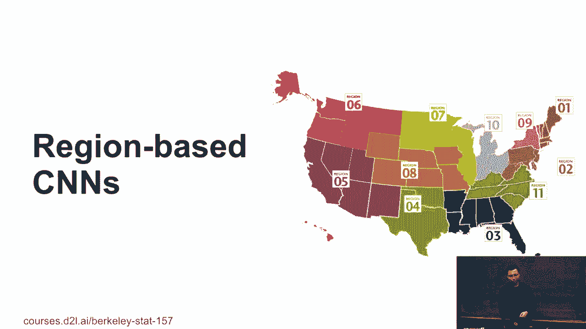
