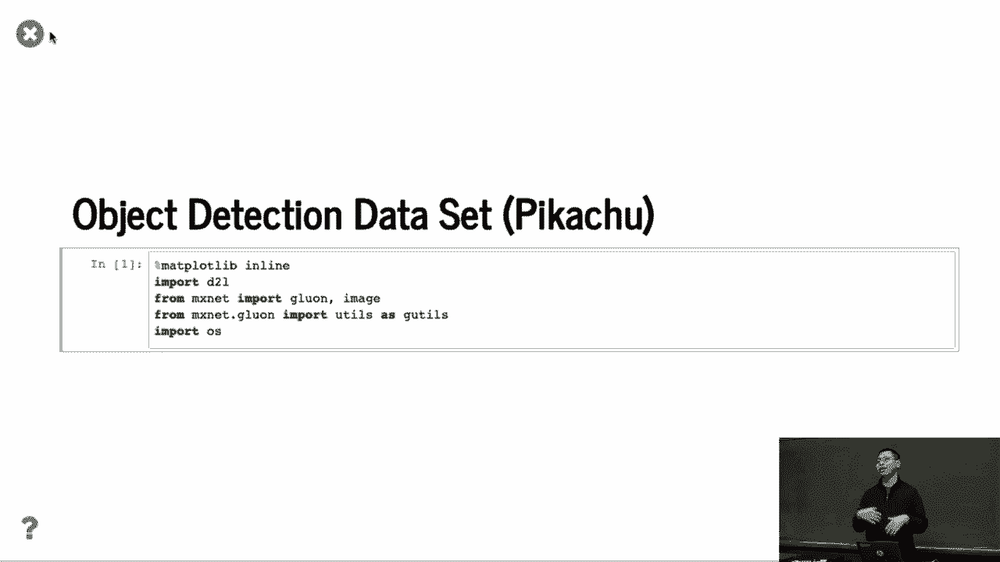
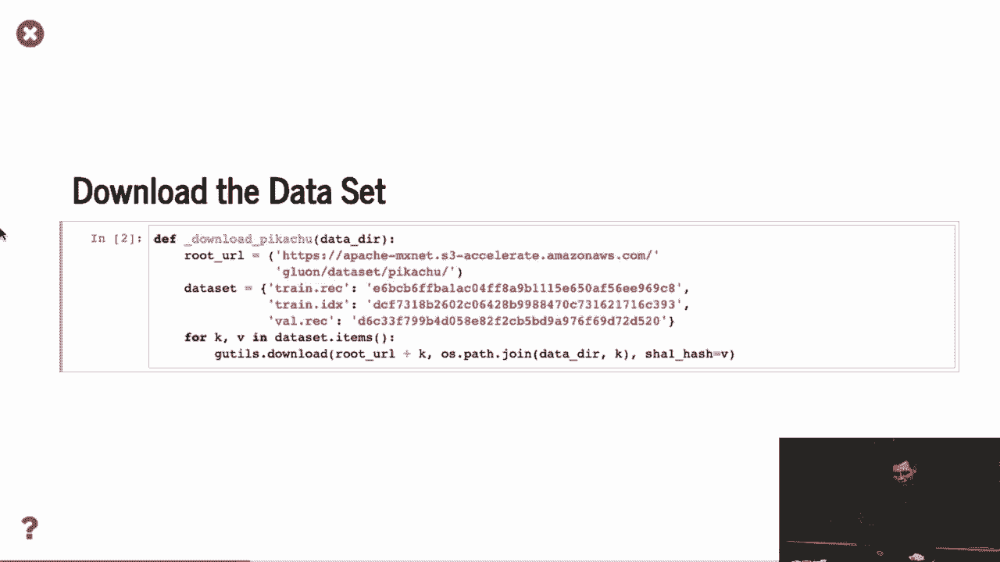
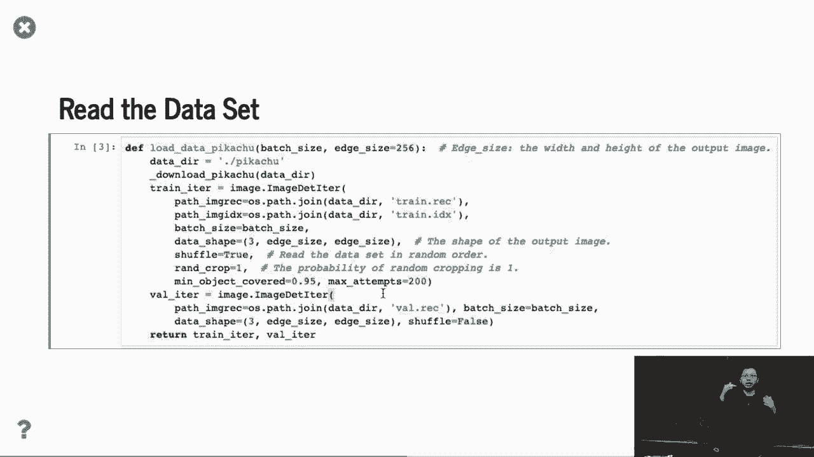
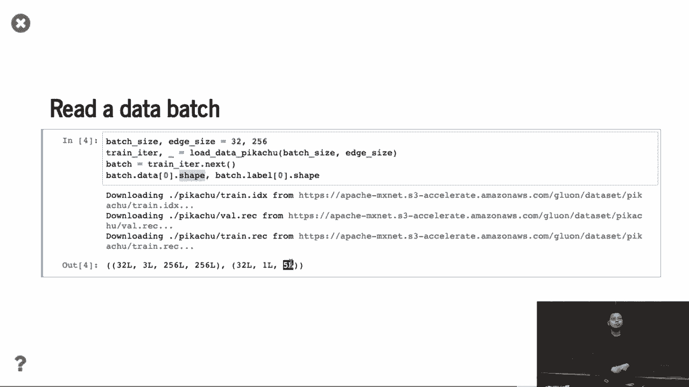

# P88：88. L16_3 物体检测数据集 - Python小能 - BV1CB4y1U7P6

好的，与图像分类不同，遗憾的是没有小规模的物体检测数据集。所以这意味着你无法获得C文件，在课程中尝试使用。

那我们在这里做什么呢？我们只是展示如何制作一个合成数据集，用于物体检测。所以我们实际上是从网上下载了数据集。

所以在这里，我们使用了不同的数据迭代器。与图像分类中的迭代器不同。用户数据集是一个文件记录，将所有这些图像放在一起。然后将所有图像切割成单独的二进制文件。通常会使训练更高效，读取速度也更快。

你不需要读取那些小文件。你读取的是大量数据块。然后我们告诉他们数据形状，进行随机洗牌，随机裁剪，嗯，这里有一个不同的地方。你做随机裁剪，是的，但你可能会裁剪到只剩下背景的部分。所以这里展示的是，我只是。

我想对至少包含内容物体的部分进行随机裁剪，覆盖90%，覆盖原始物体。并且物体的面积达到95%。如果没有，我就把它丢掉，并重复200次。所以这和如何进行图像分类的随机裁剪有点不同。图像分类，我假设它不会那么大。你总是不能裁剪，得到其中的一部分。

然后，接下来我基本上会跳过数据集的部分。那么你可以看到这里，它是一个批次，数据的零形状与图像相同。批次大小为32。这个是RGB通道。这是高度。好的，所以这里是批次大小。所以这是图像中的物体数量。所以这里，我们很简单，每个图像只包含。

单一物体，但它包含了10个物体。所以这就是10个。然后第一个是分类ID，最后四个只是边框。与图像分类相比，如果你仅仅进行图像分类，你没有这样的东西。你不会使用类似32×1的标注。但是对于物体检测，你需要使用。

所以这是每张图像中的最大物体数量，通常是五个。好吗？

展示的效果是什么样子呢？嗯，效果挺好，我们做的是，下载了3D皮卡丘模型，并进行旋转渲染，抓取了一堆图像和自然图像，并将皮卡丘放入其中。因为我们知道边框，我们知道放置皮卡丘的位置，我们始终知道边框的位置。

所以这是一个我们可以很容易得到的数据集。所以这就是我们称之为“数据集”的原因。你可以看到，效果很好，嗯，简单的方法就是查看RGB直方图。你可以直接进行物体检测。你不需要做复杂的事情，因为我们知道，这个是非常黄色的。我们做了很多图像补丁，并计算了计算机直方图。但我们就用这个来展示。

如何尝试物体检测。嗯，是的，我们可以做更多高级的事情，所以你可以再试一次。实际上，议程图像更接近真实的图像。好吗？[BLANK_AUDIO]。
