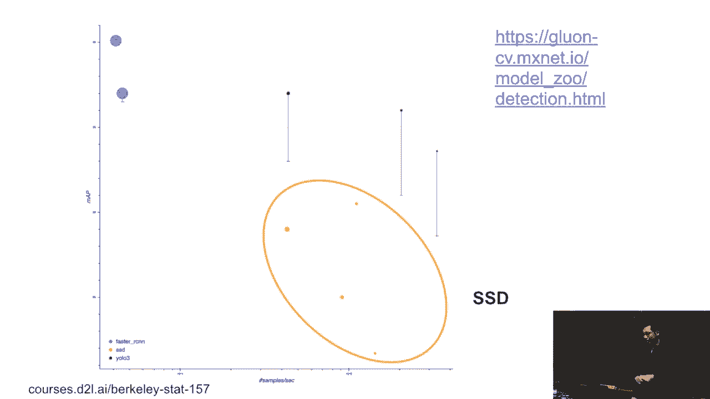
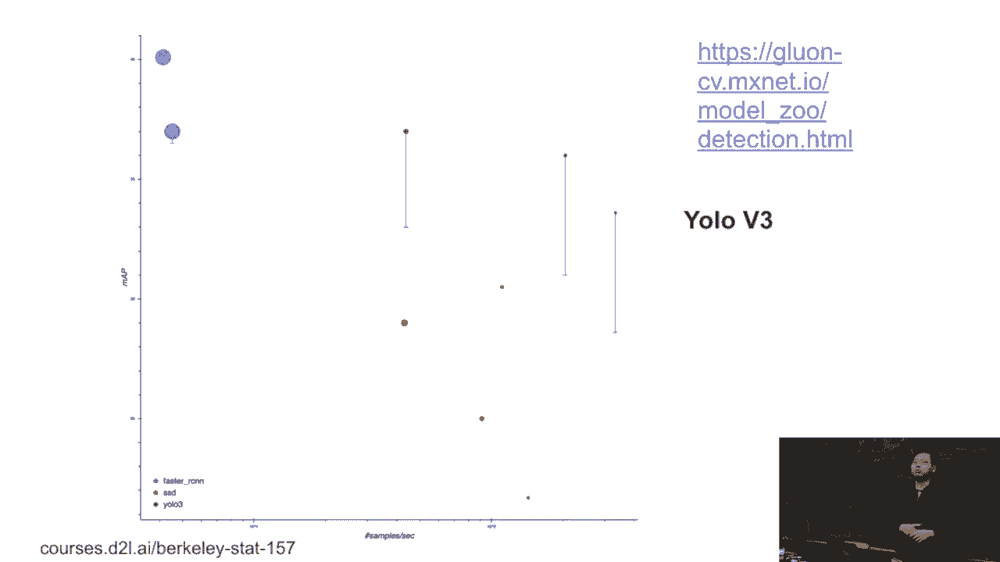

# P90：90. L16_5 SSD 和 YOLO - Python小能 - BV1CB4y1U7P6

所以首先我们来谈谈 SSD。它被称为单次检测，多框检测。这个概念其实很简单。所以 RCNN 和 SSD 之间的主要区别在于边框是如何生成的。在 RCNN 系列中，我们有一个复杂的算法来生成边框，以便我们希望边框能够尽可能覆盖更多内容。对于 SSD。

它要简单得多。所以在 SSD 中，对于每一个像素，我们可以生成多个边框并以此像素为中心。多重意味着我们给定不同的大小、不同的形状、不同的比例。例如，如果我们给定 N 种大小，从 S1 到 SN，再给定 M 种比例，从 R1 到 RM。

所以大小意味着相对于原始图像的大小。比例是宽度与高度。所以这里的想法是生成 M 加 M 减 1 的锚框。所以它不是 N 乘 M，而是 M 加 M 减 1。生成锚框的方式是首先选择第一个比例 R1，然后改变大小从 S1 到 SN。这是前 N 个框。

然后我们将固定 S1，这是大小，然后改变比例从 R1 到 RM。我们已经为 R2 到 RM 做好准备。所以总的来说，我们有 N 加 M 减 1。之所以不做 N 加 M，是因为这意味着给定任何形状、任何大小和任何比例，我们都会生成一个锚框。这是因为可能会给你太多。

比如，如果你选择 N 等于 10，M 等于 10，那就会给你 100 个锚框。这就意味着每个像素都有 100 个锚框。如果是 100x100 的图像，你将得到 10K 个像素，另外 10K 个锚框，那么你的内存就会用完。所以这是一个权衡。我们希望调整大小和比例，并生成它们的线性组合。好的。

所以整个模型是这样的。我们首先输入一张图片。将其输入到基础网络中。基础网络进行特征提取。你可以选择 SSD，也可以选择 ResNet，或者选择任何一个作为基础网络。然后基础网络将输出一个小的特征图，类似于 32x32 的特征图。然后给定这个特征图。

我们生成的是锚框。对于每一个锚框，我们都会进行类别预测和边框预测。这里的另一个特点是，我们有多框或多尺度。就像基础网络给你可能是 32x32 的特征图。然后可以进一步得到宽度和高度。然后在降低特征图时。

我将生成另一批锚框，然后进行另一次类别预测和边框预测。我会多次进行。所以这里的基本思路是，底部是基础网络的输出，特征图依然是大的。所以我可以生成小的锚框来捕捉小物体。

在顶部，每次我们减少特征图的宽度和高度时，我们会生成稍微更大的锚框。所以我们可以尝试捕捉更大的物体。所以这里的主要区别是，我们不需要预测锚框的具体位置。然后对于每个像素，我们只生成一堆框。这样就使得整个流程更简单。

问题。我们不再学习显示的方面。我是说，或者大小，而是我们只是在使用不同的尺度，改变其增长。或者我意思是，我们只是有不同的 s，y 和 r1。是的。所以我们没有线性算法来预测锚框的位置。

我们只需要挑选不同的 s1 和 r1，这样我们就能捕捉到所有这些不同的形状。所以这些超参数。我们可以展示给你们，通常我们是如何选择这些超参数的。但你会看到有很多重叠。确实如此。我们可以看到如何让分类器和预测器更加高效地处理这些问题。

所以这就是 SST。另一个。你可以看到这是 SST 的表现。X 轴是吞吐量，每秒 mh 数量。Y 轴是准确度，你可以理解为准确度。我们可以尽量向右上角走，越高越好。所以你可以看到，SST 比较快，可以指向黄色的那些，和蓝色的相比。嗯，准确度是可以接受的。就像 SST 是 2。

三年前，或者两三年前，算法。所以你总会看到我们无法展示一点点的，皮革。这是去年。所以当时 SST 在速度上超越了 Fast-Dossy 和很多家庭。但他们牺牲了准确度，但当时人们仍然在使用它。

特别是在更快的推理时。问题？[INAUDIBLE]，[INAUDIBLE]，好吧，我是两者兼顾。我们可以讨论什么是地图皮革。好的。

所以另一个是黄色的。不是，绿色的。它叫做黄色。你只看一个。这是前置 UW 的一种方式。

这个想法很简单。我们没有深入探讨这个家族。这个想法就像 SST。所有这些锚框只是高度重叠。对于每个像素，附近的像素，我们生成一堆几乎要重叠的锚框。为了你们的法则，我们不希望锚框重叠太多。它的做法是，给一个输入图像。

给一个输入特征图。我甚至可以将其按 S 行和 S 列划分，你生成的是 S 乘以锚框。所以每个框都没有重叠。然后对于每个锚框，我们可以预测边界框。因为我们减少了大量的锚框。也许我们有更多的边界框。

但是对于每个锚框，我们可以预测B。通常你希望它是一个边界框。所以这是一个基本的想法。这就是为什么你只需要寻找一个。也就是说，锚框将不会重叠。我不会详细讲解——你将会看到V2，有V3。基本上，它会与SST非常不同，但V2与SST非常接近。

Fast-out C和所有这些家族非常接近。如何进行预测，如何进行类别预测，如何进行边界框预测，它们彼此非常接近。而V3增加了另一个微小的改进。但基本思想是，它会让速度更快。所以你可以看到那个u-lock，绿色的那个，向右的那个，我认为它是两倍快。

可能比小型SST快1到0.2倍，1.5倍。但我们可以在此基础上做很多改进。

好的。
