# P91：91. L16_6 Bag of Tricks for CNN Training - Python小能 - BV1CB4y1U7P6

 So far we talk about the basic idea， how to get a network。

 how do you use a normal way how to train the network。 But if you just follow one by one。

 you're going to find， well， you never reproduce state-vort or results。 So if you read the paper。

 there's several tiny things mentioned there。 Actually， the tiny things matter a lot。

 For example， so this is a model zoo I just opened。

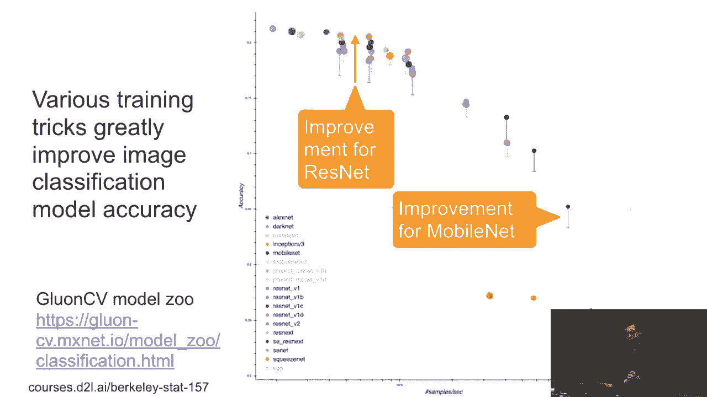

 Let me just open the model zoo here。

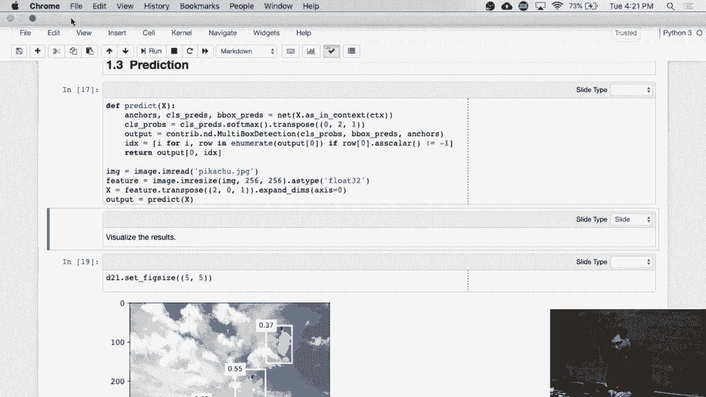

 So this is a model zoo we have。

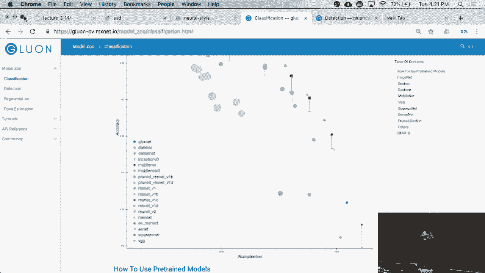

 It's still like the axis， the throughput， the wise axis， it's very much classification。

 So you can see every thing like， let me zoo。 Well， okay。 So this is the rest。

 let me pick a small one。 So this rest is not 100， let me be this typical one。 So less than 50。

 this is the typical one we have。 So you can see here， this is the thing， the bar here。 Actually。

 this is the accuracy reporting the paper。 Okay。 So then， you're adding a bunch of tricks。

 you can improve the accuracy a lot here。 So， so this is the adding a bunch of tricks。

 you can improve the accuracy from almost like 75 plus to， 77， 78。 Let me see the exact number。

 like 77。 From 75 to 77， like 2%。 That means our paper in CVPR， if we improve the net。

 we'll go by so much。 And so there's a bunch of other things like， this is a rest net， we two， well。

 this is a rest net， we want B， like we want C， we want this dark net， this is not a rest net。

 we want B， but we want B even much higher。 It's like 79% top of our accuracy。 So the baseline model。

 we have almost like 76 kinds of 75 plus reporting the page。 So a lot of tricks matters。 Actually。

 this trick is a tiny， it's almost giving you no overhead。

 but it actually improves the accuracy a lot。 So we will have a lot， briefly introduce something。

 similar thing for mobile net， for example， the mobile net， improve a lot， mobile net。

 another mobile net， improve a lot。 Similar thing we have for detections， like for ULA v3。

 original in the paper， ULA v3 is similar to SSC we have。 So this is a ULA v3 report in the paper。

 So almost like tiny bit improve the SSD， okay， they write the paperboard that。

 but actually apply a bunch of a trick， you can improve a lot here。 That's us。 I love tricks here。

 So okay。

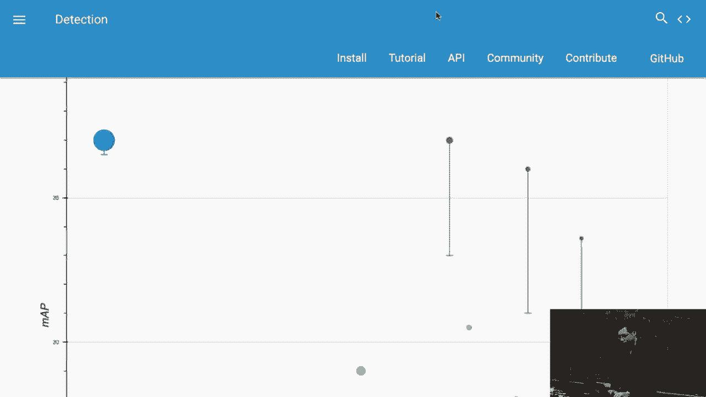

 So here we will briefly say something about the tricks， but you can see that like。

 there's always new tricks coming out every year， and if you read the paper。

 there's a lot of tiny space color。 Yeah， what's my set up， experiment set up。

 but even some thing just available in the code， you need to read the source code。

 and find all of the tricks there。 It's more even mentioned in the paper。 So。

 similar thing for ULA v3。

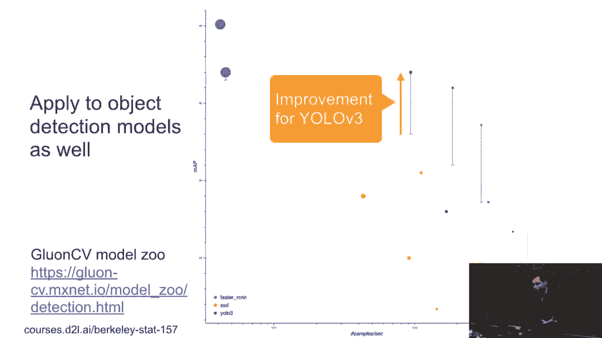

 So we can not briefly say some tricks。 I think we are think that's pretty useful。

 The first one is called mix up。 It's pretty weird data augmentation thing。 What I'm doing here。

 every time I write and select two examples。 I see examples of the JS example。

 And then I can sample random numbers number number， from zero and one。 What I do here。

 I will mix these two sample examples together， to get the new example。 So called X。

 so we do here is number the times XI， plus one minus number that times XJ。

 which is the linear combines the two examples。 Similar thing for the labels。

 which is the linear combine them。 So we get a new example called X and Y。 For the training。

 we only train all these mixed examples。 We can ignore this original example。

 So we have we train the new examples。 You can see that， okay， given clock， given a class。 So。

 this is the image。 And for the labels， we have one hearted encoding， which is zero， zero， zero。

 and tier one。 And our similar thing for the first one。

 We choose the number that equal to zero point line， and get the new image。

 Almost like almost the clock， but a little bit， like even how to see this little bit of glasses here。

 And the label here is zero point one， for the first。

 the glass and the zero point line for the clock。 Okay， so this pretty weird。

 You even get a lot of images， not human readable。

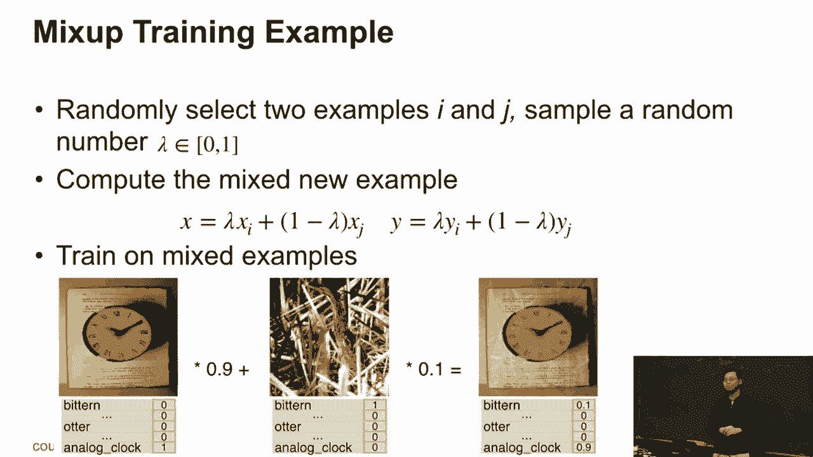

 Similar thing for the object detections， you can do， you can put all these image together。

 you can put the bond box together。 The only thing here。

 the object detection is pretty sensitive to the shape。 You want to preserve the input shape。

 Even you have different ratios， you want to preserve the geometry shapes here。

 So that the ratio is not messed up here。 So this is make two bond box for ship。

 and the ones for stop sign， and which together get us three bond boxers here。 Okay。

 so this is the one tiny trick。 The second one is called label smoothing。

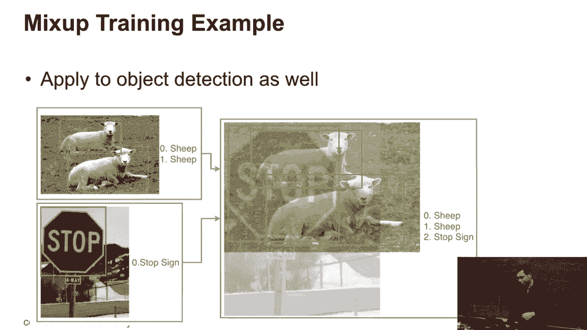

 So we know that we also use， one-hotting coating for the label。 So here。

 the Y is just the undimensional vector， and that is the number of classes we have。

 If this YI belongs to class I， Y equals to one， all the other things you could do zero。

 This is one-hotting coating of the label。 But we know that we are approximating。

 all this one-hotting coating using a softmax。 Softmax is pretty hard to approach zero or one。

 Either the input， the infinity or all the things are zero， you got the zero and the one。

 But in reality， you could not go to logic numbers。

 So it's really hard to approach either the zero or one。 The smoothed labelings give you like。

 I pick up a epsilon here。 For example， I choose epsilon equals 0。1。 And then if it's class。

 I use one minus epsilon。 Others， I just， epsilon divided by n plus one。 And then minus one。

 So that's still like， I can sum them together equals to one。 Steering probability。

 but it's kind of not just a two goes to one。 It's smoother version。

 So if it's just epsilon equals to zero one， then it's zero point line for the two classes。

 and small number less than 0。1 for negative classes。 So this number we have much。

 we make the softmax much easier to try。 This is a pretty standard trick。

 not just using on calibration， but also for like， I don't know， a piece as well。 Okay。

 so label smoothing。

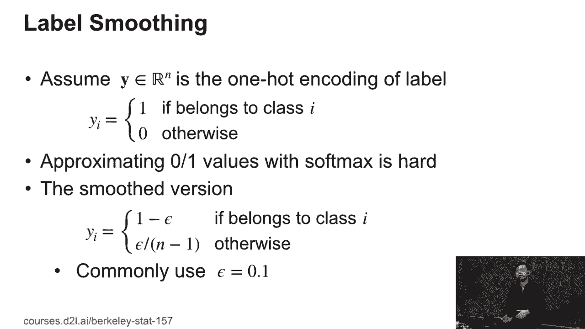

 The other tricks like， well， we mentioned that if you use a multi GPU training。

 you want to try a very large batch size。 Because for good performance。

 but if you use a large learning rate at the beginning， all this weight I read in the initialised。

 It's a random， and you use a large learning rate， you make it numerical issues here。

 So in this case， we cannot use a large learning rate。

 but we want to use a large learning rate to faster convergence。

 So what we can do here is go the one up。 What do we do here？

 We pick up small learning rate at the beginning， and gradually increase to the original learning rate that we have。

 For example， assuming we use the 0。1 as the initial learning rate， but at large at the beginning。

 What we can do here， we use the first five epoch for one map。 In the first five epochs。

 I start with the numerator equal to zero at the beginning。 At the end of the five epochs。

 we want to increase to 0。1 for the learning rate。 And between then， I just linearly increase it。

 until we get the 0。1 at the end。 So the idea here is that I want to use a tiny learning rate。

 at the beginning so that when I train the network， I train the network， it's moved close to the end。

 The surface is more smooth， I can slightly increase the learning rate。

 So I can use the linear rate after five epochs。

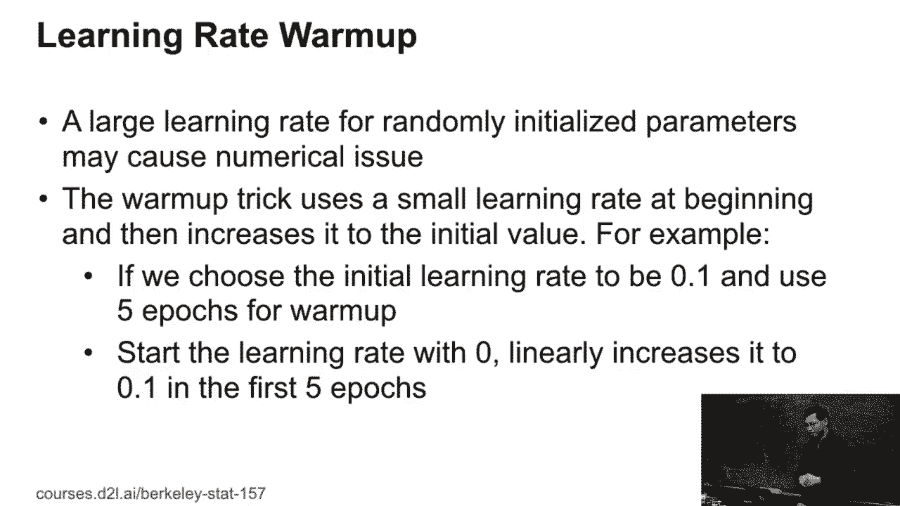

 Another trick is about the linear rate as well。 I will， in typically。

 because we use stochastic rate in descent， we didn't cover a theory。

 but you want to make it converge， you need decrease on the rate。 In the CIFA 10 homework。

 you already see that you need decrease on the rate at the end。 A typical way for rest net。

 what we're doing here， we choose the linear rate， initial error rate， equal to 0。1。

 then decrease by 10 times at the 30 epoch。 And decrease by another 10 times at the 60 epoch。

 And again at 90 epoch。 Okay， this is typical way we're doing。 But then we need to select， okay。

 this 30， this 10x 30， 60， 90， all the things that have a parameters。

 You need to choose for your algorithm。 Well， if I don't want to choose what I can do。

 that I can use a cosine function。 So assume the capital T is the total iterations we have。

 total batches we have。 And then at a particular iteration T。

 we can use a cosine function to decase one。 From the first two terms， the larger one is zero。

 is one at beginning， and well， it's pretty small on the right end。 Okay， so you can see that。

 the blue line， the dot， the blue line is the original one。 You first start with zero。

 which is the one map， and the increase to zero point， like here， here's zero point， what。

 zero point four， as after five epoch。 And then running for like 20 another 25 epoch。

 decreased by the fourth 10 times， and decreased again at 60 and 90 epoch。 But the red one。

 still use a one up， but at the latter I can smoothly decrease。 And what we can see that， well。

 the decay is much smoother， first is much smoother， secondly， it's much larger at the beginning。

 So keep very large at the beginning， and almost close to half of the back end right now。

 So you can think about both like， it's pretty constant at beginning。

 Decase very slowly at the beginning， linear at the middle， and slowly at the end。

 to the kind of cosine function we have。 But the major benefit here。

 you don't need a variable to have parameters。 Just a cosine function。

 you don't have anything to choose。 It can make your life easier。

 but actually improve the things a lot。 Okay， and another bunch of things。

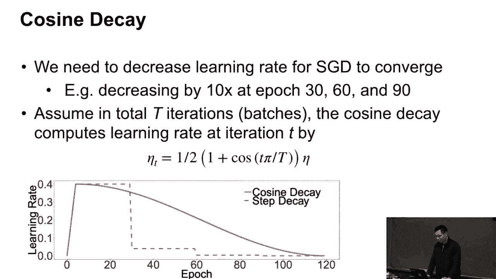

 synchronize the batch normalization。 So we know that in batch normalization。

 we need to compute the mean and the variance， for the example across the whole batch。 For example。

 the batch size equal to 32， we can compute the mean and the variance， using 32 examples。 All right。

 that works well if the batch size is big enough。 But if the batch size equal to one。

 I cannot compute the variance， it's always zero。 If the batch size equal to two， or like four。

 that's too small to compute a reliable main and variance。 That's a big problem。

 That no problem for image classification， that big problem for detections。 For detections。

 you need to generate so many， anchor boxes is much more memory。 For example， in first class here。

 and even a GPU have 16 gigabyte memory， but you can only run a single image for a GPU。

 Because you have so many anchor boxes， all of them eat memories。 Well， then we get a problem。

 because we only got a single image per GPU， and a multi GPU training in the batch long。

 what we do is the batch long compute the mean and the variance， within GPU separately。

 So because if GPU only has single image， I cannot compute the variance。

 So think about the batch long， which means in the multi GPU training。

 I will compute the mean and the variance， cross hold all these GPUs。 So if I have eight GPUs。

 one image per GPU， then I'm gonna， I'm gonna， I will compute the mean and the variance。

 for the age images we have。 Which means we need send all the variance。

 between the GPUs when you're computing。 That's give you like， maybe slows down your computation。

 because you need to pay the synchronization cost， but at the least you get stable batch long。

 as being a divergence here。 Okay， so this is a singleized batch normalization。

 which is all commonly used for detections， and segmentation。

 We probably are not going to have our segmentation， but you can read the book。

 they have two segment peaks or level information。

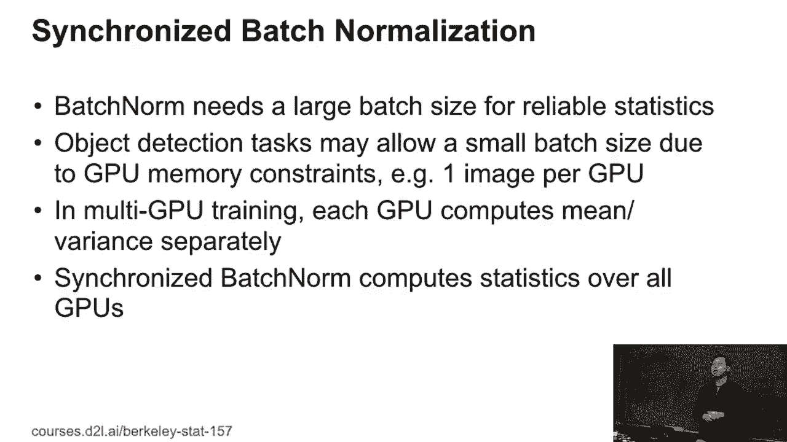

 Well， the last one， I don't， yeah， that's the last one。 Last one is like， every time。

 because the input image can't have different shape。 We want， we show the individual imitation。

 that we always resize into a same shape。 So here with 20 by 24 width and 20 by 24 height。 And。

 but for image， classification， that's fine， usually。 Because the objects are large。

 always in an image， but for object detections， the object can be large and can be small。

 If you always give you like this size， it may be not good enough， because time image is very large。

 time image is very small， and you don't want to fix size。

 The random batch size shape means that for every batch。

 I first random pick up a height and the width， and the resize all the image to this value。 So。

 so here， for example， we can randomly choose the value from 224， like this 7 times 32， and 256。

 this 8 times 32。 And another one like it， the number is wrong， but it's nine times 32。 So。

 anyone have idea why we won't have always times 32？ The reason why we always won't have 32。

 because like for rest net， we know that we have five stage。 We g g also have five stage。

 Every stage we have the width and the width。 So， five stage every time we do half the swing。

 which means total we have， we reduce by 32x for the width and the height。 So。

 if a pick number is like multiplied by this number， until then at the end。

 we will not have so much submitted alignment issues。 So， similar thing for the object detection。

 because they use the share the same base network， as the image classification。 Also。

 they won't have， as like always， we reduce by 32 at the end to get a feature map。 So。

 that's why we always render these select numbers， by this number。 Then。

 if I pick up a random number， I choose random one from here。

 and the resize all the image to this shape。 So， which means for batch to batch。

 I always try to image different size。 Okay。 Okay， so this is the last one we have。

 But you know that you， next time， if you read the paper。

 you cannot see a lot of other tricks around。 So， so many。

 maybe tens or 20 tricks all over the round。 So， here we show some small results。

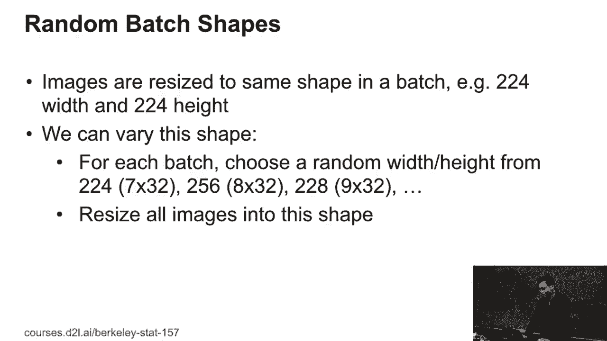

 like how the things matter to other things。 So， firstly， it's image classification。

 And we choose the rest net， just already modified rest net。 And， in sepsilon。

 we three in the mobile net。 We talked about in sepsilon， but we didn't talk about mobile net。

 Efficient is a baseline。 We always improve the， the step-out result on the paper。 Then。

 adding cosine decay， like this one top one accurate， or image net。 Like。

 adding cosine decay give you like， for a rest net， 0。75% accuracy。 Adding another label smoothing。

 0。04。 And the mix-up， actually give a lot of things here。 0。84， 3-4 rest net。 In total。

 so that's why we can improve， the baseline from 77% to 79。 Similarly， for the reception， we can get。

 make a lot of improvement as well。 For the reception， V3， the cosine decay improves a lot。

 For mobile net， I also the cosine decay improves a lot。 The interesting thing here。

 you can stack all the trick together。 You can stack one by one， and you can maybe stack。

 here we have three， you can stack another， like seven， maybe you can first improve it。

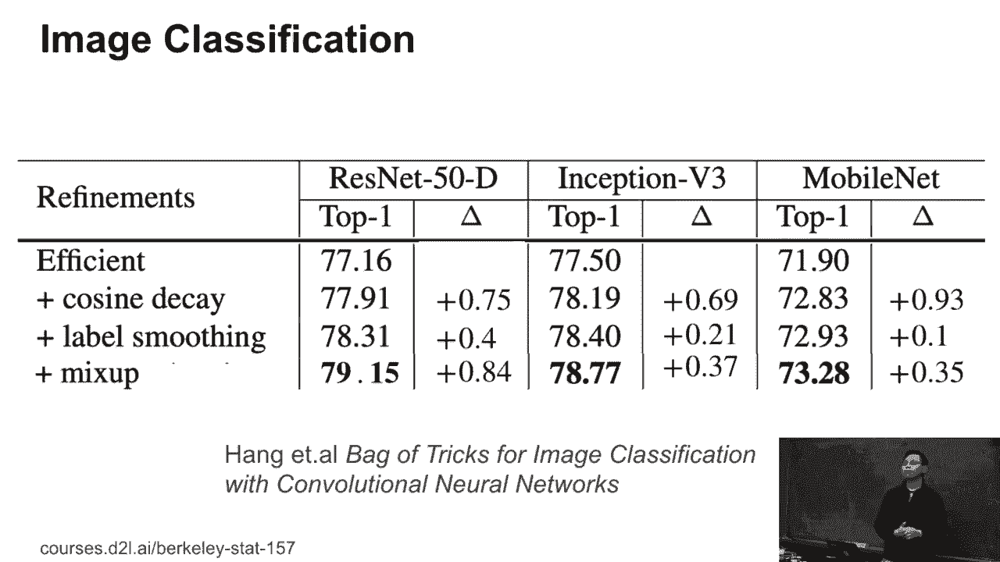

 The other thing for you， V3， here， MAP is the bondbox， like accuracy we have。 The baseline is here。

 baseline is 80。 If we remove all data augmentations， well， we get a lot of。

 we decrease the accuracy a lot。 And then we look at synchronous batch long， give it 0。56。

 and randomize the training shape， give it 0。0。4， cosine linearity decay， 0。4 always with one map。

 And also label smoothing 0。4， and mix up， again， give a lot of things here， 1。5 here。 In total。

 we can give 3。4 for U-LOV3。 Okay， that's why you can see a huge jump。

 from the original paper into the state-fought results we have。

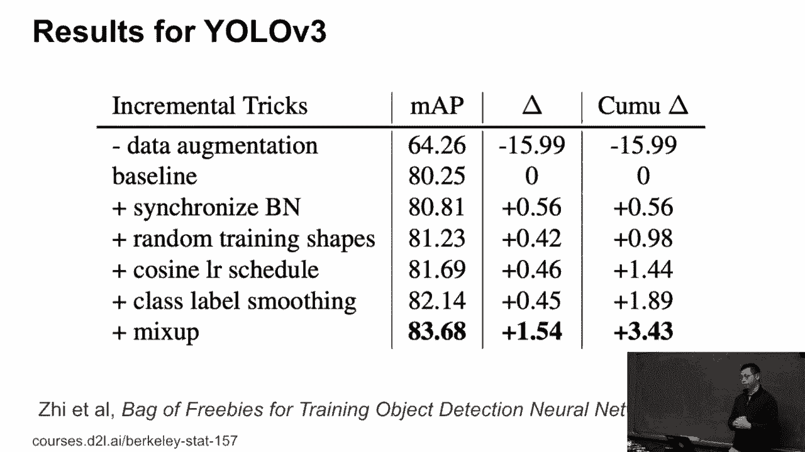

 Okay， so that's basically a bunch of training tricks。 Like， usually we don't talk about that。

 like it's not， you never know why it works or not。 Also， the others don't change， but we have， like。

 find something。

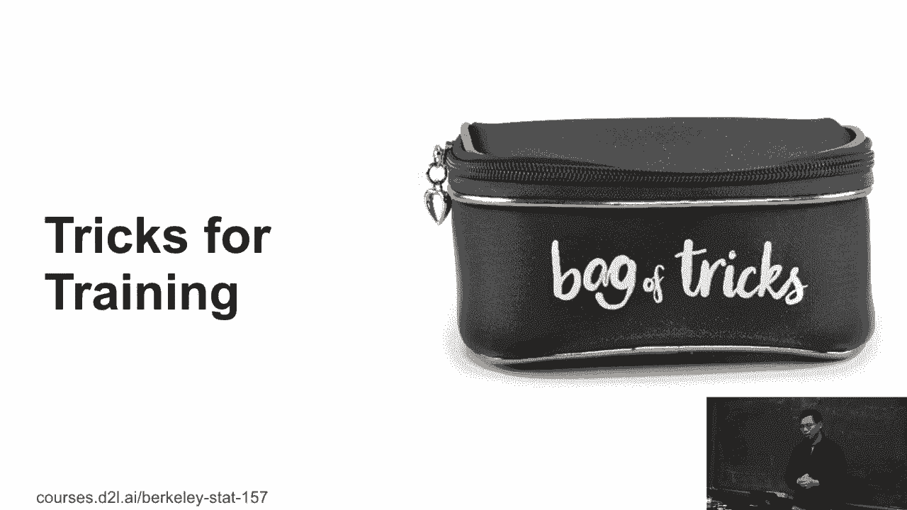

 Hands-off， unif only works well for all these applications we have。

 but next time you can read the papers， and read the other guy's source code。

 you want to pay attention to these more tricks。 Even that is like tiny things。

 and give a lot of improvement here。 Okay， any questions？

