# P93：93. L18_1 依赖随机变量 - Python小能 - BV1CB4y1U7P6

好的。

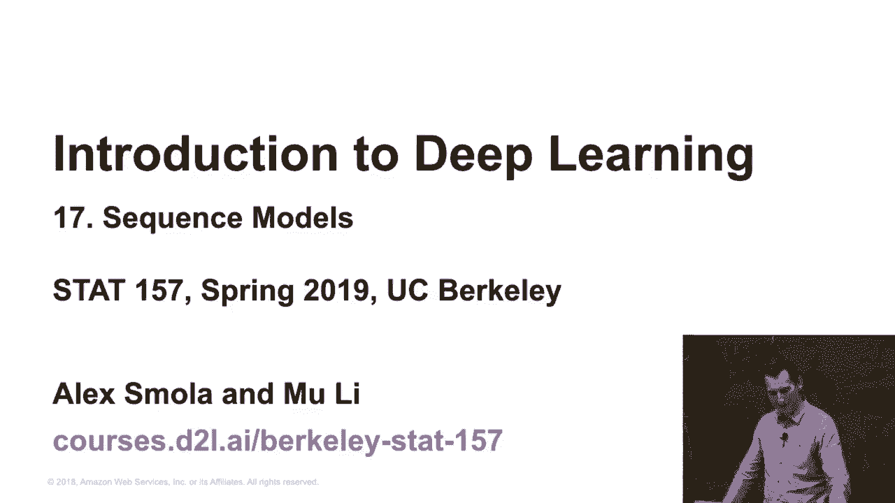

序列模型。我们需要思考的第一件事是，你知道的，为什么我们需要序列模型呢？到目前为止，我们大多讨论的是，看看我们的训练点，然后我们在它上面训练，最后会有好结果，也许我们在CAGU上做得不错，或者在现实中做得不错。所以，依赖随机变量。

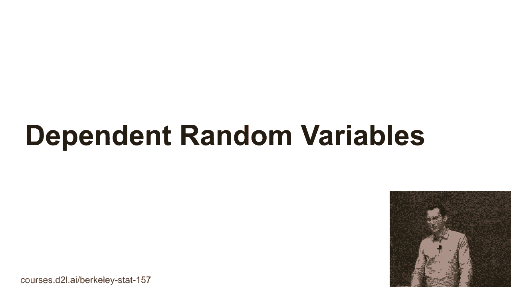

所以，基本上，到目前为止我们做了什么，你知道的，我们收集了一些观察对，xi，yi，来自某个联合分布p(x, y)。然后我们会去估计，y给定x，你知道的，也许是从某个p(y | x)估计，对于一些未见过的x'。然后，你知道的，我们可能有图像和物体，或者回归问题，或者房价问题。

这一天的顺序其实并不重要。如果是那样的话，生活就很好了，对吧？所以，你可以随便地遍历你的训练集，一切都很顺利。所以，我想你能看到这接下来会怎么发展。

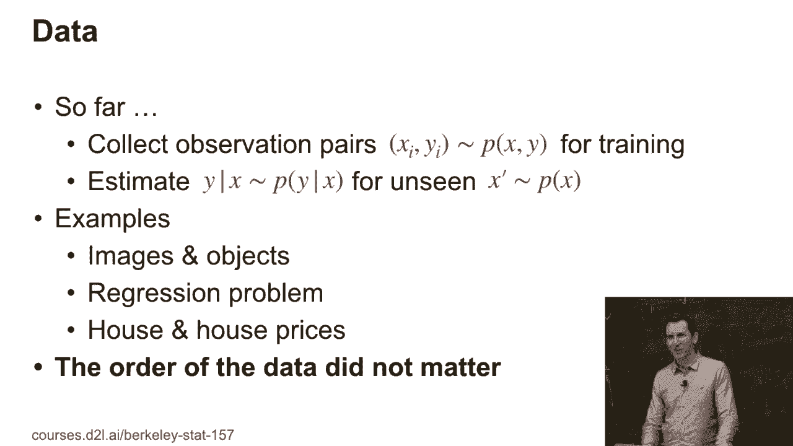

好吧，这其实不完全是现实。快速回顾一下。这是我们大约八个单元之前做的事情。所以，当你与环境互动时，对吧，你可以有不同的互动模式。你可以做批量训练。你下载所有数据，然后在这些数据上训练那些观察值，然后部署。

或者你可以做一些在线的事情，每次获取一个观察值，你更新你的模型，然后你部署它。在计算广告中，你会考虑做这样的事情，因为你的模型越新鲜，你赚的钱就越多。所以，这就是为什么能快速响应非常重要的原因。

很快就能看到事情是如何变化的。一个有趣的故事。曾经有一家大广告公司，它在很长一段时间里没有库存某个非常受欢迎的消费电子设备，而这可能是一个很昂贵的事情，没能在库存中有那个关键词。

对不起，我不得不这么含糊其辞，否则我会惹麻烦。不过，我猜你能猜到我在说什么。好吧，也许是电话铃响了。然后你就知道我在说的是哪一个。主动学习。你实际上可以与环境互动，可以进行实验。例如。

在计算广告中，你可能会做一些事情，比如，嘿，让我展示这个奇怪的广告。我不确定它是否有效，但如果我试一下，就能知道。然后有了强盗算法，你实际上可以决定你接下来做什么，你选择什么。然后是强化学习。而强化学习，你采取一个行动。

环境做出反应，然后你采取新的行动。例如，如果你在开车。如果发生了这种情况，而你采取了错误的行动，那么，嗯，你最终会撞到树上，那不好，但你知道，有些，性能瓶颈你可能会遇到，或者如果你把服务中心的所有风扇都打开。

然后服务中心过热，你就失业了。所以，有一些不容忽视的约束是你想要满足的，但它基本上是采取行动，环境做出反应，然后它。

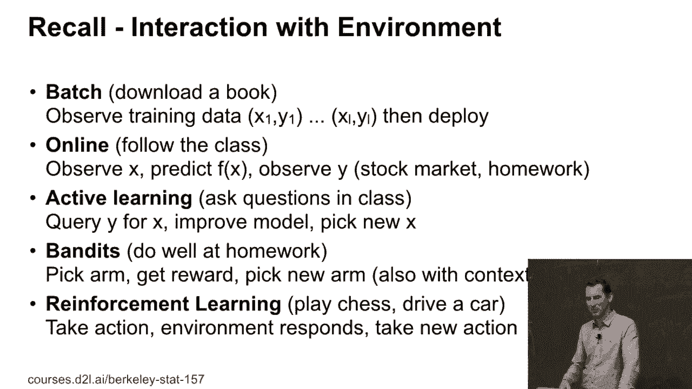

记得。所以，系统可以是有状态的，这里有一个系统，一个是有状态的，一个不是有状态的。因为在一种情况下，那只犀牛被麻醉枪射中了。所以，你可以随便做任何事情对左边的犀牛，但我不推荐对右边的犀牛这么做。同样的系统，不同的记忆。是的。所以，总的来说，训练和测试可能并不完全相同。

而且，特别是，你可能会遇到非平稳环境，整个。接下来两周的目标是我们如何应对非平稳、有状态以及依赖于犀牛变量的情况。所以，基本上，我们会深入探讨很多我们假装不存在的误区。

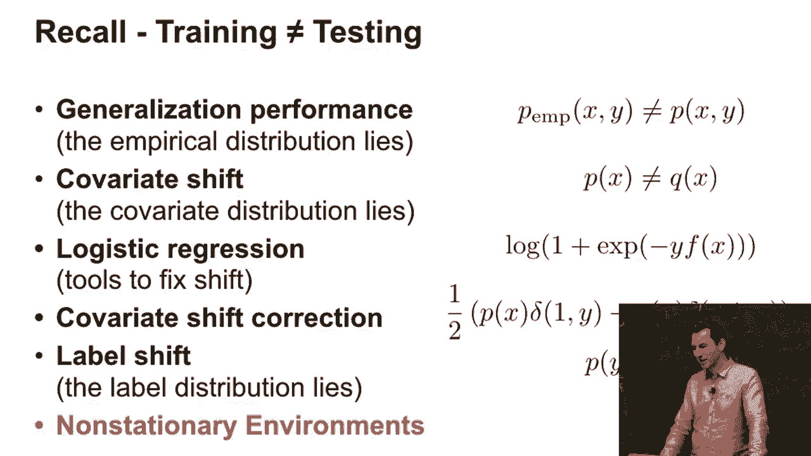

这是一个例子。所以，这是Uda Kureng的一篇论文中的内容。这是关于Netflix的。基本上是关于Netflix数据集的。他只是绘制了按日期的平均评分。好吧，可能里面有一些微小的结构。也许周末时，人们更宽容，或者也许他们更苛刻，但随后就有了这个大幅的跳跃。

有没有人记得为什么Netflix电影的评分突然大幅上升？

你认为可能发生了什么？所以，发生的事情是，某个时刻，Netflix改变了其评分体系上的标签。它把一些非常差的电影的评分从“我讨厌”改成了“我不喜欢”，或者反过来。所以，从“我不喜欢”改成了“我讨厌”。于是，人们就想，嗯，我不会给它打一分。

给它两颗星，因为我并不讨厌这部电影，我只是没有很喜欢，所以我给了它两颗星。所以，并不是Netflix的推荐系统突然变好了，大约在1500天时，而只是你知道，突然间，不同的标签让人们写和标记的方式发生了很大不同。而0.2、0.3分是一个显著的差异。好吧。这里有另一个例子，再来一次。

来自同一篇论文。

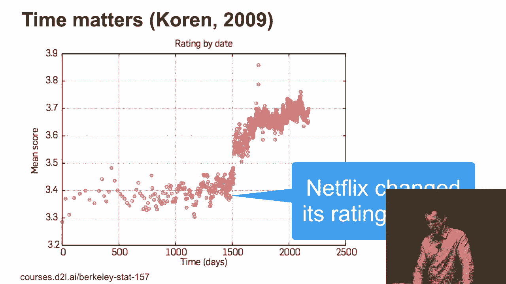

所以，如果你看电影，电影的平均评分随时间改善。那么，为什么会这样呢？好吧。这是通货膨胀，可能就是这个原因。实际上，情况完全不同。如果你想想看，如果有一部老电影你想看，你会去看一部垃圾电影吗？不，你会去看一部好电影，对吧？所以。

因此，作为一种选择性偏差，倾向于观看好电影。你可能会选择观看一些非常新的电影，因为，嘿，它们刚刚上映，你想看看它们到底是什么样的。或者，你可能想看一部大家普遍认为很好的电影，因为你不会去看一部随便的老电影。

通常情况下。

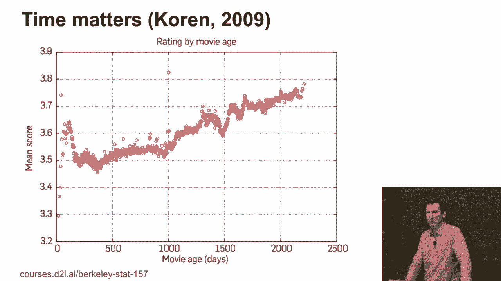

好的，这是另外一个。这个是我们三年前做的研究。我们看了一部特定电影，在同一批用户中，随着时间的推移，它会被评分成什么样。你可以看到那些峰值。而当这些峰值出现时，评分可能会上升0.2或0.3分。基本上，这就是，嗯，每当这部电影赢得一个奖项的时候。

突然间，大家都说，这是部好电影。你还记得去年谁得了奥斯卡奖吗？好吧，没人记得，对吧？

你可以看到，基本上，一年后，评分就恢复到了它应该有的水平。对吧？所以，只有在非常短期的时间内，大家才会记得。嗯，比如《水形物语》，它本来应该是一部好电影。所以，我猜如果你想看一个青蛙人出来，那么，嗯，好吧，那是一部很酷的电影。然后。

你知道，也许一年后，你就不再记得那部电影曾经获得奥斯卡奖，而会说，嘿，怎么会是这个奇怪的青蛙人呢？对吧。所以，这就是为什么会发生这种情况。

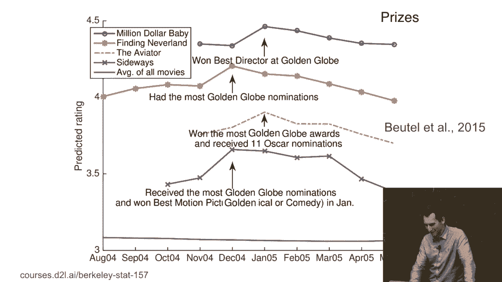

好的，这是另一个。这是一个有趣的事情。这个是卡尔里·莫宁-克里格的论文。它是在分析女性幸福感，尤其是已婚女性，根据她们结婚的时间。好的。所以，也许德国的丈夫真的很糟糕，可能他们会做那种“诱饵交换”的事情，对吧？他们对未婚妻非常好，然后结婚后，嗯。

结果它真的是不怎么样。那么，我是德国人，所以我对这件事有点苦涩。事实上，它可能更多的是一种头脑适应现象。也就是说，无论你处于什么情况，一旦事情在某个时刻变得更好，你就会把它重置到你正常的偏见状态。而且，顺便说一句，这不仅仅是德国人的问题。

这是中国的生活满意度。还有另一张图表，遗憾的是它在2005年后持续了下去。因此，尽管人们赚得更多，但金钱并不一定能买来幸福，实际上，幸福感稍微下降了一些。所以，是的，就是这样。那么，这应该表明的是，这显然是非平稳的。

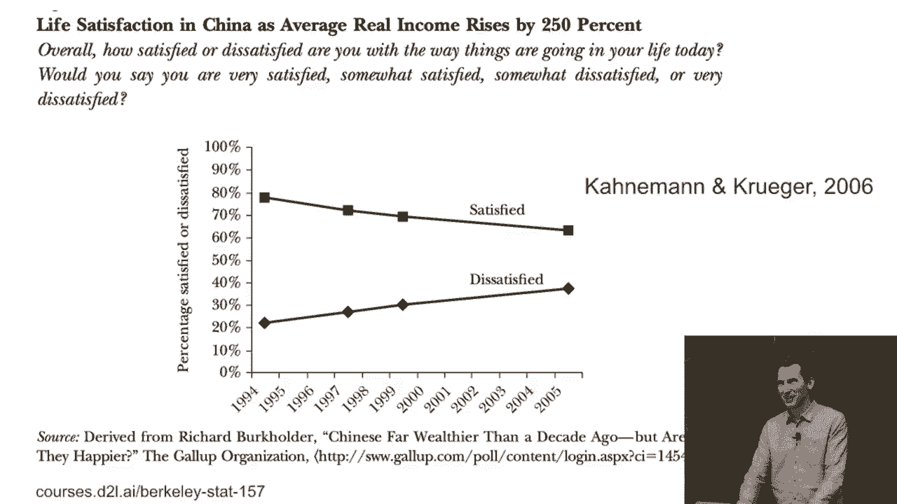

那么，我们要如何处理这个问题呢？顺便说一下，这不仅仅是时间问题。它也是特殊的。所以，换句话说，依赖性可以基于许多其他变量，而不仅仅是时间。所以，正如你可以想象的那样，这是美国各地的地震发生率。而这并不特别令人惊讶，对吧？我的意思是，我们住在加利福尼亚。

有一段时间，嗯，我们会有一次大地震。然后呢，东部有一个大块区域，你知道吗？如果你查一下地图，你会看到俄克拉荷马州。有人知道为什么俄克拉荷马州有这么多地震吗？这很奇怪，对吧？那里什么都没有。我的意思是，连地震都不想去那里。嗯，那是因为水力压裂。

如果你从地下提取大量石油并在地下做其他事情，那么，嗯，你就会扰动地质结构，然后，嗯，你就会引发地震。这就是为什么俄克拉荷马州会发生地震的原因。

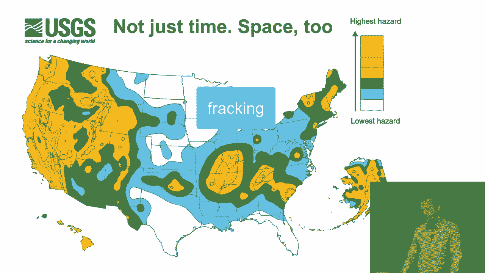

是的，这是显而易见的，你知道的，股票价格随时间变化，你可以看到，嗯，FTSE100指数。科技股泡沫破裂，嗯，它把指数压了下去，然后就是次贷危机。我不知道未来会怎样，也许它会像橙色峰值那样爆发，或者其他什么的。但没错，这是决定性的非平稳过程，如果你到现在都没怎么注意，嗯，TLDR（太长不看）。

数据通常不是独立同分布（IID）。

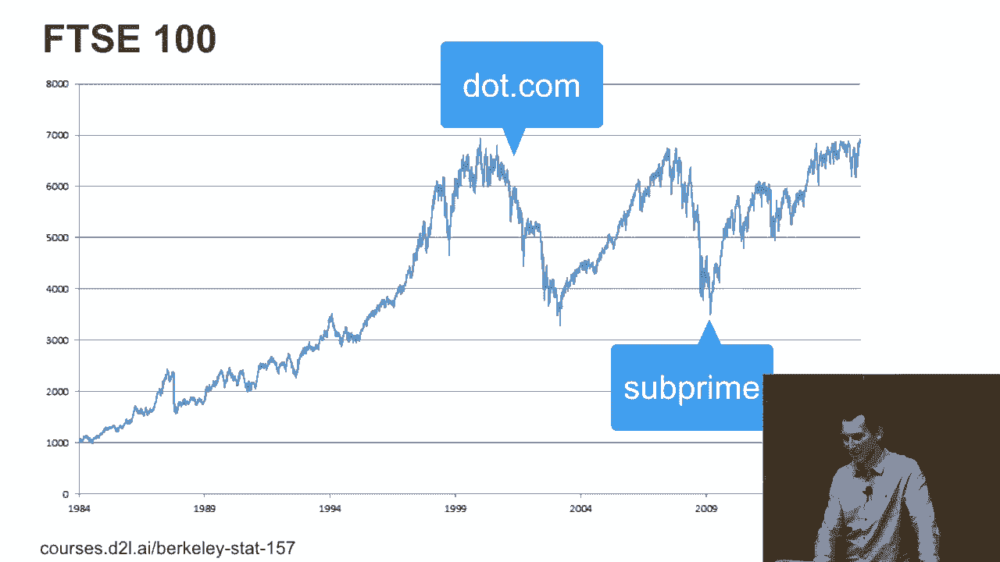

几乎总是，IID只是一个简化的假设，如果你能处理数据不是IID的事实，那么通常模型会表现得更好。到目前为止有什么问题吗？好，没问题。[BLANK_AUDIO]。

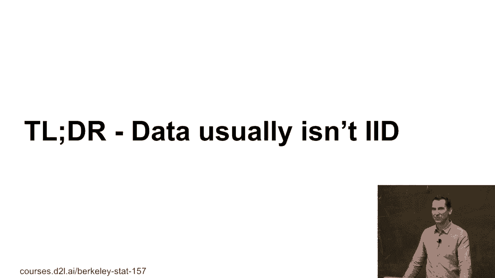
