# P94：94. L18_2 序列模型 - Python小能 - BV1CB4y1U7P6

序列模型。好了，到目前为止，我们已经看到，数据不是 ID。

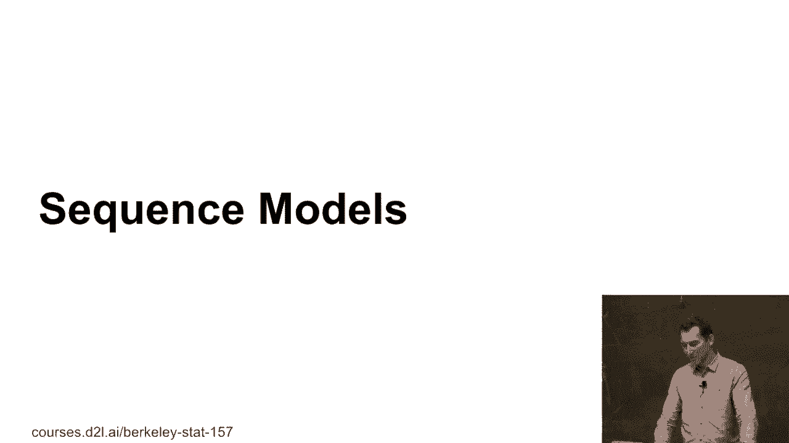

那么，让我们看看如何建模这个。如果我有一些依赖的随机变量，x1 到 xt，对吧？我意思是，任意顺序，反正它们是从某个 p(x) 中抽取的。只要写出条件概率，我可以将 p(x) 写成 p(x1)，然后是 p(x2|x1)，再到 p(x3|x1 和 x2)，一直到 p(xt|x1 到 xt-1)。

而这个，我可以做，无论我是否有时间序列，对吧？

我也可以做反向的那种情况，对吧？

所以，单纯为了发现，你可以提出非常荒谬的模型。而这些模型在技术上是正确的，只不过这些模型非常荒谬。那么，知道了这个，有什么意义呢？有没有人有想法为什么你需要去在意这个呢？好了，那我们再写一遍。

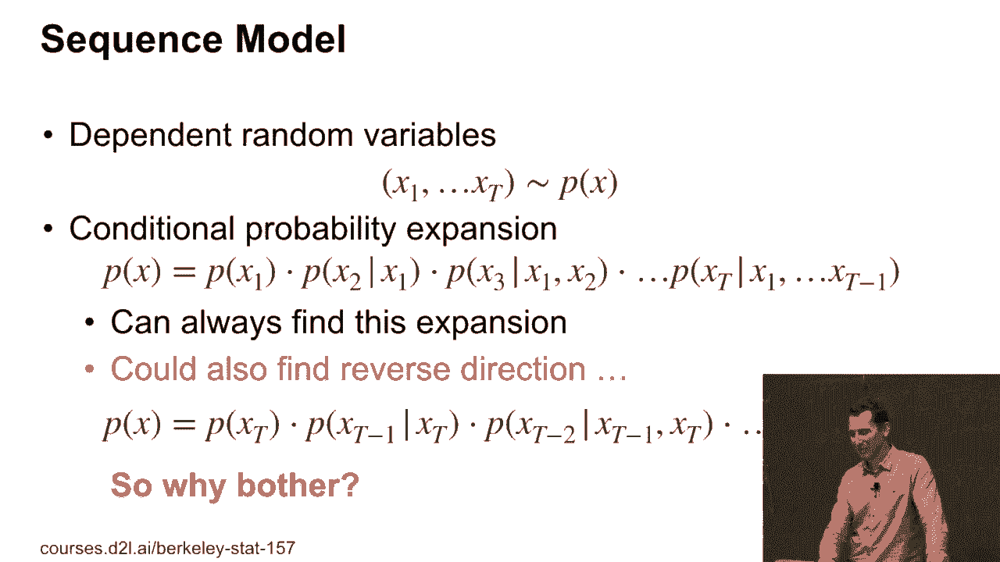

所以在一种情况下，所有的箭头都指向右侧，而在另一种情况下，所有的箭头都指向左侧。而因果关系，换句话说，现实通常会防止反向的因果关系。因此，未来不会影响现在或过去。我的意思是，除非你看科幻电影，里面有从未来穿越回来的情节。那就是为什么我们不会看到时间旅行。

不过，通常找出时间走向的一种方法是，你尝试用两种模型来建模数据，然后，你尝试看看哪一种更合适，哪一种能引出更复杂的解释。你其实可以在合理范围内的情况下，数学上证明这一点。

错误的因果关系方向会导致更复杂的模型。所以在这个方向上，Bernard Cholkopf 和 Dominic Yansing 做了很多很好的工作。他们写了本书。如果你对这个领域感兴趣，可以去读一下。

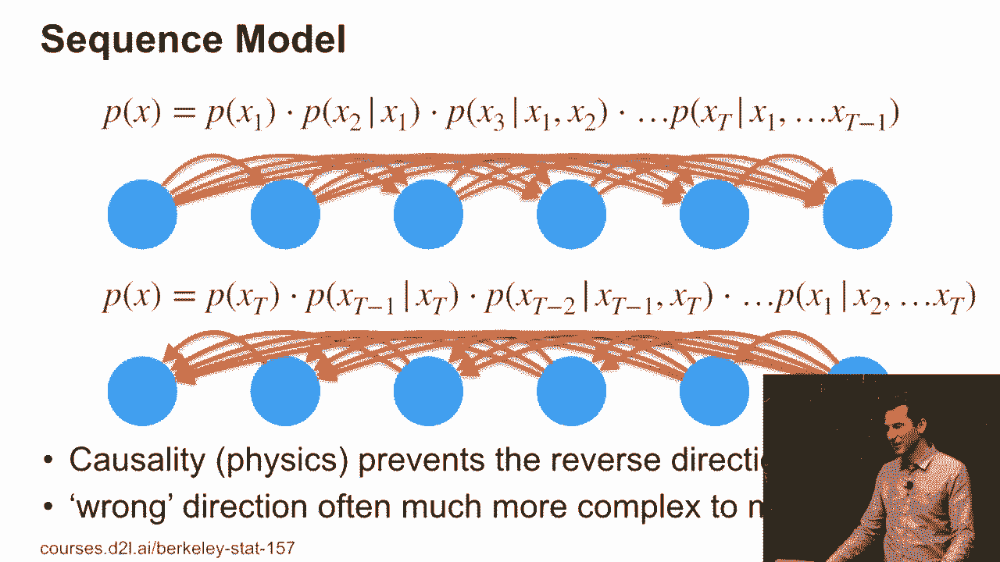

好的，那我们怎么处理这个呢？毕竟，这是一个深度学习课程，对吧？

所以我们可以做的一件事是，我们可以使用某种回归模型。因为毕竟，我们的目标是某个 p(xt|x1 到 xt-1)。我可以简单地说，这就是 p(xt)，然后给出所有过去数据的某个函数。到目前为止，这完全可以，因为我还没有具体说明这个模型有多智能。

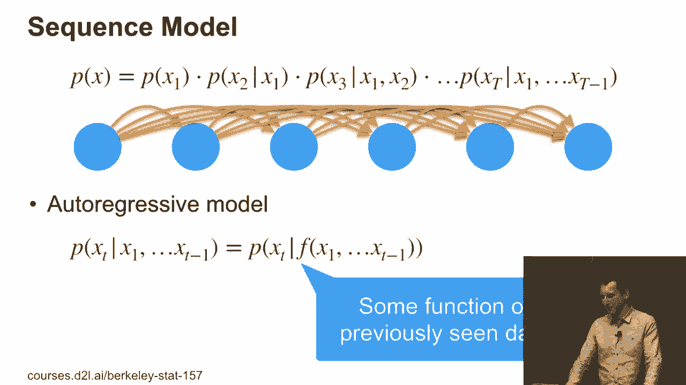

这个函数 f 应该是。好了，这里有一点问题。如果我有这个函数来捕捉所有内容，那么，嗯，它计算起来会非常复杂。而且我们会看几种方法来解决这个问题。所以计划 A 是我使用马尔科夫假设。马尔科夫假设只是意味着，如果我有这个链条。

那么，依赖关系只能回溯到这么远，也就是 t 步。有人能告诉我图中 tall 是什么吗？好吧，谁支持选 1？

谁投票支持图中 tall 等于 1？谁投票支持等于 2？好，好的。谁投票支持等于 3？好，谁支持 0？好吧。所以一半的观众没有明确的看法。最后 2 得票最多，对吧？

所以这里的依赖关系是两步的。基本上，观察值是过去两步的内容，它们会影响接下来的结果。在这种情况下，你可以写出一些类似水文的模型。P（x t 给定 x 1 到 t-1）是 f（x t - tau 到 x t - 1）。这是一个完全合理的模型。如果 tau 足够长，如果我有很多数据，这一切都成立。

但也有很多情况下，这种方法实际上会失败。

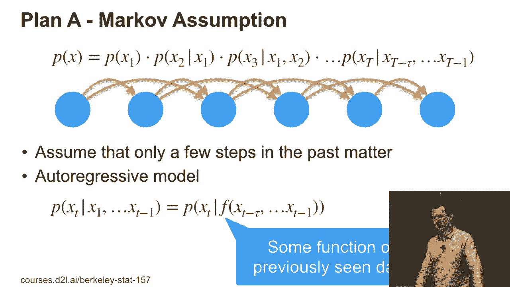

但让我们看看我们能做什么。所以你基本上可以解决一个回归问题。比如 x hat 是某个函数 f（x t - tau 到 x t - 1）。然后我做回归。对此有任何问题吗？这是一个非常简单的方法，对吧？所以我可以直接使用过去的数据，执行回归。如果这就是所有的内容。

现在我们都可以回家休息，想着，嗯，是的，我们可以做时间序列模型。而显而易见的是，嗯，确实还有更多的内容，但我们先从这里开始。对吧。

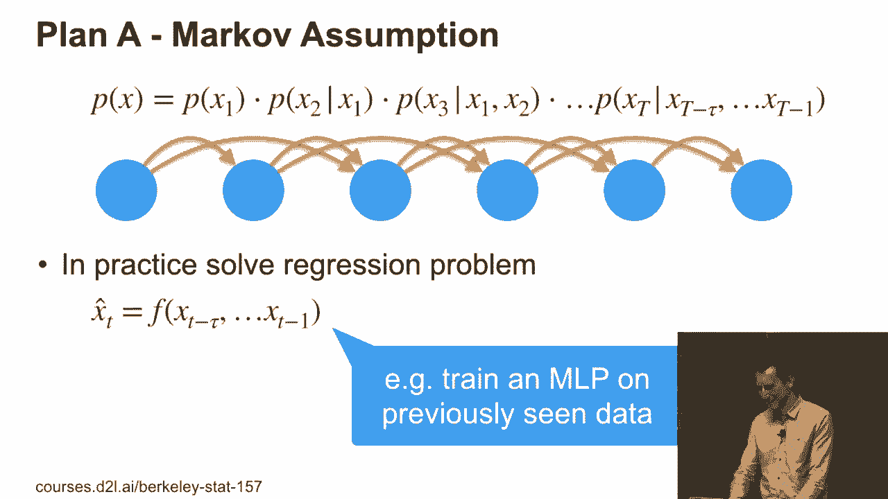

计划 B。这是一个长期以来都很流行的方法。它是一个延迟和可变模型。所以我们不说，我要截断历史，而是通过假设存在某个隐藏状态 h，来携带这些历史。这个隐藏状态会基于过去的观察和过去的隐藏状态进行更新。

新的观察值依赖于当前的隐藏状态和 x t 的值。绿色的点表示隐藏状态，蓝色的点表示观察值。所以现在你可以很容易地看到，至少，你知道。你可以让自己相信，如果 h t 实际上是 h t - 1 的一个函数，对吧。

这就是我们所拥有的，新观察值也随之而来。那么，如果我的隐藏状态真的很强大，能够存储很多信息，那就等同于拥有从开始到结束的所有数据的函数。只是写法上有点奇怪。好吧，这是一个微妙的区别，对吧？

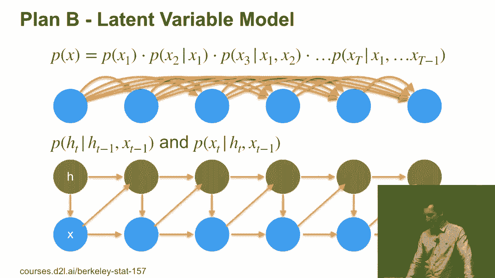

所以在一个选项中，如果我们有一个马尔可夫模型，我们只需要有一个依赖于过去观察值的函数。所以一切都是可观察的，我们基本上可以形成一些训练数据并解决它。

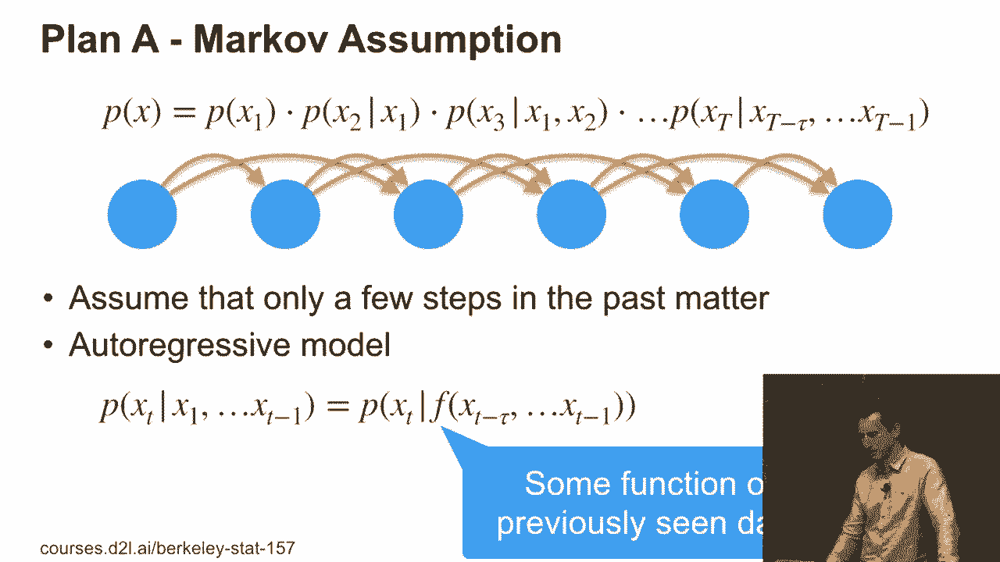

或者我们假设存在某种隐藏状态。好吧，让我给你一个隐藏状态模型的例子。事实上，你的大脑现在正在解决其中一个问题，至少我希望它正在解决。也就是说，存在一个隐藏状态。假设我在说话前会思考。

对吧？现在，你的大脑在做的事情是解决逆向问题。你知道，声音从我的嘴巴发出来，进入你的耳朵，然后根据观察，你试图推测我在说话时隐藏的状态是什么。你知道，当那个声音从我的嘴巴发出时，你大脑正在解决逆向问题——我生成声音的过程，而你则是从声音中推理出思维。所以这是你大脑现在正在解决的逆向问题。

产生噪音从思想中出来，而你则从噪音中产生思想。当你问问题时，它会反过来。好吧，这里有问题吗？所以这似乎是一个相当微妙的区别。但是，正如我们稍后看到的，它会导致非常不同的算法。我想现在先把这个问题解决掉，因为后面我们会进一步讨论。

我们会遇到很多模型，它们会选择计划 A 或计划 B。实际上，大多数是计划 B。所以模型后期几乎就是我们接下来三节课要讨论的内容。我想确保大家都理解我们为什么要这么做。好吧。

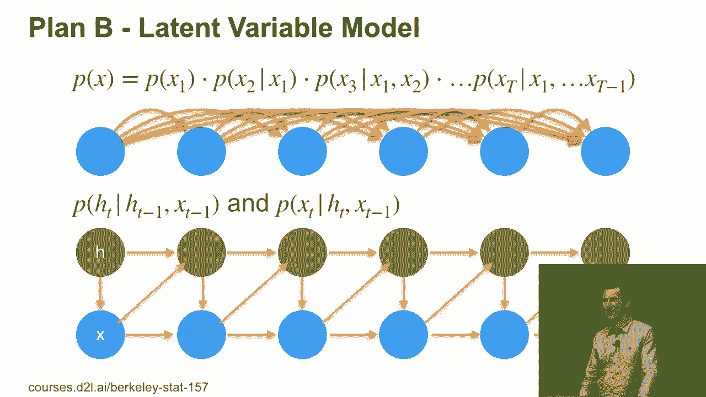

所以，基本上如果我有一个函数 f，涉及从 x1 到 xt-1，对吧？

所以这是我们想要的函数，它可以写成 ht-1 和 xt-1 的某种函数 f。在这种情况下，你知道，这完全是类比的。对于某些分布，存在这样的形式。所以，在一个替代宇宙里，光谱方法将成为新的令人兴奋的事物。

在某个时刻，这一点并不清楚。你实际上可以证明，某些嵌入是处理某些模型所需要的全部。好吧，但在深度学习领域里，这种替代的宇宙并不存在。

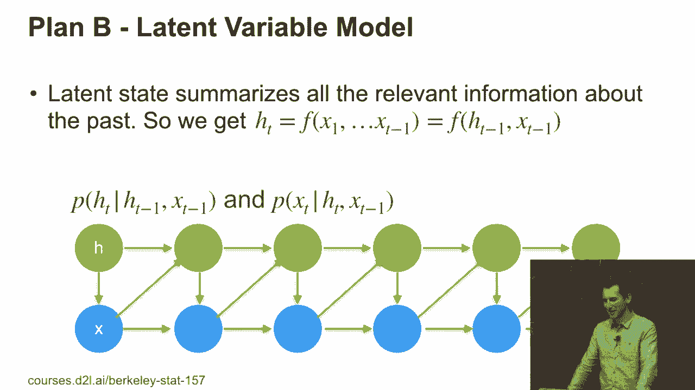

好吧，你可能以前听说过其中的一些东西。我只是想给你提供一点背景，这样当有人跟你说，"我们不用深度网络，因为我们用的是比如 HMMs 或者常见的滤波器，或者随着时间推移的主题模型"之类的，你就能理解。

至少你知道他们告诉你的东西与你正在做的事情是如何契合的，并且你正在做的事情和其他所有事情一样有原则。所以，我们很快就会遇到一些，比如，时间序列观察数据，像是购买记录、点赞、应用使用、邮件、点击、查询或评分。对吧，这些都属于其中。

然后我可以做的一件事是赋予这个隐藏状态某种含义。对吧？我可以把它分成不同的簇。人们在搜索中做过类似的事情，他们会把搜索分为三种不同的类型。所以有导航型的、信息型的，或者有一个我现在忘记的第三种类型，但基本上从这些你可以看出，这个过程非常。

然后他们会让人类标注一些东西，建模过渡过程，等等。是的，接下来我们来看看一个做过这些的公司，尽管在搜索领域做得不太好。是的。但基本上，你可以尝试这样建模，不管你是否在同一个搜索会话内，还有许多其他特征。

你可以假设随着时间的推移，用户有兴趣的主题是存在的。我们曾经做过这个，效果很好，特别是在计算广告领域。那时，深度学习还没有那么流行。大约是在2011年到2012年之间。你可以看到网络如何学习到，比如说，知道。

你知道，体育、教育、健康、金融等其他领域。你确实能看到像这样的故事：这个人喜欢体育，但后来他发现自己没钱了，于是开始找工作。你可以看到这些话题相互交织，产生了不错的互动。是的。

你可以讲述一个不错的故事。如果你想要简单且可解释的模型，这不是一个坏的起点。或者我们可以看看一些本质上是1960年代的技术，也就是常见滤波器。大概到现在，很多控制理论的课程还是会教你常见滤波器。如果你在雷达上追踪一架飞机。

嗯，他们可能会使用类似这样的东西，对吧？这些都是很酷的东西，对吧？

再次强调，他们基本上假设存在某种潜在状态，比如飞机的位置。然后你观察到的是雷达回波的位置。

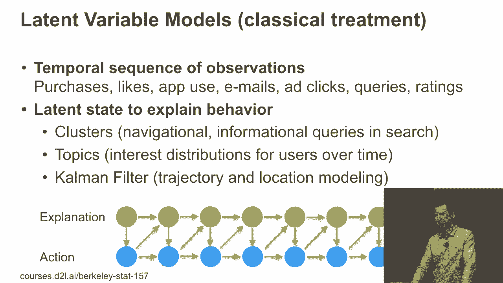

比如在计算生物学中，你可以遍历一段DNA序列，你会看到其中有内含子和外显子，这就像是一个函数调用的起始部分。所以，如果你把转录想象成一个函数调用，那么你就需要有某种方式来标明函数调用的开始和结束。你可以对它进行建模。

是的，不要害怕数学，我们不会做这个的。

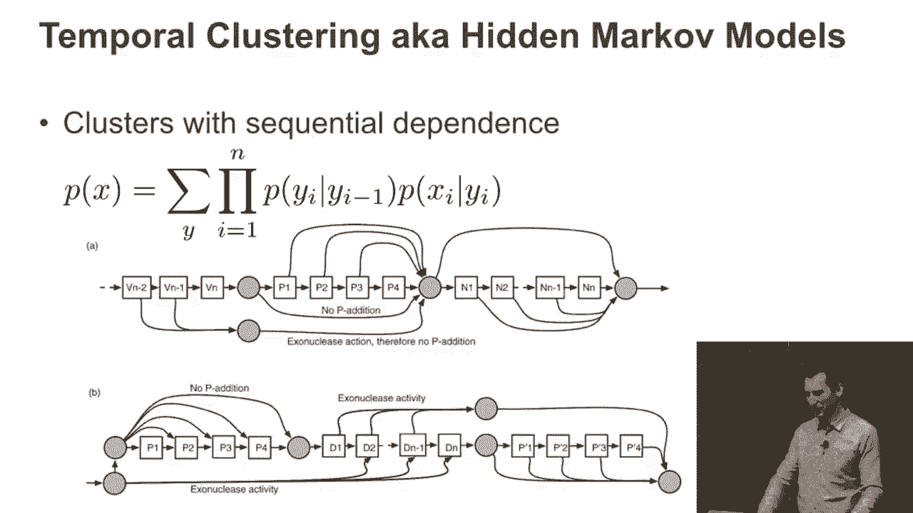

但你现在可以通过深度学习来做到这一点。如果你告诉UVC，你可能还是能做一个初创公司。我正在为Compile做深度学习。好的，别告诉他们我这么说的。你可以做时间主成分分析（PCA），这是一种常见的滤波器。基本上，你有一些潜在因子模型。对，潜在变量是从某个正态分布中抽取的。

然后你有一些简单的序列因子结构。所以基本上，你有一些观察值，然后根据这些观察值来转换数据。是的，这通常能很好地工作。

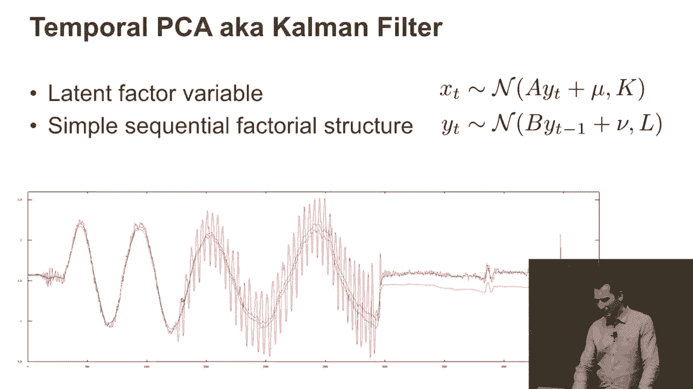

或者基本上是其他任何事情。所以这引出了一个大问题：既然人们已经做了几十年了。

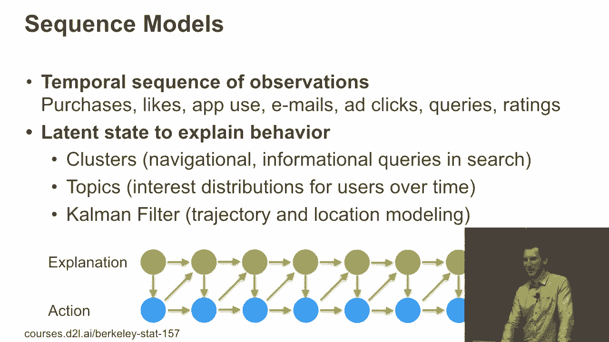

我在这里做什么？为什么我想要尝试进入一些新的领域？而真正的大问题是，我们是否应该相信所有这些参数化模型？

这个问题有点像修辞性的问题，因为如果我回答“是”，那我现在就可以回家了，对吧？

实际上，这些并不完全正确，对吧？它们只是科学家们为了处理少量数据，或者强行推导出他们认为应该存在的某些结构而做出的非常方便的假设。例如，对于语音识别，假设人们嘴里说的不是乱码，而是单词，这个假设是完全合理的，对吧？

因此，你会有离散的术语。是的，不过还有更多的术语。

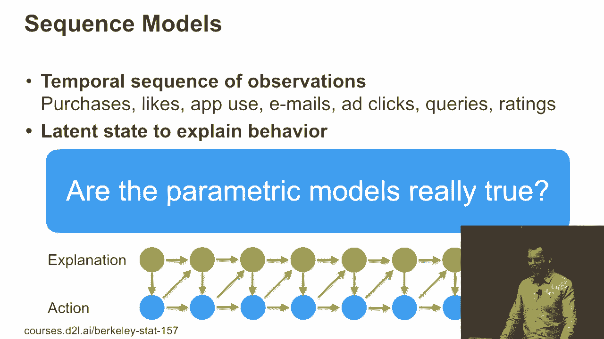

处理这个问题的优雅方法。所以你基本上想要的是拥有一些更丰富的表示方式。你希望能够处理，例如人们在随机时间做事的事实，而不是每15分钟定量一次。是的，我们会在这方面玩得很开心。

