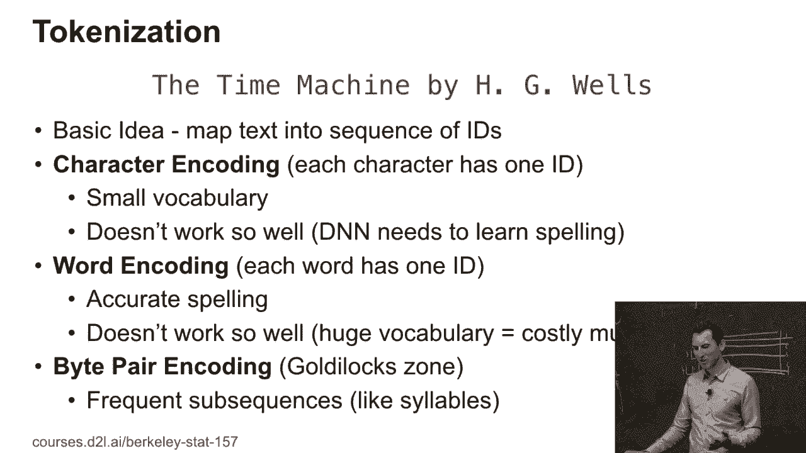
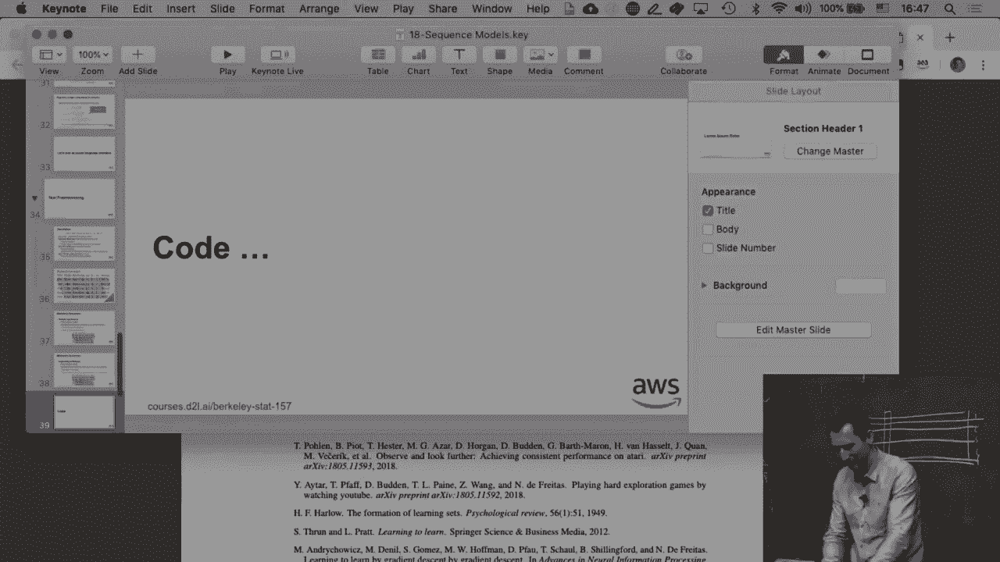
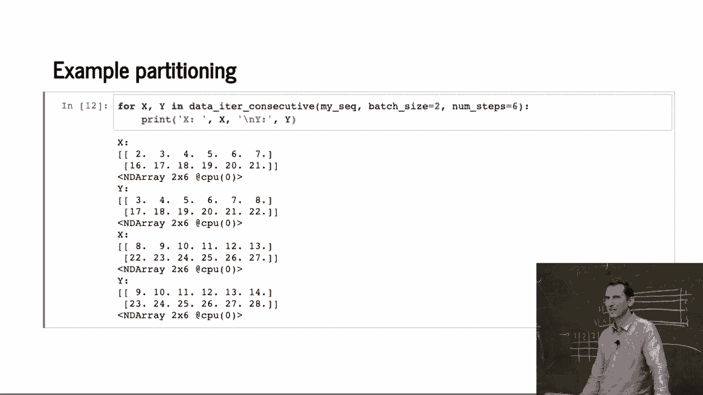

# P97：97. L18_5 文本预处理 - Python小能 - BV1CB4y1U7P6

好的。那么现在我们已经看到了基本的文本统计信息的样子。接下来，让我们看看我们实际上该如何处理文本。所以我们首先要做的就是对文本进行分词处理。所谓分词，我的意思是……嗯，我们把每个词或者每个简单的单位转换成一个概念，然后文本就变成了一系列整数。

基本上。所以，有很多方法可以去实现这个目标。一种是我可以使用字符编码。这是非常好的，因为你知道，如果我有，也许是30到35个有意义的字符，我会得到一个非常小的词汇表。所以它非常非常容易，嗯，你知道，每次预测一个新字符。如果我做这个的话。

我永远不会遇到一个我没有见过的特定单词，因为它是由这些字符组成的。问题是，如果我这么做，模型往往并不能很好地工作。它运作得不好。我的意思是，网络实际上需要学习如何正确拼写。对于某些语言来说。

这实际上是件好事。所以如果你有，比如说，像德语那样的奇怪语言，其中不仅动词，名词的形态也会发生变化，或者像俄语那样有六种不同的格，并且还有单数和复数形式。那么。

或者，如果你有一些语言，它们在单词的末尾附加了很多东西，那么对于那些奇怪的语言来说，这其实是完全可以接受的。对于中文来说，这种方法实际上非常有效，原因显而易见。有什么想法吗？

为什么这种方式对于中文或日语有效呢？确切地说，你实际上有成千上万个字符。所以这实际上是在一个刚刚好的区域，你既没有太多，也没有太少。所以你得到了有意义的颗粒度表示。但如果你有一个小的字母表。

然后，这样就不太好了。嗯，你可以往相反的方向走，对吧？那么，嗯，为什么你不能做跟中文一样的事情，来处理英语呢？嗯，让我们假装，你知道，每个词就是一个标记，对吧？

事实上，这并不是完全如此，但这正是我们在中文中能够得以拯救的原因，然而对于英语来说，如果我们没有……嗯，对于英语来说，情况还不是那么糟糕，但对于几乎所有其他语言，名词和动词的形式变化真的是非常剧烈的。所以，你会拥有一个非常庞大的词汇量，而你可能无法做到普遍化，嗯，不然的话。

举个例子，你可能只在一个形式下见过某个动词，而没有看到它的所有其他形式。所以词汇量庞大，代价高且速度慢，GPU厂商会很高兴因此卖给你一个更大的GPU，但这是个糟糕的主意。所以显然在中间有一个解决方案，那就是字节对编码（byte pairing）。

所以人们做的是，他们说，嗯，让我们寻找常见的频繁子字符串。然后你只需要对它们排序，聚合，嗯，最频繁的常见子字符串。然后你将这些进一步聚合，所以你基本上得到的东西几乎看起来像音节。但是，如果你有一些非常常见的其他子字符串，它们可能会稍微长一些。

所以这种字节对编码几乎可以让你进入一个“恰到好处”的区间，这，嗯，如果你处理的是日语或中文，你基本上一开始就已经进入了。好的，接下来我们需要做的是，如果你。

想一想，你需要生成小批量。因为我们需要生成我们的训练数据。记住，我们有这个嵌入，然后我们想预测下一个字符。所以你可以，基本上将文本分割开来，在这个例子中，分成，嗯，五个字符的子序列。这样你就有不同的偏移量，你只需要继续。

稍微计算一下，确保你不会越界，对吧？

所以这非常直接。然后，接下来你要做的事是，你可以，举个例子。

随机分区，比如说选择一个随机偏移量。你将序列随机分布到小批量中。这会给你一种相对独立的样本，虽然它们不完全独立，但在某些混合属性下，你基本上可以计算出所有的问题。所以，举个例子。

关于β混合有一些不错的工作，Sarah Funder-Gere和Don Mayer等人做了很好的工作。问题是，如果你有一个潜变量模型，你需要重置隐藏状态，对吧？因为每当你在该字符串的不同部分生成一个不同的序列时，你并不知道任何。

这是它所来自的上下文，所以你需要重置你的隐藏状态。好的，稍后我们会更详细地讨论这一点。另一种方法是使用顺序分区。所以基本上，你只需，嗯，取一个随机偏移量，然后，嗯，将序列分布到小批量中，但你需要保持序列在小批量中不变。

所以基本上，你为这一部分生成一个小批量，接下来的小批量用于这里，下一个小批量用于这里，然后继续下去。这样你可以在小批量之间携带隐藏状态。然后，正如我们将看到的，这样做效果要好得多。好了，现在是代码时间。

好的。

看到了吗？我们开始了。好，我们再读取一次我们的时光机。好了，我们大约有178,000个字符，这就是文本。所以我将首先生成一个索引，我将在这里使用字符模型。所以我将，嗯，查看数据集中所有的字符。原始数据集是，嗯，我的数据集，并且集成了方便的那部分。

在 Python 中，这一切都变得独一无二。索引到字符给我返回这个。然后字符到索引，我只需要，你知道，反转那个映射。接着我得到了恢复大小，你知道，这就是我的计数，对吧？

所以第一个字符是逗号，第二个字符是 S，依此类推。这些都是数据集中实际出现的字符。好的。这正是 Python 如此方便的原因。好的。现在我可以做的是，我可以查看字符和索引的内容。

所以字符到字符索引。嗯，这就是我对原始数据集中所有字符的映射，生成了索引集。这就是这里的内容。所以每个字符一个数字。然后前 20 个字符的样本是这样的。接下来我可以做反向操作。我只需执行一次连接操作。然后我遍历数据中的所有字符，按照这个映射进行操作。

所以再次强调，这是 Python 的便利，因为你在一个索引内运行整个循环。好的。当你第一次编写这个时，你不会这么做。你会走一条更长的路，之后如果你想展示漂亮的代码，你可以这么做。否则，这样容易出错。嗯。里面有意外的东西吗？没有。

好的。那么现在这是一个有点复杂的函数。这个函数将生成随机子序列。所以我们这里有所有的索引，迷你批次大小，步骤数，设备，上下文。设备上下文确保我们可以把东西推送到 GPU 上（如果我们需要的话）。所以这里我计算一个随机偏移量。然后我就丢掉偏移量之前的几个字符。

然后我们可以计算出实际上能生成多少个子字符串。这基本上就是剩余数据量减去一。然后我需要把它除以我拥有的步骤数。好的，减去一。否则我会多算一个。然后我丢弃所有半空的部分，因为我假设我们已经有了。

数据非常充足，所以我不需要特别节省。现在我只需将数据划分成这样。也就是说，例子的数量乘以步骤数。步骤数。所以这基本上就是在重新洗牌。然后，好的，我们重新洗牌。好的。这是所有的预处理。现在，谁曾经在 Python 中写过迭代器代码？好的。

所以，Python 中的迭代器是一个非常方便的东西。你实际上可以在 `for` 循环中使用它。每当你说“给我一个新观察值”时，迭代器就返回一个新的东西。我们把它写成一个函数。与其返回，它做了一件叫做 `yield` 的事情。所以目标是执行 `yield`。基本上，每当我调用 `data iterator random` 时，它都会返回。

它会返回一个新的子字符串。所以它在启动时就完成了所有这些操作。这只是一个有用的辅助函数，基本上就是提取某个子序列的数据。我使用下划线来表示，这个是内部函数，你不应该去动它。现在我开始遍历数据。

这基本上是批次大小乘以批次数。那就是我所看到的。所以很多批次大小，一次处理很多字符串。我会一直进行，直到批次大小乘以批次数。好的。那么批次索引。这里只是一个开始。今天，生成x和y。所以我精确地提取出当前和下一个子字符串。然后，嗯，我们完成了。好的。

那么我们来看一下这个是怎么进行的。我使用了批次大小为二和五，步长为五的序列。总序列长度是30。所以在这种情况下，我只是将x和y对拆分开来。基本上，我有六、七、八、九、十。而y则只是向前移动了一个位置。所以我得到了七到十一。类似的，这里从16到20，我得到的是17到21。就是这样。

使用那个特定的偏移量，我尽可能地提取出数据。然后，你知道的。这里还有一个例子。一到五和十一到十五。我还没有覆盖到这个。还有对应的y值。所以基本上，每一个块就是一个小批次。好。如果我再运行一遍，来让我再做一次。那我会得到其他的结果。好的。

所以还有另一种方法来做这个。那基本上是顺序划分。在这种情况下，我只需要拿我的长序列。我将它分成，例如，大小为三的小批次，其中有三个子段。然后我基本上会把它们折叠起来，对吧？

还有一个例子。这一块过来。然后我会根据需要调整它，是吧？

所以这将给我一个、二、三、四个小批次。我会按这个顺序读取它们。好的。所以这段代码，你看到的就是那样。再次，我选择它们的偏移量。好的。计算出索引的数量。所以这基本上就是在试图找出我有多少数据。然后，因为我有目标值。

好的，我基本上需要再留一个术语。然后，是的，我又得到了我的交易者。只是现在它按照顺序遍历数据。好的。你可能需要一些时间在家里阅读这个。让我快速向你展示它的作用。所以，和之前类似的情况，我们有，嗯，30个观察值。在这种情况下，我假设，好的。

好的，我们基本上是六的序列长度，二的小批次大小。你可以看到提取出的对应子序列。所以我们有三到八。然后继续是九到十四。底部这里，我们有十六到二十一，然后继续是，二十二到二十七。如果我再运行一遍，好的，那就是这种情况。

只有一个适配，因为我只是恰巧非常不幸。在偏移量方面，是的。这就是结果。有什么问题吗？好的。

[BLANK_AUDIO]。
