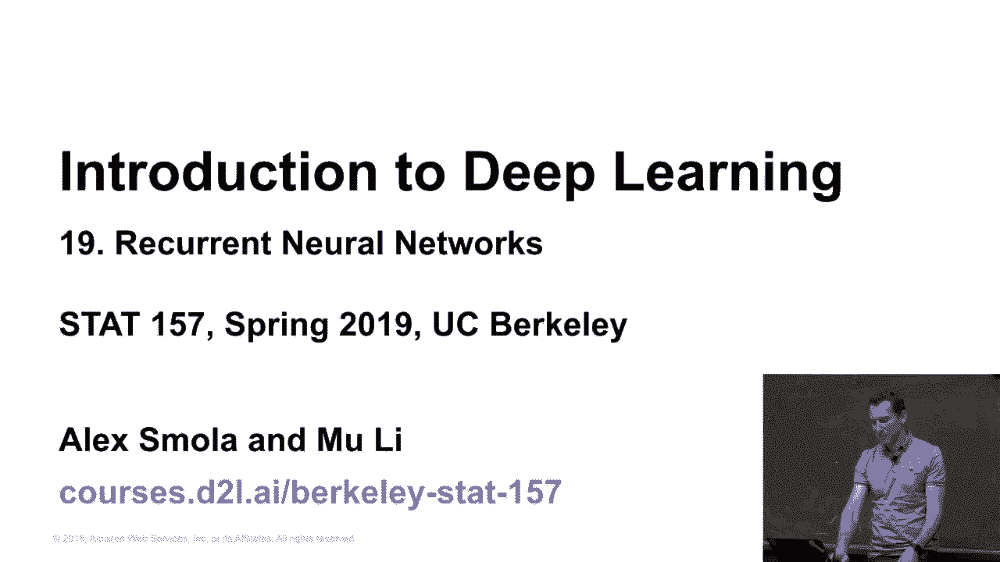
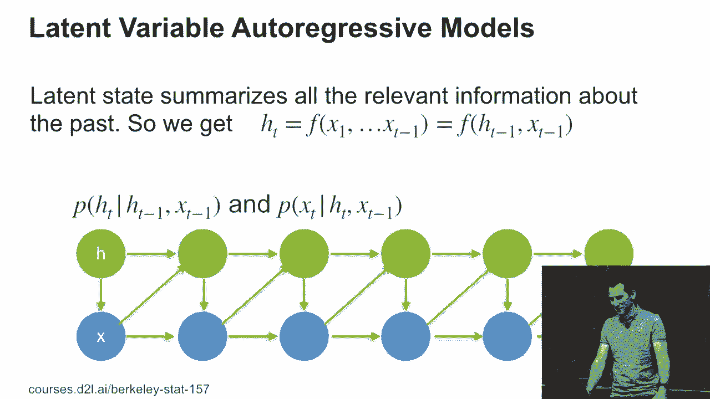
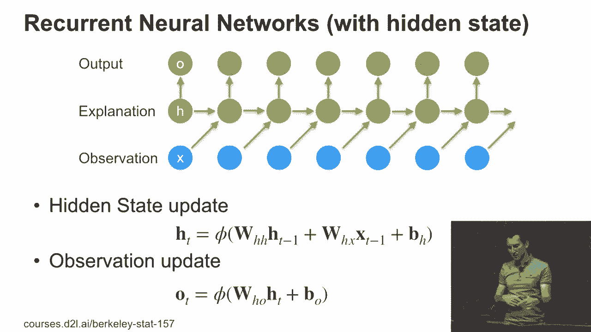

# P98：98. L19_1 递归神经网络 - Python小能 - BV1CB4y1U7P6

好的，欢迎来到关于递归神经网络的另一个课程。上周，我们讲解了基本的内容，为什么你实际上需要递归模型。潜在变量模型和不带潜在变量的模型之间的区别是什么。我们实际看到的是，潜在变量模型可以是。

这是处理你需要以某种方式聚合你到目前为止看到的所有过去状态的一个非常方便的方法。并将其聚合到一个有助于你做出预测的变量中，预测你接下来将看到什么。关键的区别实际上是，你可以选择仅使用过去的信息。

k个术语作为嵌入，或者你可以拥有一个潜在变量。如果你必须将k个术语作为嵌入，这样训练就非常容易，我们实际上也看到了发生了什么。但是你可能没有很高的精度。另一方面，如果你有一个潜在变量模型，你在可插入内容的自由度上会更多。

变量，然后它可能会表现得更好。所以在理想情况下，这将存储所有过去观测的充分统计量。所以今天我们将实际看看这些模型在实践中的表现，如何工程化其中的一些模型。让我们看看我们能进行多远，可能至少会涉及到基本的部分。

潜在变量模型，也许我们会涉及到GRU。 不太可能会讲到STM。让我们看看接下来怎么进行。

所以让我们简单回顾一下。基本上，我们假设我们有一个函数F，它将从X1到Xt-1的所有信息压缩成某个状态ht。当然，如果我们显式地计算这个，T的范围从1到10,000，这非常昂贵，所以你不希望这样做。我们做的是，我们基本上将这个函数F设计成一个可以接受。

它的输入是之前的统计量，ht-1。以及之前的观测值，以便我们可以推断出p(ht)。 给定ht-1，xt-1，以及p(xt)，给定ht，xt-1。因此我们只是从左到右在这个网格中前进。所以，实际上，宽度模型和不带潜在变量的模型之间的差异是相当微妙的。

但其含义非常深远。基本上，也许在大约十年前，我会和你们讨论如何在这种模型中做高效推断，如何使用图模型工具扩展它。有很多美丽的数学构造来支持这一点。之所以我们几乎跳过这一部分，直接进入深度学习，是因为。

学习实际上是双重的。首先，我们将使用的那些模型可能本来也不是真实的，对吧？毕竟，它们是模型，对吧？很少有情况，你知道你确实有10个聚类作为潜在状态？你不知道。这只是一个建模假设。其次，虽然你可能有。

你甚至可能会指定它，但即使你做了推理，也可能无法高效地得到精确结果。所以首先，你不应该信任你的模型；其次，即便你信任它，你也可能得不到真正的答案。你可能会决定，嗯，既然我不知道真相，而且即使我知道了，我也无法得到它。嗯。

让我们做一个工程师会做的最好的事情，也就是说，尝试设计我们能实际得到的最佳模型。这也是深度网络如今在某些应用中相较于图模型非常流行的原因。

仍然有一些情况，图模型仍然优于其他方法，特别是当你有非常具体的结构时，你可以有效地加以利用。但除此之外，这可以给你一点背景，帮助你理解为何它很重要。到目前为止有任何问题吗？是吗？

>> 图模型与神经网络的结合方式是，你可以绘制模型，同时仍然保持深度神经网络的表现力吗？ >> 所以问题是，你能将二者结合起来，得到两者的最佳效果吗？的确可以。比如说。

有一篇非常著名的论文，来自 Cabbie Murphy，讲的是如何将条件随机场与基础的图像预处理相结合，举例来说，用于执行图像分割。这篇论文真的是一篇很棒的论文，引用了几千次。所以，考虑到这篇论文可能才只有两三年历史，这真是相当了不起。

事实证明，到现在为止，这篇论文获得引用并不是因为位于顶部的条件随机场部分，而是因为本质上是扩展卷积，涉及到上采样特征图。这是一个稍微的旁注，在工程解决方案中其实是很简单的。

而现在，它的引用量正是因为这一点，而实际上现在没有人再使用 CRF 了，他们直接跳到深度学习。所以，只有在你真的非常非常必须要实现互操作性，或者你有一个非常狭窄的场景，你知道特定的图模型真的成立时，我才会推荐你构建这样一个混合方法。

但如果你遇到这种情况，你大概会知道。是的，所以这既是非常解放的，也让人有点伤感。伤感的是很多工具现在变得不再那么相关了，但也很解放，因为它让事情变得更容易了。

之前你可能会有一个很复杂的模型，然后你基本上找一个博士生，让他花三个月的时间，去解决数学问题，无论是样本方法还是变分推断，实施并写一篇论文，然后你会做五次这样的事。

论文之所以有保证，是因为数学内容并不简单，然后你就毕业了，对吧？

或者可能需要两三年的时间，但这是一个非常可预测的毕业方式。不幸的是，这种方法现在已经不再有效了，因为它们是更简便的工具。

无论如何，所需的模型都有隐藏状态。在最简单的情况下，你可以像这样定义。我的隐藏状态h t 只是由某个函数phi给出。我有一个矩阵向量w乘以h，再加上一个矩阵向量，w乘以通过的观测和一些偏置。然后对于输出，我同样只是取隐藏状态的某个非线性函数。

所以这就是最基础的形式，你可以用它来构建一个简单的RNN。而且这本质上并不比一个多层感知机复杂，除了你需要一步一步地进行处理。另一点是，我区分了输出和观测。

在许多情况下，我可能想使用输出生成下一个观测，并继续处理。但这不一定是必须的。比如，如果我要为命名实体标注文本序列，那么我的输入，即观测，就是单词。隐藏状态的解释则是隐藏状态本身。

然后输出将允许我生成命名实体标注，对吧？

所以，这就是为什么区分这两个部分是有意义的。

好的，那么现在让我们从代码的角度来实际看一下这个问题，因为。

这真的非常简单。
