# 1：深度学习课程安排与介绍 📅

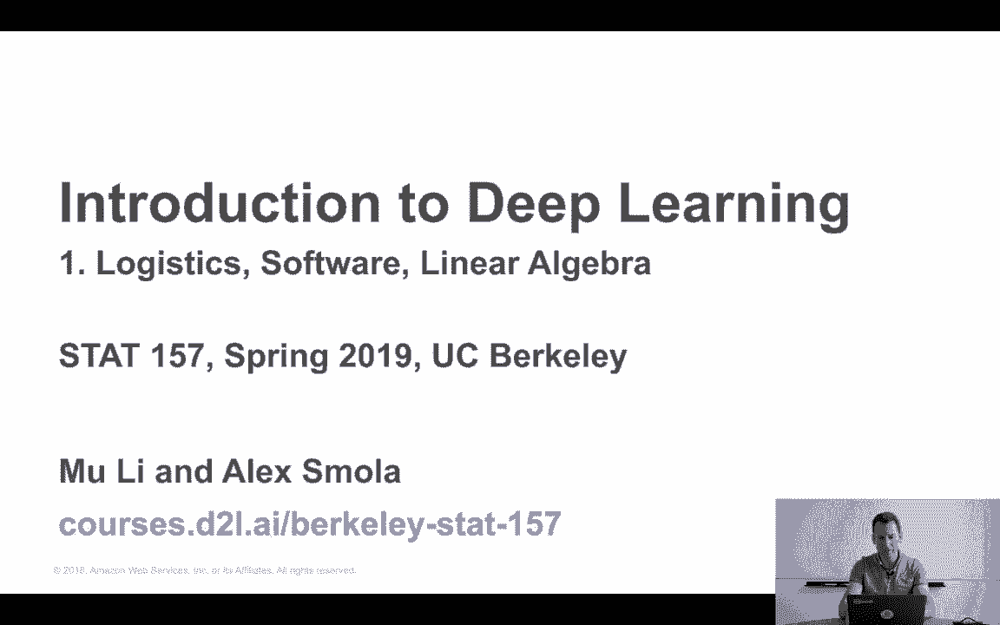

在本节课中，我们将学习本深度学习课程的整体安排、目标、评估方式以及核心资源。我们将了解如何通过作业、项目和考试来掌握深度学习，并熟悉课程使用的软件和框架。

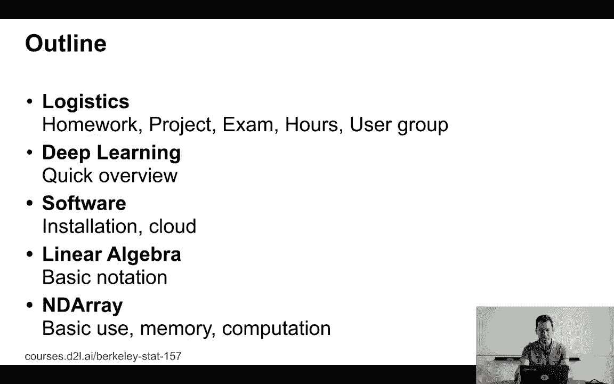

---

## 课程目标 🎯

上一节我们介绍了课程的基本信息，本节中我们来看看这门课的具体目标。

这门课的目标是介绍深度学习。具体内容包括基础的多层感知器、优化方法、卷积、序列模型（例如LSTM），以及注意力机制等内容。这构成了构建深度网络的基本框架。

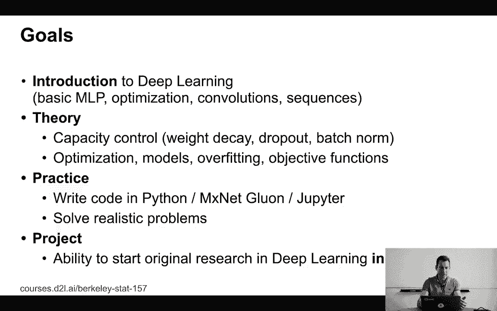

同时，课程也确保每个人都理解背后的深度学习理论，至少达到本科级别的深度学习入门课程水平。这意味着我们需要讨论容量控制、权重衰减、丢弃法（Dropout）、批量归一化等内容。此外，课程还会涉及优化、不同类型的模型、过拟合、目标函数等主题。

既然这是一个实践课程，课程还希望确保每个人都能理解如何在实践中执行和应用深度学习。因此，学生将需要在Jupyter Notebooks中用Python编写代码。课程选择的深度学习框架是MXNet。如果学生熟悉PyTorch或TensorFlow等其他框架，这应该不会造成太大困扰。

课程的最终目标是让学生能够解决实际的问题，尽管这些问题不一定是大规模或极其复杂的，但至少是现实且可操作的。项目将帮助学生顺利开始带有辅助功能的研究，并作为进行原创性深度学习研究的起点。

---

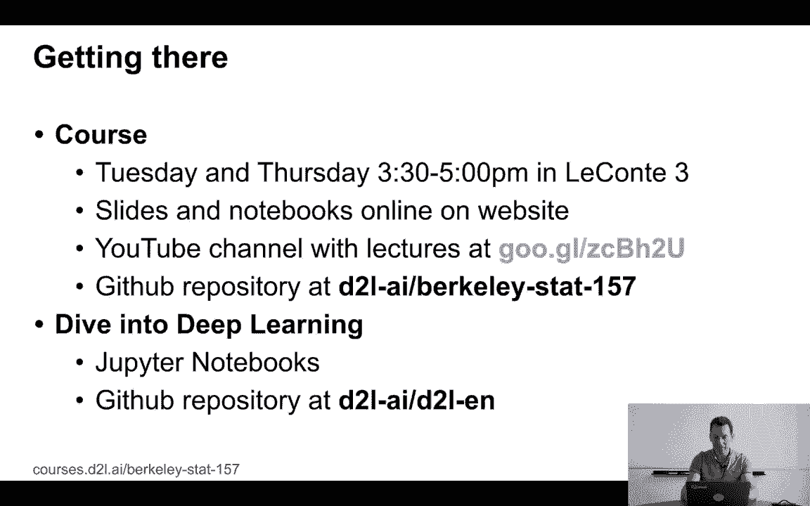

## 课程结构与资源 📚

了解了课程目标后，我们来看看课程是如何组织的，以及有哪些学习资源。

课程将在周二和周四下午3:30到5:00举行。如果不能现场参加，也可以在YouTube上观看直播。所有的讲义和笔记本都会通过课程网站发布。YouTube频道会更新最新的讲座内容。所有材料也会上传到GitHub仓库：`d2l-ai/berkeley-stat-157`。

以下是课程的核心资源列表：
*   **讲座**：由Alex Smola、Mully和讲师本人共同教授。
*   **办公时间**：星期四下午1点到2点，在Evans Hall 13号。也可以通过电子邮件联系：`berkeley-stat-157@googlegroups.com`。
*   **助教**：Rachel Hu和Ryan Theison。他们的办公时间大概率在星期三下午2点到4点，地点在Evans Hall。
*   **讨论平台**：课程讨论在 `discuss.d2l.ai/c/courses` 进行，不再使用Piazza。与MXNet或机器学习相关的问题可以在此发布。

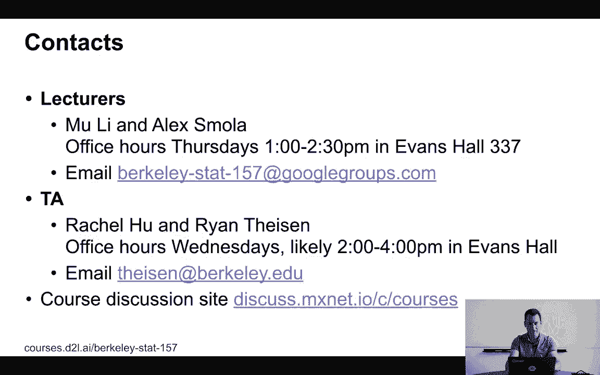

---

## 作业安排与提交 📝

课程提供了丰富的资源，而作业是确保学习效果的关键环节。

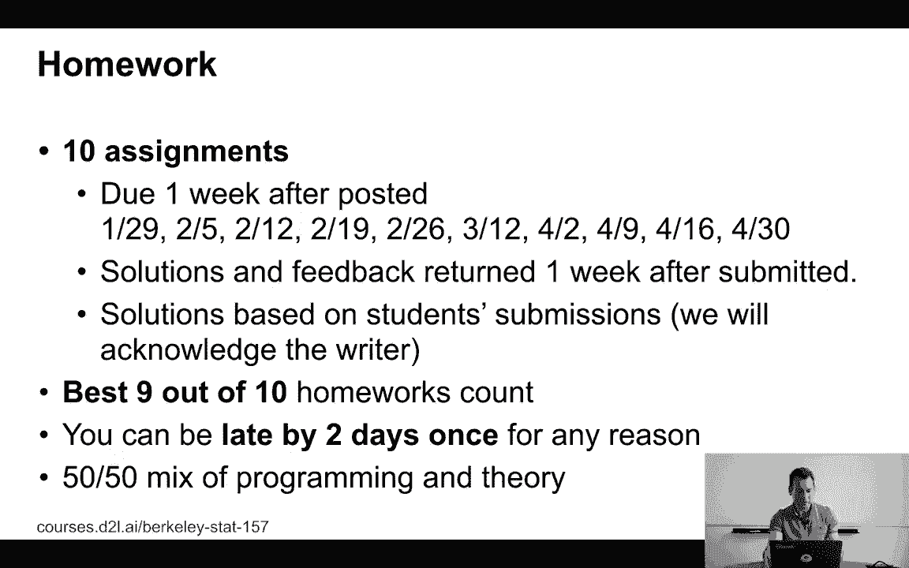

课程共有10次作业，每周发布一次。作业包含一定量的编码任务和一些理论内容，所有内容都是解释型的。作业在发布后一周内提交。

评分时，只计算最好的九次作业成绩。这意味着学生可以因任何原因（如会议、面试或生病）缺席一次作业，而不会影响最终成绩。

所有作业都通过Git提交。操作方式是，在作业截止日期（星期二下午4点）前提交到GitHub仓库。学生应以PDF、LaTeX源文件和Jupyter Notebooks的形式提交作业。助教会通过Git提交注释反馈。

如果学生仍在等待名单上，也应通过Git提交作业，以便有时间戳记录。使用Git是一项非常有用的技能，对未来的职业生涯有帮助。

---

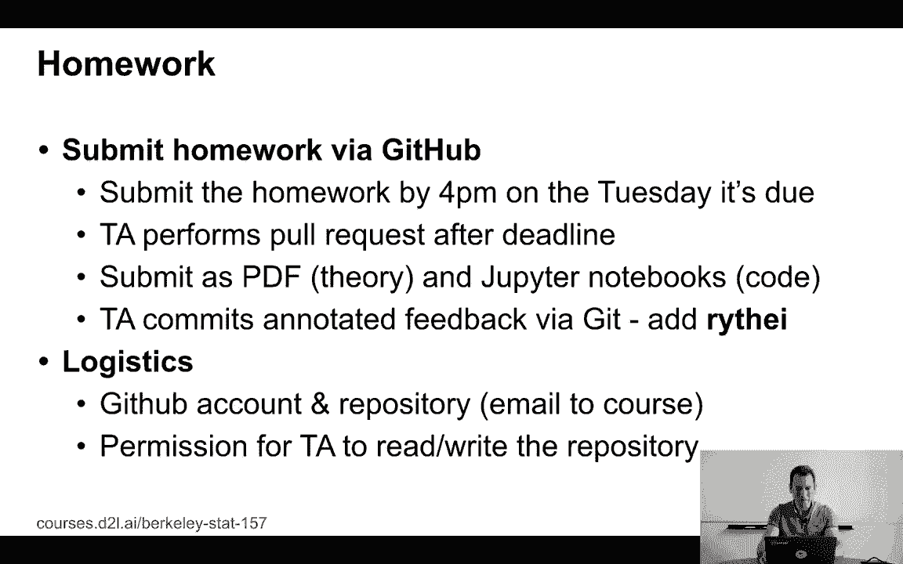

## 考试与项目评估 📊

完成作业是日常练习，而考试和项目则是更综合的评估方式。

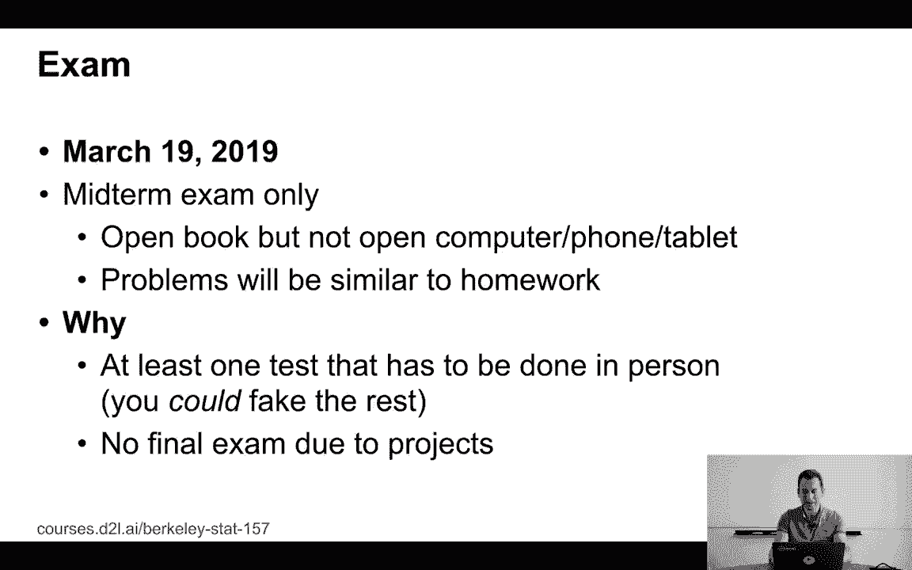

课程有一场期中考试，日期定在2019年3月19日。考试是开卷形式，但不允许使用计算机、手机、平板等电子设备。学生可以使用任何纸质笔记或打印的幻灯片。考试的目的是确保学生本人参与了课程学习。

课程没有期末考试，因为项目占据了评估的绝大部分比重。

项目的目标是让学生在机器学习领域进行原创性工作。原创性可以体现在应用现有工具解决新问题、处理新数据集，或提出新算法。这是一个“带有辅助轮的研究”项目，旨在帮助学生起步，成为更好的科学家、研究员和工程师。

项目要求以团队形式进行，每个团队由三到五名学生组成。项目将模拟学术研究过程，最终产出包括论文报告和演示文稿。报告需按照NeurIPS会议模板撰写。如果项目完成得出色，学生甚至可以考虑将其提交到学术会议上。

---

## 项目时间安排 ⏳

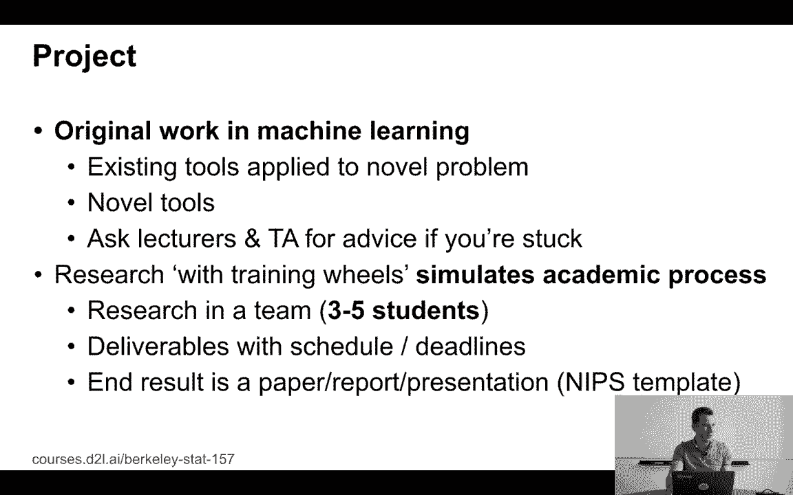

为了确保项目顺利进行，课程设定了明确的时间节点和检查点。

以下是项目的主要时间节点：
*   **团队注册截止日期**：2月5日。学生需要在此日期前组建团队并提供成员名单和初步标题。
*   **项目提案展示**：3月5日。团队需要提交一到两页的书面提案，并进行五分钟的全班展示。
*   **与助教沟通**：在4月22日至25日之间，每个团队必须与助教至少沟通一次，讨论项目进展。
*   **最终提交与展示**：5月7日和9日。团队需要提交至少六页、最多不超过二十页的最终报告，并准备六到二十张幻灯片进行项目展示。

课程鼓励学生尽早开始规划项目，并与讲师和助教保持沟通，以获得反馈和帮助。

---

## 总结 ✨

本节课中，我们一起学习了加州大学伯克利分校STAT 157深度学习课程的整体安排。

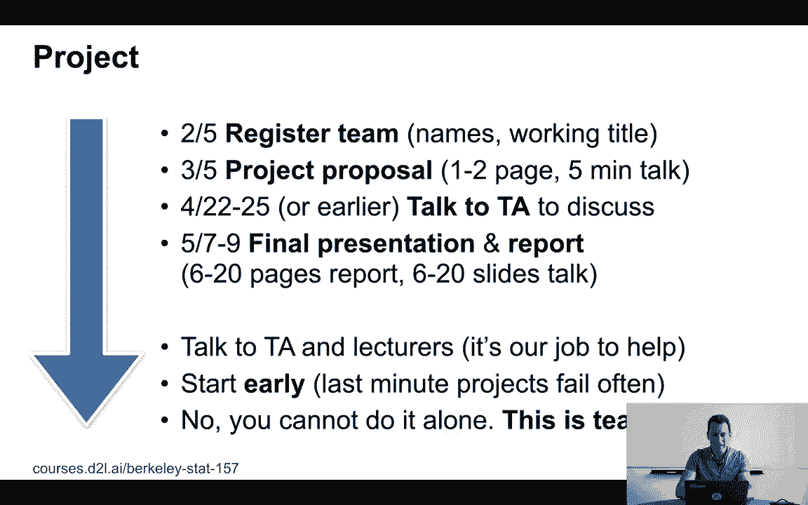

我们明确了课程的目标是理论与实践并重，涵盖从多层感知器到注意力机制的核心概念，并使用MXNet框架进行实践。我们介绍了课程的主要资源，包括讲座、办公时间、GitHub仓库和在线讨论区。我们了解了通过每周作业巩固知识、通过开卷期中考试检验理解、以及通过团队研究项目培养原创能力和协作精神的评估体系。最后，我们梳理了项目从组队到最终展示的完整时间线。

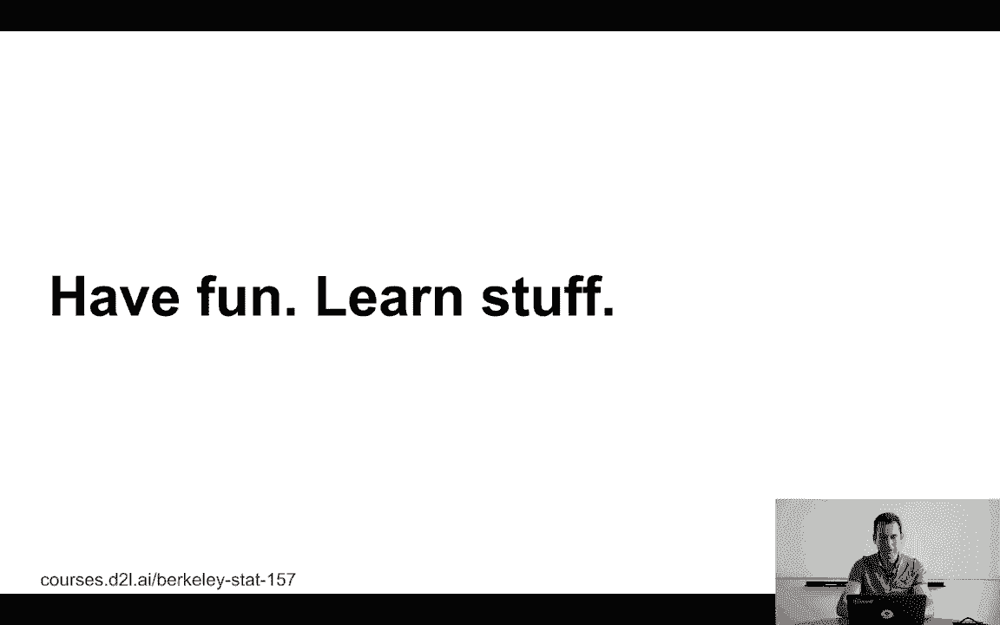

总体目标是确保学生能享受学习过程，掌握深度学习的核心技能，并为未来的研究或工程实践打下坚实基础。