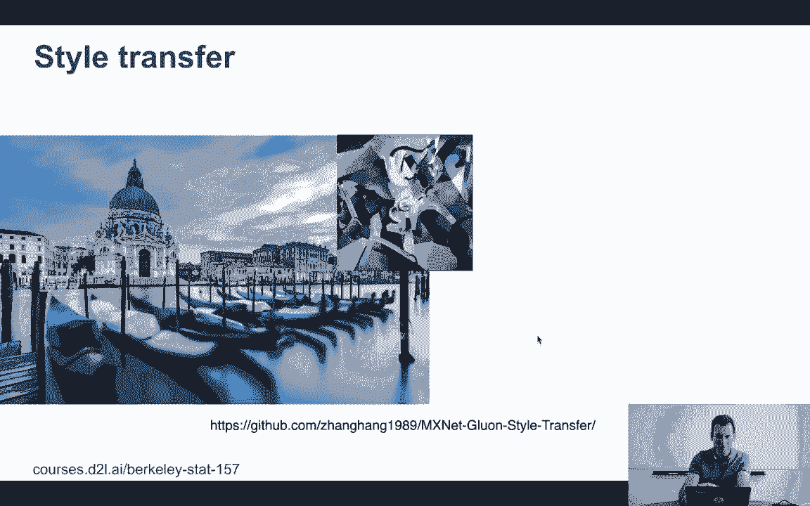
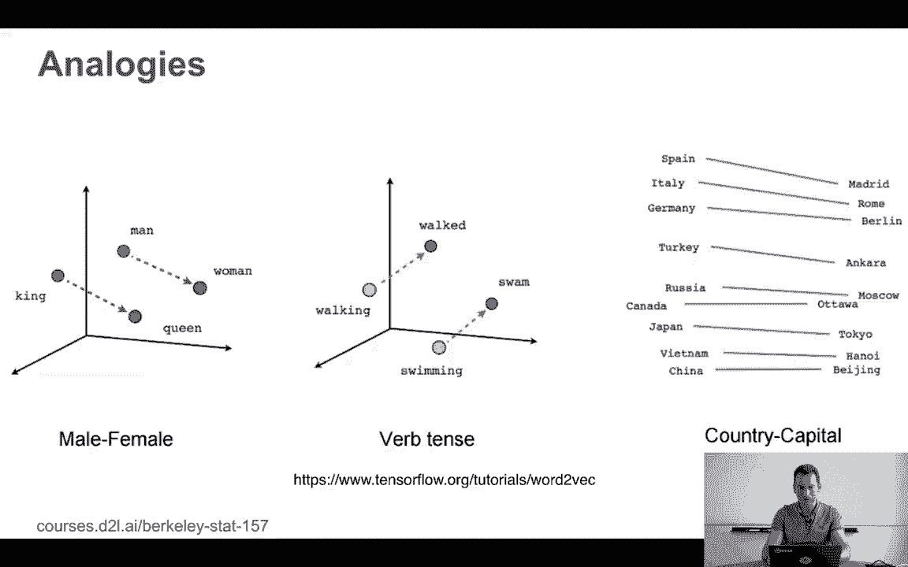
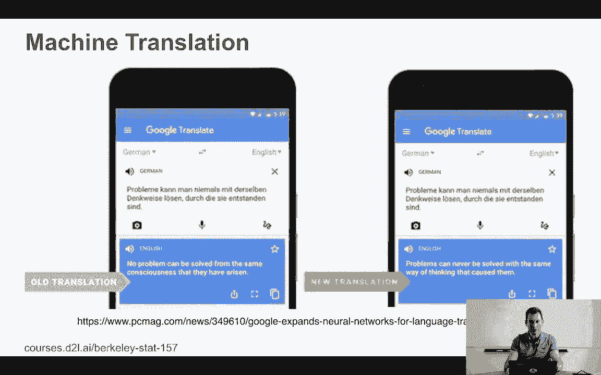
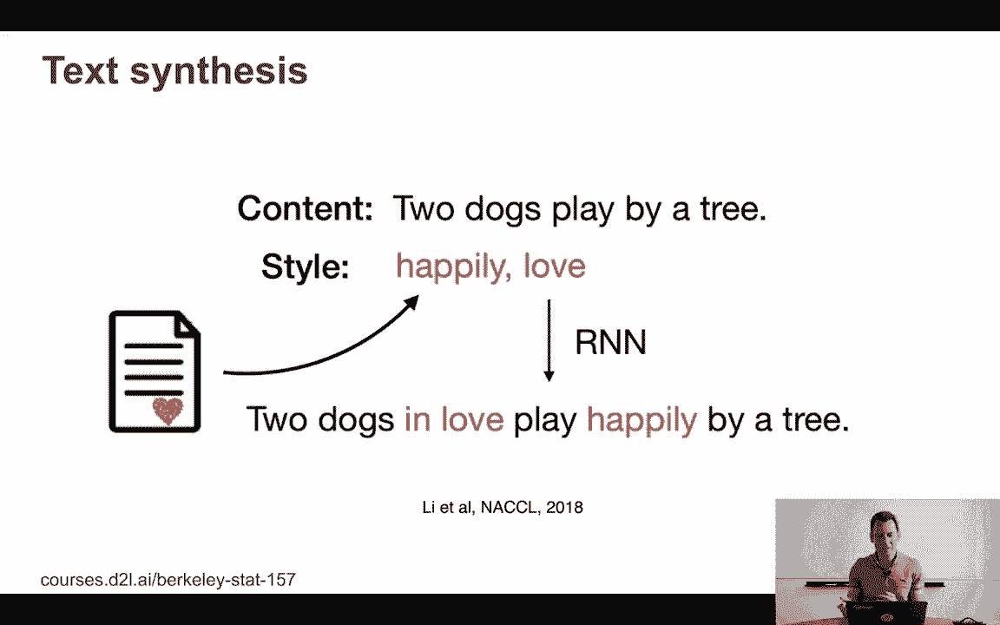
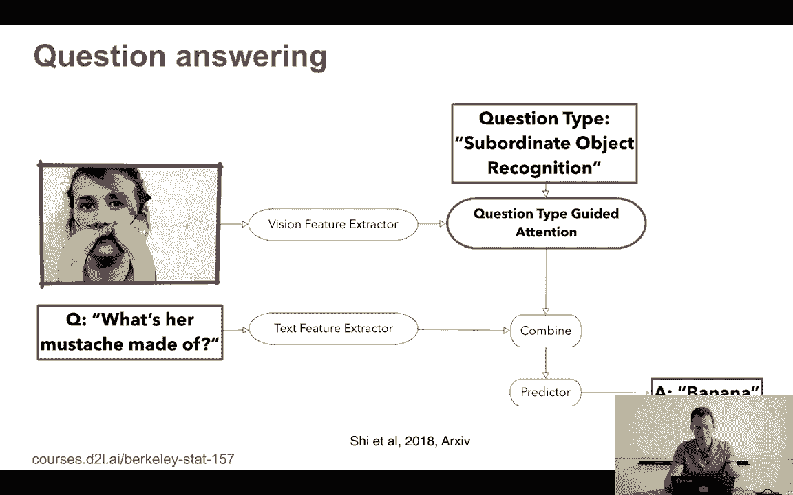

# 2：深度学习概览 🧠

在本节课中，我们将对深度学习进行一个非常简要的概述。目的是让你了解深度学习能够完成哪些任务，激发你的学习兴趣，并对这门课程将要探讨的内容有一个初步的认识。

## 图像分类 📸

深度学习最广为人知的应用之一是图像分类。ImageNet竞赛是展示深度学习在计算机视觉领域能力的关键里程碑。

以下是ImageNet竞赛中分类器错误率的变化趋势：
*   **2010年**：分类器的准确率参差不齐，错误率从非常糟糕到约20%-25%不等。
*   **2012年**：首个使用深度学习的团队将错误率降至25%以下，表现显著优于其他团队。
*   **2013年及以后**：几乎所有团队都突破了25%的错误率门槛，性能提升迅速。到2017年，根据不同的衡量标准，错误率已降至5%到10%之间。

## 图像分割与标注 🎯

除了识别整张图片的类别，深度学习还能进行更精细的图像分割与标注。

例如，Matterport在GitHub上开源的Mask R-CNN代码，以及在GluonCV等工具包中能找到的类似实现，都使用了卷积神经网络等技术。这些算法不仅能识别物体，还能精确地勾勒出每个物体的轮廓（分割），并为图片中的不同区域生成文字描述（标注）。

## 风格迁移 🎨

深度学习可以实现图像的风格迁移，即将一张图片的内容与另一张图片的艺术风格相结合。

其核心思想非常直接：我们希望生成一张新图片，使其在深层网络激活值上（内容）与源图片（如维纳斯雕像）相似，同时在浅层统计特征上（纹理、色彩）与目标风格图片相似。

你可以将此功能理解为手机上的高级艺术滤镜。此外，深度学习还能合成以假乱真的人脸，这些完全由算法生成的面孔看起来非常自然。

## 词向量与类比 🤖

在自然语言处理领域，深度学习可以将单词转换为数学向量（即词嵌入），从而捕捉单词之间的语义关系。

例如，通过词向量空间中的计算，我们可以进行类比推理：
*   `“男人” - “女人” ≈ “国王” - “女王”`
*   `“西班牙” - “马德里” ≈ “意大利” - “罗马”`

基于此，甚至可以尝试进行向量运算，如 `“意大利” - “罗马” + “马德里”` 的结果会接近 `“西班牙”`。这表明模型确实学习到了一些有意义的语义知识。如今，几乎所有已部署的机器翻译工具都在某种程度上使用了深度学习技术。

## 文本生成与视觉问答 📝

深度学习能够根据给定的开头或条件生成连贯的文本。

例如，给定开头“两只狗”，模型可能生成“快乐地玩耍并相爱，还买了一棵树”这样的后续内容。虽然逻辑上可能有些跳跃，但这展示了模型生成创造性文本的能力。

更复杂的任务是视觉问答（VQA），即让AI理解图片并回答相关问题。例如，对于问题“胡须迷宫是什么？”，模型需要：
1.  理解这个看似荒谬的问题（通常女性不会长甜菜根状的胡须）。
2.  从计算机视觉模块提取图片特征。
3.  通过注意力机制关注图片的相关部分（如识别出“香蕉”）。
4.  综合信息给出答案。

这是2018年一篇论文中展示的可行技术。

## 图像描述生成 🖼️➡️📃

深度学习还能为图片自动生成描述性字幕。

例如，给出一张小狗坐在沙滩心形图案里的图片，人类可能会写下“可爱的小狗坐在沙滩上的心形图案里”。深度学习模型，如2016年相关论文所展示的，已经能够自动生成类似“一只狗坐在沙滩上，旁边还有另一只狗”这样准确、自然的描述。

---

本节课我们一起浏览了深度学习在多个领域的应用概览，包括图像分类、分割、风格迁移、词向量、文本生成、视觉问答和图像描述生成。这只是一个非常简要的介绍，在后续课程中，我们将深入探讨这些激动人心的技术，并学习如何亲手实现它们。希望这个概述能让你对深度学习的力量充满期待。