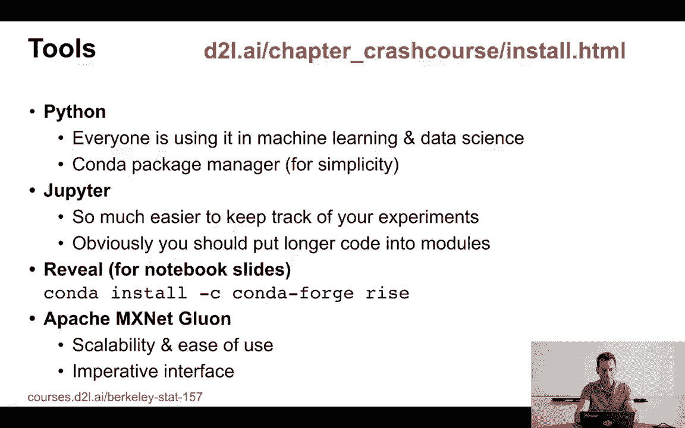
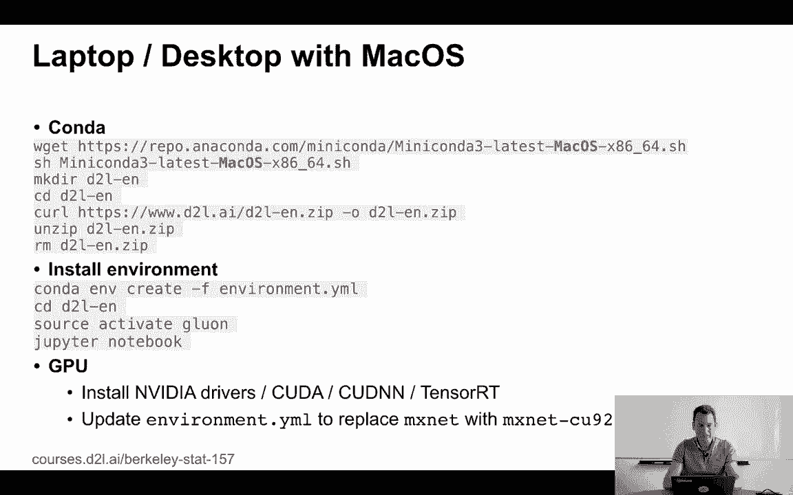
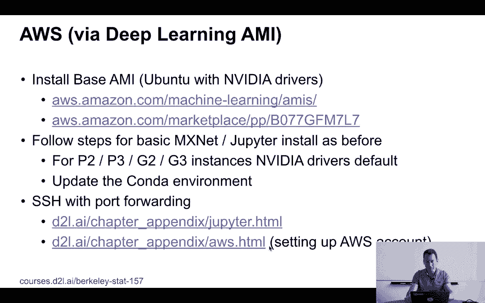
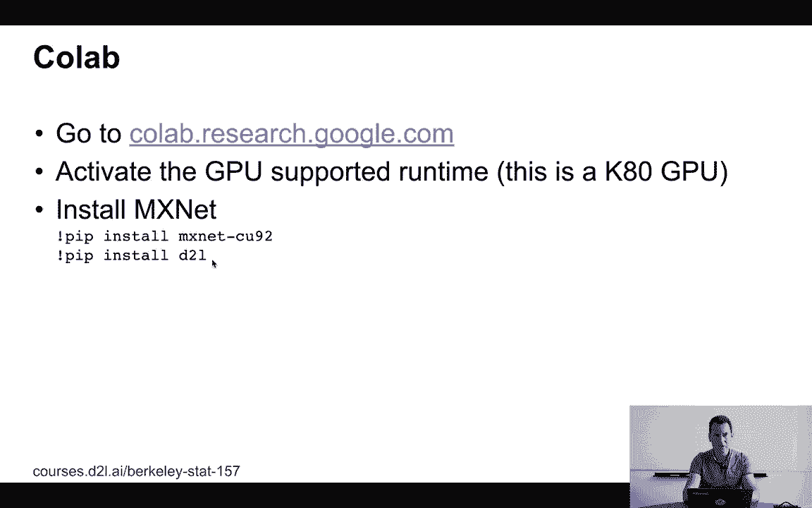

# 3：软件环境搭建指南 🛠️

在本节课中，我们将学习如何为深度学习实践搭建必要的软件环境。我们将介绍核心工具Python、包管理器Conda、交互式笔记本Jupyter以及深度学习框架MXNet的安装与配置方法。

---

## 1. 核心工具概述

我们将要使用的工具是Python，它在机器学习和数据科学领域应用广泛。为了简化包管理操作，我们将使用Conda。

我们将使用Jupyter笔记本进行代码编写和实验跟踪。对于本课程涉及的代码量（约100到200行），Jupyter是一个非常合适的工具。

最后，我们需要一个深度学习框架。本课程选择的是MXNet-Gluon，因为它具有可扩展性好、易于使用、接口友好、跨硬件兼容性强等优点。

> 如果你使用其他深度学习框架，你仍然能够理解所有理论和模型。但如果你想动手实践代码，则需要安装MXNet。

---

## 2. 基础安装步骤（Linux/Mac）



上一节我们介绍了核心工具，本节中我们来看看在Linux或Mac系统上的具体安装步骤。

如果你使用的是通用的Linux云服务器、Linux笔记本电脑或Mac电脑，安装过程相当简单。

以下是具体步骤：
1.  从Conda官网下载并安装最新的mini-conda安装程序。
2.  从`d2l-en.zip`获取本课程书籍的最新版本代码包。
3.  解压缩后，你会找到一个包含所有相关包定义的环境配置文件`environment.yml`。
4.  通过Conda创建该环境。命令为：`conda env create -f environment.yml`。
5.  激活Gluon环境。命令为：`source activate gluon`（Mac/Linux）。
6.  进入解压后的目录，运行Jupyter笔记本即可。

---

## 3. GPU支持配置

如果你希望使用GPU来加速计算，则需要额外的配置。这可能会比安装MXNet本身花费更多时间。

首先，你需要安装NVIDIA驱动程序、CUDA和cuDNN。请严格按照NVIDIA官网的说明进行操作。

其次，你需要修改环境配置文件`environment.yml`，将MXNet的CPU版本替换为对应的GPU版本。例如，将`mxnet`替换为`mxnet-cu92`以支持CUDA 9.2。

> 这只是为了确保你能在设备上实际使用GPU。

---

## 4. Windows系统安装

如果你使用的是Windows系统，安装过程与Linux/Mac略有不同。

主要区别有以下两点：
1.  你需要下载适用于Windows 64位系统（Windows x86_64）的Conda安装程序（.exe文件）。
2.  激活Conda环境的命令不同。在Windows上，你应使用：`activate gluon`，而不是Linux/Mac上的`source activate gluon`。



除此之外，其他步骤与前述基础安装步骤一致。

---

## 5. 使用云服务（AWS）

如果你不想在本地处理复杂的NVIDIA驱动安装，可以直接使用亚马逊AWS云服务。

你可以从“深度学习基础AMI”镜像开始创建云服务器实例。访问课程提供的链接，查找最新的基础AMI（例如基于MXNet的版本），然后按照步骤启动实例。

对于P2、P3、G2、G3等GPU实例，你仍需在实例内部配置NVIDIA驱动并更新Conda环境。

---

## 6. 安全访问云服务器Jupyter

在云服务器上运行Jupyter会遇到安全问题：直接将Web服务器端口对外开放是危险的。

你需要使用SSH端口转发（隧道）技术。它的作用是将云服务器上Jupyter打开的端口，通过加密的SSH连接转发到你本地计算机的某个端口。

这样，你就可以在本地浏览器中安全地访问运行在远程云服务器上的Jupyter笔记本。

> 我们将在后续课程中实际演示这一操作。你也可以参考书籍网站中关于AWS的附录获取详细指南。如需AWS学术积分，可以联系我们。

---



## 7. 使用Google Colab

你也可以使用Google Colab进行实验。访问 `colab.research.google.com`，创建一个新笔记本。

以下是使用前的必要设置：
1.  在菜单栏选择“运行时” -> “更改运行时类型”，确保激活了“GPU”支持的硬件加速器。
2.  在笔记本的第一个单元格中，运行以下两行安装命令：
    ```python
    !pip install mxnet-cu92
    !pip install d2l
    ```
    然后你就可以开始运行代码了。

Colab的优点是提供免费的GPU资源。缺点是运行环境不是永久性的，长时间无活动会被回收，本地变量状态会丢失，因此需要注意保存重要数据。

---



## 总结

本节课中，我们一起学习了为深度学习课程搭建软件环境的多种途径。我们介绍了核心工具Python、Conda、Jupyter和MXNet，并详细说明了在Linux、Mac、Windows系统上的安装步骤，以及如何配置GPU支持。此外，我们还介绍了通过AWS云服务和Google Colab这两种无需复杂本地配置的替代方案，特别是强调了使用SSH隧道安全访问云服务器的重要性。现在，你的实践环境已经准备就绪。