# 4：线性代数基础 🧮

在本节课中，我们将要学习线性代数的核心概念。线性代数是深度学习的基石，因为它擅长表示和计算深度学习所需的大量函数与数据。我们将从最基础的概念开始，逐步构建理解。

## 概述

线性代数提供了处理多维数据的数学框架。我们将从标量和向量开始，然后介绍矩阵及其运算，最后讨论一些特殊的矩阵及其在计算中的意义。

---

## 标量 🔢

标量是我们熟悉的单个数字。我们可以对它们进行基本的数学运算。

以下是标量的基本操作：
*   **加法与乘法**：`c = a + b` 或 `c = a * b`。
*   **函数应用**：计算如 `sin(a)` 或 `cos(a)`。
*   **绝对值**：`|a|` 表示 a 的长度，如果 `a > 0` 则为 `a`，否则为 `-a`。

标量的绝对值满足两个重要性质：
1.  **三角不等式**：`|a + b| ≤ |a| + |b|`。
2.  **乘积的绝对值**：`|a * b| = |a| * |b|`。

## 向量 ➡️

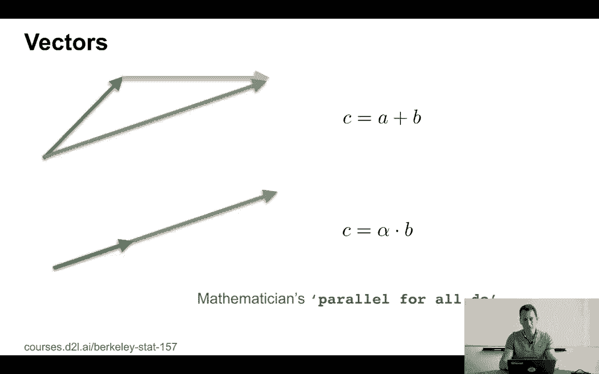

上一节我们介绍了标量，本节中我们来看看向量。向量是一组有序排列的数字。我们可以对向量进行逐元素的运算。

以下是向量的基本操作：
*   **向量加法**：`c = a + b`，其中 `c_i = a_i + b_i`。
*   **标量乘法**：`c = α * b`，其中 `c_i = α * b_i`。
*   **逐元素函数**：例如，对向量 `a` 应用符号函数 `sign(a)`。

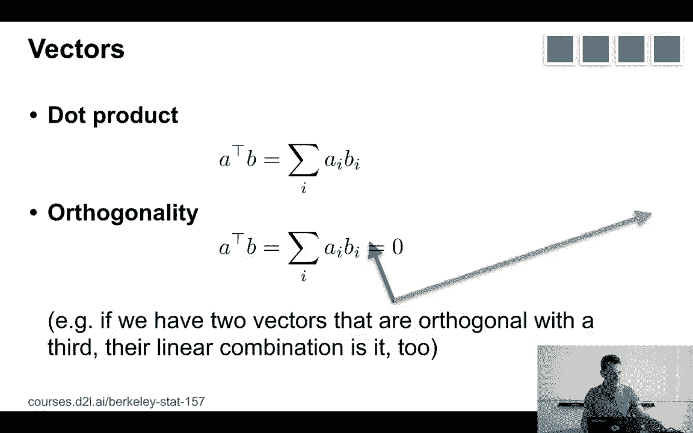

### 向量的长度（范数）

衡量向量长度有多种方式，最常用的是**欧几里得范数（L2范数）**：
`||a||₂ = sqrt(∑_i a_i²)`
在二维空间中，这对应勾股定理。范数满足以下性质：
*   `||a|| ≥ 0`。
*   `||a + b|| ≤ ||a|| + ||b||`（三角不等式）。
*   `||α * a|| = |α| * ||a||`。

另一种常见的范数是**曼哈顿距离（L1范数）**：
`||a||₁ = ∑_i |a_i|`
它表示在网格状路径（如城市街区）上移动的总距离。

### 向量运算的几何意义

向量加法可以几何地理解为将两个向量首尾相接。标量乘法则是将向量按系数进行拉伸或收缩。这种表示方式天然适合并行计算，因为对每个元素的操作是独立的，这正是GPU（图形处理器）所擅长的。

## 点积与正交性 ✖️

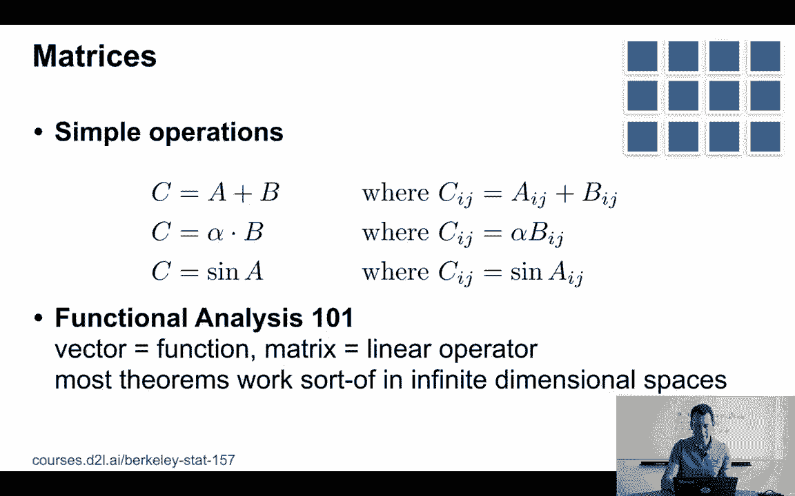

一个非常重要的向量运算是**点积**。两个向量 `a` 和 `b` 的点积定义为：
`aᵀb = ∑_i a_i * b_i`
如果两个向量的点积为零，即 `aᵀb = 0`，我们称它们为**正交**向量。

正交性有一个有用的性质：如果向量 `a` 和 `b` 都与另一个向量 `c` 正交，那么它们的任意线性组合 `(αa + βb)` 也与 `c` 正交。证明如下：
`(αa + βb)ᵀc = α(aᵀc) + β(bᵀc) = α*0 + β*0 = 0`
这种线性性质在未来非常有用。

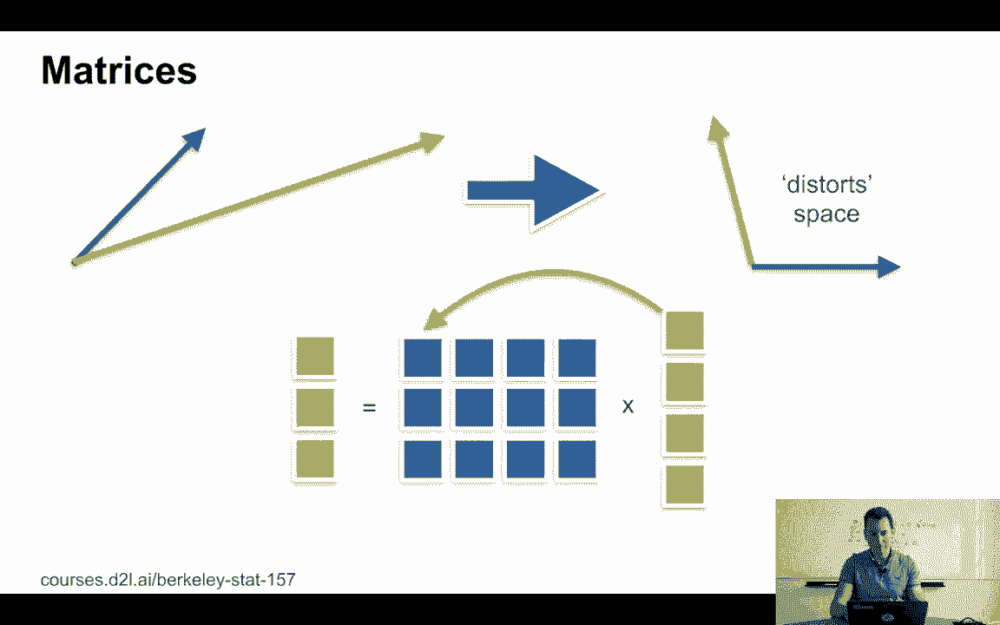

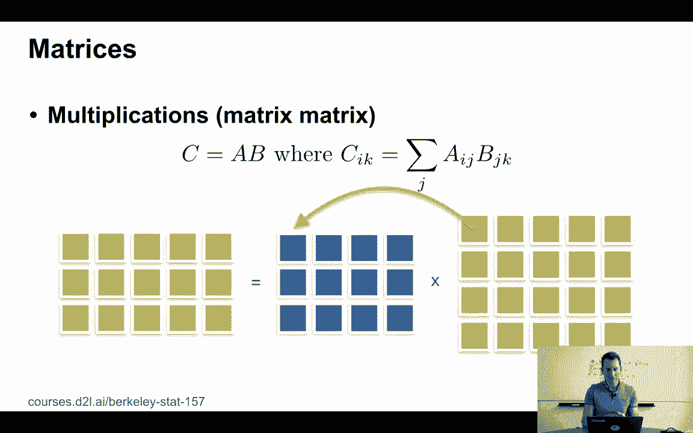

## 矩阵 🧱

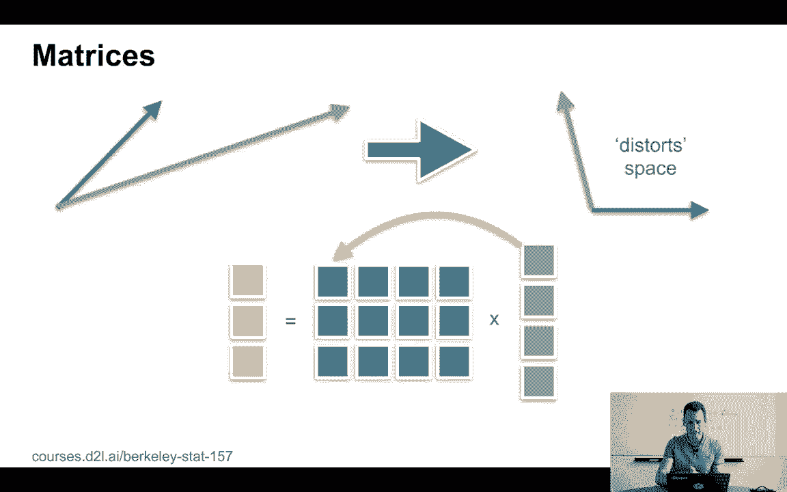

现在，让我们从向量扩展到矩阵。矩阵是排列成矩形阵列的数字集合。它们也构成一个向量空间，支持加法和标量乘法。

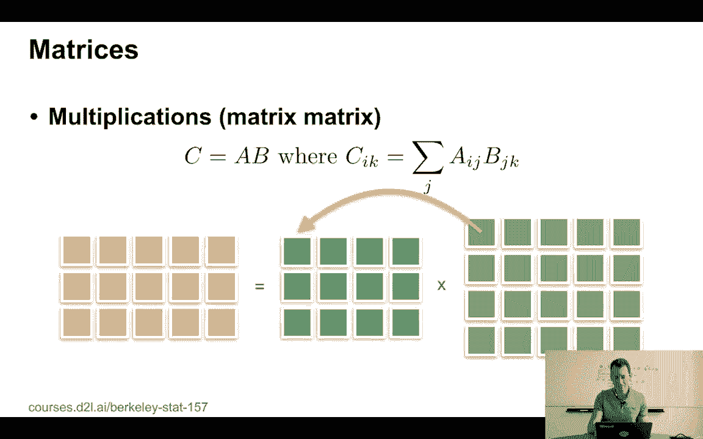

以下是矩阵的基本操作：
*   **矩阵加法**：`C = A + B`，按元素相加。
*   **标量乘法**：`C = α * B`，每个元素乘以α。
*   **逐元素函数**：如 `sin(A)` 或 `cos(A)` 作用于每个元素。

### 矩阵乘法

矩阵最强大的操作是**矩阵乘法**，这是线性代数中“魔法”发生的地方。
*   **矩阵乘以向量**：将一个 `m×n` 的矩阵 `A` 乘以一个 `n` 维向量 `x`，得到一个 `m` 维向量 `b`。
    `b_i = ∑_j A_ij * x_j`
    这可以理解为矩阵的每一行与向量做点积。矩阵乘法会对向量空间进行线性变换（如旋转、缩放、剪切）。
*   **矩阵乘以矩阵**：将一个 `m×n` 的矩阵 `A` 乘以一个 `n×p` 的矩阵 `B`，得到一个 `m×p` 的矩阵 `C`。
    `C_ik = ∑_j A_ij * B_jk`
    这相当于用矩阵 `A` 分别乘以矩阵 `B` 的每一列，然后将结果并排堆叠起来。

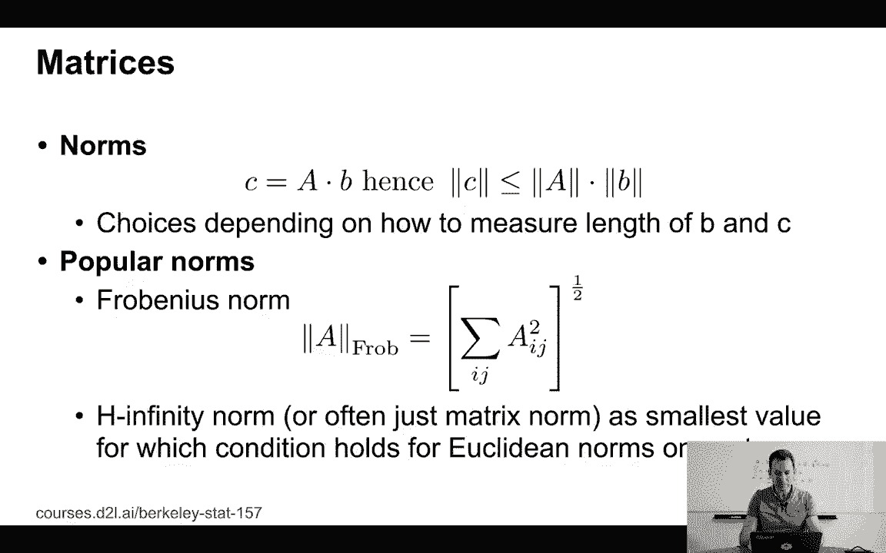

### 矩阵的范数

矩阵的范数需要定义，以确保乘法不等式 `||A * B|| ≤ ||A|| * ||B||` 成立。常见的矩阵范数有：
*   **谱范数**：与矩阵的最大特征值相关（当向量使用L2范数时）。
*   **弗罗贝尼乌斯范数**：将矩阵视为一个长向量，计算其L2范数。
    `||A||_F = sqrt(∑_i ∑_j A_ij²)`

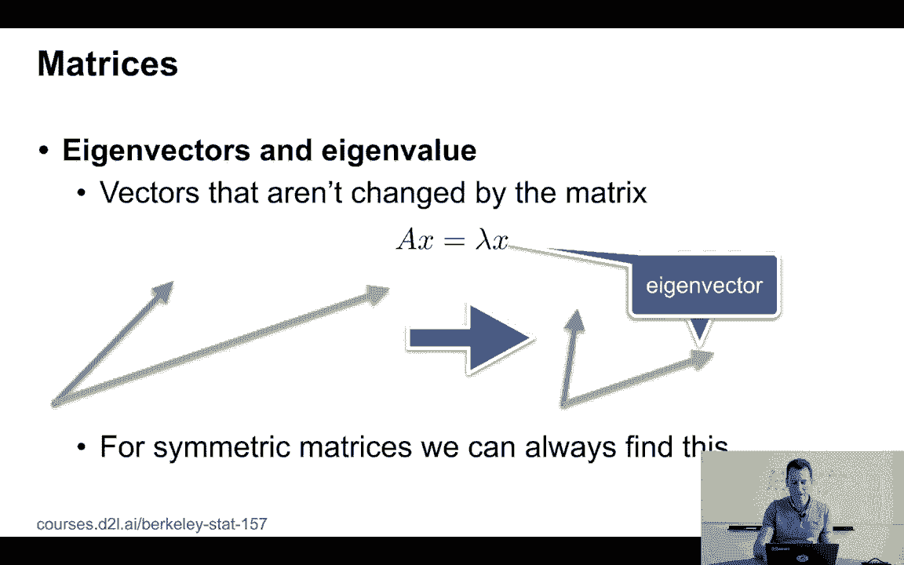

## 特征值与特征向量 🔍

我简要提到了特征值。**特征向量**是那些经过矩阵变换后方向不变（仅被拉伸或压缩）的向量。满足：
`A * x = λ * x`
其中 `λ` 称为**特征值**。对于对称矩阵，总可以找到一组完整的特征向量来分解矩阵。

## 特殊矩阵 🎭

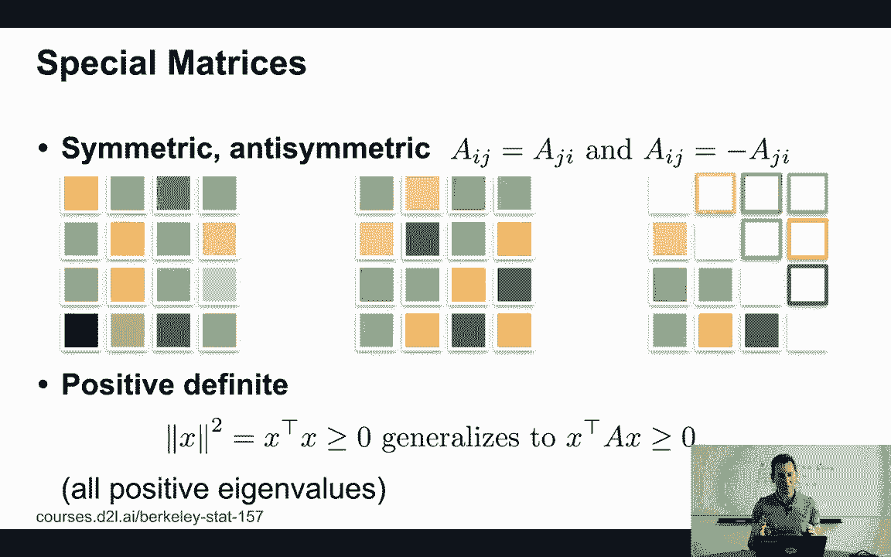

除了通用矩阵，还有一些具有特殊性质的矩阵在深度学习中很重要。

以下是几种重要的特殊矩阵：
*   **对称矩阵**：满足 `A_ij = A_ji`。其元素关于主对角线对称。
*   **反对称矩阵**：满足 `A_ij = -A_ji`。其主对角线元素必须全为零。
*   **正定矩阵**：推广了向量长度的概念。对于所有非零向量 `x`，满足 `xᵀ A x > 0`。若等号可以取零，则为半正定矩阵。
*   **正交矩阵**：其所有行（或列）彼此正交且长度为1。满足 `U * Uᵀ = I`（单位矩阵）。正交矩阵的逆等于其转置。
*   **置换矩阵**：每行和每列有且仅有一个元素为1，其余为0。它用于对向量或矩阵的行/列进行重新排列。可以证明，置换矩阵是正交矩阵。

## 为什么关心这些？💻

我们关心这些线性代数概念，一个核心原因是计算效率。现代GPU（如图形处理器）拥有数千个小型处理核心，能够同时并行执行大量相同的操作（如向量和矩阵的逐元素运算）。线性代数的运算结构天然适合这种并行计算模式，使得大规模矩阵乘法等操作能够高效执行，这正是训练深度学习模型所必需的。

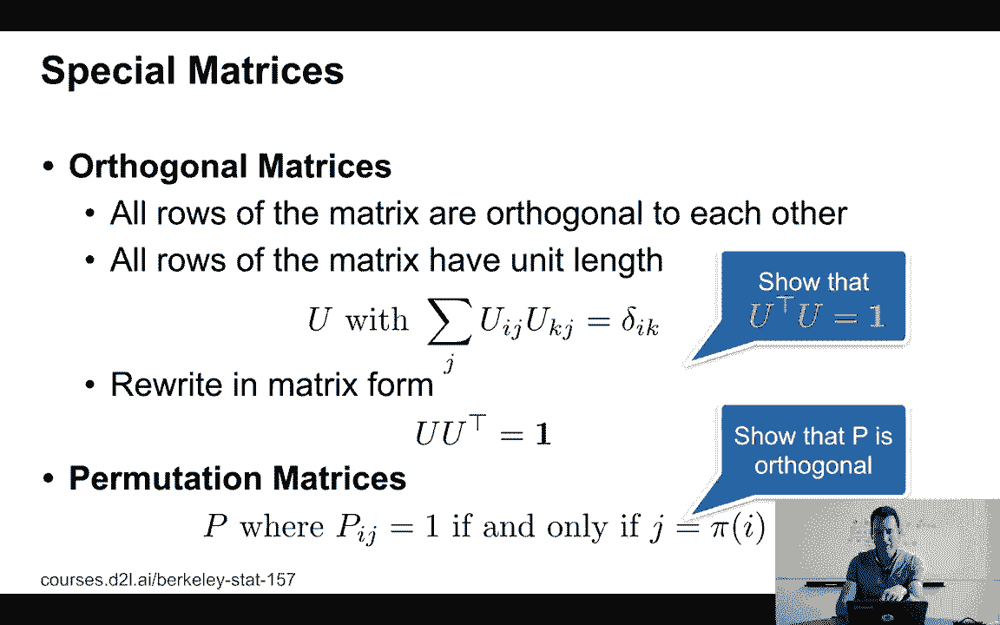

---

## 总结

本节课中我们一起学习了线性代数的基础知识。我们从**标量**和**向量**出发，学习了它们的运算和范数。然后引入了**点积**和**正交性**的概念。接着，我们扩展到**矩阵**，掌握了矩阵加法、乘法和范数。我们还探讨了**特征值与特征向量**的意义。最后，我们认识了几种**特殊矩阵**（对称、正交、置换等），并理解了线性代数与GPU并行计算之间的紧密联系，这为后续的深度学习学习奠定了坚实的数学基础。