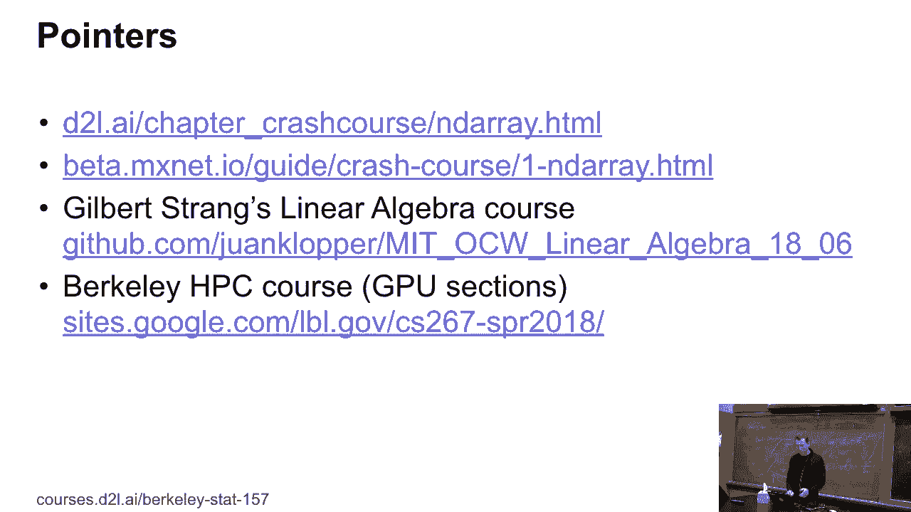
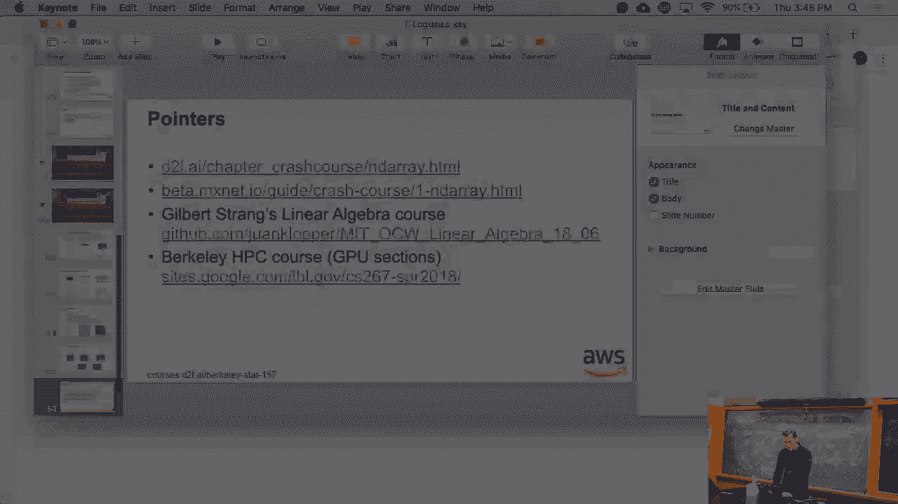
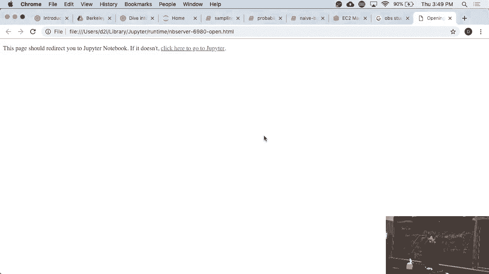
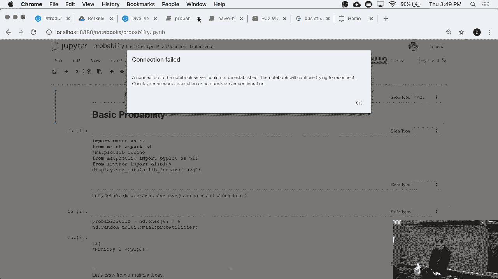
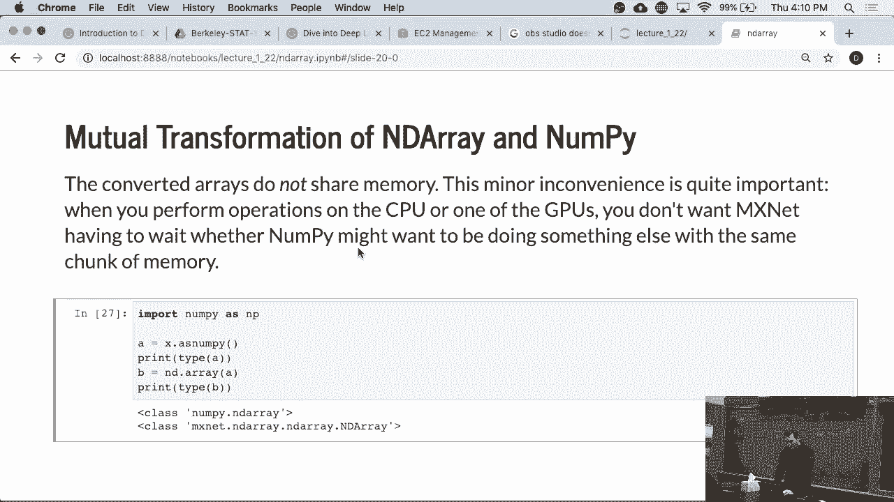

# 6：NDArrays 入门教程 📊

在本节课中，我们将学习深度学习框架 MXNet 中的核心数据结构——NDArray。我们将了解它的基本概念、创建方法、常用操作以及与 NumPy 的交互。掌握 NDArray 是进行高效数值计算和深度学习的基础。

---

## 1. 数组与张量：多维数据的表示

上一节我们介绍了线性代数的基本概念，本节中我们来看看这些向量和矩阵在计算机中是如何存储和表示的。

一个**标量**就是一个零维数组。
一个**向量**是一个一维数组。
一个**二维数组**可以表示一个矩阵，例如数据集中的特征行（每个观测对应一行属性）。

对于更高维度：
*   **三维数组**：可以表示一张黑白图像（高度 x 宽度 x 1），或一张彩色图像（高度 x 宽度 x 3个颜色通道 RGB）。
*   **四维数组**：可以表示一个图像批次（样本数 x 高度 x 宽度 x 通道数）。
*   **五维数组**：可以表示视频数据（时间帧 x 样本数 x 高度 x 宽度 x 通道数）。

超过五维在视觉上展示会变得困难，但原理相同。**张量（Tensor）** 是这些多维数组的统称，其概念并不复杂。

---

## 2. 创建与访问 NDArray





我们可以像使用 NumPy 一样创建和访问 NDArray。





首先需要导入 MXNet 的 NDArray 模块：
```python
import mxnet.ndarray as nd
```

以下是创建数组的几种基本方法：

*   **创建连续数字的数组**：使用 `arange` 函数。
    ```python
    x = nd.arange(12)  # 创建一个包含0到11的一维数组
    ```
*   **查询数组形状与大小**：
    *   `x.shape` 返回数组的形状，例如 `(12,)`。
    *   `x.size` 返回数组中元素的总数，例如 `12`。
*   **改变数组形状**：使用 `reshape` 函数。
    ```python
    x = x.reshape((3, 4))  # 将一维数组重塑为3行4列的二维数组
    ```
    可以使用 `-1` 自动推断某一维度的大小：
    ```python
    x = x.reshape((3, -1))  # 自动推断第二维为4
    ```
*   **创建未初始化数组**：使用 `empty`。**注意**：其内容为内存中的任意值，并非全零。
    ```python
    a = nd.empty((3, 4))  # 类似 malloc，分配内存但不初始化
    ```
*   **创建全零或全一阵列**：
    ```python
    z = nd.zeros((3, 4))
    o = nd.ones((3, 4))
    ```
*   **从列表创建指定数组**：
    ```python
    nd.array([[1, 2, 3], [4, 5, 6]])
    ```
*   **创建随机数组**：例如，从标准正态分布中采样。
    ```python
    nd.random.normal(0, 1, shape=(3, 4))
    ```

访问元素的方式与 NumPy 完全一致，可以通过索引访问单个元素、一行、一列或一个子块。

---

## 3. NDArray 的基本运算

NDArray 支持丰富的数学运算。

*   **按元素运算**：使用 `+`, `-`, `*`, `/`, `**` 等运算符直接在相同形状的数组间进行运算。
    ```python
    x + y, x - y, x * y, x / y, x ** y  # 均为按元素操作
    ```
*   **指数、三角函数等**：
    ```python
    nd.exp(x), nd.sin(x), nd.cos(x)
    ```
*   **矩阵乘法（点积）**：使用 `dot` 函数。**重要**：`*` 是按元素乘，`dot()` 才是矩阵乘。
    ```python
    nd.dot(x, y.T)  # 计算 x 和 y 转置的矩阵乘积
    ```
*   **连接数组**：使用 `concat` 函数，可以沿指定轴连接多个数组。
    ```python
    nd.concat(x, y, dim=1)  # 沿第1轴（列）连接
    ```
*   **逻辑比较**：返回布尔值数组。
    ```python
    x == y
    ```
*   **求和**：`sum()` 函数可以对整个数组或沿特定轴求和。
    ```python
    x.sum(), x.sum(axis=0)  # 全局求和，沿第0轴（行）求和
    ```
*   **转换为 Python 标量**：
    ```python
    x.asscalar()  # 当数组只有一个元素时，将其转换为 Python 标量
    ```

---

## 4. 广播机制

广播机制是处理不同形状数组间运算的强大工具。其核心思想是：通过适当复制数据，使两个数组的形状兼容，从而进行按元素运算。

**规则**：从尾部维度开始，逐一比较。维度大小要么相等，要么其中一个为1，要么其中一个不存在（维度大小为1被自动扩展）。

例如，一个 `(3, 1)` 的数组 `A` 与一个 `(1, 2)` 的数组 `B` 相加：
```
A (3x1) + B (1x2) -> 结果 (3x2)
```
运算时，`A` 的列被复制到2列，`B` 的行被复制到3行，然后进行按元素加法。这类似于线性代数中的外积运算。

广播机制可以避免使用显式的 `for` 循环，极大提升代码效率和可读性。

---

## 5. 索引、切片与内存管理

索引和切片用于访问或修改数组的特定部分。

```python
x[0:2, :] = 12  # 将前两行的所有列元素设置为12
```

关于内存，需要注意赋值操作可能产生新对象：

```python
y = x + y  # 创建新数组，y 指向新的内存地址
```

为了节省内存，特别是处理大数组时，应使用**原地操作**：

```python
# 方法一：使用全切片赋值
z[:] = x + y  # 结果写入z的原始内存
# 方法二：使用原地操作符
y += x        # 等价于 y[:] = y + x，但更高效
# 方法三：调用明确的原地函数
nd.elemwise_add(x, y, out=y)
```

此外，`zeros_like` 或 `ones_like` 可以方便地创建与目标数组形状相同的全零或全一阵列。

```python
nd.zeros_like(y)
```

---

## 6. 与 NumPy 的互操作

在实际项目中，常需要将 NumPy 数据转换为 NDArray 以供 MXNet 计算，或将结果转换回 NumPy 进行后续处理。

*   **从 NumPy 转到 NDArray**：
    ```python
    np_array = np.ones((2, 3))
    nd_array = nd.array(np_array)  # MXNet 知道如何转换 NumPy 对象
    ```
*   **从 NDArray 转到 NumPy**：
    ```python
    np_array = nd_array.asnumpy()
    ```

**重要提示**：这种转换会触发数据在 CPU 内存中的实际拷贝，并可能引起 Python 全局解释器锁（GIL）的争用。如果频繁进行，会**显著降低程序性能**。因此，应尽量减少这种转换，尤其是在循环内部。

---

## 7. 总结与资源

本节课中我们一起学习了 MXNet 中 NDArray 的核心知识：

1.  **概念**：理解了标量、向量、矩阵到高阶张量的关系。
2.  **创建**：掌握了使用 `arange`, `zeros`, `ones`, `random`, `array` 等方法创建数组。
3.  **运算**：学会了按元素运算、矩阵乘法、广播机制等关键操作。
4.  **操作**：熟悉了索引、切片以及节省内存的原地操作。
5.  **交互**：了解了与 NumPy 互操作的方法及其性能注意事项。

为了深入学习，你可以参考以下资源：
*   **本书 NDArray 章节**：提供更系统的讲解。
*   **MXNet 官网 (beta.mxnet.io)**：查阅 NDArray API 文档和教程。
*   **线性代数复习**：如果对基础概念不熟，建议复习线性代数中的**点积**、**外积**等概念。

对于想了解硬件加速（如 **GPU**）原理的同学，可以搜索相关的高性能计算（**HPC**）课程资料，它们通常用直观的方式解释了 **GPU** 如何通过大量并行处理单元高效执行线性代数运算，而像 MXNet 这样的框架则帮助我们避免了直接编写复杂的 **CUDA** 代码。



掌握 NDArray 是开启深度学习实践的第一步，请务必动手练习以巩固理解。