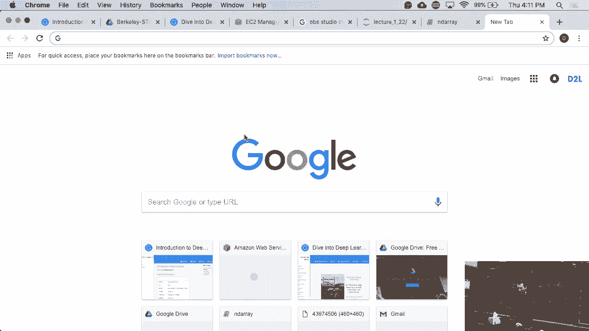
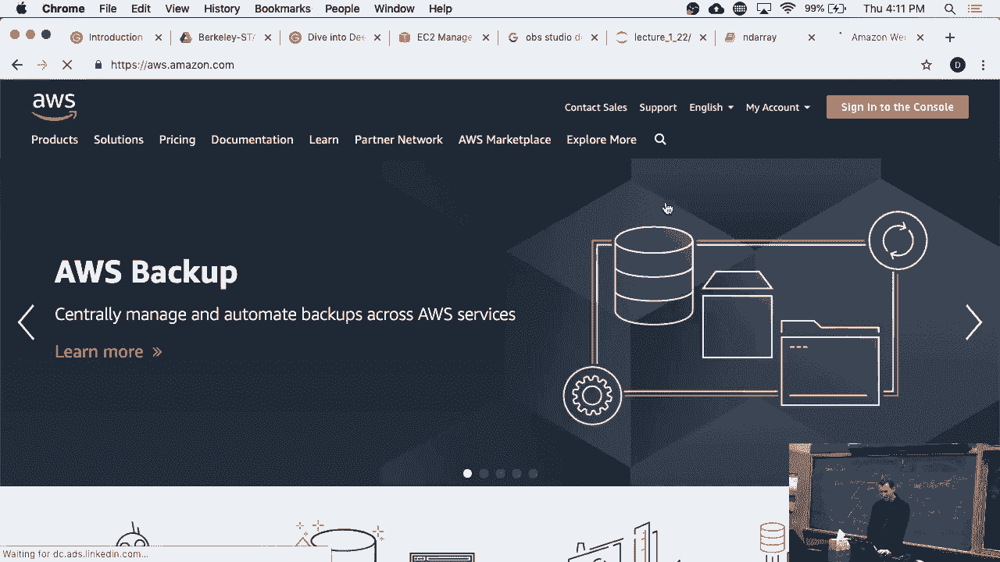
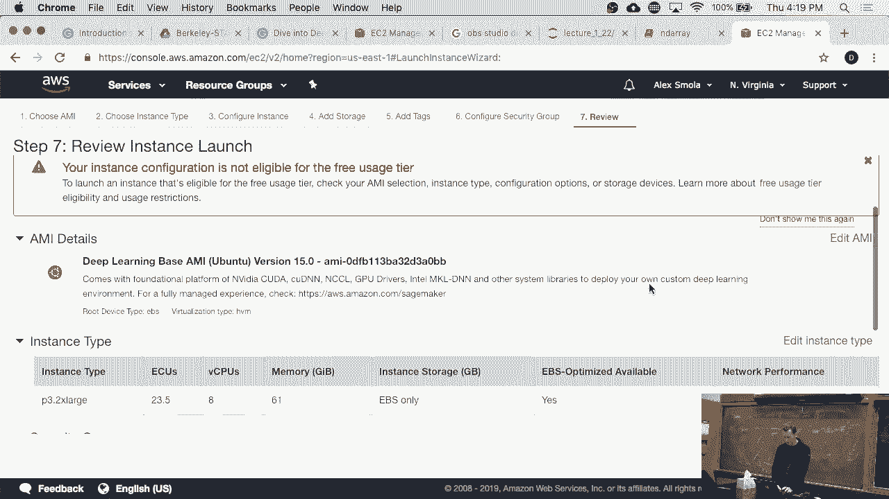
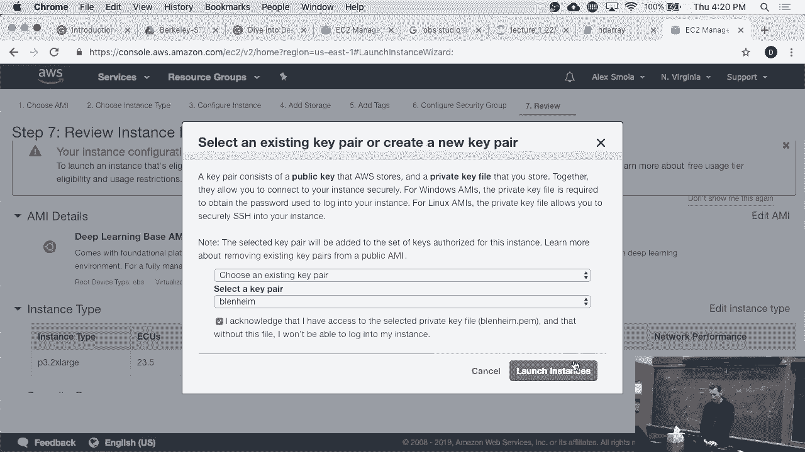
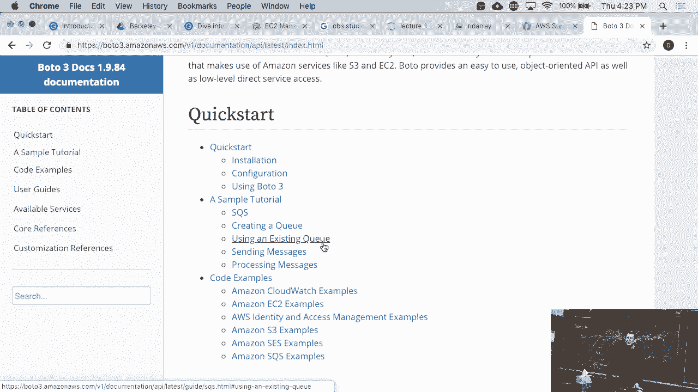

# 7：AWS EC2 实例启动教程 🚀

在本节课中，我们将学习如何在亚马逊云服务（AWS）上启动一个EC2实例。我们将从登录控制台开始，逐步完成选择地区、实例类型、配置存储和安全设置等关键步骤，最终启动一个可用于深度学习的GPU实例。



---



## 登录AWS控制台

首先，你需要访问AWS官方网站并登录你的账户。


点击“登录到控制台”按钮。


如果你尚未注册，需要先创建一个AWS账户。

---

## 选择AWS区域 🌍

AWS在全球运营着多个区域。不同区域提供的设备、服务和价格可能存在差异。

选择区域时，你可以考虑以下因素：
*   **延迟**：选择离你的用户或客户地理位置近的区域，例如为印度尼西亚的用户选择新加坡区域。
*   **服务可用性**：并非所有服务在所有区域都可用。
*   **法规遵从**：某些数据法规要求数据存储在特定区域，例如欧盟。

对于本教程，建议选择“美国东部（弗吉尼亚北部）”或“美国西部（俄勒冈）”区域。

---

## 启动EC2实例

在AWS控制台的服务列表中，找到并点击 **EC2** 服务。EC2提供了可租用的虚拟计算机（实例）。

点击“启动实例”按钮以开始创建新实例。

---

## 选择亚马逊机器镜像（AMI）

AMI是预装了操作系统和软件的模板。你可以选择公共AMI，也可以创建自己的。

以下是选择AMI的步骤：
1.  在搜索框中输入“深度学习”。
2.  从结果中选择一个预装了NVIDIA驱动和深度学习框架的AMI，例如“Deep Learning AMI (Ubuntu)”。
3.  选择基础版本即可。

---

## 选择实例类型 💻

AWS提供了上百种实例类型，针对不同计算需求（如CPU、内存、GPU、存储）进行了优化。

对于需要GPU进行深度学习的任务，请按以下步骤操作：
1.  筛选出GPU实例系列（如`p3`, `g4`等）。
2.  `p3.2xlarge` 实例搭载了NVIDIA Volta架构的GPU，性能强大但成本较高。
3.  为节省成本，可以考虑使用**抢占式实例**，其价格远低于按需实例，但可能被AWS随时中断。

实例类型的命名规则通常反映了其配置，例如 `p3.2xlarge` 表示P3系列，2倍于大型实例的配置。

---

## 配置实例存储 💾

你可以为实例配置附加的存储卷（EBS卷）。

配置存储时，请注意：
*   默认根卷大小可能较小，你可以根据需求增加，例如设置为50GB。
*   可以选择卷类型，如通用型SSD (`gp2`) 或预配置IOPS的SSD (`io1`)，后者能提供稳定的高性能。

增加存储大小的操作类似于为电脑挂载一块新硬盘。

---

## 配置安全组 🔒

安全组充当虚拟防火墙，控制进出实例的流量。

创建一个新的安全组时，建议采取以下安全措施：
*   **限制SSH访问**：仅允许从你的可信IP地址（如学校或公司的网络范围）通过22端口进行SSH连接。
*   **避免开放所有端口**：不要设置过于宽松的规则，以防被恶意扫描或攻击。

---



## 选择密钥对 🔑

你需要一个密钥对来安全地通过SSH连接到你的Linux实例。

以下是相关操作：
1.  在下拉菜单中选择一个已有的密钥对。
2.  或者点击“创建新密钥对”，为其命名（例如`my-ec2-key`）并下载私钥文件（`.pem`）。
3.  **务必妥善保管私钥文件**，它是连接实例的唯一凭证。



---

## 处理配额与启动实例

点击“启动实例”后，你可能会遇到启动失败的情况，提示“实例配额不足”。

这是因为AWS对新账户的某些资源类型（如GPU实例）设置了默认限制。你需要申请提高配额。

申请提高配额的步骤如下：
1.  在AWS控制台顶部，点击“支持” -> “支持中心”。
2.  选择“创建案例” -> “服务限额增加”。
3.  在表单中，选择服务为“EC2”，限额类型为“实例”。
4.  指定区域和所需的实例类型（如`p3.2xlarge`），并请求将限额提高到所需数量（例如4个）。
5.  提交请求，通常AWS支持团队会很快通过邮件或电话与你联系并处理。

成功提高配额后，再次尝试启动实例即可。

---

## 使用命令行与SDK 🛠️

除了Web控制台，你还可以通过命令行工具或编程语言来管理AWS资源。

*   **AWS CLI**：通过命令行执行所有AWS操作。
*   **AWS SDK**：使用Python、JavaScript等语言编写脚本，以编程方式启动和管理大量实例，适用于自动化任务。

例如，使用Python的`boto3`库启动一个实例的核心代码结构如下：
```python
import boto3
ec2 = boto3.resource(‘ec2’)
instance = ec2.create_instances(
    ImageId=‘ami-xxxxxxxx’, # 你的AMI ID
    InstanceType=‘p3.2xlarge’,
    KeyName=‘my-ec2-key’,
    MinCount=1,
    MaxCount=1
)
```

---

## 总结 📝



本节课中，我们一起学习了在AWS上启动一个EC2实例的完整流程。我们从登录控制台和选择区域开始，逐步完成了选择AMI、实例类型、配置存储和安全组、管理密钥对等关键步骤。我们还了解了如何处理实例配额限制，并简要介绍了通过命令行和SDK进行自动化管理的方法。掌握这些步骤后，你就能在云端快速获取所需的计算资源了。