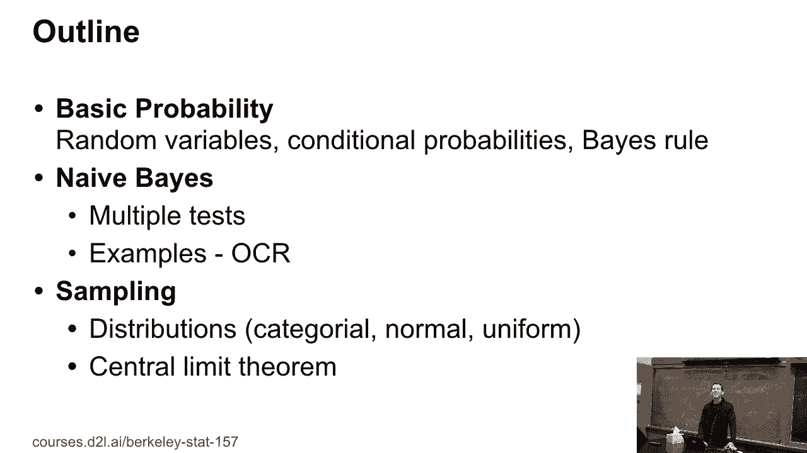
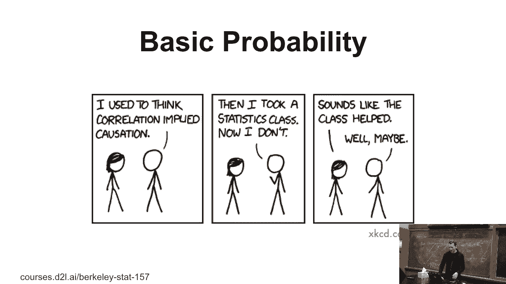
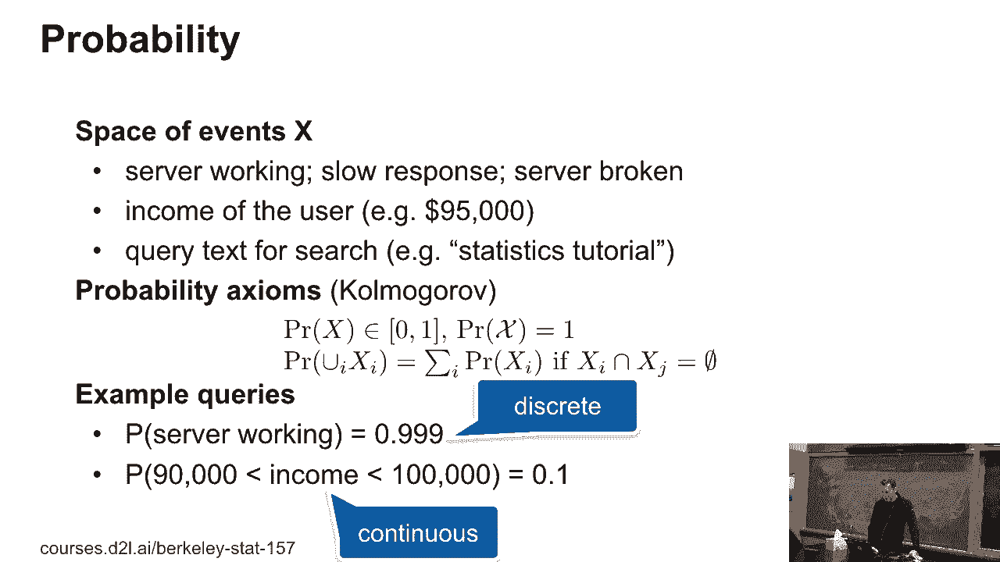
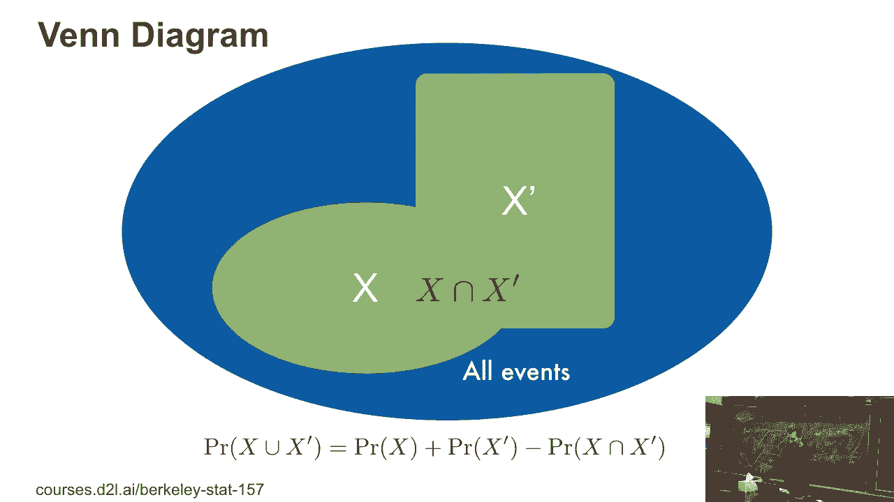
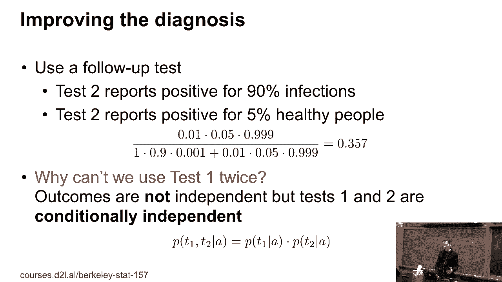

# 8：基本概率 🎲

在本节课中，我们将学习概率论的基本概念。这些概念是理解后续机器学习与深度学习模型（如朴素贝叶斯分类器）的基础。我们将从事件和概率的定义开始，逐步介绍联合概率、条件概率以及贝叶斯定理，并通过实际例子来理解这些概念的应用。

## 概述：概率的基本规则

概率论为我们提供了一套量化不确定性的数学框架。它建立在几个基本公理之上，这些公理定义了概率的性质。

以下是概率论的核心公理：
1.  **非负性**：任何事件 `A` 的概率 `P(A)` 满足 `0 ≤ P(A) ≤ 1`。
2.  **规范性**：整个样本空间（即所有可能结果的集合）的概率为 `1`。
3.  **可加性**：对于互斥（即不能同时发生）的事件 `A` 和 `B`，有 `P(A ∪ B) = P(A) + P(B)`。

这些公理是构建更复杂概率概念（如条件概率和独立性）的基石。

## 联合概率与事件关系

上一节我们介绍了概率的基本公理，本节中我们来看看多个事件之间的关系。联合概率描述了两个或多个事件同时发生的可能性。

以下是描述事件关系的关键概念：
*   **联合概率**：事件 `A` 和事件 `B` 同时发生的概率，记为 `P(A ∩ B)` 或 `P(A, B)`。
*   **加法法则**：对于任意两个事件 `A` 和 `B`，它们至少有一个发生的概率为 `P(A ∪ B) = P(A) + P(B) - P(A ∩ B)`。这考虑了事件交集被重复计算的部分。

理解这些关系对于处理复杂场景至关重要。

## 独立性与条件概率

在现实世界中，事件往往不是孤立的。一个事件的发生可能会影响另一个事件发生的可能性。这就引出了条件概率和独立性的概念。

以下是相关的核心定义：
*   **条件概率**：在事件 `B` 已经发生的条件下，事件 `A` 发生的概率，记为 `P(A | B)`。其计算公式为 `P(A | B) = P(A ∩ B) / P(B)`，前提是 `P(B) > 0`。
*   **独立性**：如果事件 `A` 的发生不影响事件 `B` 发生的概率（反之亦然），则称 `A` 和 `B` 相互独立。数学上表示为 `P(A ∩ B) = P(A) * P(B)`，这等价于 `P(A | B) = P(A)`。

一个经典的例子是俄罗斯轮盘赌：在第一次扣动扳机后存活下来，如果不重新转动转轮（即不重置条件），第二次扣动扳机时死亡的概率会发生变化，说明这两个事件不是条件独立的。

## 贝叶斯定理 🧠

条件概率的一个极其重要的应用是贝叶斯定理。它允许我们根据新的证据（数据）来更新我们对某个假设的信念（概率）。

贝叶斯定理的公式如下：
`P(A | B) = [P(B | A) * P(A)] / P(B)`
其中：
*   `P(A | B)` 是后验概率：观察到证据 `B` 后，假设 `A` 为真的概率。
*   `P(B | A)` 是似然：在假设 `A` 为真的条件下，观察到证据 `B` 的概率。
*   `P(A)` 是先验概率：在观察到任何证据之前，假设 `A` 为真的初始信念。
*   `P(B)` 是证据概率：观察到证据 `B` 的总概率，通常通过全概率公式计算：`P(B) = P(B|A)P(A) + P(B|¬A)P(¬A)`。

### 实例分析：艾滋病检测

让我们通过一个艾滋病检测的例子来应用贝叶斯定理。
*   **已知条件**：
    *   人群感染率（先验）`P(病) = 0.001`。
    *   检测灵敏度 `P(阳 | 病) = 1`（感染者100%检出）。
    *   检测假阳性率 `P(阳 | 健康) = 0.01`（健康者有1%误检）。
*   **问题**：如果一个人检测结果为阳性，他实际患病的概率 `P(病 | 阳)` 是多少？

**计算过程**：
1.  根据贝叶斯定理：`P(病 | 阳) = [P(阳 | 病) * P(病)] / P(阳)`。
2.  计算 `P(阳)`（全概率）：
    `P(阳) = P(阳 | 病)*P(病) + P(阳 | 健康)*P(健康) = 1*0.001 + 0.01*0.999 = 0.01099`。
3.  代入计算：
    `P(病 | 阳) = (1 * 0.001) / 0.01099 ≈ 0.091`。

**结论**：即使检测看起来很准确（假阳性率仅1%），但一个阳性结果的人实际患病的概率也只有约9.1%。这凸显了在罕见病筛查中考虑先验概率的重要性。为了更可靠，需要进行第二次**条件独立**的测试来更新概率。

## 总结

本节课中我们一起学习了概率论的核心基础。我们从**概率的公理化定义**出发，理解了概率必须满足非负性、规范性和可加性。接着，我们探讨了**联合概率**以及事件之间的加法法则。

然后，我们引入了**条件概率**和**独立性**的概念，这是理解事件间依赖关系的关键。最后，我们深入学习了**贝叶斯定理**，这是一个强大的工具，能够让我们利用新的证据来更新对某个假设的概率估计，并通过艾滋病检测的实例演示了其应用。

掌握这些基本概念，是后续学习朴素贝叶斯分类器、概率图模型等更高级机器学习算法的重要前提。