# 9：L2_4 基本概率 🎲

在本节课中，我们将要学习如何使用 Python 和 MXNet 库进行基本的概率实验。我们将通过模拟掷骰子的过程，来观察随机抽样、频率统计以及概率收敛的现象。

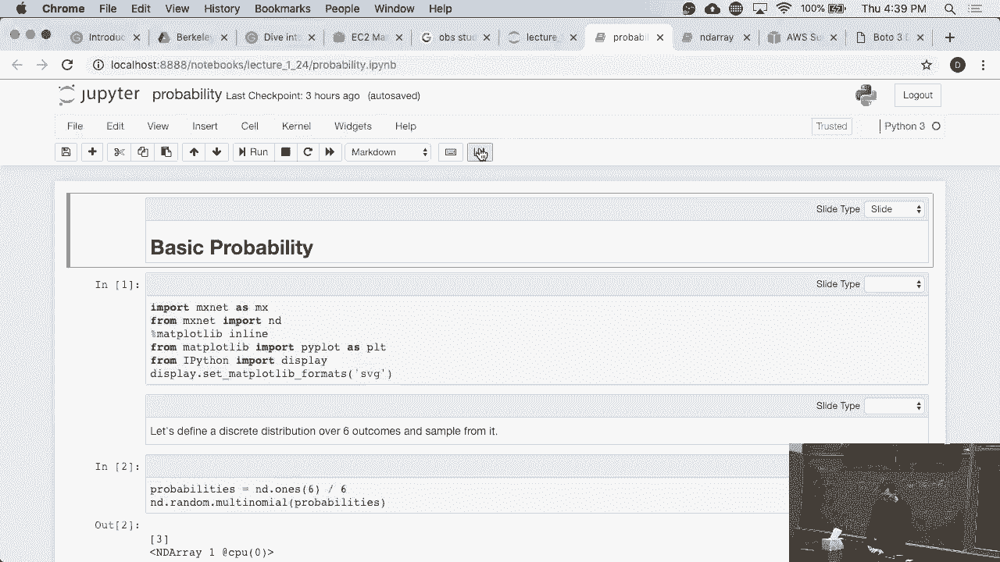

---

## 导入必要的库

首先，我们需要导入 MXNet 库，它提供了生成随机数的功能。同时，我们也会导入一些绘图相关的库，以确保我们的图表能够清晰地展示结果。

```python
import mxnet as mx
from mxnet import nd
# 此处省略了绘图库的导入，仅用于美化图表
```

---

## 定义概率与抽样

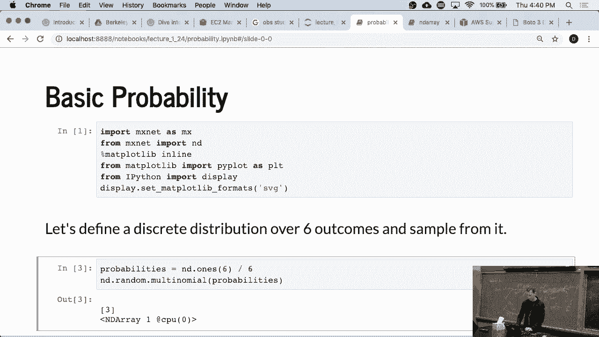

上一节我们介绍了如何导入库，本节中我们来看看如何定义一组概率并进行随机抽样。

假设我们有一个公平的六面骰子，每个面朝上的概率相等，都是 **1/6**。我们可以用一个包含六个概率值的列表来表示。

```python
probabilities = [1/6, 1/6, 1/6, 1/6, 1/6, 1/6]
```

然后，我们可以从这个概率分布中进行抽样。以下是从中抽取一个样本的代码：

```python
sample = nd.sample_multinomial(nd.array(probabilities), shape=1)
print(sample)
```
输出可能类似于：
```
[3]
<NDArray 1 @cpu(0)>
```

---

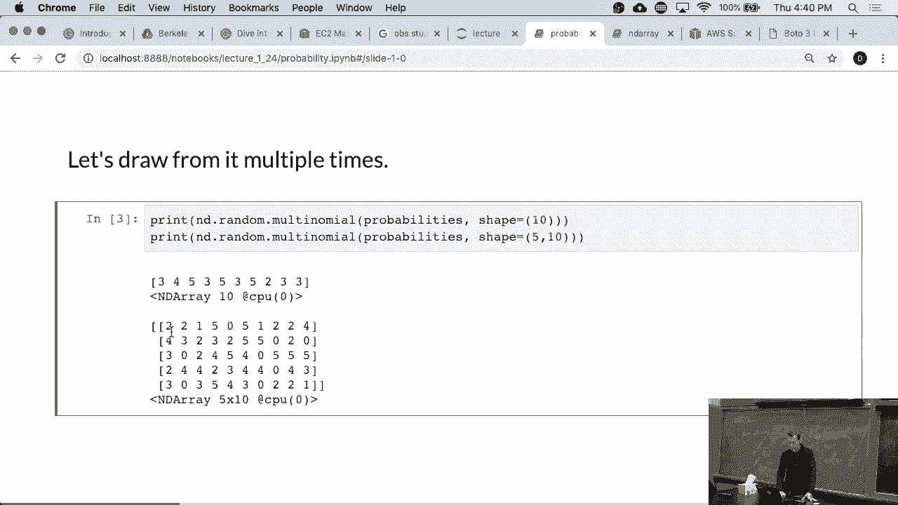

## 进行多次抽样

单次抽样的结果具有随机性。为了观察统计规律，我们需要进行多次抽样。

以下是进行多次抽样的方法，例如从一个形状为 `(5, 10)` 的矩阵中抽取样本：

```python
samples = nd.sample_multinomial(nd.array(probabilities), shape=(5, 10))
print(samples)
```
这段代码会生成一个 5 行 10 列的矩阵，每个元素都是从给定概率分布中抽取的一个结果（0到5之间的整数）。

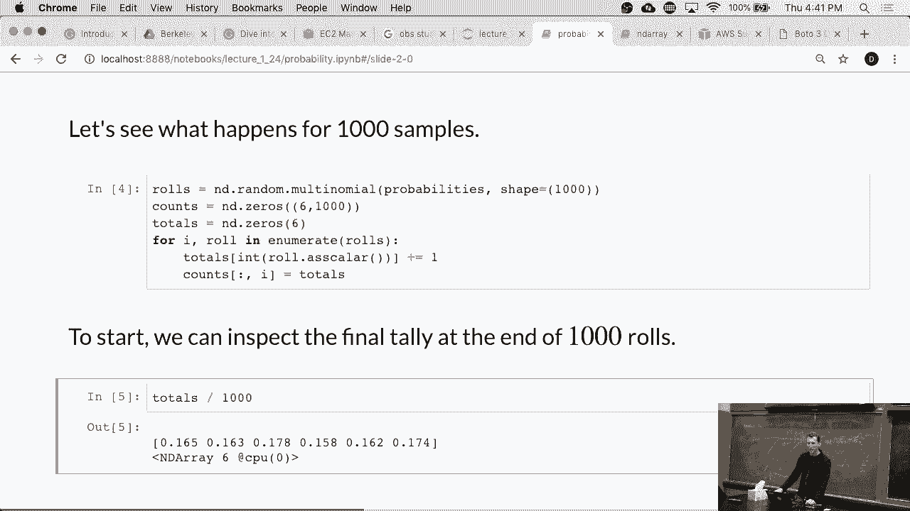

---

## 模拟大量实验并观察频率

现在，让我们模拟掷骰子一千次，并统计每个数字出现的次数。

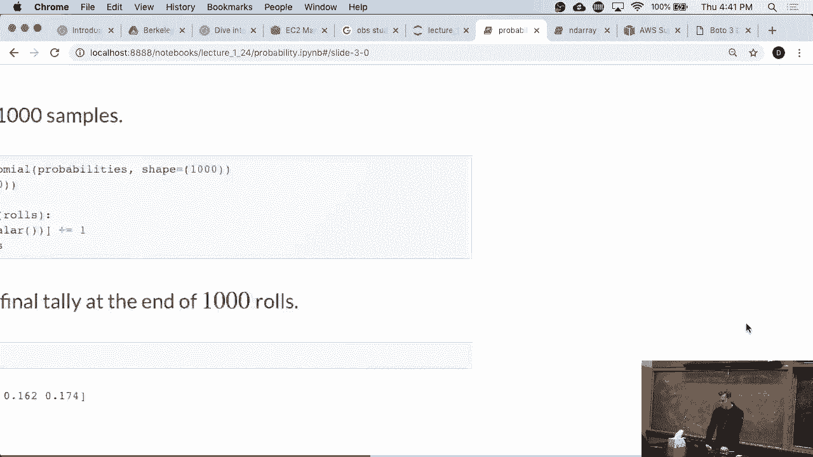

以下是模拟和统计的步骤：

1.  进行 1000 次抽样。
2.  统计每个面出现的次数。
3.  计算每个面出现的频率（次数/总次数）。

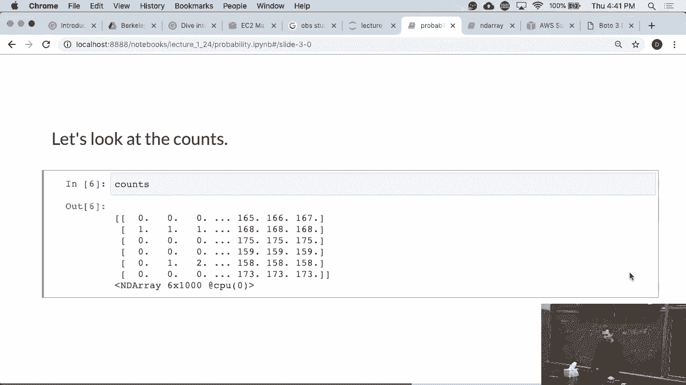

```python
# 进行1000次抽样
num_trials = 1000
results = nd.sample_multinomial(nd.array(probabilities), shape=num_trials)

# 统计每个数字（0-5）出现的次数
counts = nd.sum(nd.one_hot(results, depth=6), axis=0)

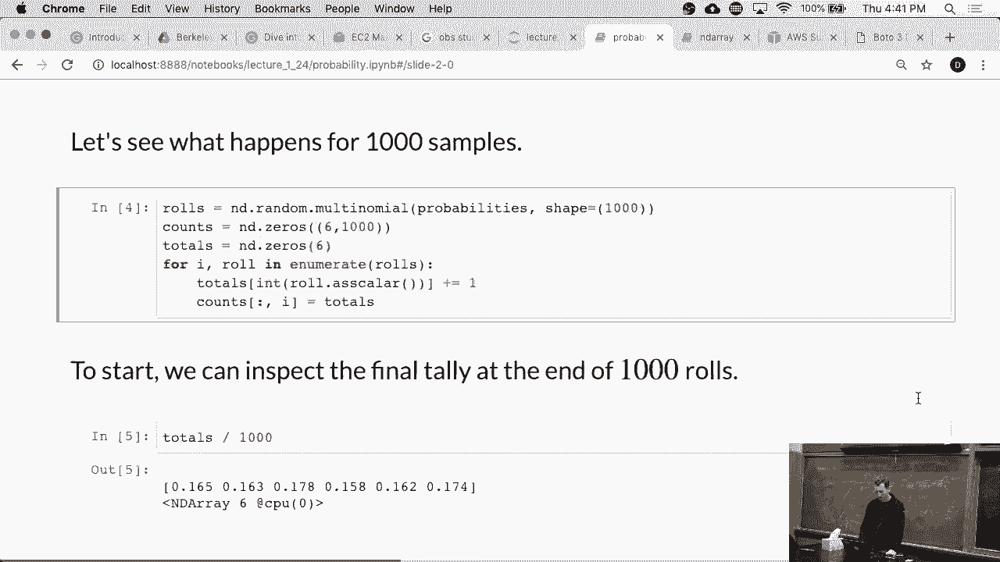

# 计算频率
frequencies = counts / num_trials
print(frequencies)
```
运行后，你会发现每个数字的频率并不精确等于 **1/6**，有些会稍大，有些会稍小。这是随机抽样的正常现象。

---

## 观察概率的收敛性

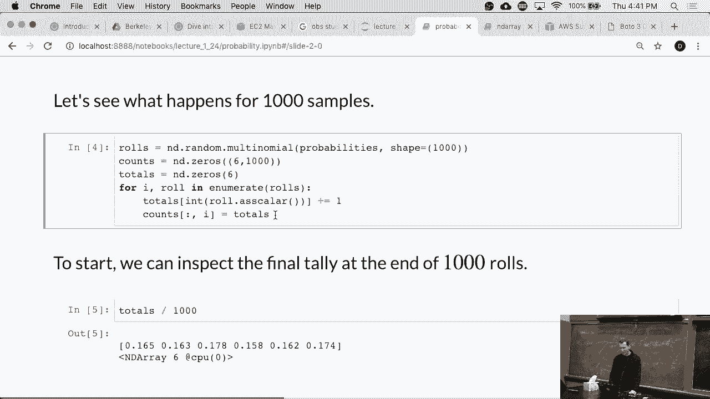

一个有趣的问题是：随着实验次数的增加，观察到的频率会以多快的速度收敛到真实的概率值？

为了观察这个过程，我们可以计算累积频率。以下是计算累积频率的步骤：

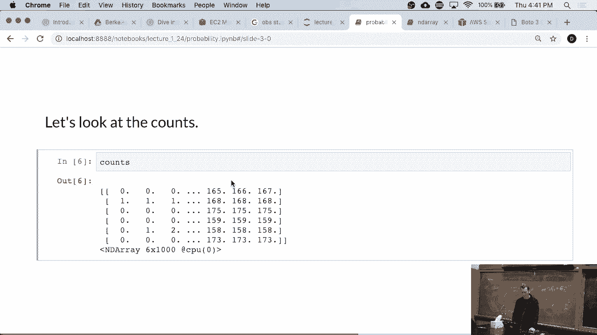

1.  记录每次实验后，每个数字出现的累计次数。
2.  将累计次数除以当前的总实验次数，得到截至该时刻的频率。

```python
import numpy as np

cumulative_counts = np.zeros((num_trials, 6))
current_counts = np.zeros(6)

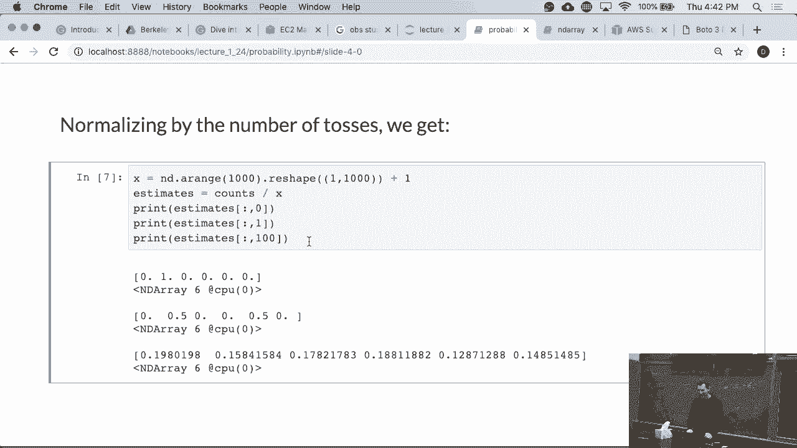

for i in range(num_trials):
    outcome = int(results[i].asscalar())
    current_counts[outcome] += 1
    cumulative_counts[i] = current_counts / (i + 1)

# 现在 cumulative_counts[i, j] 表示前 i+1 次实验中，数字 j 出现的频率
```

在实验初期（例如前100次），频率可能与真实概率 **1/6** 相差较大。但随着实验次数（例如达到1000次）的增加，所有数字的频率都会逐渐稳定并收敛到真实概率附近。

这个现象体现了**大数定律**：当随机实验的次数足够多时，随机事件的**经验平均值（频率）** 会收敛于其**理论期望值（概率）**。

在更高级的统计学课程中，你会学到如**切比雪夫不等式**、**切尔诺夫界**等定理，它们从数学上描述了这种收敛的速度和可靠性。

---

## 总结

本节课中我们一起学习了如何使用代码进行基本的概率实验。

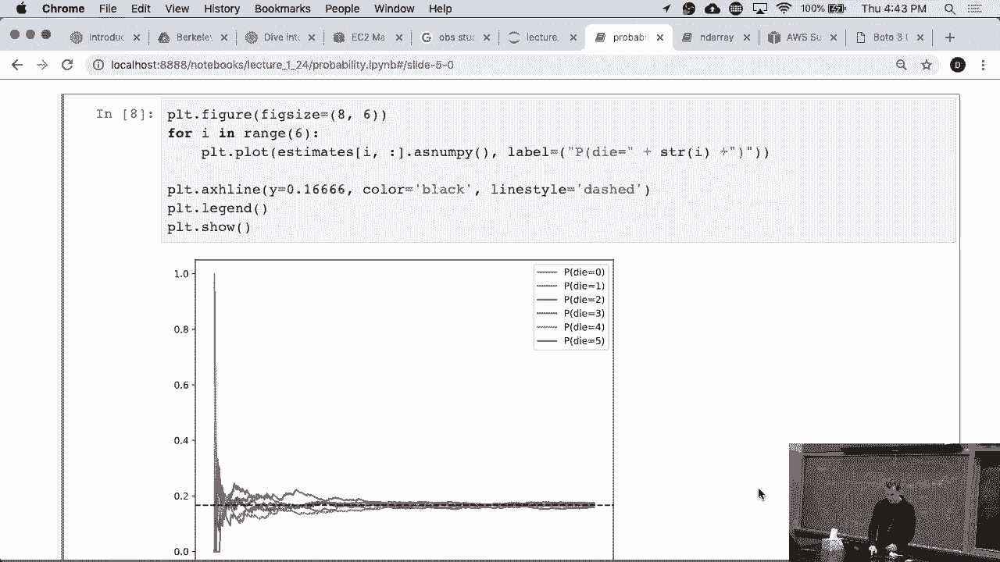

我们首先定义了均匀的概率分布，然后进行了单次和多次随机抽样。接着，我们通过模拟大量掷骰子实验，统计了各结果的频率，并观察到随着实验次数增加，频率会逐渐收敛到真实的概率值。这个过程直观地演示了概率论中的核心概念——**大数定律**。

通过动手实验，你可以更深刻地理解随机性、统计规律以及概率收敛的含义。