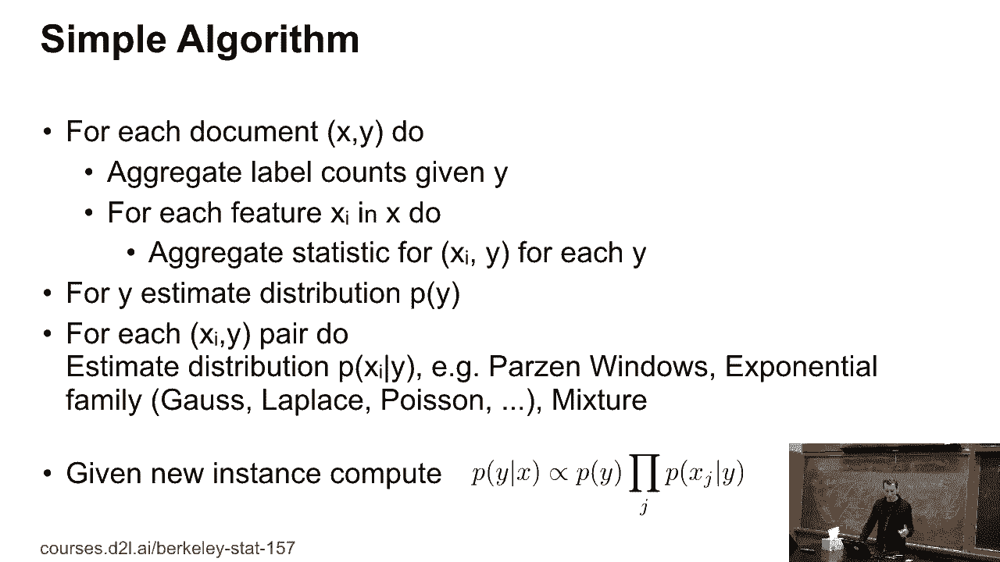
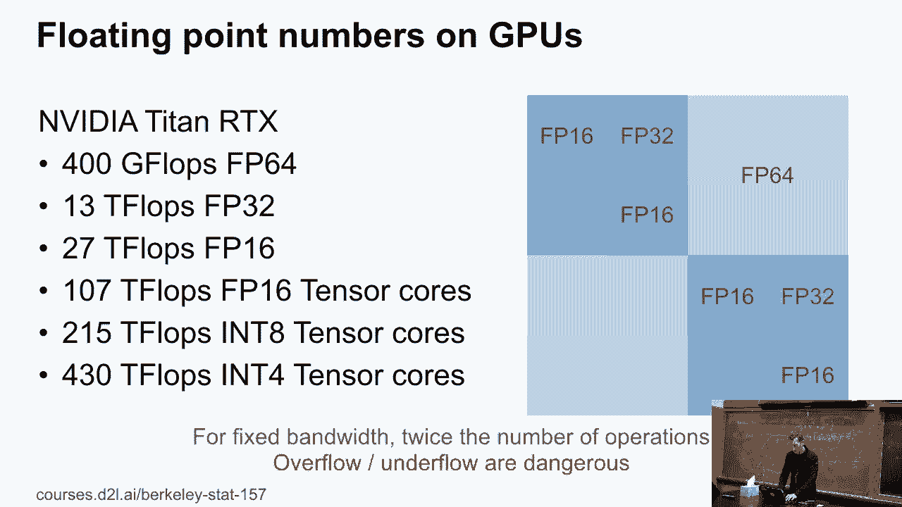

# 10：朴素贝叶斯 🧠

在本节课中，我们将要学习朴素贝叶斯分类器。这是一种基于贝叶斯定理的简单而强大的分类算法，尤其适用于文本分类等任务。我们将了解其核心假设、工作原理、潜在问题以及如何在实际应用中避免数值计算问题。

---

## 算法简介与核心假设

上一节我们介绍了本课程的目标。本节中我们来看看朴素贝叶斯算法的基本思想。

朴素贝叶斯的关键假设是：在给定类别（如“垃圾邮件”）的条件下，文档中所有特征（如单词）的出现是**相互独立**的。这个“朴素”的假设极大地简化了计算。

对于一个包含n个单词的邮件，其属于“垃圾邮件”的概率可以表示为：
`P(垃圾邮件 | 单词1, 单词2, ..., 单词n)`

根据贝叶斯定理和独立性假设，这个概率正比于：
`P(垃圾邮件) * ∏ P(单词i | 垃圾邮件)`

其中，`∏` 表示连乘。我们通常比较垃圾邮件和正常邮件的这个概率值来做分类，因此可以忽略共同的分母。

---

## 训练朴素贝叶斯分类器

理解了核心假设后，本节我们来看看如何训练一个朴素贝叶斯分类器。

训练过程需要计算两个简单的统计量：

1.  **先验概率 P(垃圾邮件)**：计算训练数据中垃圾邮件所占的比例。
2.  **条件概率 P(单词i | 垃圾邮件)**：对于每个单词，计算它在垃圾邮件中出现的频率。

例如，要计算单词“viagra”在垃圾邮件中的条件概率，只需统计它在所有垃圾邮件中出现的次数，然后除以垃圾邮件中单词的总出现次数（或垃圾邮件的总数，取决于模型定义）。

---

## 模型的图形表示与局限性

我们已经了解了如何计算概率。现在，通过图形模型来直观理解这个算法的结构。

朴素贝叶斯可以表示为一个有向图模型：一个父节点代表类别（如“垃圾邮件”），多个子节点代表各个特征（单词），且所有子节点在给定父节点的条件下相互独立。

这种“朴素”的独立性假设也是模型的主要局限。它意味着模型认为“恭喜”和“获奖”这两个词在给定垃圾邮件的条件下出现是无关的，这显然不符合现实。攻击者可以通过在邮件中插入大量无关的随机词汇来故意混淆这种基于独立单词概率的过滤器，历史上这种攻击曾一度成功。

---

## 实际问题：零概率与平滑技术

上一节我们讨论了模型的理论局限。本节中我们来看看一个实际应用中会遇到的严重问题。

在训练集中，如果某个特征（单词）在某个类别下从未出现，那么其条件概率 `P(单词 | 类别) = 0`。这会导致整个概率连乘式为0，模型会做出绝对自信但可能是错误的预测。

以下是解决这个“零概率”问题的常用方法：

*   **拉普拉斯平滑 (Laplace Smoothing)**：在计算每个特征的计数时，为所有可能的特征值都加上一个小的伪计数（例如1）。这确保了没有概率会为零。

---

## 数值计算问题与对数技巧

我们解决了概率为零的问题，但在计算许多小概率值的乘积时，又会遇到数值下溢的问题。本节我们来探讨这个挑战及其解决方案。

当计算大量概率（如0.5）的连乘时，结果会迅速变成一个极小的数字（例如2^-100），超出计算机浮点数的精确表示范围，导致数值下溢。

解决方案是使用**对数概率**。将概率乘法转换为对数概率的加法：
`log(P) = log(P(垃圾邮件)) + Σ log(P(单词i | 垃圾邮件))`

这样计算更稳定。但在比较不同类别的概率时，我们需要计算 `log(e^a + e^b)`。直接计算仍可能溢出。技巧是提取最大值：
`log(e^a + e^b) = max(a, b) + log(1 + e^(-|a-b|))`
这个公式能保证数值稳定性。

---

## 低精度计算的意义

最后，我们讨论一下为何要关心这些数值格式。在GPU等硬件上，使用更低精度的浮点数（如16位、8位）可以显著提升计算速度和能效，因为可以在相同的数据带宽内传输和处理更多数据。这使得研究如何在低精度下稳定运行机器学习算法（包括朴素贝叶斯中的概率计算）变得非常重要。

---

## 总结

本节课中我们一起学习了朴素贝叶斯分类器。我们了解了其基于特征条件独立性的核心假设，学习了通过计算先验概率和条件概率来训练模型的方法。我们还探讨了模型的主要局限性、零概率问题及其平滑解决方案，并深入研究了在实际实现中避免数值下溢的对数计算技巧。这些知识是理解和使用这一经典分类算法的基础。