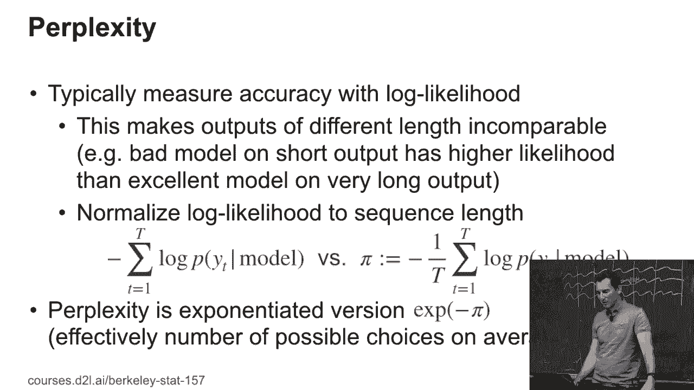
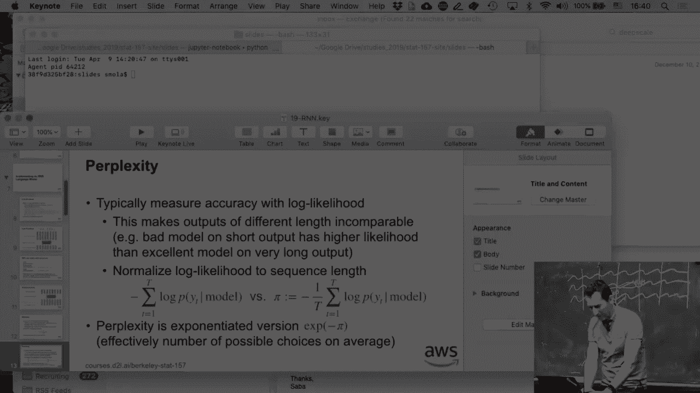
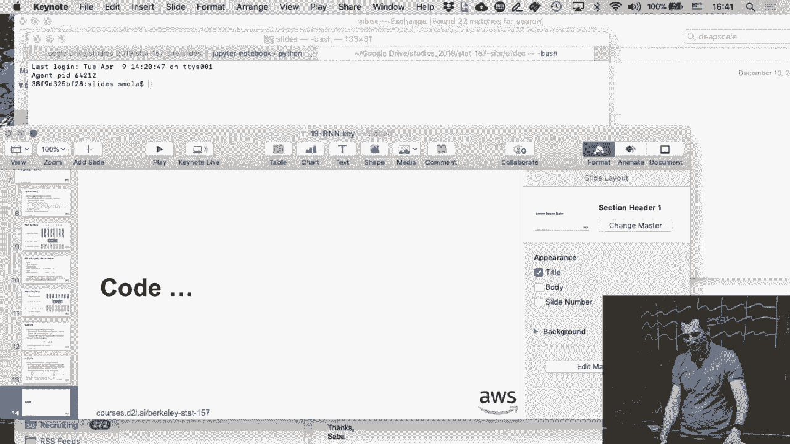

# 100：RNN 机制详解 🧠

在本节课中，我们将学习循环神经网络（RNN）的核心工作机制，包括输入编码、状态传递、输出解码以及模型评估指标。我们将通过简单的语言和清晰的公式来理解这些概念。

---

## 输入编码与嵌入

上一节我们介绍了RNN的基本流程，本节中我们来看看输入是如何被处理的。

首先，我们需要对输入进行编码。这涉及到选择一种粒度，例如单词、字符或子单词。然后，我们将这些单元映射到指示向量，这类似于之前的独热编码。

接着，这个指示向量可能会乘以一个嵌入矩阵，或者直接输入到LSTM、RNN或GRU等模型中。例如，对于输入“时光机器”，每个字符都会进入其对应的标准向量。通过嵌入矩阵，我们会得到一些嵌入向量。

对于单个字符，嵌入可能不是大问题。但对于单词或较长的子字符串序列，嵌入就变得非常重要。例如，“cat”和“cats”是非常相似的单词，我们希望嵌入能确保它们被映射到非常相似的向量表示。

**核心公式**：`嵌入向量 = 独热编码向量 × 嵌入矩阵`

---

## RNN的状态与迭代

现在我们已经有了输入向量，接下来看看RNN如何处理序列。

RNN具有状态。我们有一个输入向量序列和一个隐含状态序列。模型会迭代处理序列中的每个元素，并产生一个输出向量序列。

正如我们之前所见，模型会使用当前时间步的输出，并通过最大似然解码将其转换为下一个预测（如下一个字符）。然后，这个预测结果会被再次编码，作为下一个时间步的输入，并继续运行。在这个过程中，会发生几次类型转换。

**核心流程**：
1.  输入 `X_t` 进入RNN单元。
2.  结合上一个隐含状态 `H_{t-1}`，计算当前隐含状态 `H_t`。
3.  由 `H_t` 产生输出 `O_t`。
4.  对 `O_t` 进行解码，得到预测 `Y_t`，并将其作为下一个 `X_{t+1}`。

---

## 输出解码的考量

对于输出，我们得到了一个向量。在独热编码的情况下，我们只需选择概率最高的那个维度（argmax）。

但为什么要关心使用解码向量，而不是直接选择概率最高的维度呢？

考虑一个词汇表大小为100万的情况。如果直接解码成一个百万维的向量，会消耗巨大的内存。因此，我们通常不希望这么做。一个更高效的做法是将其解码为一个低维向量（例如1000维或2000维），然后通过与一个参考解码矩阵进行最大化内积运算，来得到最终的预测结果。

**核心思想**：为了效率和可扩展性，避免处理超高维输出向量。

---

## 梯度与训练稳定性

我们已经讨论过梯度问题。在训练RNN时，我们不希望梯度变得太大，否则模型参数会剧烈更新，导致训练过程发散。

为了防止这种情况，我们采用**梯度裁剪**技术。这基本上是为梯度设置一个上限，确保其范数不会超过某个阈值，从而保持训练的稳定性。

**核心代码**（概念性描述）：
```python
grad_norm = torch.nn.utils.clip_grad_norm_(model.parameters(), max_norm)
```

---

## 评估指标：困惑度

你可能还记得之前的作业中提到了困惑度。为什么我们需要定义这个新的评估指标呢？

假设我想构建一个语言模型，并希望同时在推文（约200字符）和整本书（约15-20万字符）上测试它。如果直接看负对数似然，书籍的负对数似然值肯定会大得多，因为它包含的字符数量多得多。即使模型很好，也难以对整本书做出完美预测。

为了使不同长度的序列可比，我们需要对似然进行归一化。具体做法是计算整个序列的负对数似然，然后除以序列长度。这得到了**每个字符的平均负对数似然**。

**核心公式**：
`平均负对数似然 = (整个序列的负对数似然) / (序列长度 N)`

但为什么这仍然可能对长序列有偏呢？因为长序列在开始时获得的信息，可以用来更好地预测后面的内容。例如，如果一本书的主题是“相机”，那么后面再次出现“相机”这个词的概率就会更高。因此，长序列的预测可能本质上更容易一些。

困惑度是这个平均负对数似然的指数形式。



**核心公式**：
`困惑度 = exp(平均负对数似然)`



困惑度可以解释为模型在预测下一个词时平均面临的选择数量。如果模型完美（概率为1），困惑度为1（exp(0)）。困惑度为3意味着，平均来看，模型在约3个选项中不确定该选哪个。

**最佳情况**：困惑度越接近1，模型预测越确定、越准确。

---

## 总结

本节课中我们一起学习了RNN的核心机制：

1.  **输入处理**：通过嵌入层将离散符号转换为有意义的连续向量。
2.  **状态迭代**：RNN通过隐含状态在时间步之间传递信息。
3.  **输出解码**：高效地将高维输出向量转换为具体的预测结果。
4.  **训练稳定**：使用梯度裁剪防止训练发散。
5.  **模型评估**：使用困惑度作为归一化的指标，公平地比较不同长度序列上的语言模型性能。



理解这些机制是构建和优化循环神经网络模型的基础。