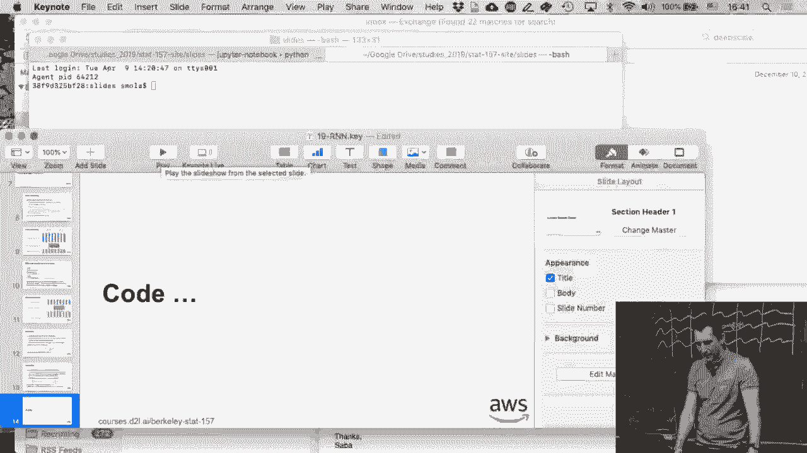
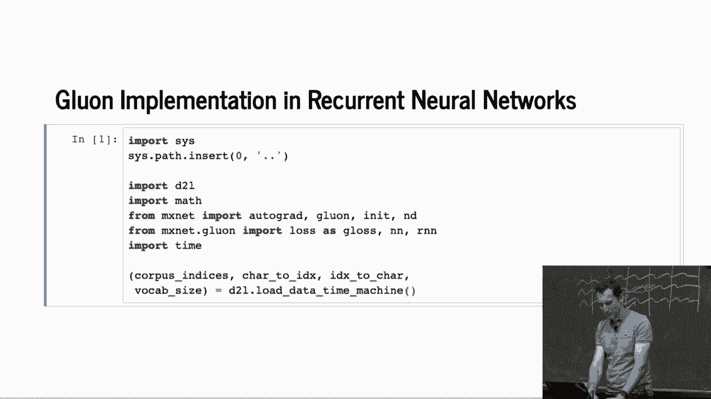
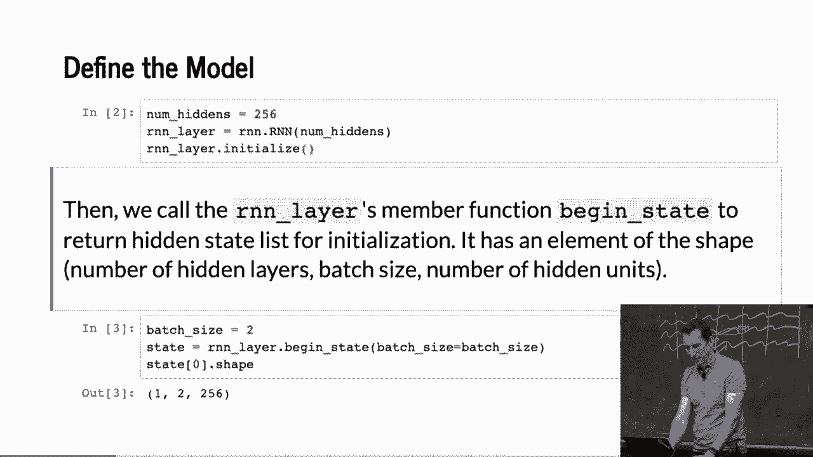

# 101：Gluon中的递归神经网络 🧠





在本节课中，我们将学习如何在Gluon框架中实现一个递归神经网络（RNN）。我们将从加载数据开始，逐步构建模型，并最终完成训练和预测的完整流程。整个过程将展示Gluon如何简化RNN的实现。



---

## 数据加载与模型定义 📊

上一节我们介绍了课程目标，本节中我们来看看如何准备数据和定义模型。

首先，需要加载数据。


然后，定义模型。这里使用`RNN`模块，并设置隐藏单元数量为256。


以下是定义RNN层的核心代码：
```python
rnn_layer = rnn.RNN(hidden_size=256)
```
初始化RNN层的工作仅需几行代码即可完成。

---

## 初始化状态与形状检查 🔄

上一节我们定义了模型，本节中我们来看看如何初始化状态并检查输入输出。

假设小批量大小为2，需要初始化一个隐藏状态。状态形状为`(batch_size, hidden_size)`，即`(2, 256)`。

我们可以执行一步前向传播来验证。输入一个35步的序列，检查输出和状态的形状是否匹配。这与之前的代码逻辑一致，目的是确保数据流正确。

---

## 构建RNN块 🧱

上一节我们检查了基础RNN层，本节中我们来看看如何构建一个更完整的RNN块。

RNN层本身只处理输入输出。RNN块则封装了完整的前向传播过程，包括one-hot编码等便捷操作。

以下是构建RNN块的关键步骤：
1.  **构造函数**：创建RNN层和一个用于输出的全连接层（`Dense`）。
2.  **前向传播函数**：将输入进行one-hot编码，送入RNN层，然后通过全连接层生成最终输出，并返回输出和状态。
3.  **初始状态函数**：提供一个方法，用于获取RNN的初始隐藏状态。

这个块负责处理数据转换，而调用者仍需准备原始的输入数据。

---

## 序列预测 🔮

上一节我们构建了RNN块，本节中我们来看看如何使用它进行序列预测。

预测过程与之前类似，主要区别是现在调用的是封装好的RNN模型。

流程如下：
1.  初始化模型和开始状态。
2.  对于输入序列中的每个字符，调整其形状，让RNN前进一步。
3.  通过`argmax`操作将RNN的输出向量转换回字符。

需要注意的是，模型在开始时会将已知的输入字符复制到输出。只有在处理完所有输入字符后，它才会开始生成新的字符。前几个步骤并非浪费，它们的作用是将隐藏状态初始化为一个有意义的数值，这对于后续生成至关重要。

---

## 模型训练 🏋️

上一节我们实现了预测，本节中我们来看看如何训练这个RNN模型。

训练过程包含以下步骤：

首先，定义损失函数（如Softmax交叉熵）和优化器。

以下是训练循环中的关键操作：
1.  在每个小批量开始时，初始化状态，并对之前的状态调用`.detach()`。这可以防止梯度在批次间传播，是处理序列模型的常用技巧。
2.  通过`autograd`记录计算过程，执行模型的前向传播，得到输出和状态。
3.  计算预测输出与真实标签之间的损失。
4.  反向传播计算梯度，对梯度进行裁剪以防止爆炸，然后使用优化器更新模型参数。

此外，还需要监控训练过程中的困惑度（Perplexity）以评估模型性能。在作业中，你需要在独立的测试集上测量困惑度。

---

## 性能与扩展 ⚡

上一节我们完成了训练，本节中我们来看看一些性能注意事项和扩展话题。

使用Gluon实现的RNN训练速度显著快于手动实现。对于更大的数据集（例如包含500万个字符的莎士比亚全集），这种效率优势更为明显。

关于使用多个GPU进行训练，基本思想与常规模型类似：将批次分配到不同GPU上计算梯度，然后聚合。对于RNN这类序列模型，需要特别注意CPU与GPU之间的负载平衡。最新的深度学习工具包（如用于BERT模型的工具包）提供了复杂的并行训练方案可供参考。

---

## 总结 📝

本节课中我们一起学习了在Gluon中实现递归神经网络的全过程。我们从加载数据、定义并初始化RNN模型开始，然后构建了封装好的RNN块以简化操作。接着，我们探讨了如何使用该模型进行序列预测，并详细讲解了包含梯度裁剪和状态分离在内的训练流程。最后，我们讨论了模型训练的性能及其在多GPU环境下的扩展可能性。通过本课，你应能掌握使用Gluon高效构建和训练RNN的基本方法。