# 102：L19_5 截断反向传播 🧠

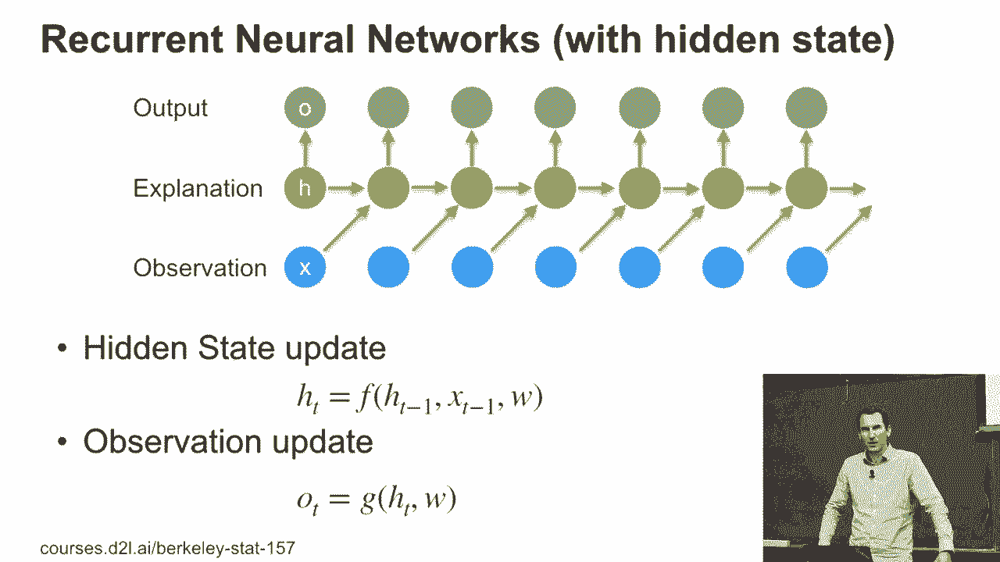

在本节课中，我们将要学习循环神经网络（RNN）训练中的一个关键技术——截断反向传播。我们将了解为什么在RNN中计算梯度会变得复杂和昂贵，以及截断反向传播如何通过一种近似但有效的方法来解决这些问题。

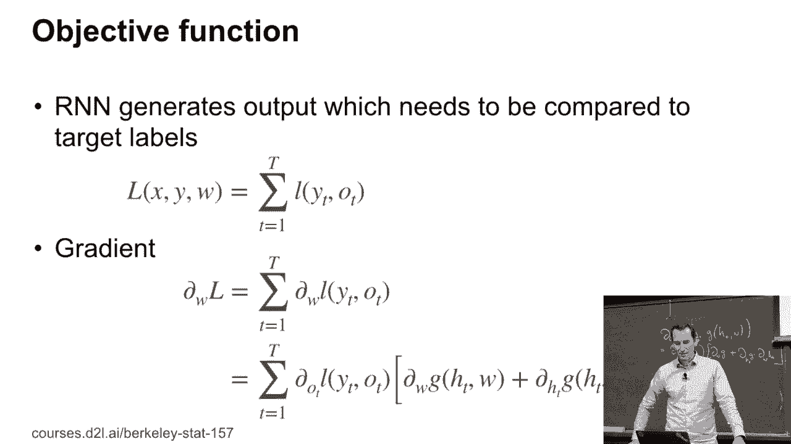

---

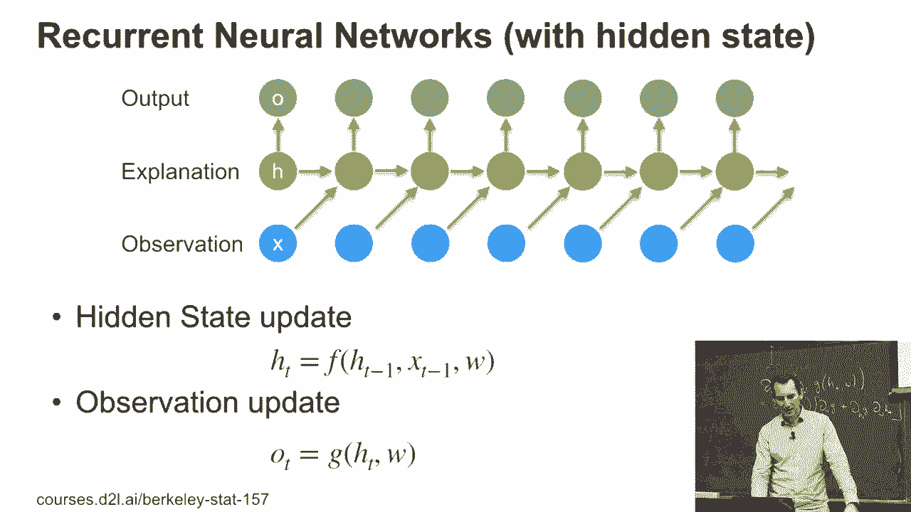

## 1. RNN的基本结构与梯度问题

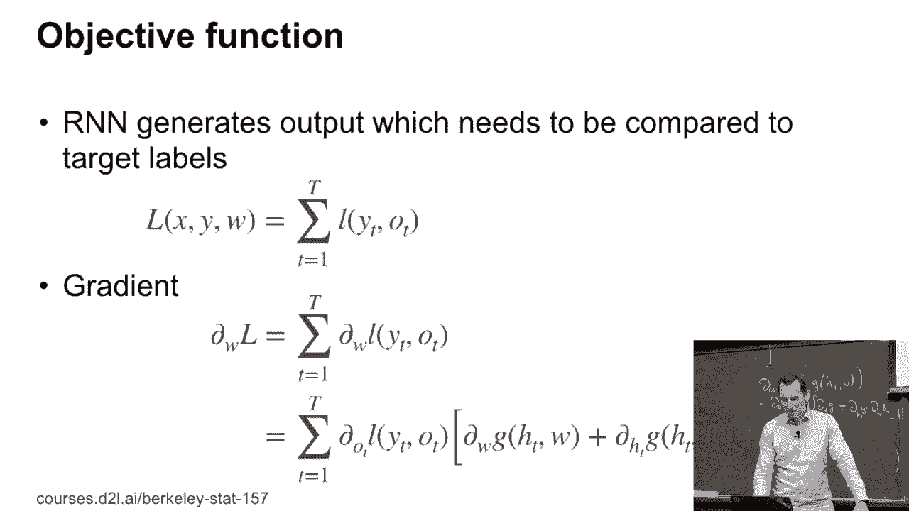

上一节我们介绍了RNN的基本概念，本节中我们来看看其梯度计算的具体挑战。

一个基础的RNN单元可以描述如下：
*   隐藏状态更新：`h_t = f(x_{t-1}, h_{t-1}, W)`
*   观测值输出：`o_t = g(h_t, W)`

其中，`f` 和 `g` 是参数为 `W` 的函数。

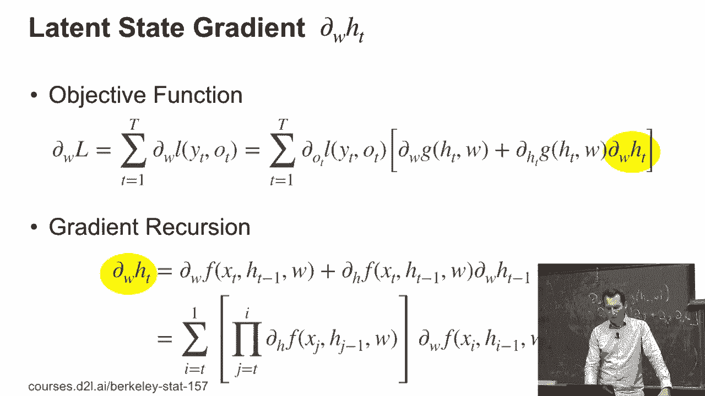

对于一个序列任务，损失 `L` 是各个时间步损失 `l(o_t, y_t)` 的总和：
`L = Σ_{t=1}^{T} l(o_t, y_t)`

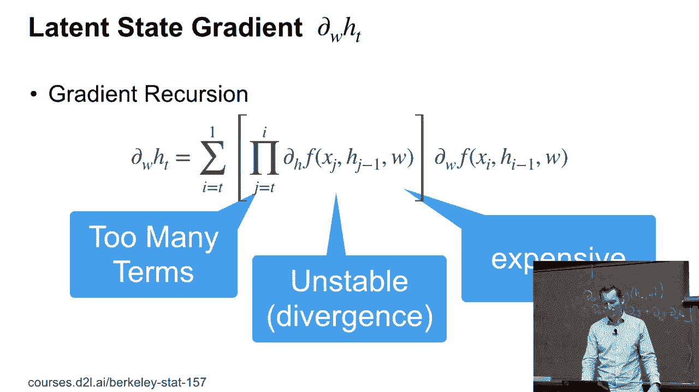

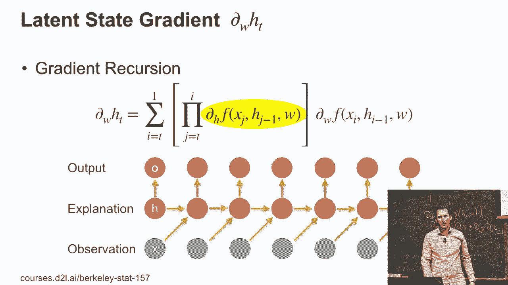

当我们计算损失 `L` 对参数 `W` 的梯度时，根据链式法则，会遇到 `∂h_t / ∂W` 这一项。问题在于，`h_t` 依赖于 `h_{t-1}`，而 `h_{t-1}` 又依赖于 `h_{t-2}`，如此递归下去。这意味着计算 `∂h_t / ∂W` 需要回溯整个历史序列：

`∂h_t / ∂W = Σ_{i=1}^{t} (Π_{j=i+1}^{t} ∂h_j / ∂h_{j-1}) * ∂f_i / ∂W`

这个公式揭示了两个核心问题：
1.  **计算昂贵**：需要计算并存储大量中间状态的梯度。
2.  **梯度不稳定**：公式中包含一连串雅可比矩阵 `∂h_j / ∂h_{j-1}` 的乘积。如果这些矩阵的特征值普遍大于1，乘积会指数级增长，导致**梯度爆炸**；如果特征值普遍小于1，乘积会指数级衰减至0，导致**梯度消失**。

---

## 2. 截断反向传播的解决方案

面对长序列梯度计算的难题，截断反向传播提供了一种实用的近似方法。

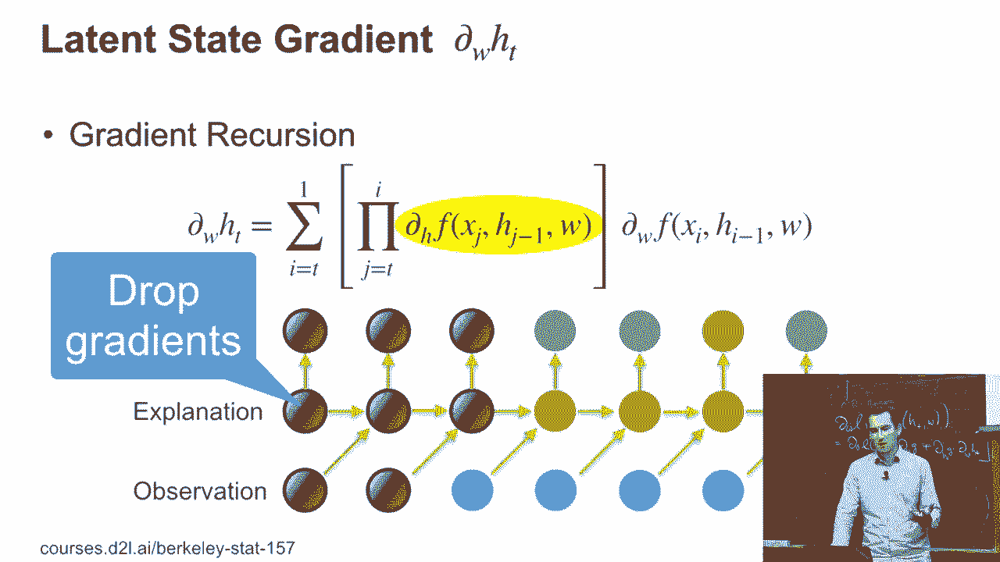

其核心思想是：在反向传播时，**人为地切断（或“截断”）超过一定时间步长的依赖关系**。具体来说，在计算当前时间步 `t` 的梯度时，我们只回溯 `k` 个时间步（例如 `k=2`），而忽略更早时间步的影响。

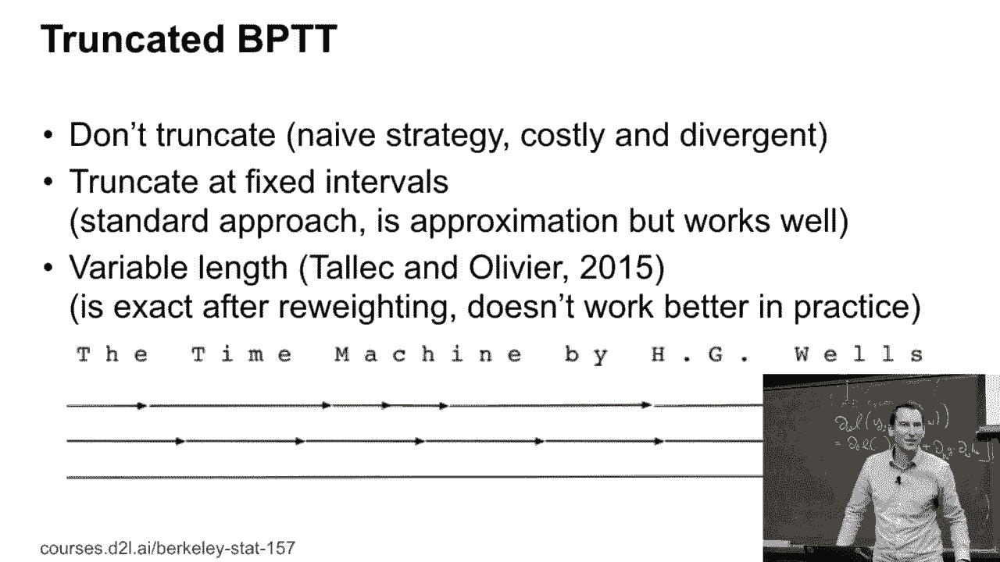

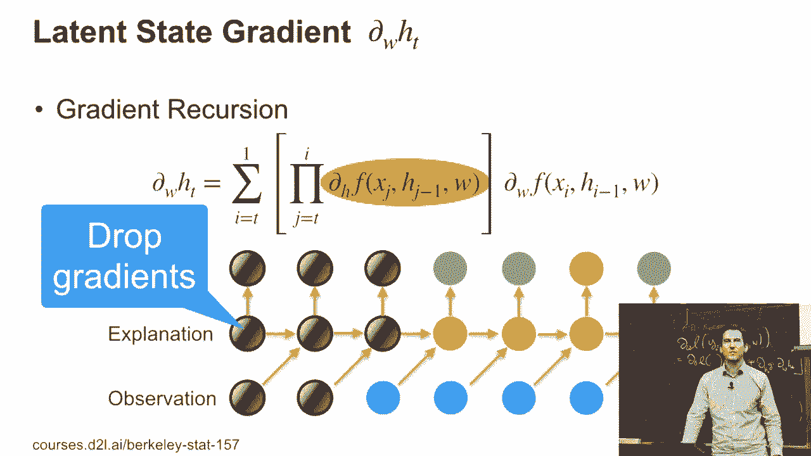

以下是截断反向传播带来的好处：
*   **显著提升计算效率**：减少了需要计算和存储的梯度数量。
*   **缓解梯度不稳定问题**：避免了长链的矩阵连乘，从而减轻了梯度爆炸或消失的风险。
*   **引入隐式正则化**：迫使模型更专注于学习短期的、局部的依赖模式，而不是试图拟合可能由噪声或偶然性导致的超长期关联，这有助于提升模型的泛化能力。

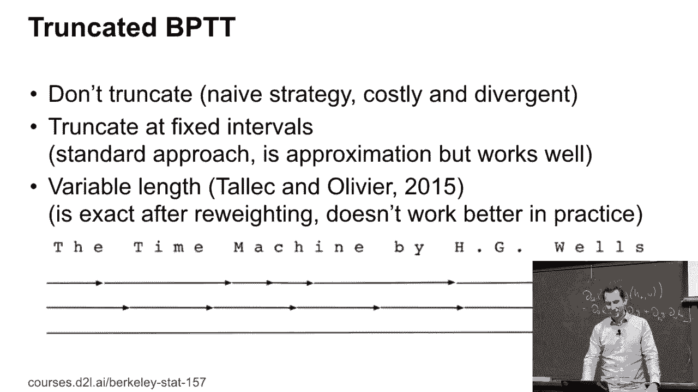

> **注意**：截断反向传播只影响梯度的计算方式（即训练过程），模型的前向传播计算保持不变。它通过计算一个近似的（有偏的）梯度来优化参数。

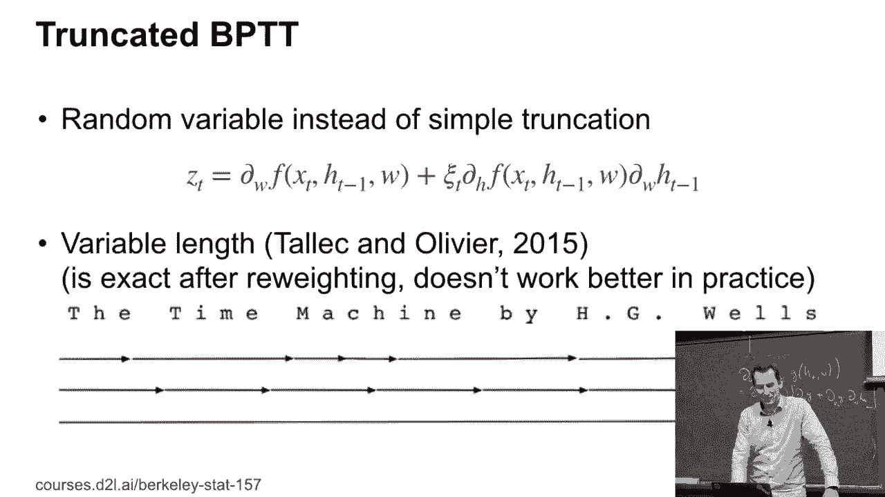

---

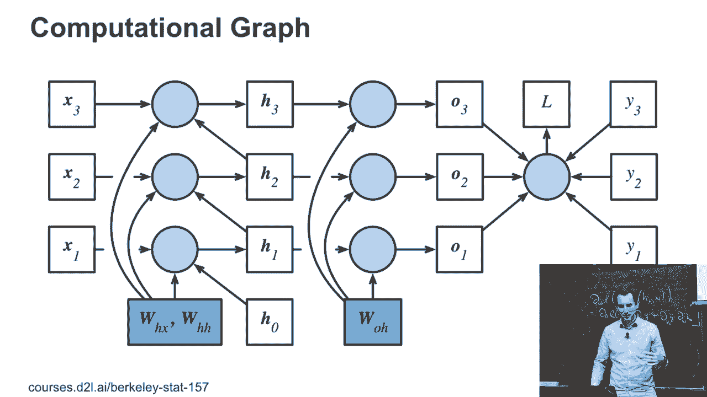

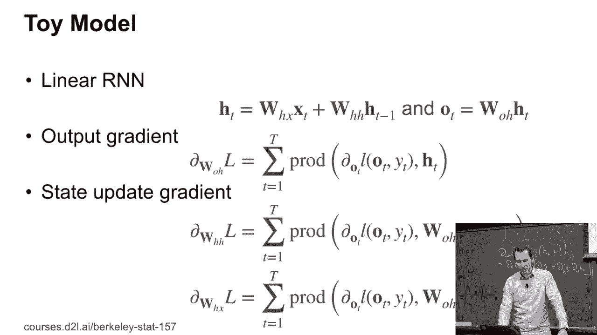

## 3. 一个线性RNN的示例

为了更具体地理解，让我们看一个没有非线性激活函数的简单线性RNN：
*   `h_t = W_{hx} * x_t + W_{hh} * h_{t-1`
*   `o_t = W_{oh} * h_t`

在这个例子中，`∂h_t / ∂h_{t-1} = W_{hh}`。因此，`∂h_T / ∂h_t` 的梯度可以明确地写为 `(W_{hh}^T)^{T-t}`。这直观地展示了为什么梯度会爆炸（`W_{hh}` 特征值>1）或消失（`W_{hh}` 特征值<1）。

截断反向传播在这里的操作就是，在计算 `t` 时刻的梯度时，我们设定一个截断长度 `τ`。当需要计算 `∂h_t / ∂h_{t-τ-1}` 这类跨越超过 `τ` 步的梯度时，我们将其视为零，或者更常见的做法是，在计算图中将 `h_{t-τ-1}` 节点的梯度**分离**（detach），阻止梯度继续向前传播。

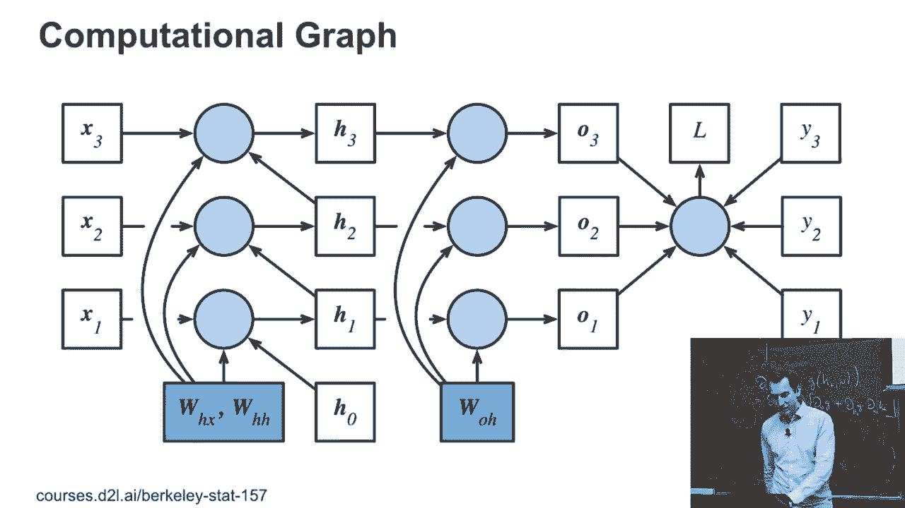

在PyTorch等框架中，这通常通过 `.detach()` 方法实现。例如，在处理小批量数据时，我们会在每个小批量的起始隐藏状态处调用 `.detach()`，以切断与前一个小批量的梯度连接。

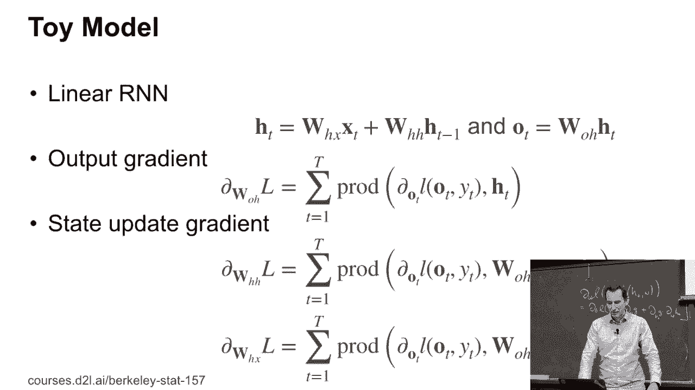

---

## 4. 其他变体与总结

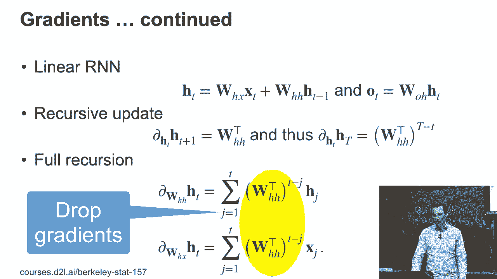

除了固定长度的截断，还有一些研究探索了其他方法，例如**随机长度截断**。这种方法以一定概率决定是否在某个时间步停止反向传播，并通过调整权重来保证梯度估计的无偏性。虽然理论上更优美，但在实践中其效果通常并不优于简单的固定长度截断，这可能也印证了固定截断所带来的正则化效应是有益的。

**本节课中我们一起学习了：**
1.  RNN在长序列上训练时，完整的梯度计算存在计算成本高和梯度不稳定（爆炸/消失）两大问题。
2.  **截断反向传播**是一种高效的近似训练技术，它通过限制梯度回溯的时间步长来解决上述问题。
3.  这种方法不仅加快了训练速度、稳定了训练过程，还意外地起到了正则化的作用。
4.  在实现上，我们通常在计算图中对较早的隐藏状态使用 `.detach()` 来分离梯度，从而实现截断。

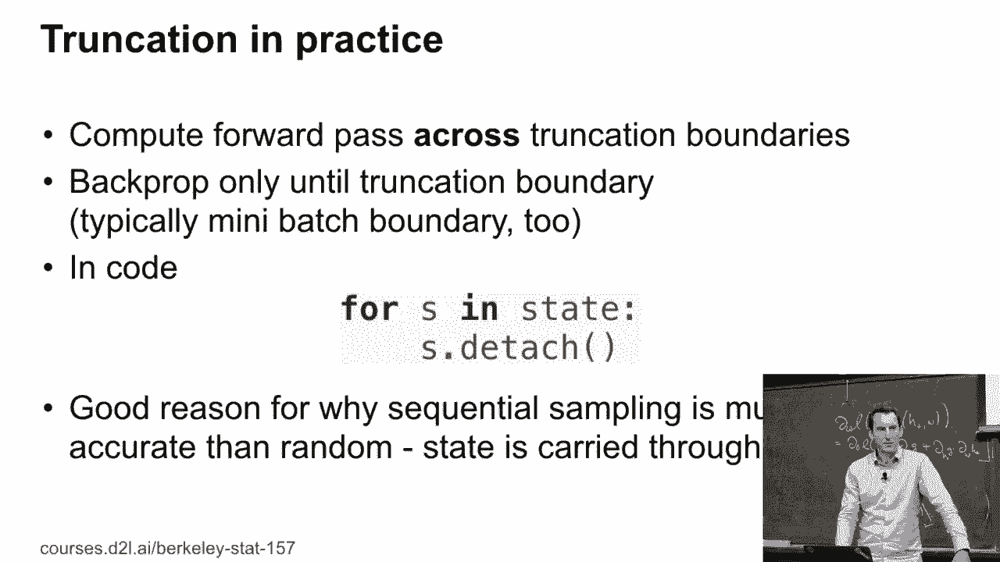

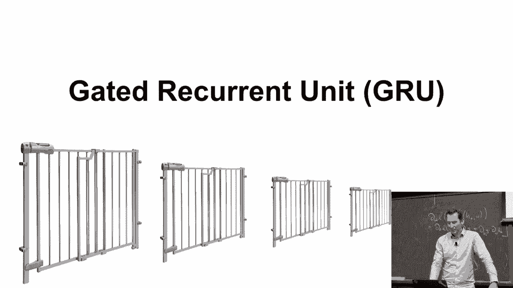

截断反向传播是训练RNN及其变体（如LSTM、GRU）的标准且至关重要的实践，它使得处理长序列数据变得可行。