# 103：门控循环单元（GRU）详解 🧠

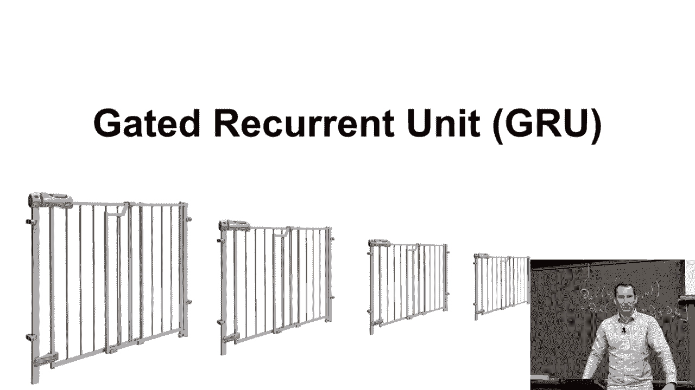

在本节课中，我们将学习门控循环单元（GRU）。GRU 是一种重要的循环神经网络（RNN）变体，旨在通过引入门控机制，更有效地捕捉序列数据中的长期依赖关系，同时减少计算复杂度。

---

## 1. GRU 的设计动机 🎯

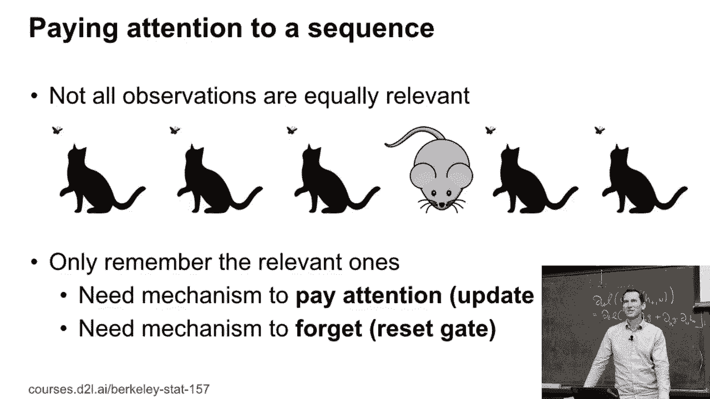

上一节我们介绍了基础RNN的局限性。本节中我们来看看GRU的设计初衷。

GRU 出现在长短期记忆网络（LSTM）之后。其核心动机是：**在减少计算量的同时，获得与LSTM相近的性能**。在序列数据中，并非所有观察值都同等重要。例如，在演讲中，演讲者的动作可能不如演讲内容重要。因此，模型需要两种机制：
1.  **更新机制**：决定何时关注新信息并更新内部状态。
2.  **重置机制**：决定何时忘记过去的无关信息。

通过控制这两个“门”，模型可以更灵活地管理其记忆，例如，通过“忘记门”断开不相关历史信息的梯度传播，从而缓解梯度问题。

---

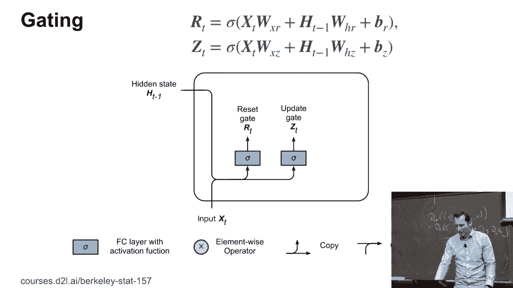

## 2. GRU 的核心结构 ⚙️

理解了动机后，我们来剖析GRU的具体结构。它主要由两个门和一个候选状态构成。

以下是GRU单元在一个时间步 `t` 的计算流程：

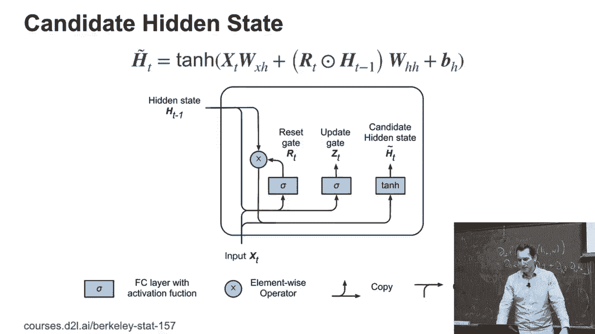

### 2.1 门控计算
首先，GRU根据当前输入 `x_t` 和上一个隐藏状态 `h_{t-1}` 计算两个门：**重置门（Reset Gate）** `r_t` 和 **更新门（Update Gate）** `z_t`。

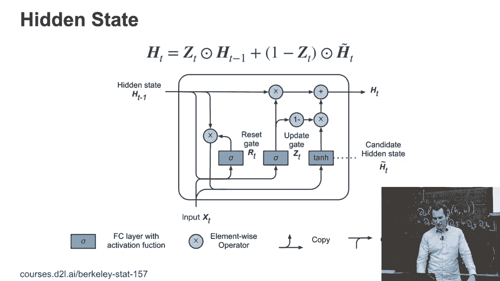

```python
# 公式表示
r_t = σ(W_r * [h_{t-1}, x_t] + b_r)
z_t = σ(W_z * [h_{t-1}, x_t] + b_z)
```
其中，`σ` 是Sigmoid激活函数，将输出值压缩到 `(0, 1)` 之间，起到“开关”作用。`W_r`, `W_z`, `b_r`, `b_z` 是可学习的参数。

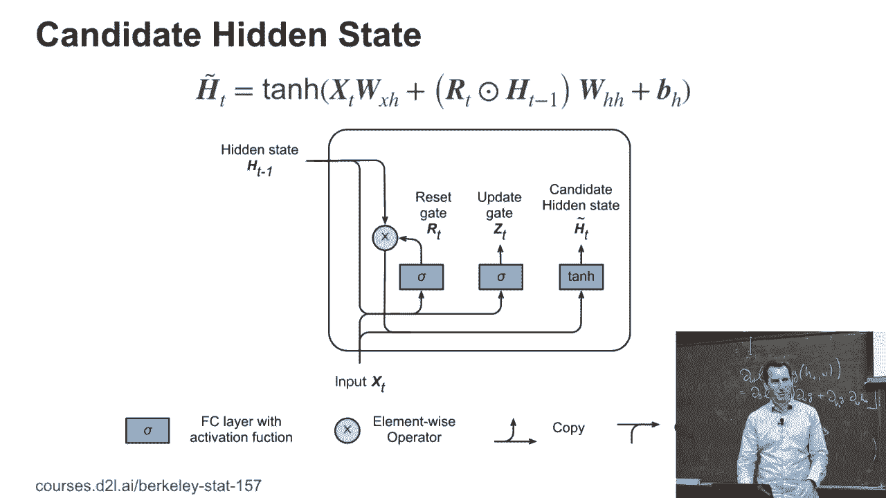

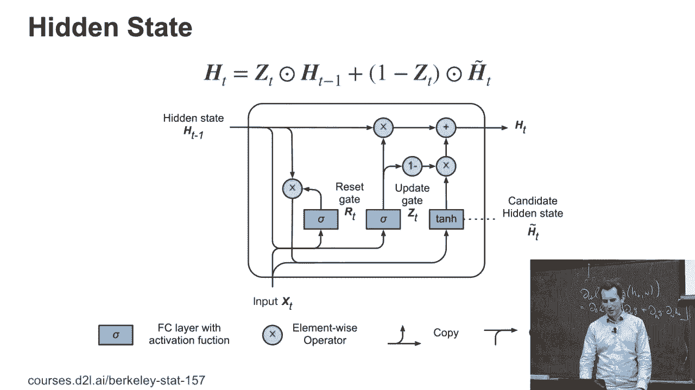

### 2.2 候选隐藏状态
接下来，GRU计算一个**候选隐藏状态（Candidate Hidden State）** `\tilde{h}_t`。它融合了当前输入和经过重置门筛选的过去信息。

```python
# 公式表示
\tilde{h}_t = tanh(W * [r_t ⊙ h_{t-1}, x_t] + b)
```
这里，`⊙` 表示逐元素相乘（Hadamard积）。如果重置门 `r_t` 接近0，则 `h_{t-1}` 的影响被大幅削弱，候选状态主要依赖于当前输入 `x_t`，这实现了“重置”或“忘记”过去的效果。

### 2.3 最终隐藏状态更新
最后，GRU通过更新门 `z_t`，将上一个隐藏状态 `h_{t-1}` 和候选状态 `\tilde{h}_t` 进行组合，得到当前时间步的最终隐藏状态 `h_t`。

```python
# 公式表示
h_t = (1 - z_t) ⊙ h_{t-1} + z_t ⊙ \tilde{h}_t
```
更新门 `z_t` 控制着新旧信息的融合比例：
*   若 `z_t` 接近1，则 `h_t` 几乎完全由候选状态 `\tilde{h}_t` 更新。
*   若 `z_t` 接近0，则 `h_t` 几乎完全保留旧状态 `h_{t-1}`。

---

## 3. 门控机制的行为分析 🔍

我们已经了解了GRU的数学公式，现在来分析这些门控如何协作。

以下是不同门控设置下的模型行为：

*   **当重置门 `r_t ≈ 0`，更新门 `z_t ≈ 1`**：模型会“重置”或忽略大部分过去状态 `h_{t-1}`，主要基于当前输入 `x_t` 生成新的隐藏状态。这适用于需要忽略无关历史信息的场景。
*   **当重置门 `r_t ≈ 1`，更新门 `z_t ≈ 0`**：模型会“保留”大部分过去状态，几乎不进行更新。这相当于在短时间内维持一个恒定状态，让梯度可以无损地穿越多个时间步，有助于缓解梯度消失。
*   **当 `r_t ≈ 1`， `z_t ≈ 1`**：模型行为接近于一个基础RNN单元，同时考虑当前输入和完整的历史信息进行更新。

> **关于参数化的讨论**：GRU的这种特定设计（使用Sigmoid和凸组合）是经过实践验证的有效方案。理论上可以尝试其他参数化方式（如交换更新公式中的权重），但当前形式在大多数任务中表现稳定。选择tanh作为候选状态的激活函数，是因为它能将值稳定在(-1, 1)之间，防止隐藏状态发散，并保证梯度在原点附近良好流动。

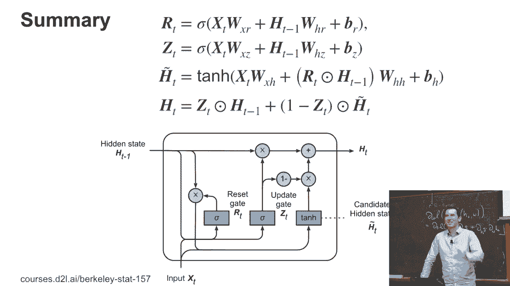

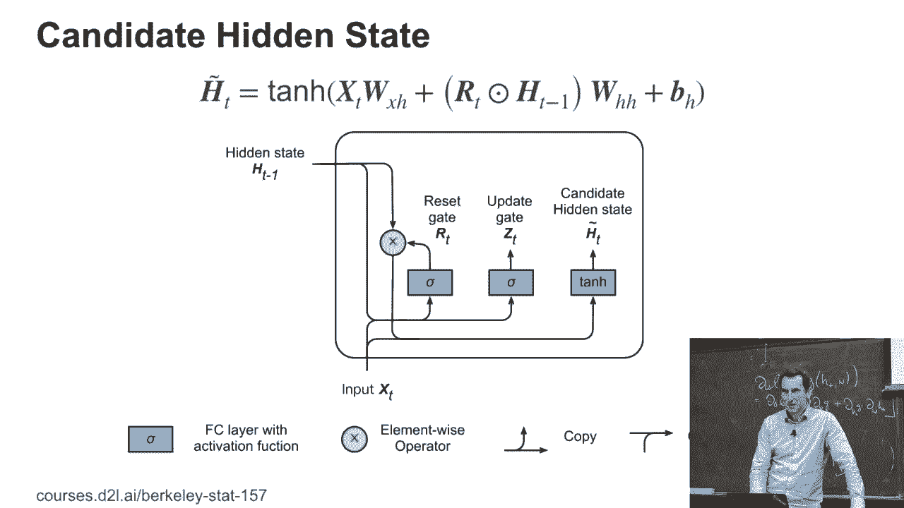

---

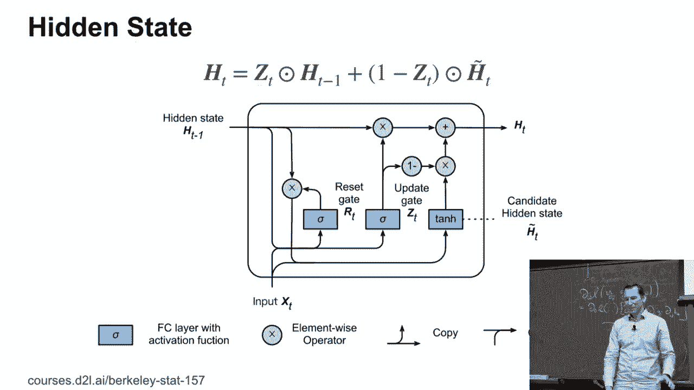

## 4. GRU 与 LSTM 及代码实现 💻

最后，我们讨论GRU的实践意义并展望其代码实现。

GRU 可以看作是 LSTM 的一个简化版本。它用更少的门控（2个 vs LSTM的3个）和更简单的状态流（只有一个隐藏状态 `h_t`，而LSTM有细胞状态 `C_t` 和隐藏状态 `h_t`），实现了类似的功能。因此，**GRU 通常具有更快的训练速度和更少的参数**。虽然在许多任务上LSTM的表现略胜一筹，但GRU在计算资源受限或数据量不足时是一个非常有竞争力的选择。

在代码实现层面，现代深度学习框架（如PyTorch, TensorFlow）都提供了封装好的GRU层。其内部计算就是将上述公式串联起来。理解这些底层计算有助于我们更好地调试模型和设计新的结构。

> **扩展思考**：门控机制的思想并不局限于全连接层。在处理图像、图结构等数据时，可以尝试将卷积操作与门控机制结合，这催生了如卷积LSTM/GRU等变体，是值得探索的研究方向。

---

## 总结 📝

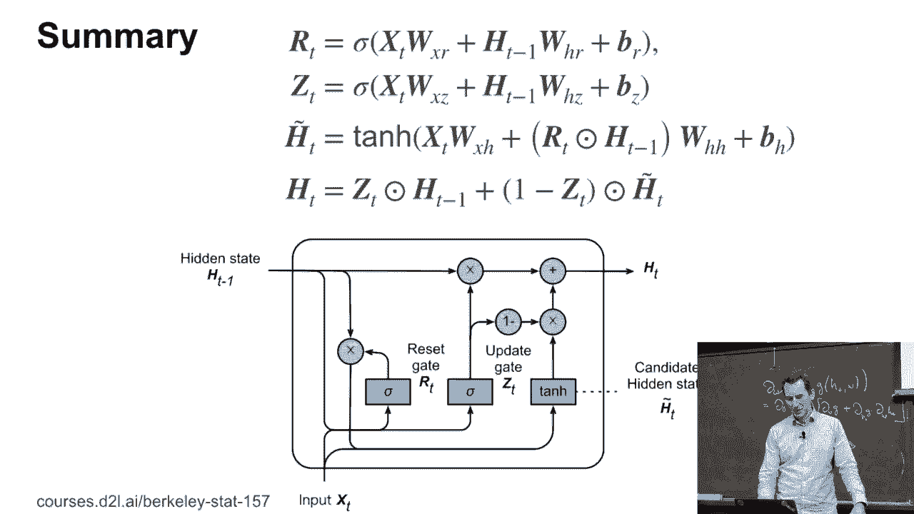

本节课中我们一起学习了门控循环单元（GRU）。我们从其设计动机出发，理解了引入**更新门**和**重置门**的必要性。然后，我们逐步拆解了GRU的三个核心计算步骤：**门控计算**、**候选状态生成**和**最终状态更新**，并用公式和代码描述了其过程。最后，我们分析了GRU的行为模式，并对比了其与LSTM的优劣。GRU通过巧妙的门控设计，在序列建模任务中提供了效率与性能的良好平衡。