# 104：门控循环单元在 Python 中的实现 🧠💻

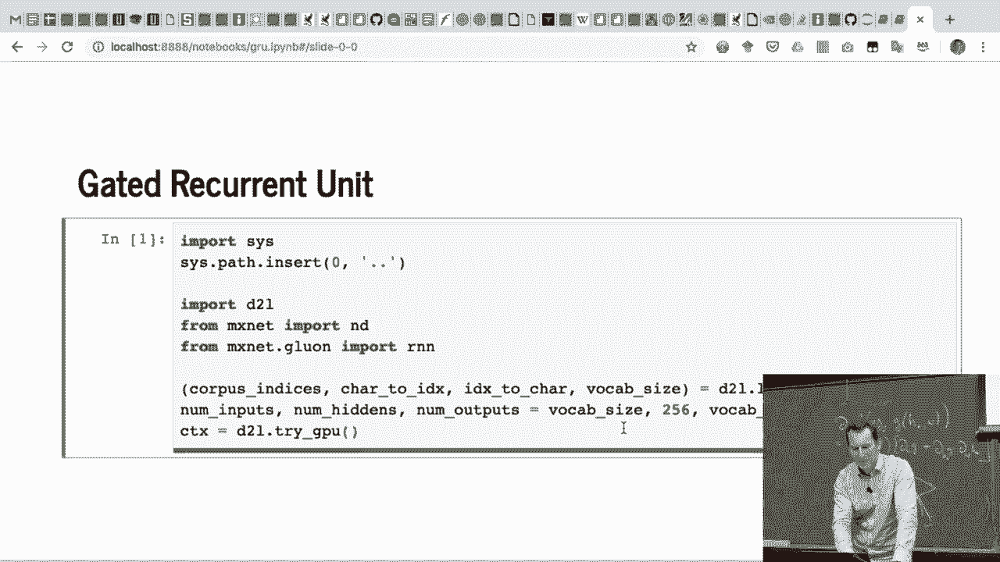

在本节课中，我们将学习如何在 Python 中从零开始实现门控循环单元。我们将逐步讲解数据加载、参数初始化、模型定义以及训练过程，确保你能理解 GRU 的每个核心组件是如何工作的。

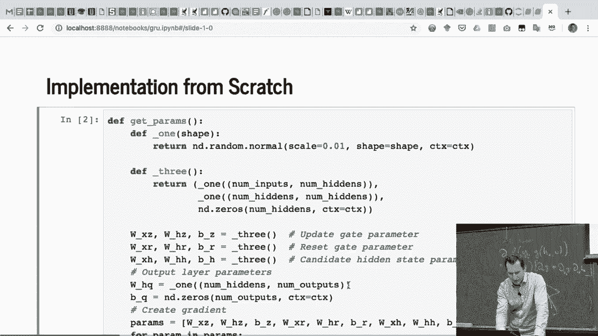

---

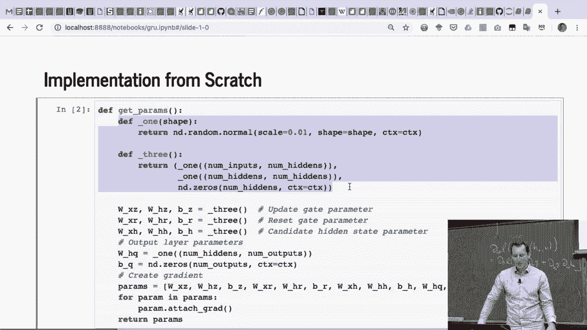

## 1. 数据加载与参数设置 📊

上一节我们介绍了 GRU 的基本概念，本节中我们来看看如何准备数据和设置基础参数。

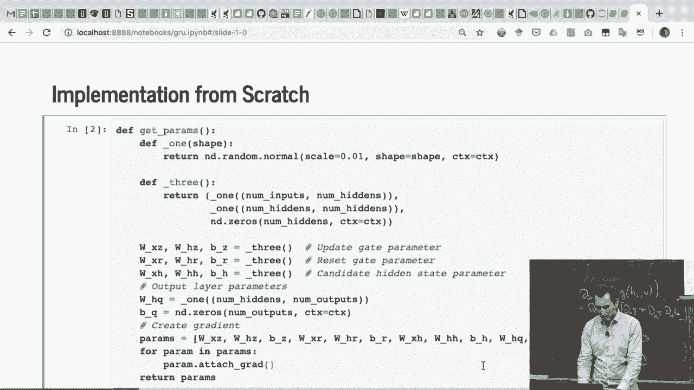

首先，我们需要加载数据并设置一些基础参数。这个过程与之前循环神经网络的实现类似。

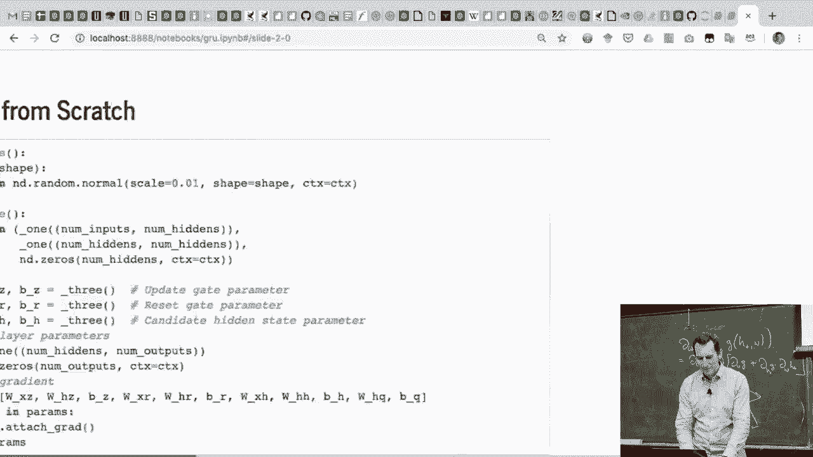

```python
# 设置隐藏单元的数量
num_hiddens = 256
```

唯一的不同之处在于，我们将隐藏单元的数量设置为 256。这与我们之前实现循环神经网络时的设置完全相同。

---

## 2. 参数初始化 🔧

在定义模型之前，我们需要初始化所有可学习的参数。以下是初始化参数的步骤。

我们需要为 GRU 的三个核心门（更新门、重置门、候选隐藏状态）分别初始化权重矩阵和偏置。

```python
def get_params(vocab_size, num_hiddens, device):
    # 初始化三种参数：更新门、重置门、候选隐藏状态
    num_inputs = num_outputs = vocab_size

    def normal(shape):
        return torch.randn(size=shape, device=device) * 0.01

    def three():
        return (normal((num_inputs, num_hiddens)),
                normal((num_hiddens, num_hiddens)),
                torch.zeros(num_hiddens, device=device))

    # 初始化参数
    W_xz, W_hz, b_z = three()  # 更新门参数
    W_xr, W_hr, b_r = three()  # 重置门参数
    W_xh, W_hh, b_h = three()  # 候选隐藏状态参数
    # 输出层参数
    W_hq = normal((num_hiddens, num_outputs))
    b_q = torch.zeros(num_outputs, device=device)
    # 附加梯度
    params = [W_xz, W_hz, b_z, W_xr, W_hr, b_r, W_xh, W_hh, b_h, W_hq, b_q]
    for param in params:
        param.requires_grad_(True)
    return params
```

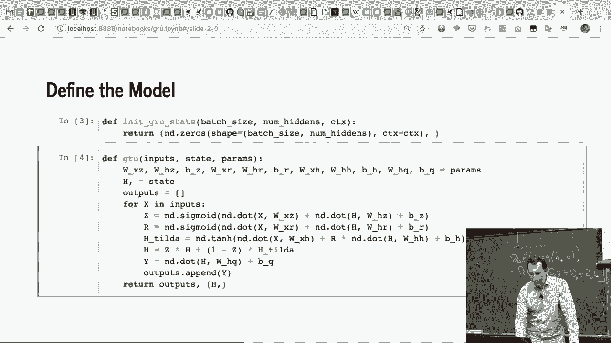

上述代码初始化了所有必要的权重和偏置，并确保它们可以被优化器更新。接下来，我们将使用这些参数来定义 GRU 的前向传播逻辑。

---

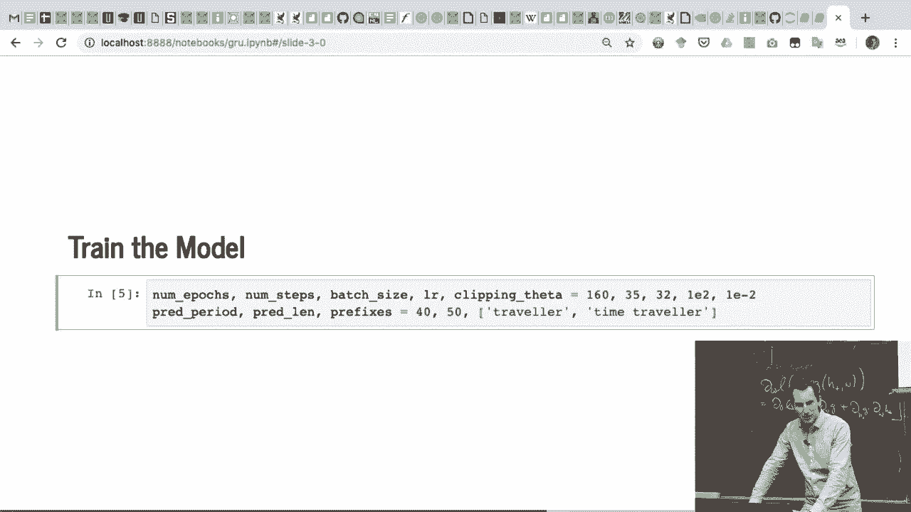

## 3. 定义 GRU 模型 🏗️

现在，我们将定义 GRU 单元的前向传播函数。这个函数将输入序列、初始隐藏状态和参数作为输入，并返回最终的隐藏状态和输出。

首先初始化隐藏状态。然后，我们迭代处理输入序列中的每个时间步。

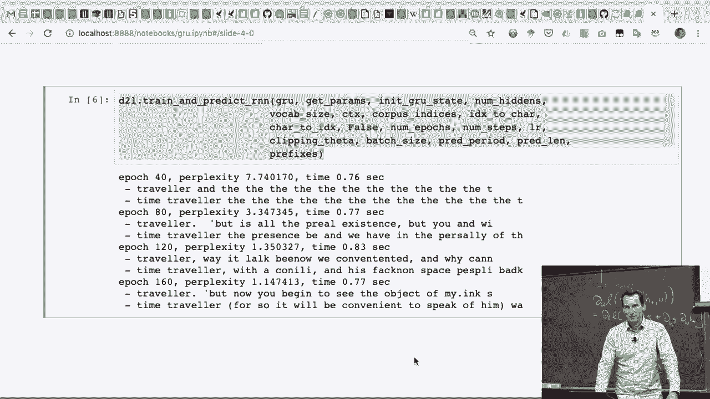

```python
def gru(inputs, state, params):
    W_xz, W_hz, b_z, W_xr, W_hr, b_r, W_xh, W_hh, b_h, W_hq, b_q = params
    H, = state
    outputs = []
    for X in inputs:
        # 计算更新门和重置门
        Z = torch.sigmoid((X @ W_xz) + (H @ W_hz) + b_z)
        R = torch.sigmoid((X @ W_xr) + (H @ W_hr) + b_r)
        # 计算候选隐藏状态
        H_tilde = torch.tanh((X @ W_xh) + ((R * H) @ W_hh) + b_h)
        # 计算新的隐藏状态
        H = Z * H + (1 - Z) * H_tilde
        # 计算输出
        Y = H @ W_hq + b_q
        outputs.append(Y)
    return torch.cat(outputs, dim=0), (H,)
```

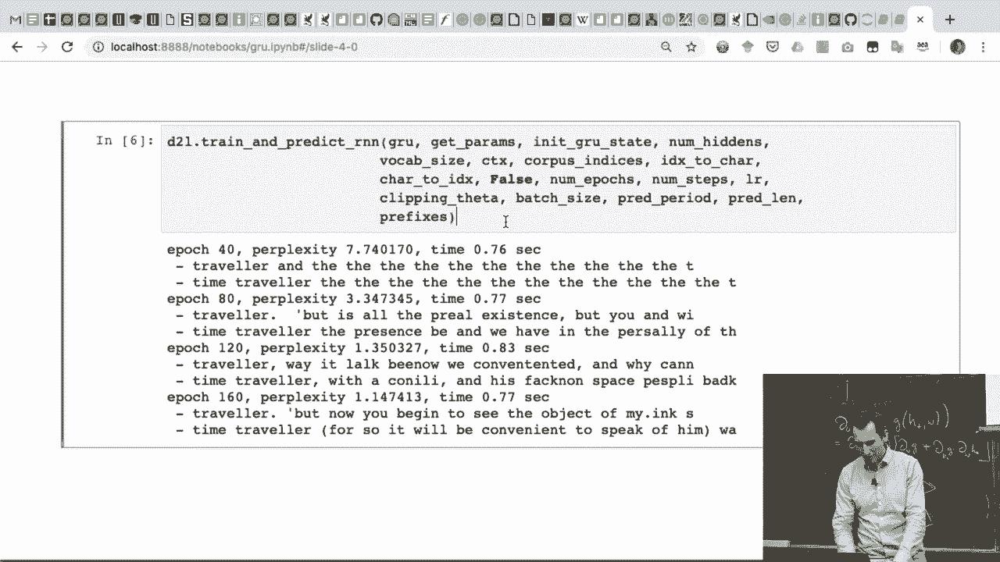

这个函数逐句实现了 GRU 的数学公式：
1.  计算更新门 **Z** 和重置门 **R**。
2.  结合重置门和当前隐藏状态，计算候选隐藏状态 **H̃**。
3.  使用更新门融合旧隐藏状态和候选状态，得到新隐藏状态 **H**。
4.  根据新隐藏状态计算输出 **Y**。

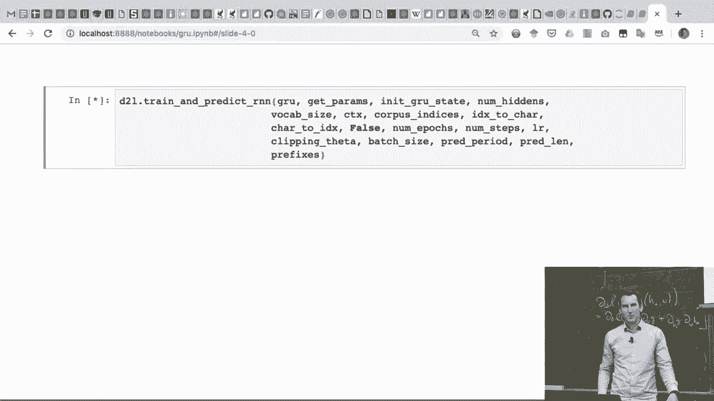

---

## 4. 训练模型 🚀

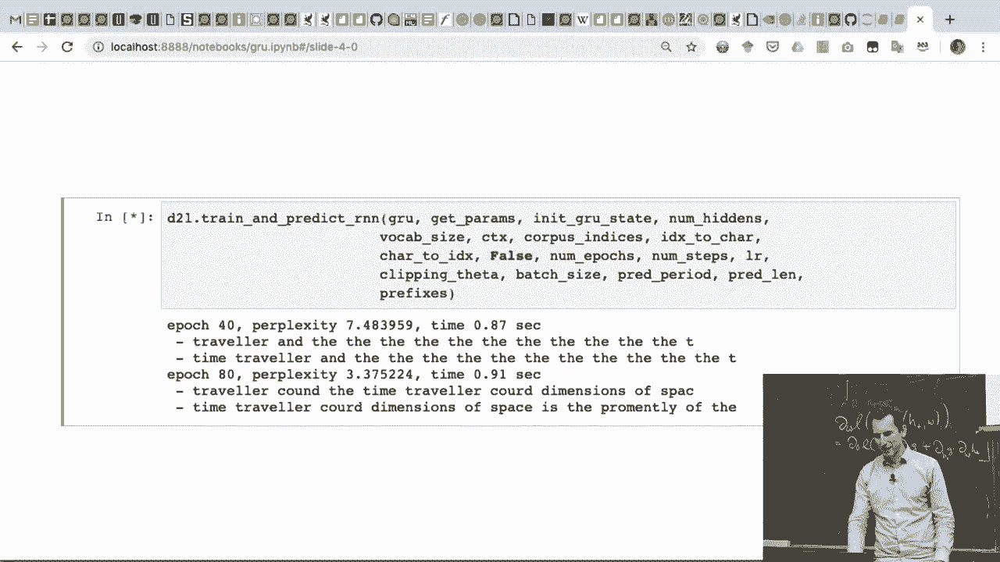

模型定义完成后，我们就可以开始训练了。我们需要设置训练参数，并调用训练循环。

以下是训练模型所需的关键参数设置。

```python
num_epochs = 160
num_steps = 35
batch_size = 32
lr = 0.01
grad_clipping = 100
```

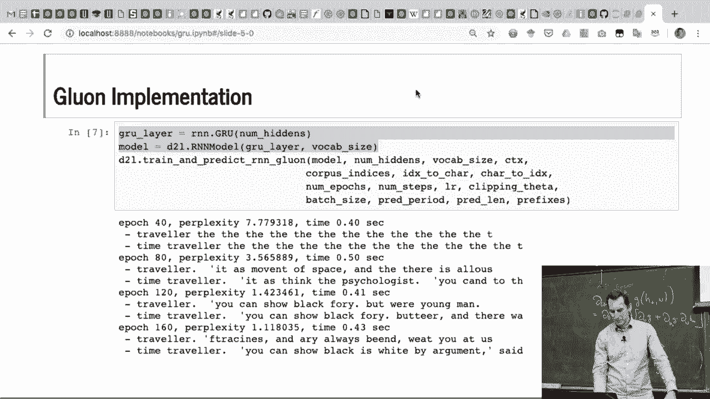

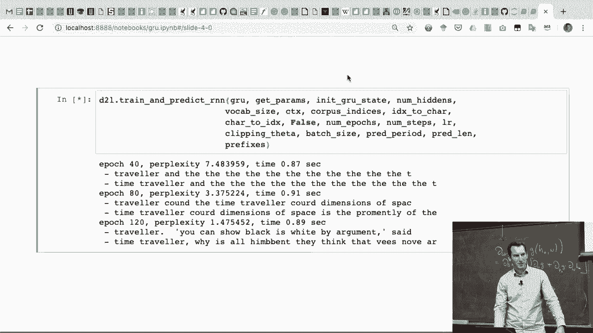

设置好参数后，我们使用与之前相同的训练和预测函数来训练 GRU 模型。训练过程会显示困惑度的下降，表明模型正在学习。

```python
train_ch8(gru, get_params, init_gru_state, num_hiddens,
          vocab, device, False, num_epochs, lr, use_random_iter=False)
```

在训练初期，模型生成的文本可能是无意义的。随着训练的进行，生成文本的质量会逐渐提高。在你的作业中，你将使用莎士比亚的文本进行类似的训练。

---

## 5. 扩展讨论与常见问题 ❓

在实现基础 GRU 后，我们来看看一些常见的扩展和问题。

### 如何构建更深的 GRU 网络？
要增加网络深度，可以将第一层 GRU 的输出作为第二层 GRU 的输入，依此类推。通常，每一层都有自己独立的参数。

### 词嵌入（Word Embedding）如何选择？
词嵌入是将词语映射为向量的技术。选择好的词嵌入对模型性能至关重要。
*   **挑战**：一个词可能有多种含义（例如，“bank”可指河岸或银行），仅靠静态向量难以捕捉。
*   **解决方案**：现代方法（如 Word2Vec, BERT）会根据词语的上下文来学习动态的向量表示，这能更好地处理一词多义。
*   **实践**：嵌入矩阵通常作为模型的一部分，在大型语料库上进行预训练，然后与下游任务（如 GRU 语言模型）进行联合微调。

### 使用框架（如 Gluon）实现有何优势？
使用深度学习框架可以大幅减少代码量。例如，在 Gluon 中，你只需定义 `rnn.GRU` 层并指定隐藏单元数，框架会处理大部分底层细节，使实现更简洁、运行更高效。

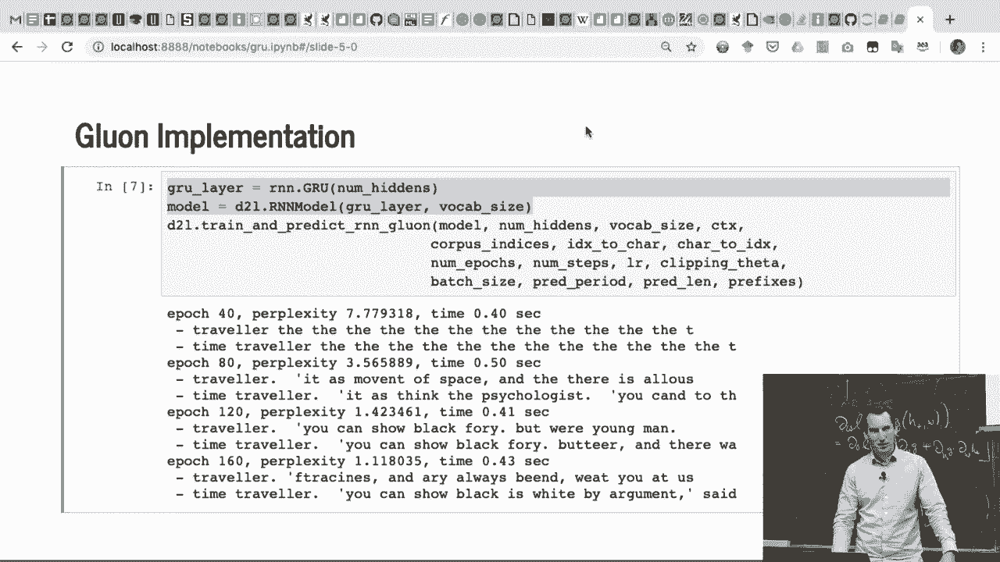

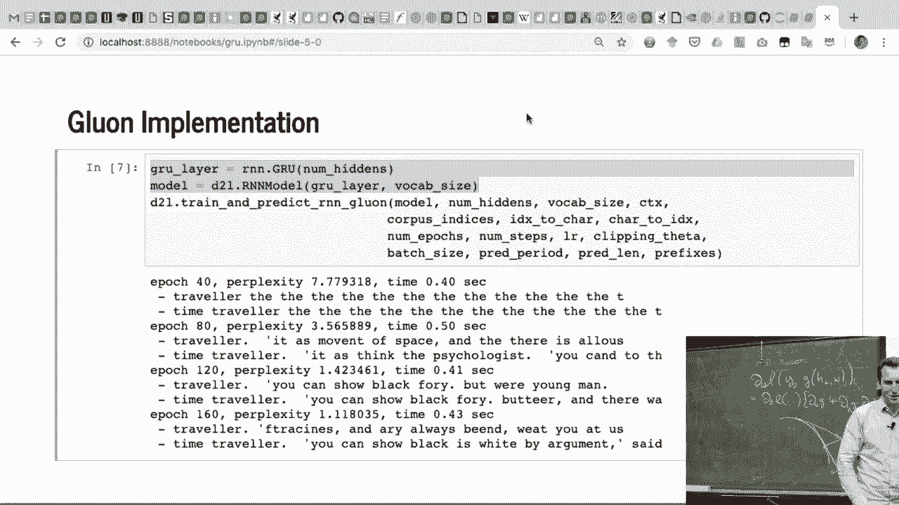

---

## 总结 📝

本节课中我们一起学习了门控循环单元在 Python 中的完整实现流程。
1.  我们首先加载数据并设置了模型参数。
2.  接着，我们详细讲解了如何初始化 GRU 的更新门、重置门和候选隐藏状态参数。
3.  然后，我们一步步实现了 GRU 的前向传播函数，将数学公式转化为可运行的代码。
4.  之后，我们设置了训练循环并观察了模型的训练过程。
5.  最后，我们探讨了构建深层 GRU、选择词嵌入以及使用高级框架等扩展话题。

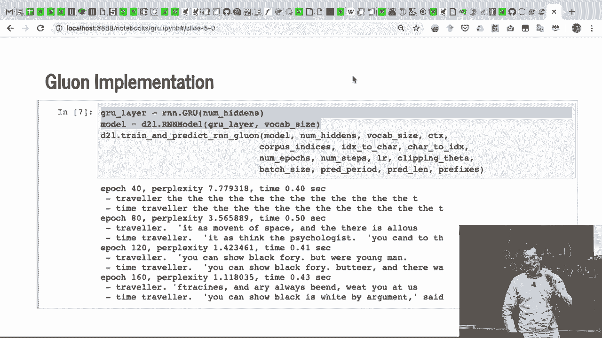

通过本教程，你应该能够理解 GRU 的核心机制，并具备从零开始实现它的能力。