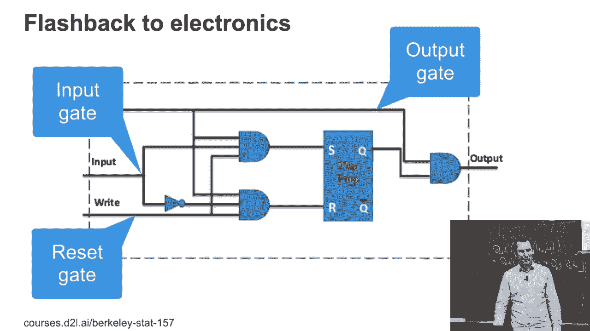
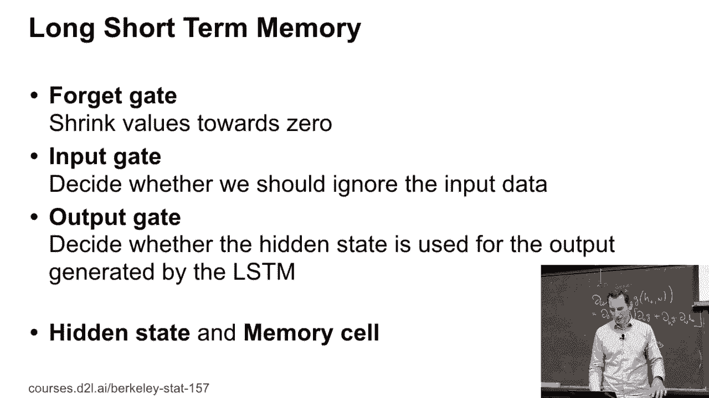
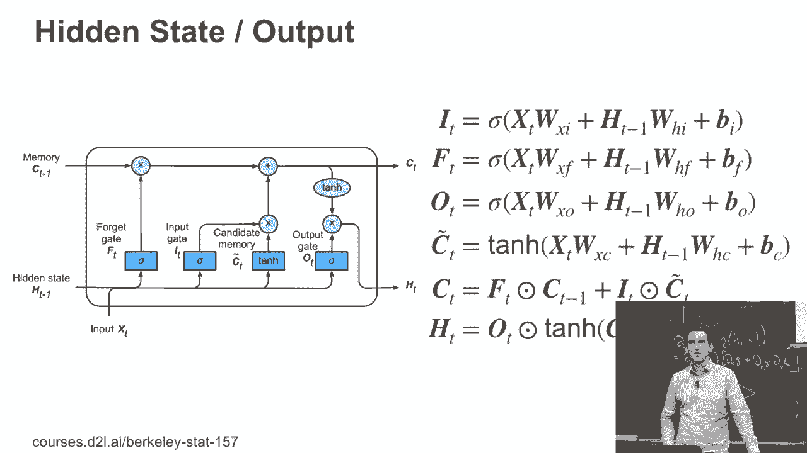

# 105：长短期记忆 (LSTM) 教程 🧠


在本节课中，我们将要学习循环神经网络中一个非常重要的变体——长短期记忆网络。我们将了解它的起源、核心设计思想以及其内部的计算机制。

## 📖 背景故事

长短期记忆网络背后有一个有趣的故事。尤尔根·施密特伯尔是一位值得记住的研究者。故事是这样的，当时有人向尤尔根·施密特伯尔提出了如何让神经网络记住时间序列中信息的问题。最终，这个想法被具体实现出来，成为了长短期记忆网络。实际上，真正完成这项工作的是一位硕士生。这项工作的起点大约在1997到1998年。当时这篇论文看起来有些奇怪，很多人最初并不理解它的意义。

## 🏗️ LSTM的核心设计

上一节我们介绍了LSTM的背景，本节中我们来看看它的核心设计思想。LSTM的设计是为了解决标准循环神经网络在长序列上难以记住长期依赖关系的问题。

### 门控机制

LSTM的核心是引入了门控机制。以下是LSTM中关键的三个门：



*   **输入门 (I)**：决定当前输入有多少信息需要存入记忆单元。
*   **遗忘门 (F)**：决定上一时刻的记忆单元有多少信息需要被遗忘。
*   **输出门 (O)**：决定当前记忆单元有多少信息需要输出到隐藏状态。

这些门函数都是sigmoid函数，它们接收当前的输入和上一时刻的隐藏状态，通过线性变换和偏置项来计算。

```python
# 门函数的通用形式（伪代码）
Gate_t = sigmoid(W_g * [h_{t-1}, x_t] + b_g)
```

### 记忆单元

接下来，让我们看看候选记忆单元。这是LSTM变得有趣的地方。候选记忆单元 `C_tilde` 不是隐藏状态，它是通过当前输入和上一时刻隐藏状态的线性变换，再经过tanh激活函数得到的。

```python
# 候选记忆单元
C_tilde_t = tanh(W_c * [h_{t-1}, x_t] + b_c)
```



有了候选记忆，我们需要决定如何更新旧的记忆。遗忘门帮助我们决定是否保留旧的记忆，输入门决定加入多少新的候选记忆。实际的记忆单元 `C_t` 的更新公式如下：

```python
# 记忆单元更新
C_t = F_t * C_{t-1} + I_t * C_tilde_t
```

### 隐藏状态输出

现在，记忆单元已经更新，但它还没有直接对外产生影响。隐藏状态 `h_t` 是由输出门 `O_t` 乘以当前记忆单元 `C_t` 经过tanh激活后的结果。

```python
# 隐藏状态计算
h_t = O_t * tanh(C_t)
```

所以，在LSTM中，你需要同时维护两个状态变量：记忆单元 `C_t` 和隐藏状态 `h_t`。这比标准RNN更复杂，但也赋予了它更强的记忆能力。

## 🔍 整体架构回顾

上一节我们分解了LSTM的各个部分，现在我们来整体回顾一下它的完整计算流程。

以下是LSTM在一个时间步内的完整计算展现：
1.  计算三个门：输入门 `I_t`、遗忘门 `F_t`、输出门 `O_t`。
2.  计算候选记忆单元 `C_tilde_t`。
3.  更新长期记忆单元：`C_t = F_t * C_{t-1} + I_t * C_tilde_t`。
4.  计算当前隐藏状态输出：`h_t = O_t * tanh(C_t)`。

这个设计看起来比标准RNN和GRU更复杂，像一台精密的机器。但它所做的事情与我们之前讨论的门控循环单元思想相似，只是在如何参数化和控制信息流方面有更大的灵活性。

## 📝 总结



本节课中我们一起学习了长短期记忆网络。我们了解了它的诞生背景，深入剖析了其核心的门控机制，包括输入门、遗忘门和输出门的作用。我们学习了记忆单元如何通过候选记忆和门控信号进行更新，以及最终如何产生隐藏状态输出。尽管LSTM的结构相对复杂，但它通过精妙的门控设计，有效地解决了长期依赖问题，成为了处理序列数据的强大工具。