# 106：LSTM 在 Python 中的实现 🧠💻

在本节课中，我们将学习如何在 Python 中实现长短期记忆网络。我们将从加载数据开始，逐步完成参数初始化、前向传播以及训练过程，并与之前学过的 GRU 进行简单对比。

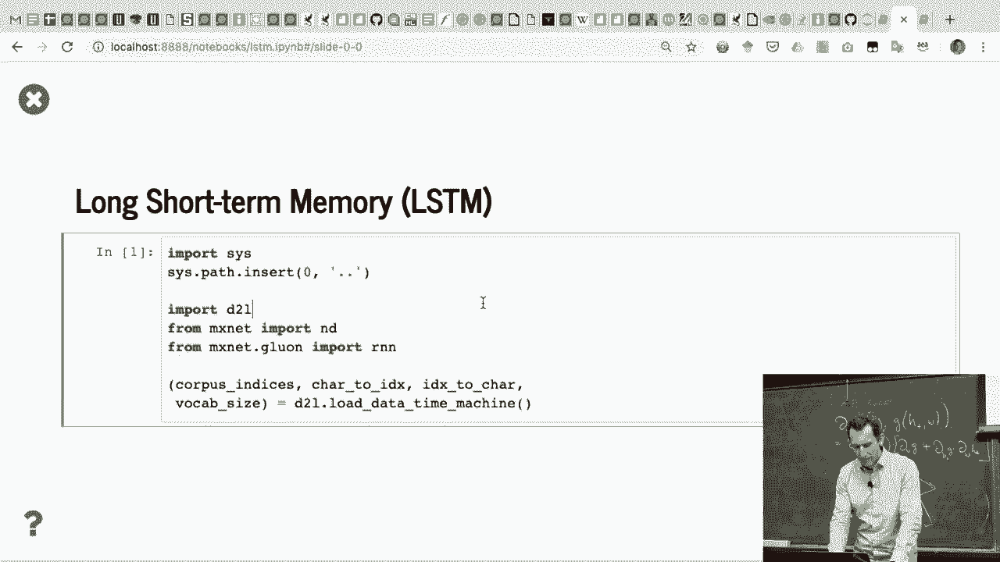

---

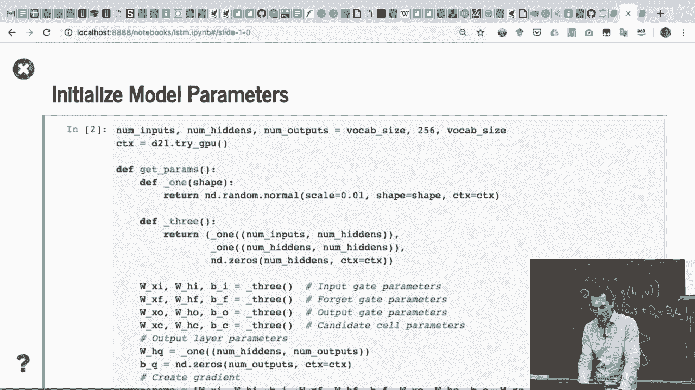

## 数据加载

首先，我们需要加载数据。这与之前处理序列数据的方法完全相同。

```python
# 加载数据的代码示例
data = load_your_data()
```

---

## 参数初始化

上一节我们介绍了数据加载，本节中我们来看看如何初始化 LSTM 的参数。

参数初始化方法与之前相同，但 LSTM 拥有更多的权重向量。我们使用正态高斯分布来初始化权重，并将偏置初始化为 0。LSTM 包含三组门参数以及候选单元的参数。

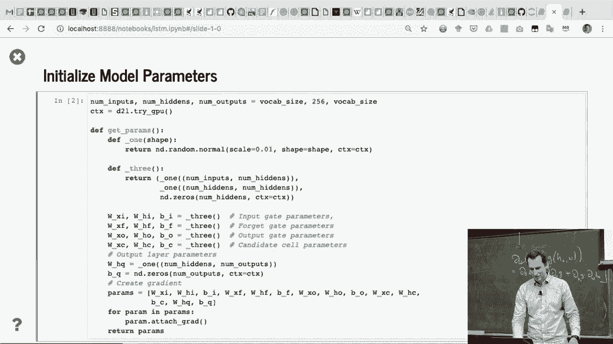

以下是初始化参数的代码框架：

```python
import numpy as np

def init_lstm_params(input_size, hidden_size):
    # 初始化输入门、遗忘门、输出门和候选单元的权重与偏置
    params = {}
    # 示例：输入门权重
    params['W_i'] = np.random.randn(hidden_size, input_size + hidden_size) * 0.01
    params['b_i'] = np.zeros((hidden_size, 1))
    # 类似地初始化其他参数...
    return params
```

初始化完成后，我们将得到附带梯度的参数，以便后续进行反向传播。

---

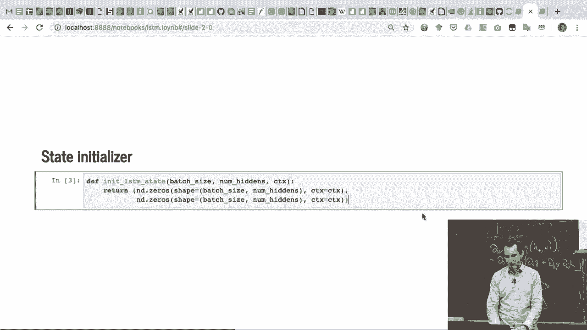

## 状态初始化

接下来我们需要初始化 LSTM 的隐藏状态和记忆单元状态。

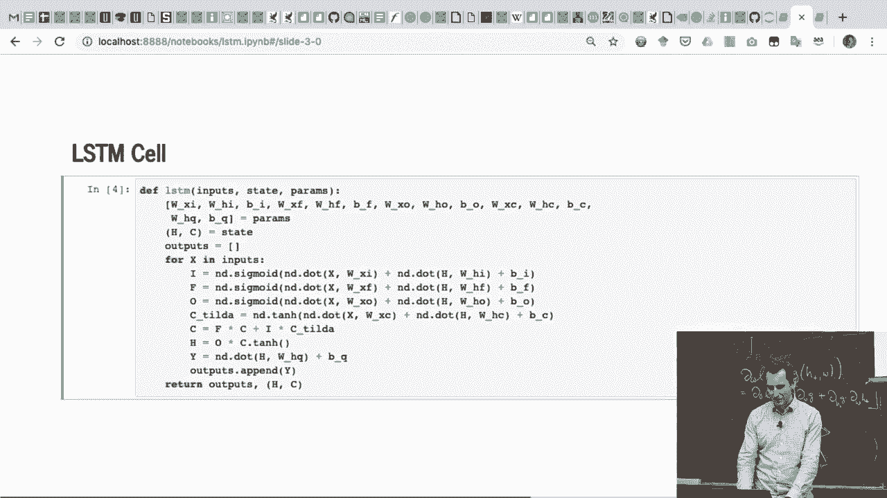

在开始时，这两个状态通常被初始化为全零向量。这是因为我们没有任何先前的信息可以依赖。

```python
def init_lstm_state(batch_size, hidden_size):
    h = np.zeros((hidden_size, batch_size))  # 隐藏状态
    c = np.zeros((hidden_size, batch_size))  # 记忆单元状态
    return (h, c)
```

记忆单元在后台运作，不直接参与输出计算，但需要随网络一起传递。

---

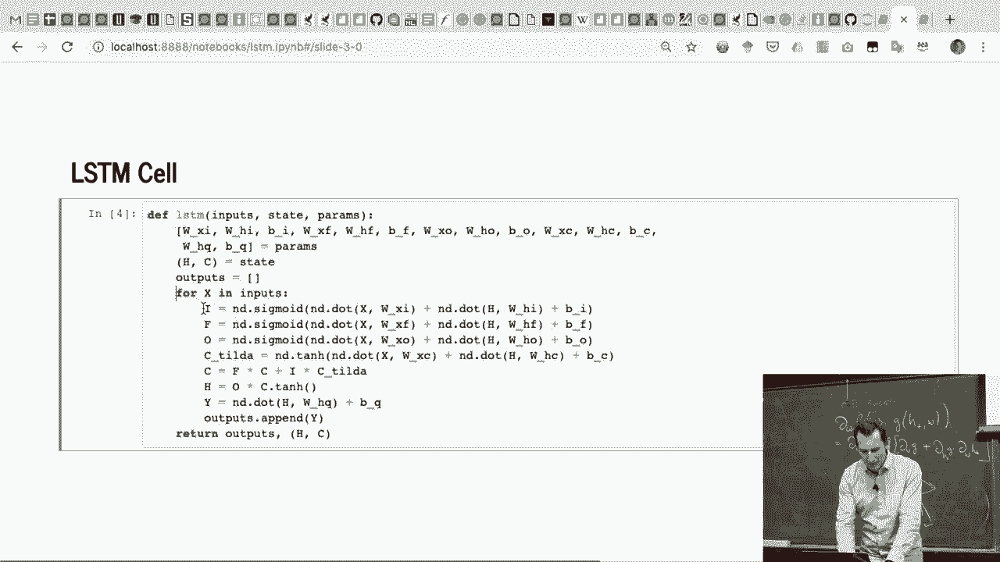

## 前向传播

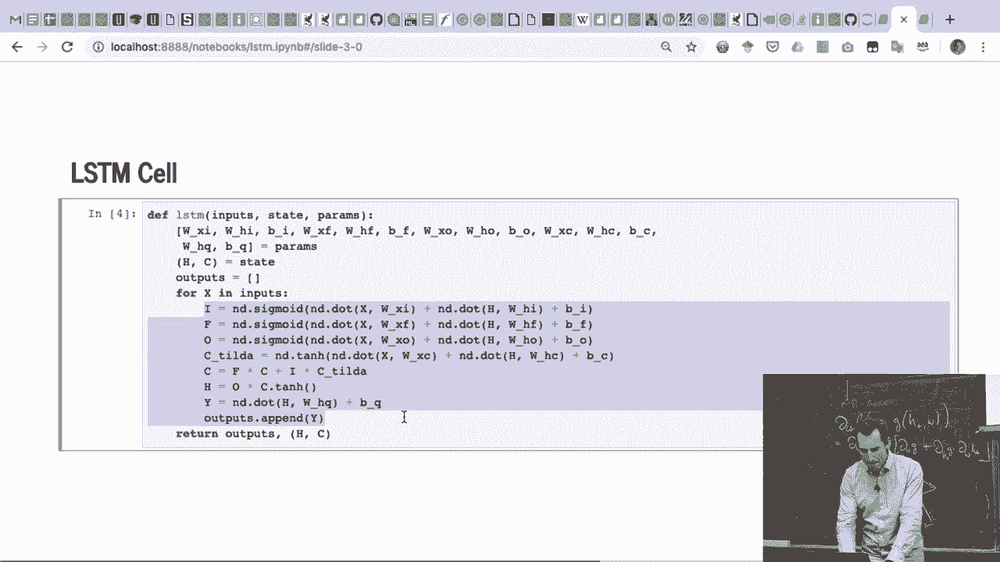

现在，让我们看看 LSTM 前向传播中“魔法”发生的地方。这里我们将参数和状态分解，并应用 LSTM 的数学公式。

以下是 LSTM 单步前向传播的核心计算步骤：

1.  **计算三个门和候选值**：
    *   输入门：`i = sigmoid(W_i * [h_prev, x] + b_i)`
    *   遗忘门：`f = sigmoid(W_f * [h_prev, x] + b_f)`
    *   输出门：`o = sigmoid(W_o * [h_prev, x] + b_o)`
    *   候选记忆单元：`c_tilde = tanh(W_c * [h_prev, x] + b_c)`

2.  **更新记忆单元**：
    *   `c_next = f * c_prev + i * c_tilde`

3.  **计算当前隐藏状态**：
    *   `h_next = o * tanh(c_next)`

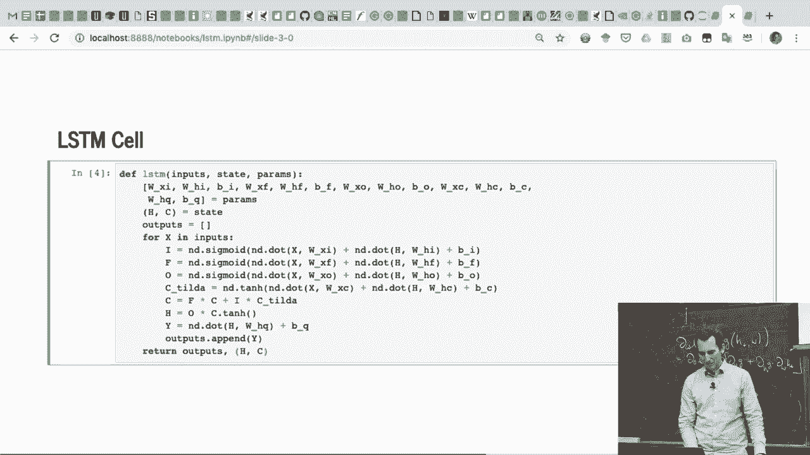

```python
def lstm_step_forward(x, h_prev, c_prev, params):
    # 拼接上一时刻隐藏状态和当前输入
    concat = np.concatenate((h_prev, x), axis=0)

    # 计算各个门和候选值
    i = sigmoid(np.dot(params['W_i'], concat) + params['b_i'])
    f = sigmoid(np.dot(params['W_f'], concat) + params['b_f'])
    o = sigmoid(np.dot(params['W_o'], concat) + params['b_o'])
    c_tilde = np.tanh(np.dot(params['W_c'], concat) + params['b_c'])

    # 更新记忆单元和隐藏状态
    c_next = f * c_prev + i * c_tilde
    h_next = o * np.tanh(c_next)

    return h_next, c_next
```

这个过程与我们在理论部分学习的公式完全一致。

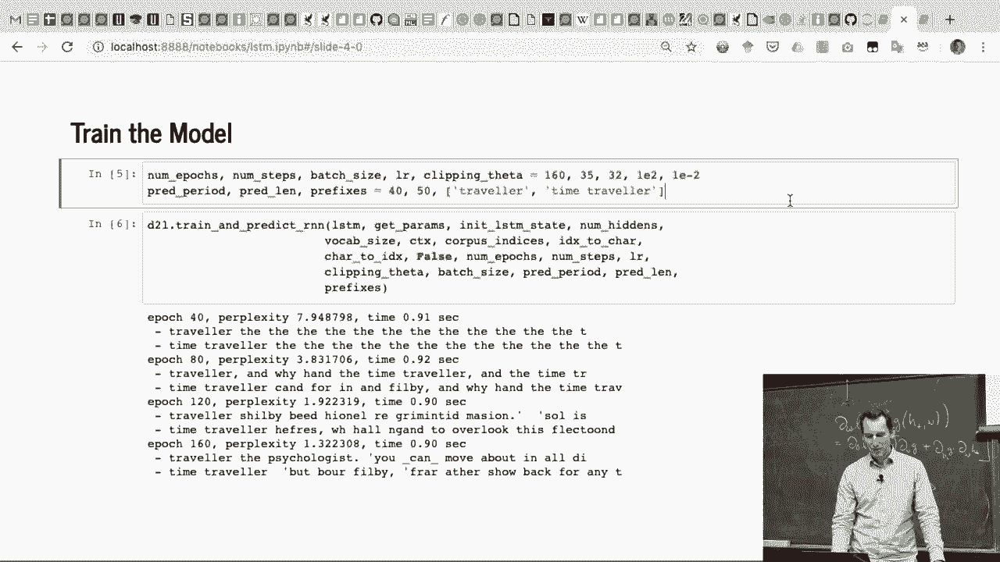

---

## 训练过程

训练过程与之前循环神经网络的训练完全相同，包括前向传播、损失计算、反向传播和参数更新。步数等超参数设置也保持一致。

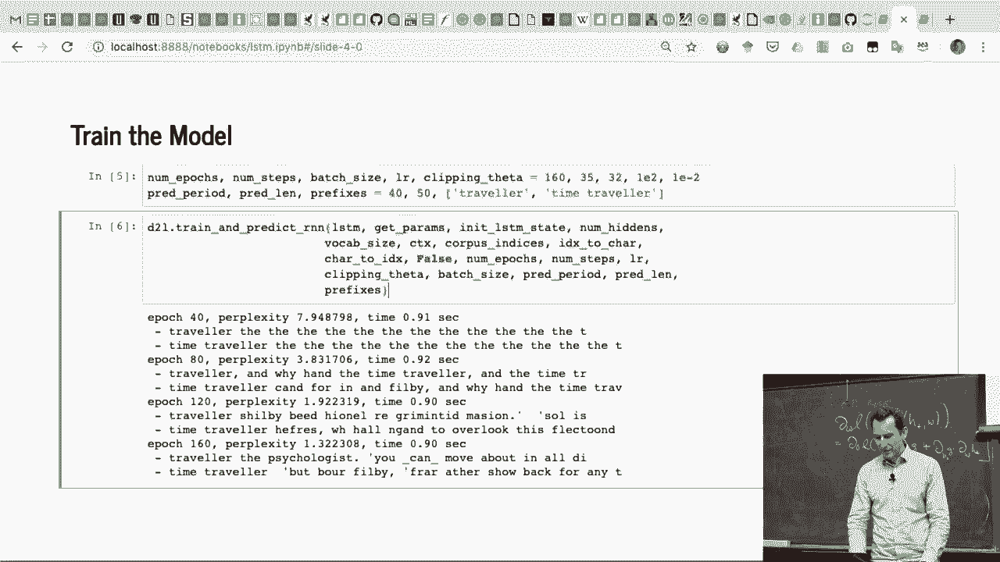

由于时间关系，我们在此不运行完整的训练。但理论上，经过足够时间的训练，LSTM 在捕捉长期依赖关系上通常比 GRU 表现稍好。

---

## 使用 Gluon 实现 LSTM

最后，我们来看看如何在高级框架（如 MXNet 的 Gluon）中快速实现 LSTM。

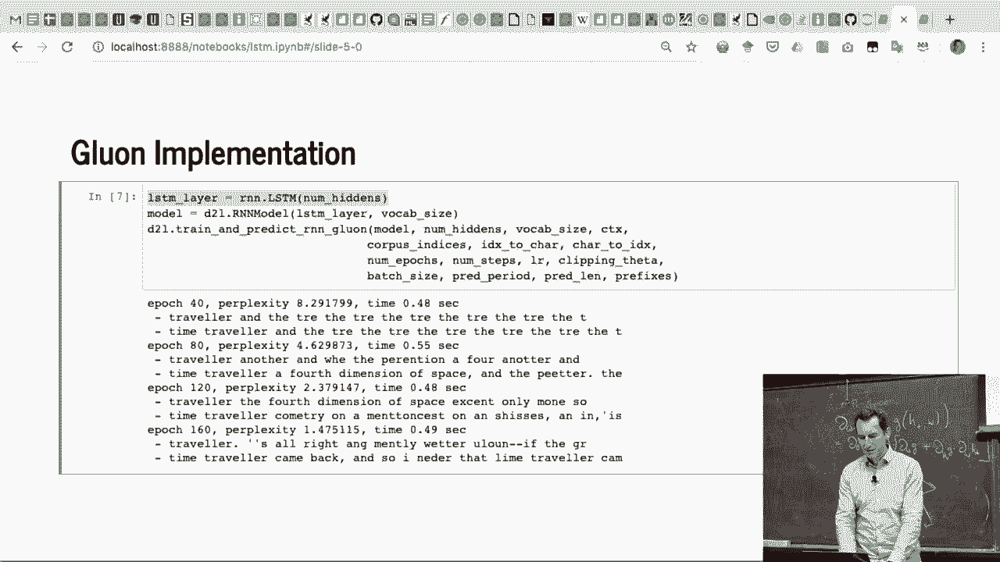

在 Gluon 中，实现 LSTM 与实现 GRU 非常相似，主要区别在于调用的模块。

```python
from mxnet.gluon import nn, rnn

# 定义 LSTM 层
lstm_layer = rnn.LSTM(hidden_size=100, num_layers=2)
```

需要注意的是，LSTM 的计算通常比 GRU 更复杂，因此前向传播速度可能稍慢一些。例如，之前 GRU 的运算时间是 0.3 秒，而 LSTM 可能是 0.48 秒。具体时间取决于硬件和后台任务。

---

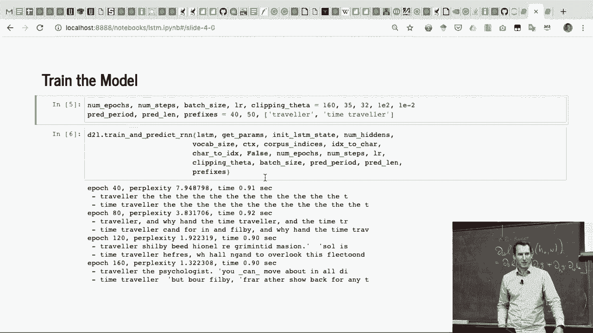

## 总结

本节课中我们一起学习了长短期记忆网络在 Python 中的实现。我们从数据加载和参数初始化开始，详细讲解了 LSTM 独特的状态（隐藏状态和记忆单元）初始化方法。然后，我们深入探讨了 LSTM 前向传播的核心公式与代码实现，涵盖了输入门、遗忘门、输出门和候选记忆单元的计算。最后，我们简要介绍了训练流程以及如何在 Gluon 框架中便捷地使用 LSTM 层。理解这些基础实现，是后续学习更复杂变体（如双向 LSTM）和词嵌入技术的重要基石。