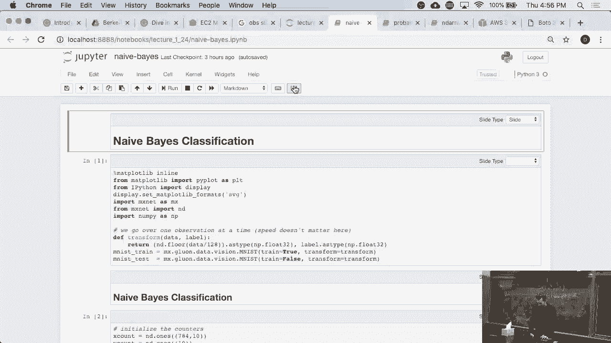
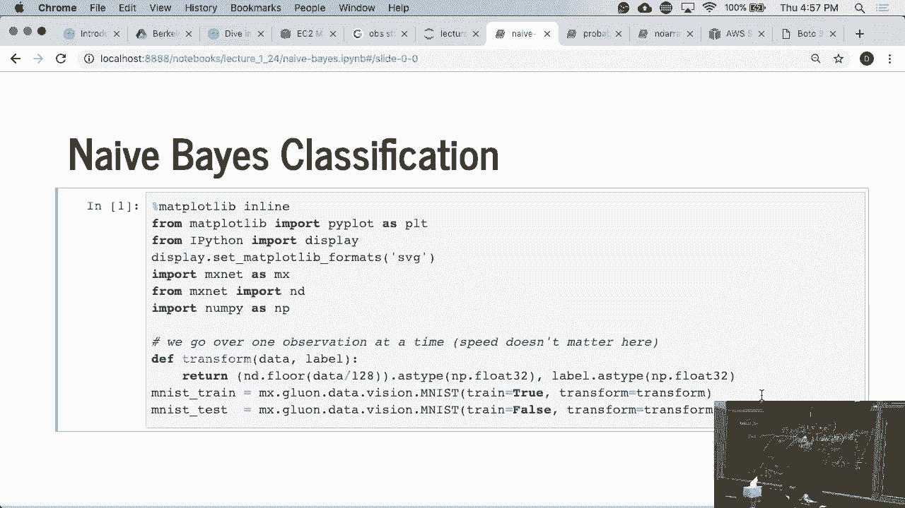
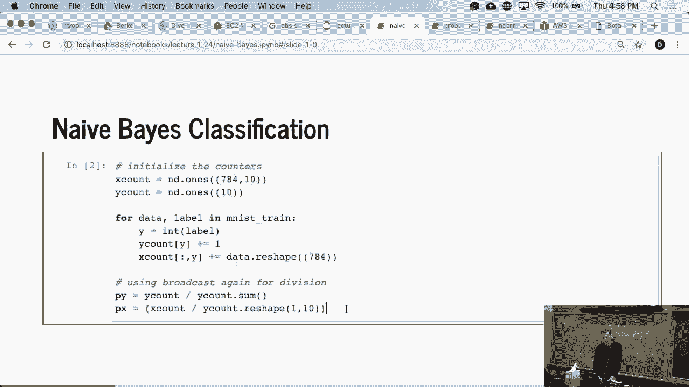
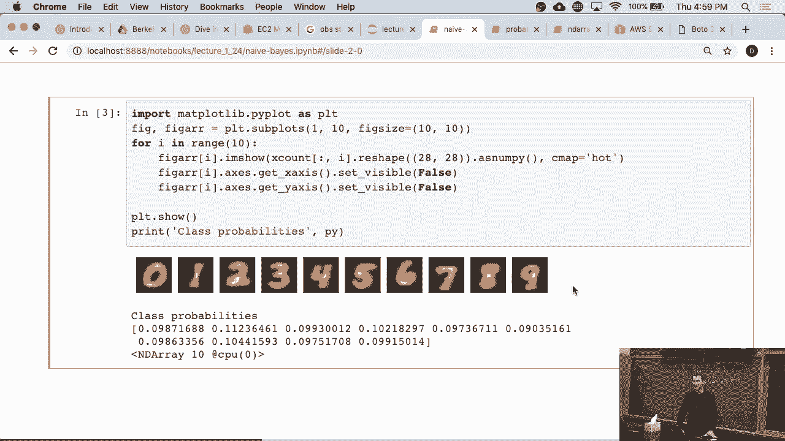
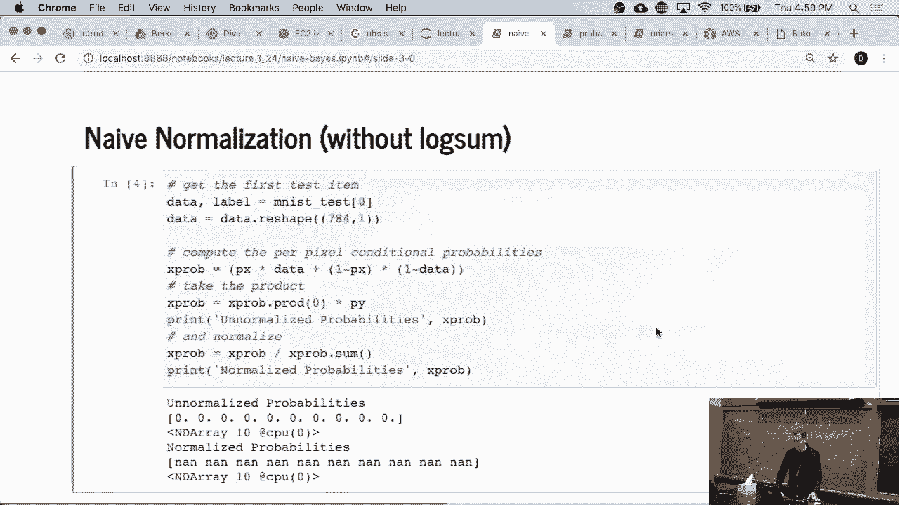
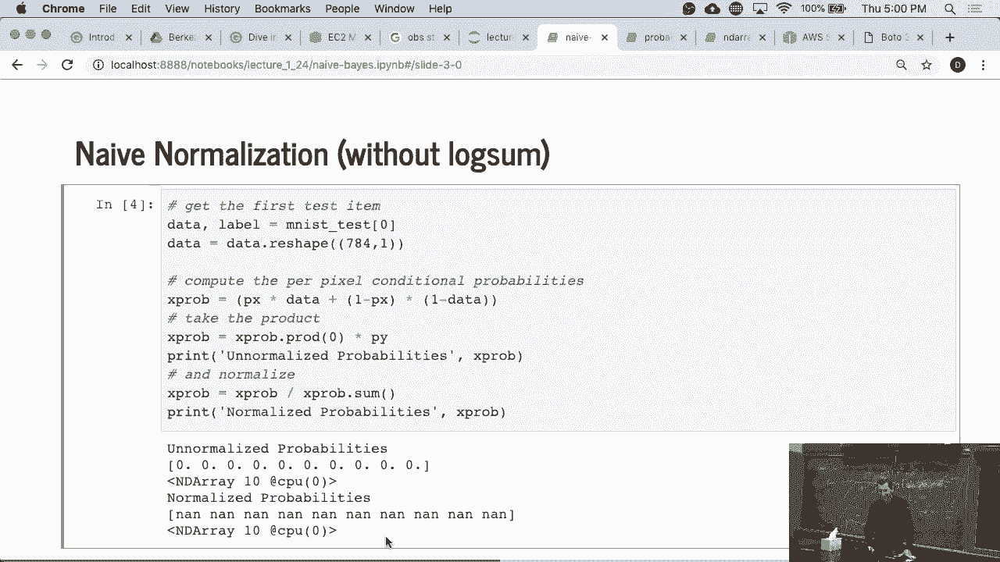
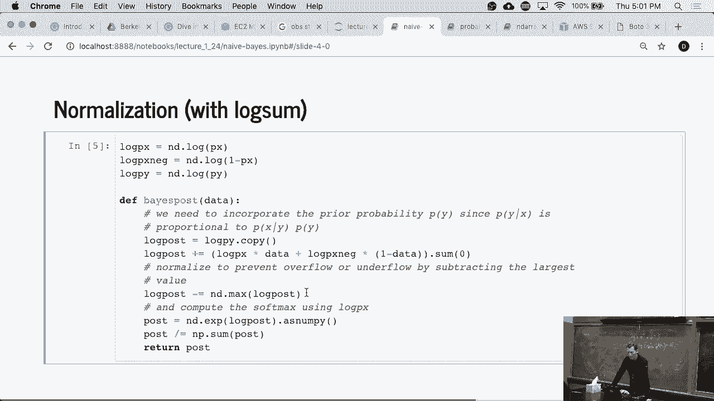
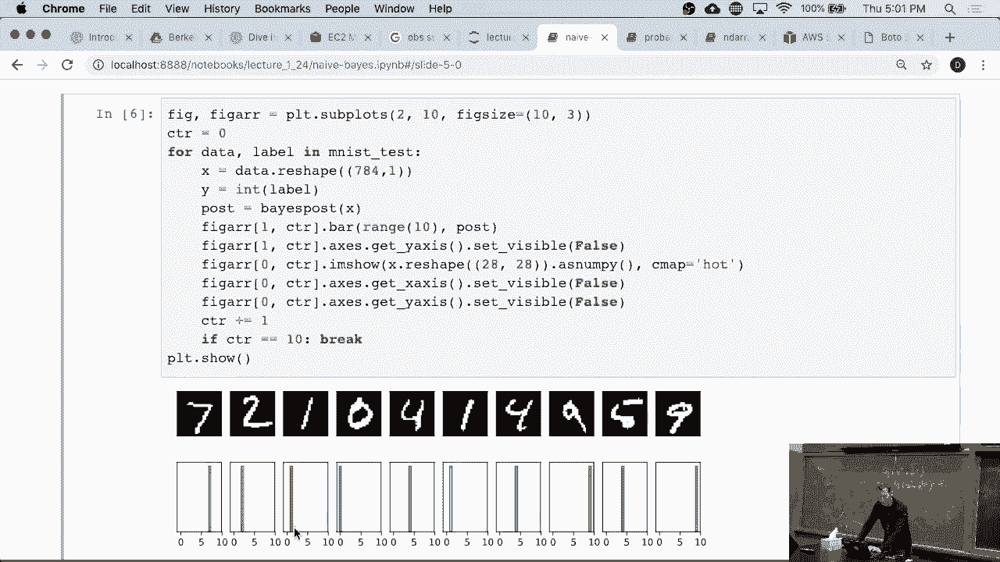
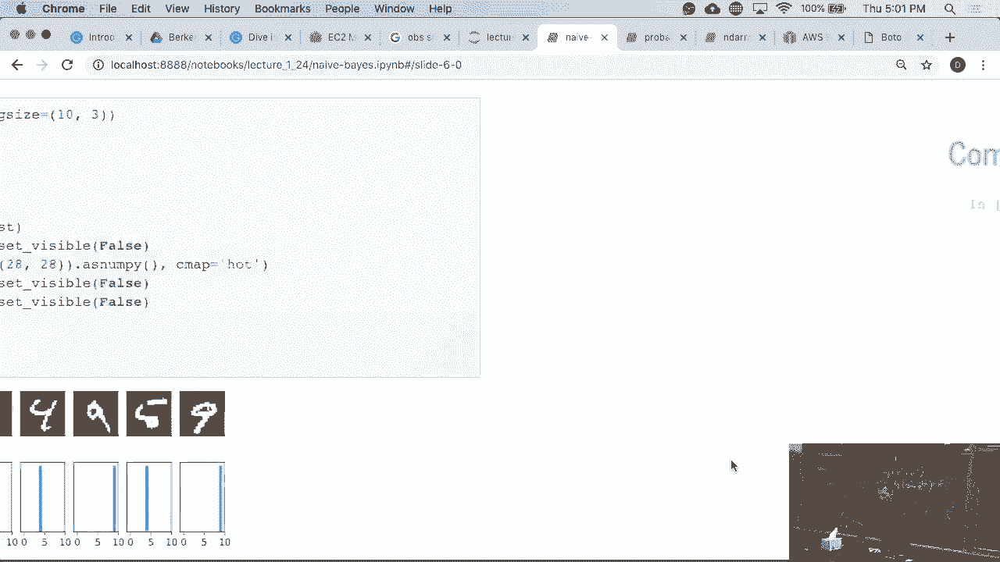
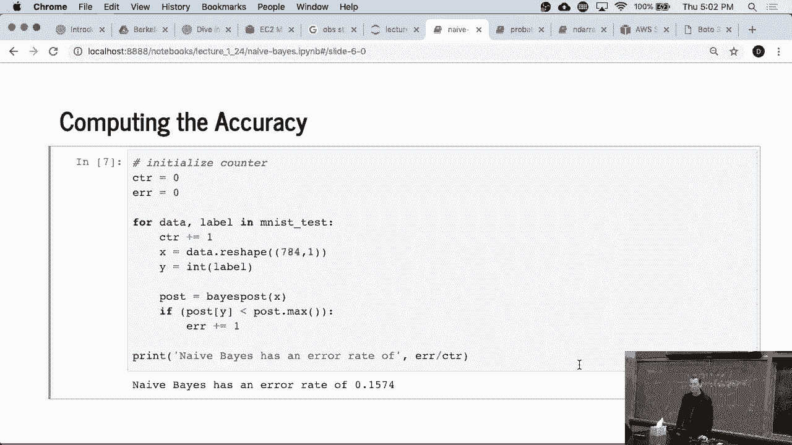

# 11：朴素贝叶斯分类器实践 🧮



在本节课中，我们将学习如何使用朴素贝叶斯算法对经典的MNIST手写数字数据集进行分类。我们将从加载数据开始，计算必要的统计量，然后基于一个“朴素”的独立性假设来构建分类器，并观察其效果。

---

## 数据准备与导入



首先，我们需要导入必要的库并加载数据。我们将使用MXNet、DRA以及NumPy。MNIST数据集是一个包含手写数字图像的标准数据集。

```python
import mxnet as mx
import numpy as np
# 假设存在一个标准的图像加载器来加载MNIST数据
# train_images, train_labels, test_images, test_labels = load_mnist_data()
```

---

## 计算统计量

上一节我们导入了必要的工具，本节中我们来看看如何为朴素贝叶斯分类器计算核心的统计量。我们需要计算两类统计量：类别`y`的先验概率，以及每个像素在给定类别下的条件概率。



以下是计算这些统计量的步骤：

1.  **初始化统计数组**：`y_count`用于记录每个数字（0-9）出现的次数，维度为10。`x_count`用于记录在每个类别下，每个像素点（共28x28=784个）被激活（即显示为黑色）的次数，维度为 `10 x 784`。
2.  **遍历训练数据**：对于每一张训练图像及其对应的标签，我们进行以下操作：
    *   在`y_count`中，将该标签对应的计数加1。
    *   在`x_count`中，找到该标签对应的那一行（即一个784维的向量），然后将图像中每个激活的像素位置在该向量中的计数加1。
3.  **计算概率**：遍历完成后，将`y_count`除以总样本数，得到每个类别的先验概率 `P(y)`。将`x_count`的每一行（对应一个类别）除以该类别的总样本数（即`y_count`中对应的值），得到在每个类别下，每个像素被激活的条件概率 `P(x_i | y)`。

通过这个过程，我们得到了分类所需的所有概率信息。`P(y)`代表了每个数字出现的普遍程度，而 `P(x_i | y)` 则像是一个“平均模板”，展示了数字`y`通常在每个像素点上的样子。

---



## 构建分类器与“朴素”假设



有了统计概率后，我们就可以对新图像进行分类了。分类的核心思想是贝叶斯定理：对于一张新图像`X`，我们计算它属于每个类别`y`的后验概率 `P(y | X)`，然后选择概率最大的类别作为预测结果。

根据贝叶斯定理，后验概率计算公式为：
`P(y | X) ∝ P(y) * Π P(x_i | y)`

请注意公式中的连乘符号`Π`。这里就引入了“朴素贝叶斯”的核心假设：**我们假设图像中每个像素的出现是相互独立的**。这个假设显然不符合现实（相邻像素之间高度相关），但它极大地简化了计算，让我们可以将所有像素的条件概率直接相乘来得到联合概率。

---

## 实践中的数值问题与解决方案

在代码实践中，直接使用概率相乘会遇到严重的数值问题。因为784个介于0到1之间的概率连续相乘，结果会是一个极其接近0的小数，可能导致计算机浮点数下溢，得到错误的结果。



以下是演示这一问题和解决方案的代码逻辑：

```python
# 错误示范：直接使用概率相乘
# 对于测试图像X（由0和1组成），计算其属于类别y的“得分”
# 对于X中像素值为1的位置，取 P(x_i=1 | y)
# 对于X中像素值为0的位置，取 1 - P(x_i=1 | y)
score_naive = prior_prob[y] * np.prod(conditional_probs)
# 这种方法会导致数值下溢，得到无意义的结果。

# 正确做法：使用对数概率相加
# 利用对数将乘法转换为加法，避免极小数的运算。
log_score = np.log(prior_prob[y]) + np.sum(np.log(conditional_probs))
# 最后，通常比较各个类别的 log_score，最大值对应的类别即为预测结果。
```



当我们使用对数概率并执行加法运算后，分类器立刻开始正常工作。我们可以观察到，对于测试图像，分类器能为正确的类别分配较高的对数概率得分。

---



## 模型评估与总结



运行完整的分类代码后，我们可以在测试集上评估模型的性能。朴素贝叶斯在这个任务上能达到大约85%的准确率，这意味着有大约15%的误差。

这是一个重要的基线模型。它原理简单，实现快速，并且在独立性假设合理或近似满足时效果不错。然而，正如我们将要在后续课程中看到的，更复杂的模型（如深度神经网络）能够显著超越这个基线，因为它们能够建模像素之间复杂的相关关系。



本节课中我们一起学习了：
1.  如何为朴素贝叶斯分类器计算先验概率和条件概率。
2.  理解并应用了“特征条件独立性”这一核心假设。
3.  在实践中使用对数概率来避免数值计算中的下溢问题。
4.  在MNIST数据集上实现并评估了一个朴素贝叶斯分类器，建立了性能基线。

感谢你的学习，我们将在接下来的课程中探索更强大的模型。