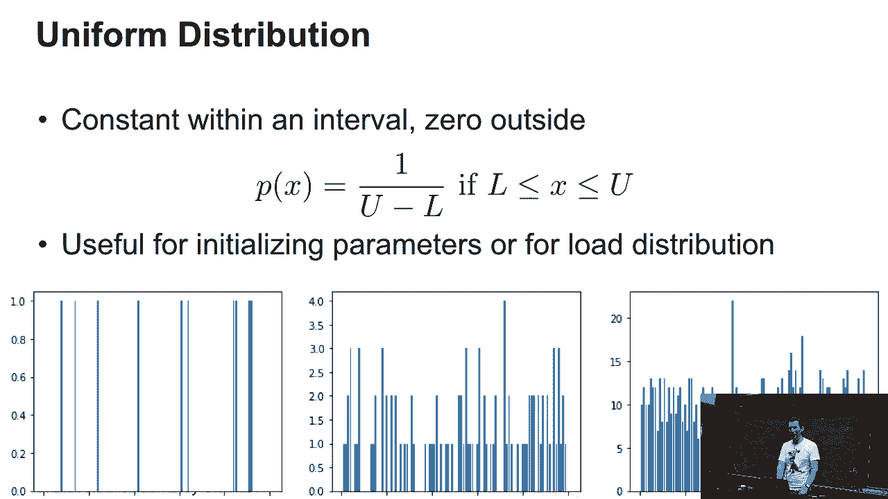
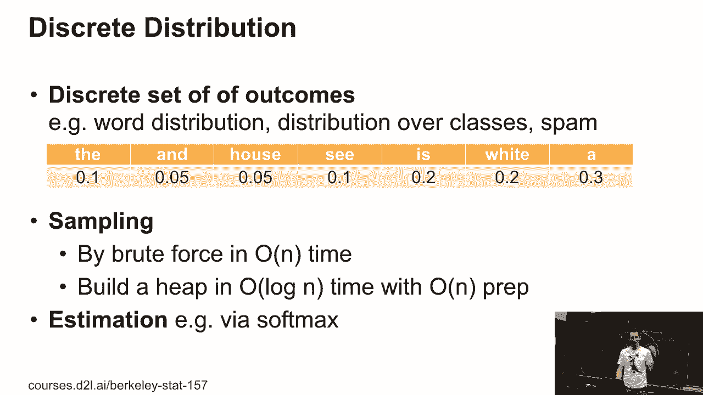
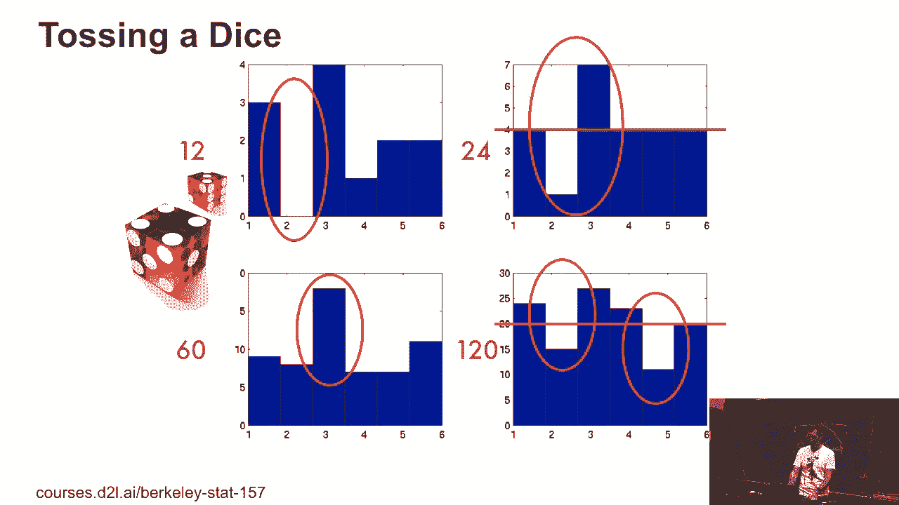
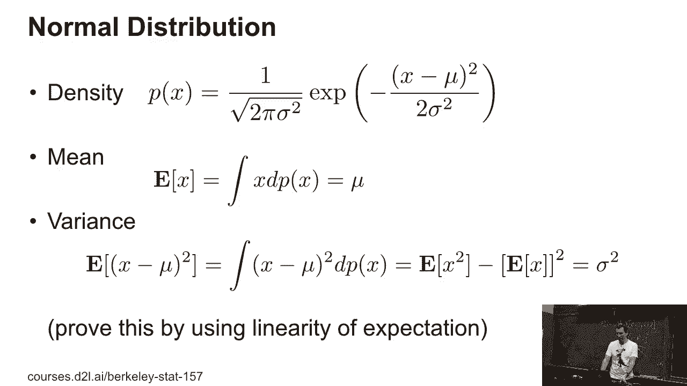
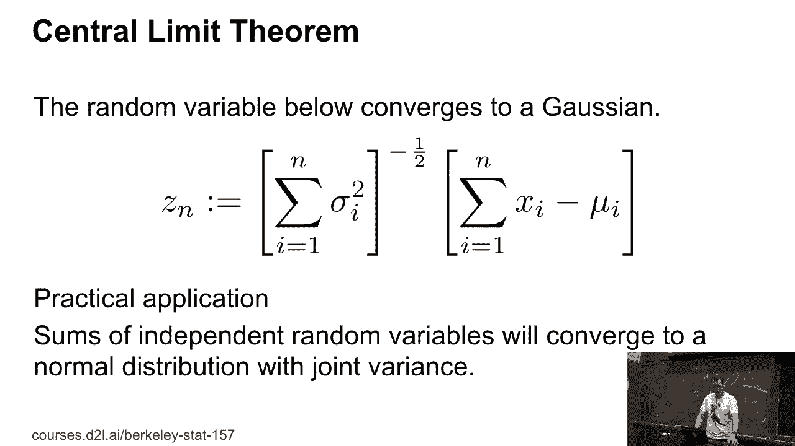

# 12：L3_1 抽样 📊


在本节课中，我们将要学习抽样的基本概念与方法。我们将从最简单的均匀分布开始，逐步深入到离散分布和正态分布的抽样，并探讨中心极限定理等核心理论。最后，我们会将理论付诸实践，进行简单的代码实现。

***

## 均匀分布抽样 🎲



上一节我们介绍了课程概述，本节中我们来看看最简单的抽样分布——均匀分布。

均匀分布非常简单。在均匀分布中，有一个从下界 `L` 到上界 `U` 的区间。在这个区间内，所有值出现的概率相等；超出这个区间，概率为零。典型的均匀随机数生成器就是基于此原理。

如果从中抽取10次、100次，然后重复1000次，结果会开始看起来越来越均匀，但并非完全均匀。如果绘制得足够精细，线条会非常窄，但量化后仍可能看到某些地方略高。这本质上就是从均匀分布中抽样的结果。

***

## 离散分布抽样 📝

上一节我们介绍了均匀分布抽样，本节中我们来看看如何从离散分布中抽样。

这是一个非常简单的语言模型，包含六个词：`the`、`and`、`how`、`C`、`is`、`white`、`A`。每个词都被赋予了一个出现概率，例如某个词的概率是10%，另一个词是5%。我们可以通过线性时间复杂度的暴力方法从这个分布中抽样。

以下是具体步骤：
1.  首先假设所有概率之和为1。
2.  生成一个介于0和1之间的随机数 `r`。
3.  遍历概率数组，依次从 `r` 中减去每个概率值。
4.  当 `r` 减去某个概率后小于零时，就选择对应的那个词。

这个方法的代价很高，因为如果有 `n` 个结果，平均需要大约 `n/2` 次减法操作。为了优化，可以将概率从大到小排序，这样能减少平均操作次数。更好的方法是构建一个堆（Heap）数据结构，这实际上实现了二分查找，效率更高。

***



## 正态分布与中心极限定理 📈

上一节我们探讨了离散分布的抽样，本节中我们来看看连续分布中最重要的代表——正态分布，以及与之相关的中心极限定理。



正态分布的密度函数为：
```
p(x) = (1 / (σ * √(2π))) * exp(-(x - μ)² / (2σ²))
```
其中，`μ` 是均值，`σ²` 是方差。

方差的计算公式为：
```
Var(X) = E[X²] - (E[X])²
```
这个分解非常有用。例如，在观察一系列样本值 `xi` 时，我们可以分别计算 `x` 的滚动平均值和 `x²` 的滚动平均值，然后利用上述公式计算方差，而无需事先知道均值。

中心极限定理是一个非常有用的性质。假设有一系列独立随机变量 `xi`，各自具有均值 `μi` 和方差 `σi²`。那么，这些随机变量之和的方差等于各个方差之和。如果我们将这些变量重新缩放，使其具有零均值和单位方差，那么在合理的条件下，当变量数量 `n` 趋于无穷大时，其分布会收敛为标准正态分布（高斯分布）。在实践中，这个收敛速度相当快。

***

## 卷积简介 🔄

上一节我们介绍了中心极限定理，本节中我们简要了解一下卷积的概念，因为它与后续的平滑处理等操作相关。

卷积的数学定义如下。对于两个函数 `f` 和 `g`，其卷积 `(f * g)(z)` 定义为：
```
(f * g)(z) = ∫ f(x) * g(z - x) dx
```
它计算的是两个函数重叠区域的积分，其中一个函数被翻转并平移。在信号处理或图像处理中，卷积常被用作滤波器。例如，对相邻采样值进行平均就是一种简单的低通滤波卷积操作。



***

## 动手实践 💻

上一节我们介绍了一些理论基础，本节中让我们实际尝试编码实现。

以下是使用Python进行简单抽样的示例代码框架：

```python
import random
import numpy as np
import matplotlib.pyplot as plt

# 1. 从均匀分布抽样
uniform_samples = [random.uniform(0, 1) for _ in range(1000)]
plt.hist(uniform_samples, bins=30, edgecolor='black')
plt.title("Uniform Distribution Sampling")
plt.show()

# 2. 从自定义离散分布抽样
words = ['the', 'and', 'how', 'C', 'is', 'white', 'A']
probabilities = [0.1, 0.05, 0.05, 0.1, 0.2, 0.3, 0.2] # 示例概率，总和应为1

def sample_from_discrete(choices, probs):
    r = random.random()
    cumulative_prob = 0.0
    for item, prob in zip(choices, probs):
        cumulative_prob += prob
        if r < cumulative_prob:
            return item
    return choices[-1] # 防止浮点数误差

# 抽样多次并统计
samples = [sample_from_discrete(words, probabilities) for _ in range(1000)]
from collections import Counter
print(Counter(samples))

# 3. 从正态分布抽样及中心极限定理演示
normal_samples = np.random.normal(loc=0, scale=1, size=1000)
plt.hist(normal_samples, bins=30, edgecolor='black', density=True)
plt.title("Normal Distribution Sampling")
plt.show()

# 演示中心极限定理：多个均匀分布之和趋近正态分布
num_samples = 10000
num_uniforms = 12  # 使用12个均匀分布变量求和
clt_samples = [sum([random.uniform(0,1) for _ in range(num_uniforms)]) for _ in range(num_samples)]
# 重新缩放，使其均值为0，方差为1
clt_samples = np.array(clt_samples)
clt_samples = (clt_samples - clt_samples.mean()) / clt_samples.std()
plt.hist(clt_samples, bins=30, edgecolor='black', density=True)
plt.title("Central Limit Theorem Demo (Sum of Uniform Variables)")
plt.show()
```

***



本节课中我们一起学习了抽样的核心知识。我们从**均匀分布**的抽样开始，理解了其基本思想。接着，我们探讨了**离散分布**的抽样方法，包括暴力法和基于堆的优化方法。然后，我们深入研究了**正态分布**的特性、方差计算以及强大的**中心极限定理**。最后，我们简要了解了**卷积**的概念，并通过代码实践巩固了所学内容。掌握这些抽样原理是进行模拟、估计和许多机器学习算法的基础。