# 13：L3_2 Jupyter中的采样 📊

在本节课中，我们将学习如何在Jupyter Notebook中使用Python进行随机采样。我们将从生成简单的随机数开始，逐步探索均匀分布、分类分布以及正态分布的采样过程，并观察大数定律和中心极限定理的实际效果。

---

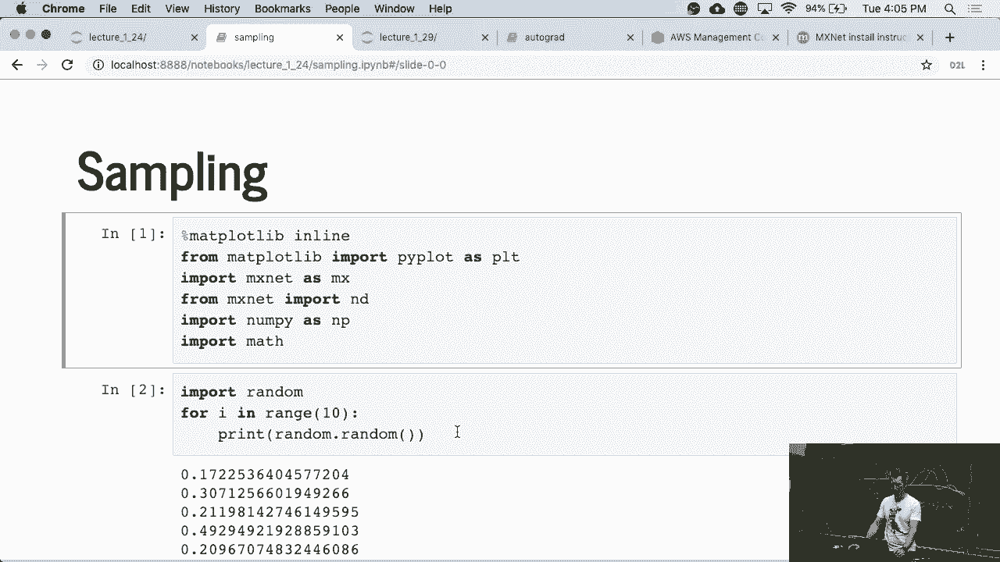

## 生成随机数

首先，我们来看看如何生成基本的随机数。在Python中，我们可以使用`random`模块来生成伪随机数。

以下是生成0到1之间随机浮点数的方法：

```python
import random
random_number = random.random()
```

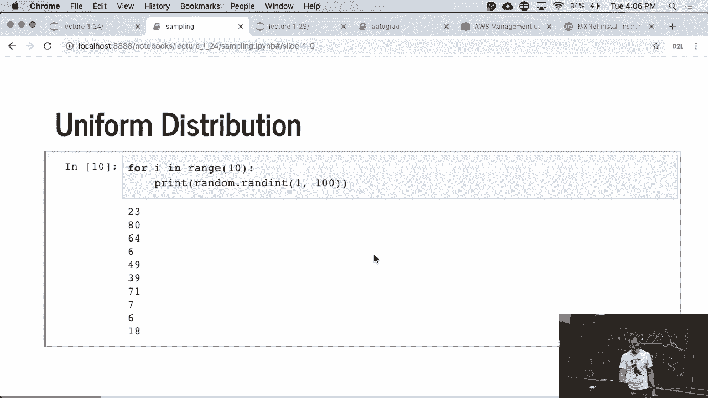

这个生成器在CPU或GPU上运行高效，虽然不是统计学或密码学上最纯粹的随机源，但速度很快。

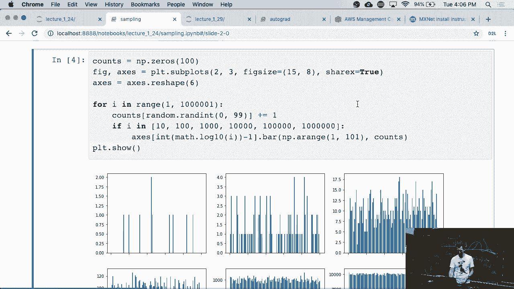


生成的结果就是一些0到1之间的数字，没有特别之处。

---

## 生成随机整数

上一节我们介绍了生成随机浮点数，本节中我们来看看如何生成随机整数。

以下是生成指定范围内随机整数的方法：

```python
random_integer = random.randint(1, 100)
```

这段代码会生成一个1到100之间（包含1和100）的随机整数。在实际测试中，你可能会得到重复的数字，例如两次得到1，这是随机过程的正常现象。

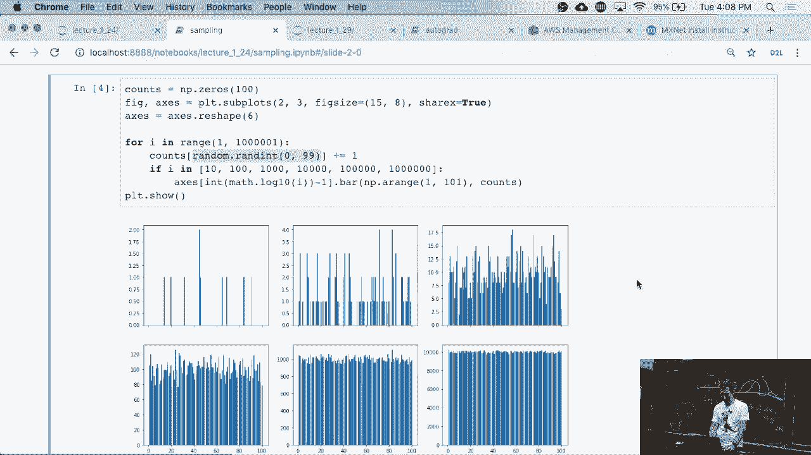


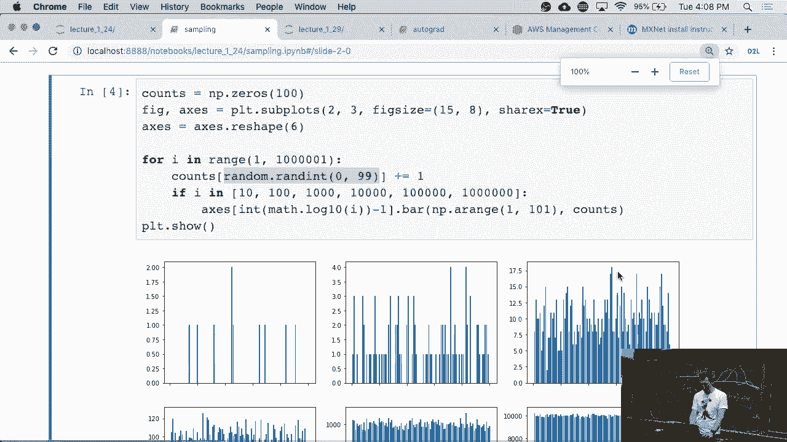

---

## 可视化均匀分布采样

为了理解随机采样的效果，我们可以通过可视化来观察。我们将生成大量随机整数，并统计每个数字出现的频率。

以下是实现步骤：
1.  初始化一个包含100个区间的列表（对应数字0到99），计数初始为0。
2.  生成大量（例如100万个）0到99之间的随机整数。
3.  每生成一个随机数，就将其对应区间的计数加1。
4.  在不同采样次数（如10次、100次、1000次等）时，绘制频率分布图。

由于Python索引从0开始，我们的区间也对应0到99。随着采样次数增加（例如达到百万次），频率分布图会变得相对平滑；而采样次数较少（如10次）时，分布则显得不均匀。


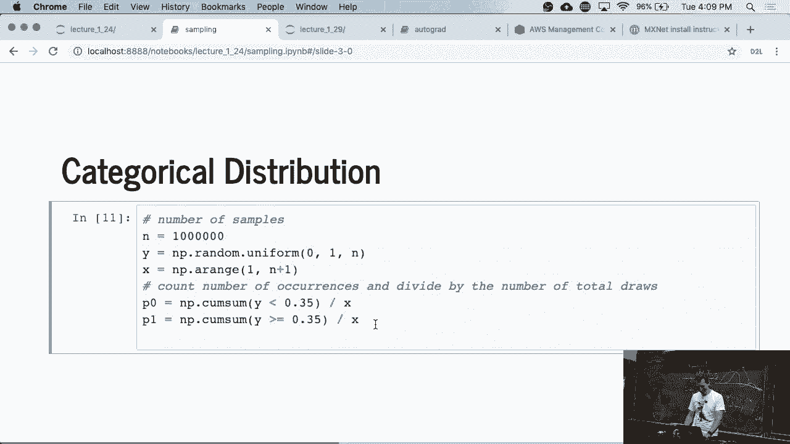

---

## 模拟分类分布

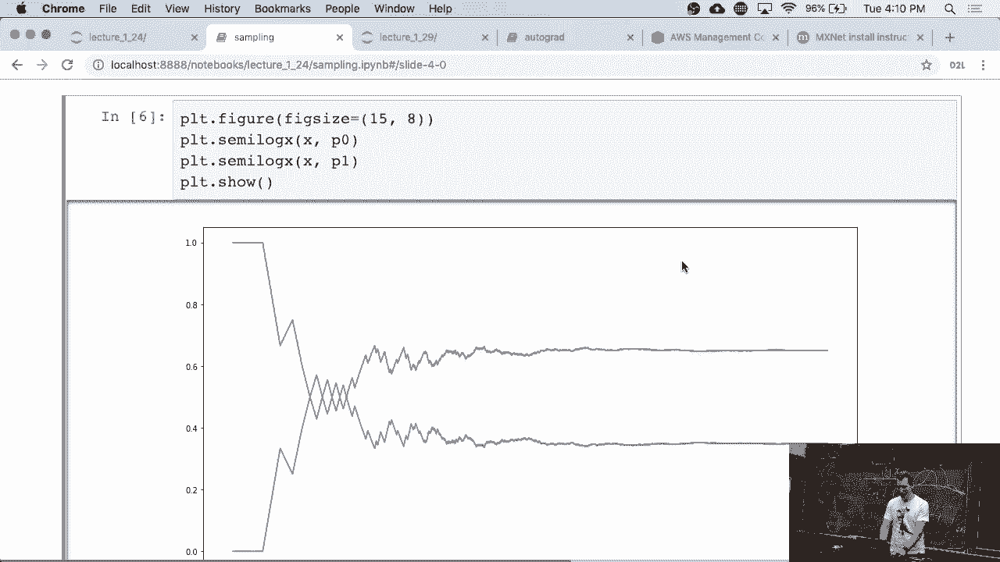

接下来，我们模拟一个简单的分类分布，例如模拟一枚有偏硬币的投掷。

我们设定结果为0的概率是0.35，结果为1的概率是0.65。采样逻辑是：生成一个0到1的随机数，如果它小于0.35，则输出0，否则输出1。

为了提高效率，我们避免使用循环，而是利用数组进行批量操作。我们生成一百万个随机数，并一次性判断它们是否大于0.35。

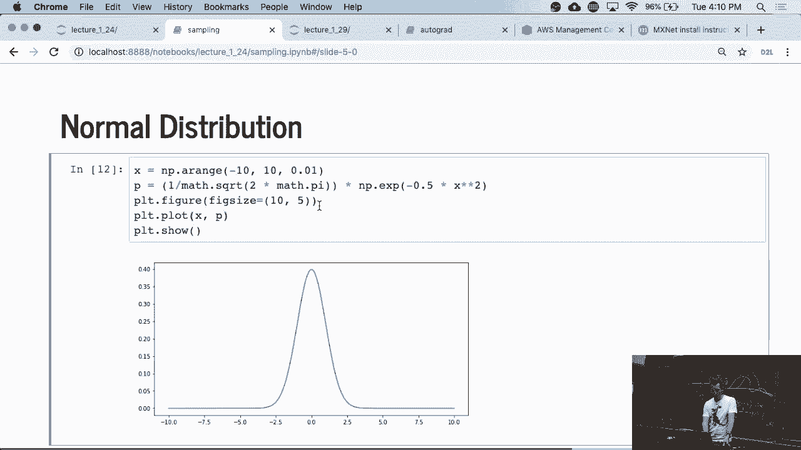

```python
import numpy as np
samples = np.random.rand(1000000)
results = (samples >= 0.35).astype(int)
```

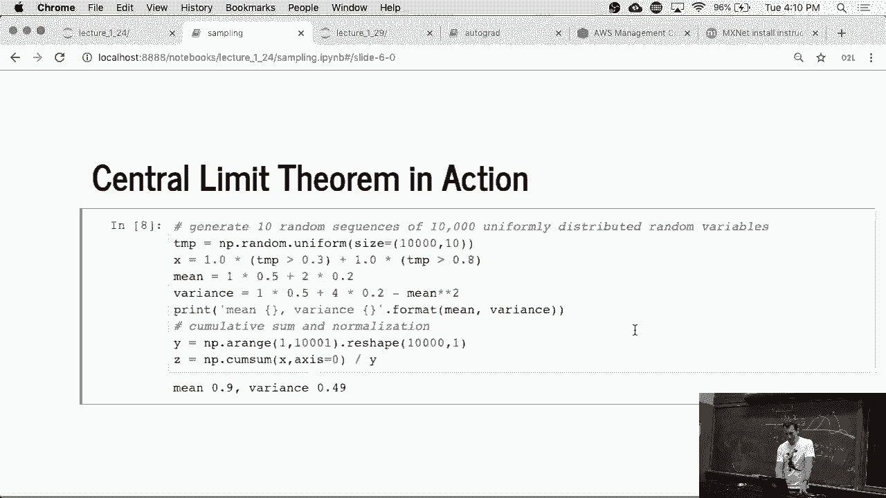

然后，我们计算结果中0和1的比例。绘制结果后可以看到，比例最初会有波动，但随着样本量增大，最终会稳定在0.35和0.65附近，符合大数定律。


---

## 正态分布与中心极限定理

最后，我们探讨正态分布，并观察中心极限定理。

首先，我们可以绘制标准正态分布的概率密度函数图。创建一个从-10到10、间隔为0.01的网格，然后计算每个点对应的函数值并绘图。


现在，我们通过一个例子来观察中心极限定理。我们定义一个随机变量，它有如下分布：
*   以概率0.3取值为0。
*   以概率0.5取值为1。
*   以概率0.2取值为2。

我们进行多次实验，每次实验抽取大量样本（例如10组，每组10000个样本），并计算每组样本的平均值。

以下是计算每组样本均值的核心逻辑：
```python
# 生成随机数数组
temp = np.random.rand(10000, 10)
# 根据阈值分配值：<0.3为0， >=0.3且<0.8为1， >=0.8为2
results = (temp >= 0.3).astype(int) + (temp >= 0.8).astype(int)
# 计算每组（每列）的平均值
means = results.mean(axis=0)
```

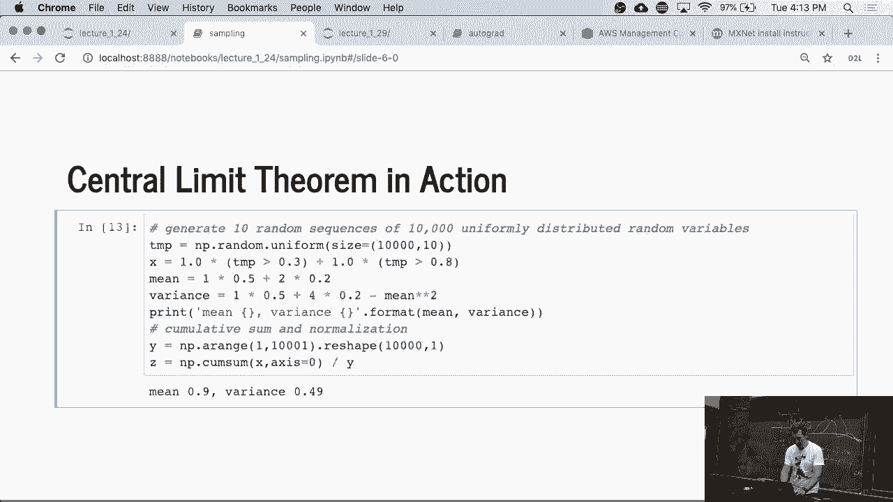

这个随机变量的理论均值可以通过公式计算：
**均值 = 0.5 * 1 + 0.2 * 2 = 0.9**

我们打印出10次实验得到的样本均值。从图表中可以看到，所有样本均值都汇聚在理论均值0.9附近。同时，图表也显示了均值的波动范围，这有助于理解抽样误差。

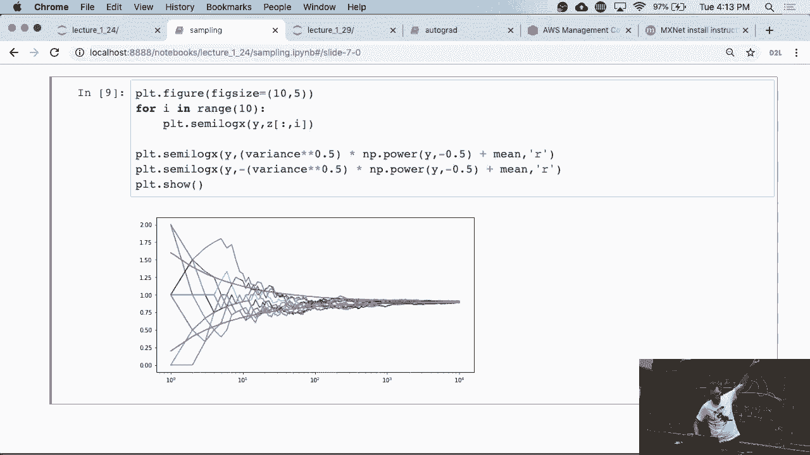


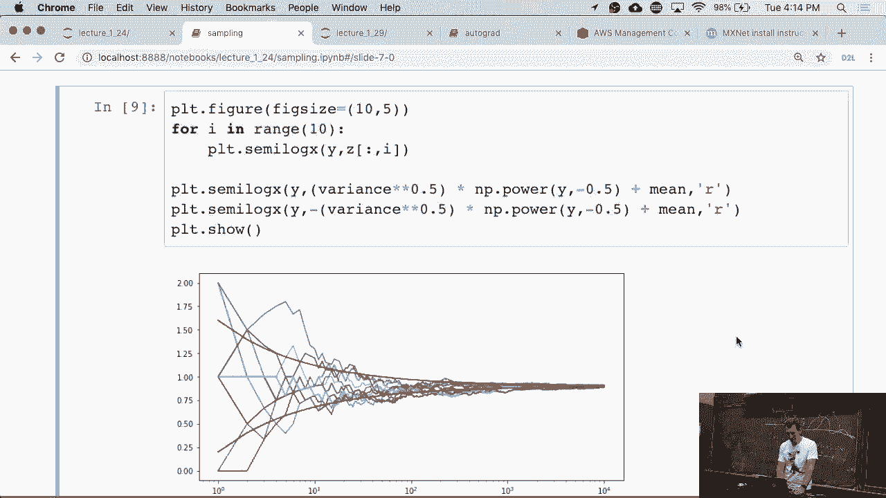

---

## 总结


本节课中我们一起学习了在Jupyter Notebook中进行随机采样的多种方法。我们从生成基本随机数开始，逐步实现了对均匀分布、分类分布的采样和可视化，并最终通过实例观察了中心极限定理的实际表现，即大量独立随机样本的均值会收敛于理论期望值。