# 14：在AWS上设置GPU实例 🚀

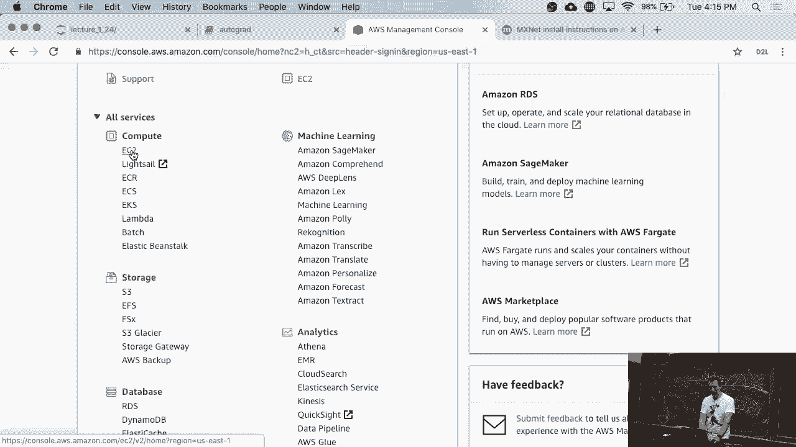

在本节课中，我们将学习如何在亚马逊AWS云平台上启动并配置一个带有GPU的实例，用于运行深度学习任务。我们将涵盖从选择实例类型、设置竞价实例、配置存储、安装必要软件到通过SSH连接和端口转发访问Jupyter Notebook的全过程。

---

## 概述

我们将逐步完成在AWS上启动一个GPU实例的流程。核心步骤包括：访问AWS控制台、选择正确的深度学习AMI和GPU实例类型、理解并设置竞价实例、配置持久化存储、通过SSH连接到实例、安装CUDA和Conda环境，最后设置端口转发以在本地浏览器中访问云端的Jupyter Notebook。

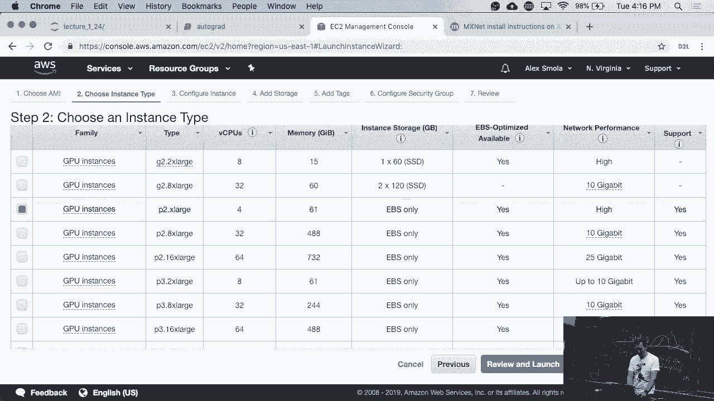

---

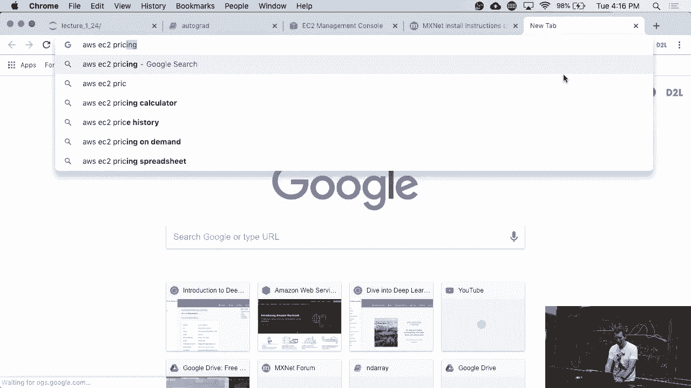

## 访问AWS并启动实例

首先，访问AWS官方网站（aws.amazon.com）并登录控制台。


在控制台中，启动一个新实例。为了运行需要GPU的任务，必须选择预装了深度学习框架的基础镜像和包含GPU的实例类型。

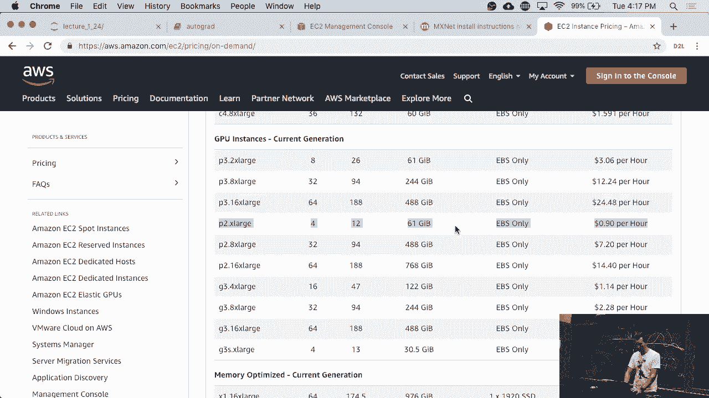

*   选择 **“深度学习基础Ubuntu版本15.0”** 作为亚马逊机器镜像（AMI）。
*   实例类型不要选择T2系列，因为该系列不包含GPU。我们将选择 **P2 Xlarge实例**，它配备了一块GPU，足以应对大多数计算任务。

---

## 理解竞价实例与定价

上一节我们选择了实例类型，本节中我们来看看如何以更经济的价格获取计算资源。

AWS提供“竞价实例”，它们是未被充分利用的闲置计算资源，通过拍卖机制以较低价格提供。其价格远低于“按需实例”。


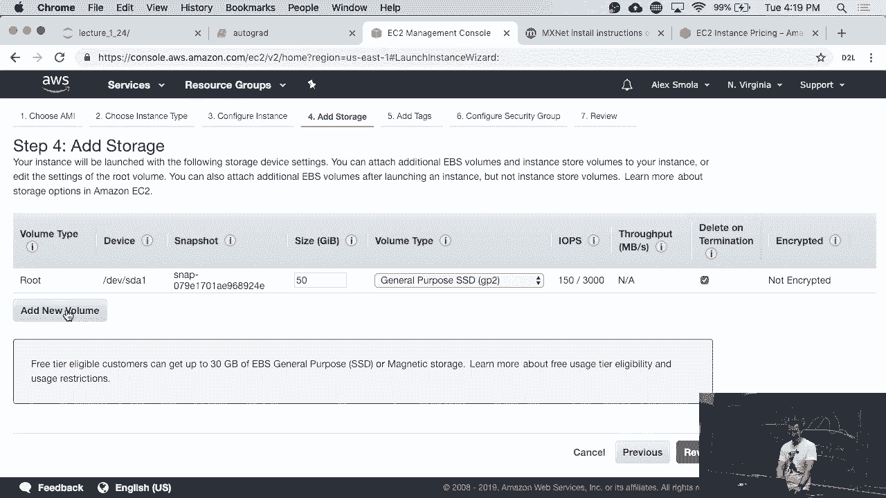

以下是关于竞价实例的关键点：

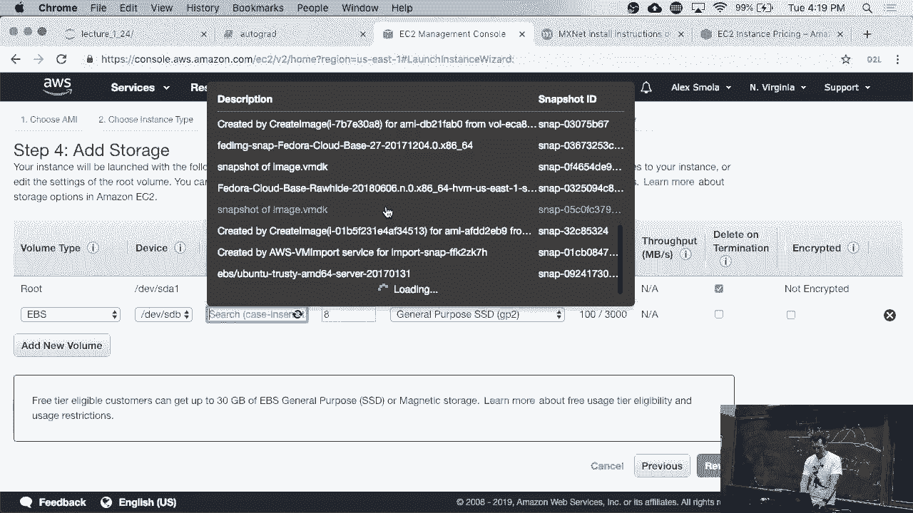

*   **价格波动**：竞价实例的价格会随供需变化。例如，P2 Xlarge实例的按需价格约为每小时0.90美元，而竞价价格可能在0.30至0.37美元之间。
*   **可能被中断**：如果资源需求增加，出价更高的用户或按需用户可能会占用资源，导致你的实例被终止。但好消息是，被中断前的最后一小时不会计费。
*   **出价策略**：你可以设置一个愿意支付的最高价格。实际支付的价格通常等于或低于你的出价，类似于“第二价格拍卖”机制。我们出价 **`$0.50`** 以确保实例稳定。


---

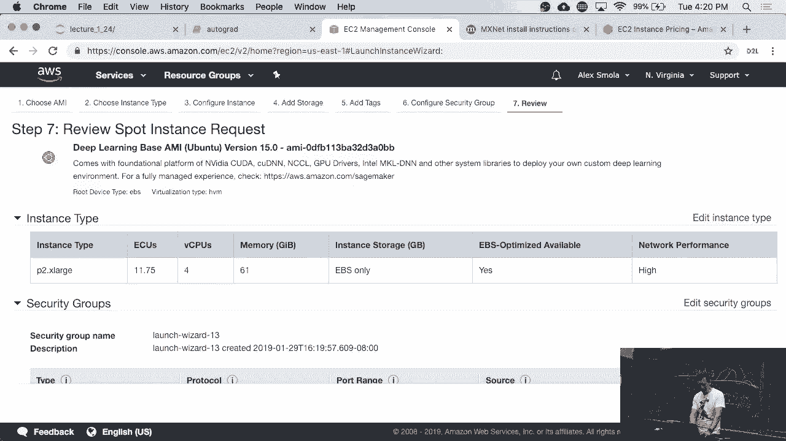

## 配置存储与安全

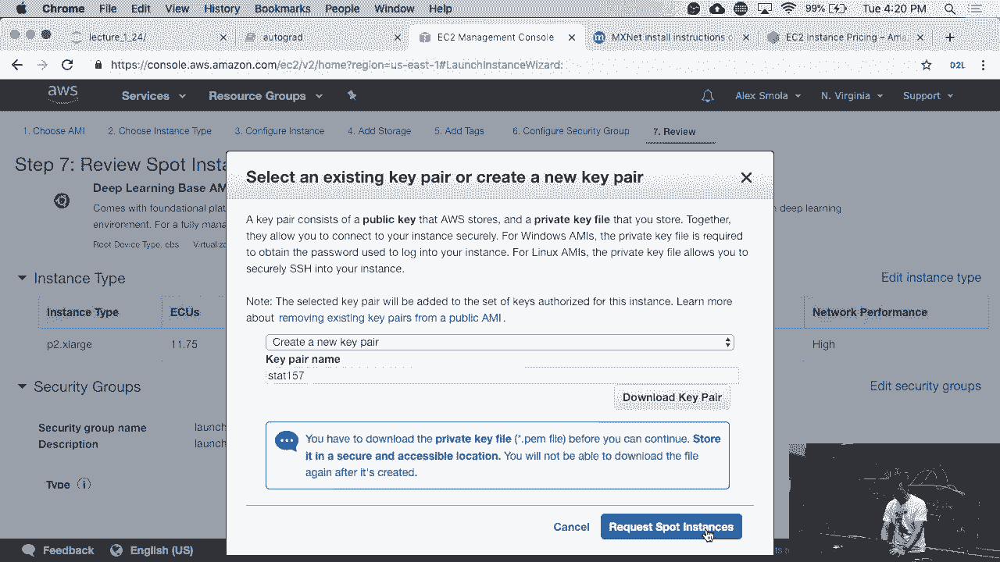

实例的计算能力配置好后，我们需要为其添加存储空间并处理安全设置。

在配置存储步骤中，默认的50GB根卷在实例终止时会丢失。因此，我们需要添加一个独立的持久化存储卷。


以下是存储配置步骤：

1.  添加一个新卷，它就像可插拔的USB驱动器，数据会持久保存。
2.  可以为此卷创建快照以便备份和重复使用。


在安全组设置中，为了简化教程，我们暂时开放所有端口。在实际生产环境中，应严格限制访问权限。

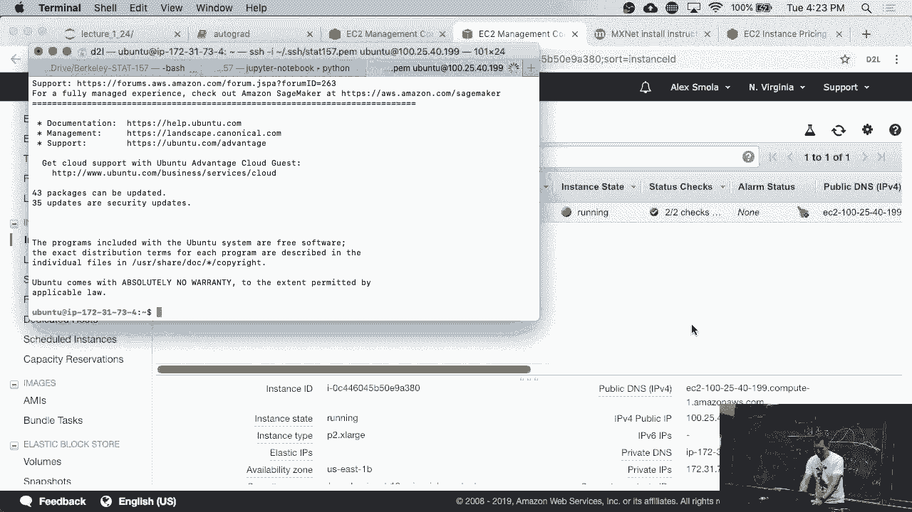

最后，系统会提示创建或选择密钥对（Key Pair）用于SSH连接。我们创建一个新密钥对（例如 `start157.pem`）并下载到本地。


提交请求后，竞价实例开始启动。


---

## 通过SSH连接到实例

实例启动后，我们需要通过SSH从本地计算机连接到它。

首先，在本地终端中，确保SSH密钥文件权限正确，只有所有者可读。

```bash
chmod 400 start157.pem
```

然后，使用以下命令格式进行连接，将 `<PUBLIC_IP>` 替换为你的实例公有IP地址。

```bash
ssh -i start157.pem ubuntu@<PUBLIC_IP>
```

首次连接时，系统会询问是否信任该主机，输入 `yes` 继续。

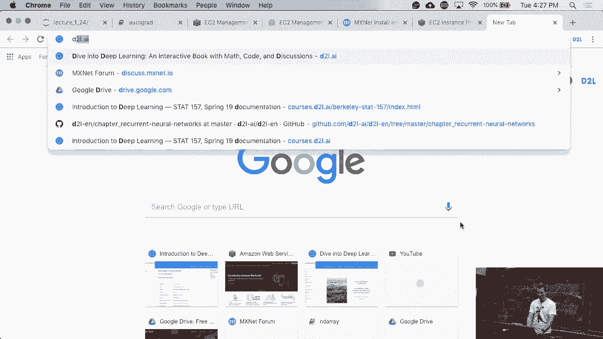

---

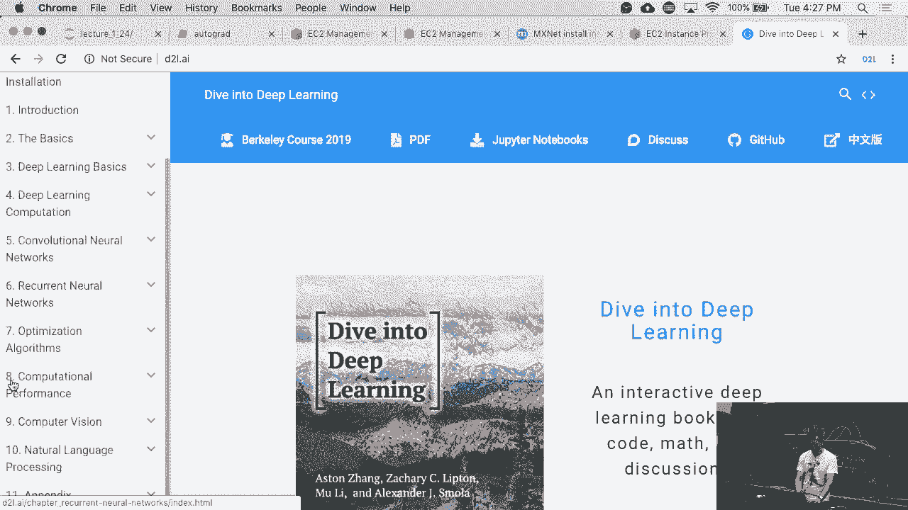

## 在实例上安装软件环境

成功连接到实例后，我们需要配置深度学习所需的软件环境，特别是正确版本的CUDA。

预装的AMI可能包含多个CUDA版本。我们需要确保系统使用CUDA 10.0。

以下是安装和配置步骤：

1.  **检查并切换CUDA版本**：根据论坛安装说明，创建符号链接将系统默认CUDA指向所需版本。
    ```bash
    sudo ln -s /usr/local/cuda-10.0 /usr/local/cuda
    ```
2.  **验证GPU和CUDA**：运行 `nvidia-smi` 命令，确认GPU（如K80）被识别，且CUDA版本显示为10.0。
3.  **创建Conda环境**：使用包含CUDA 10.0依赖的 `environment.yml` 文件创建环境。
    ```bash
    conda env create -f environment.yml
    source activate gluon
    ```

环境安装需要一些时间。在此期间，我们可以进行下一步操作。

---

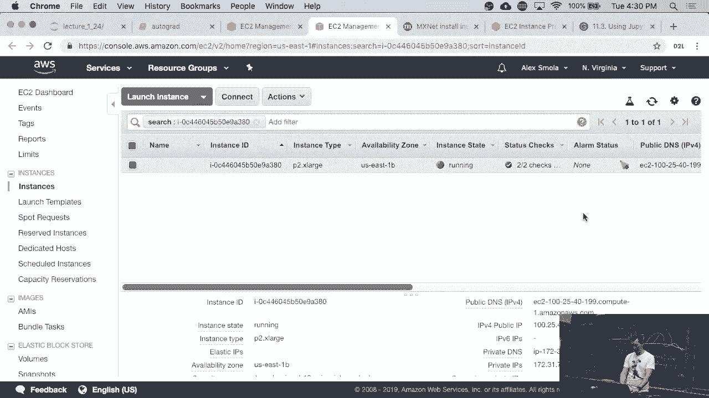

## 设置端口转发以访问Jupyter

为了在本地浏览器中方便地使用实例上运行的Jupyter Notebook，我们需要设置SSH端口转发。

由于本地可能已有服务占用了Jupyter默认的8888端口，我们将其转发到另一个端口（如8890）。

端口转发命令格式如下：

```bash
ssh -i start157.pem -L 8890:localhost:8888 ubuntu@<PUBLIC_IP>
```

此命令将实例上的8888端口映射到本地的8890端口。

连接成功后，在实例上激活Conda环境并启动Jupyter Notebook（需设置无浏览器模式）。

```bash
source activate gluon
jupyter notebook --no-browser
```

启动后，Jupyter会输出一个带有token的URL。将其中的 `localhost:8888` 改为 `localhost:8890`，然后在本地浏览器中打开即可访问云端的Notebook。

---

## 配置持久化数据盘

考虑到我们使用的是可能被中断的竞价实例，将重要数据存储在独立的持久化卷上至关重要。

之前我们附加了一个卷（如 `/dev/xvdb`），现在需要对其进行分区、格式化并挂载。

以下是配置持久化数据盘的步骤：

1.  **查看磁盘**：使用 `lsblk` 或 `sudo fdisk -l` 确认附加的磁盘（如 `/dev/xvdb`）。
2.  **创建分区**：
    ```bash
    sudo fdisk /dev/xvdb
    # 在交互界面中，依次输入：n (新建), p (主分区), 1 (分区号)，其余默认，最后 w (写入)
    ```
3.  **格式化分区**：
    ```bash
    sudo mkfs -t ext4 /dev/xvdb1
    ```
4.  **创建挂载点并挂载**：
    ```bash
    sudo mkdir /home/ubuntu/payload
    sudo mount /dev/xvdb1 /home/ubuntu/payload
    ```
5.  **设置权限**（简化示例，生产环境应更严格）：
    ```bash
    sudo chmod a+rwx /home/ubuntu/payload
    ```

现在，你可以将实验数据和Notebook文件保存在 `/home/ubuntu/payload` 目录下，即使实例终止，数据也会保留在卷中。

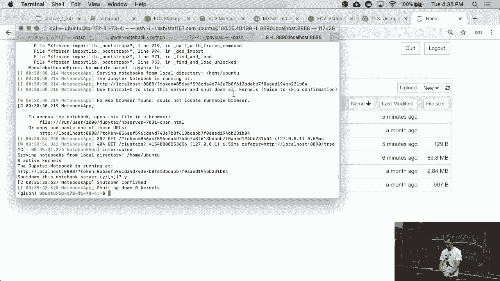

---

## 结束使用与成本控制

完成实验后，应妥善关闭资源以避免产生不必要的费用。

以下是收尾步骤：

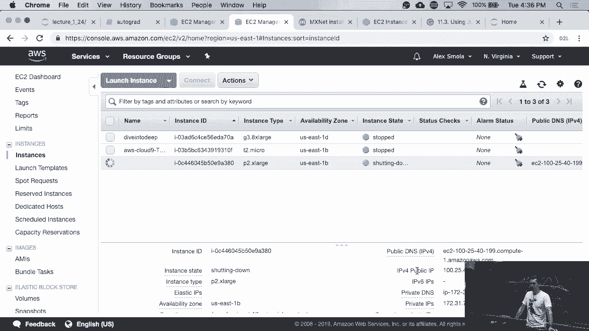

1.  在Jupyter Notebook界面中正常关闭所有笔记本并停止服务器。
2.  在SSH终端中，按 `Ctrl+C` 停止Jupyter进程，然后输入 `exit` 退出SSH连接。
3.  返回AWS控制台，找到正在运行的实例。
4.  选择该实例，点击 **“操作” -> “实例状态” -> “终止”**。


实例终止后，按需实例的计费会停止。竞价实例则根据实际运行小时数和你最终成交的价格计费。记住，你为竞价实例支付的价格不会高于你的出价，且通常是当时的市场成交价。

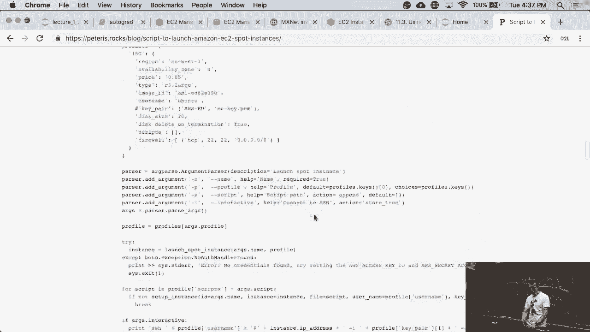

**高级提示**：你可以将整个设置过程（包括启动特定类型的竞价实例、附加卷、运行安装脚本等）编写成Shell脚本或使用AWS CloudFormation等工具自动化。这样，每次只需运行一个命令，就能在几分钟内获得一个完全配置好的深度学习环境。

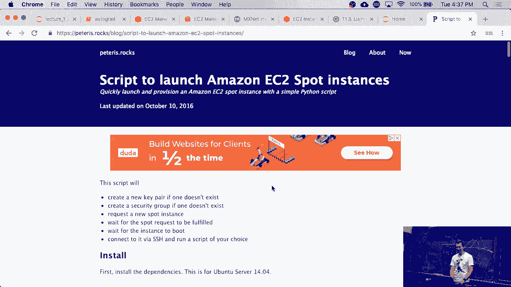

---

## 总结

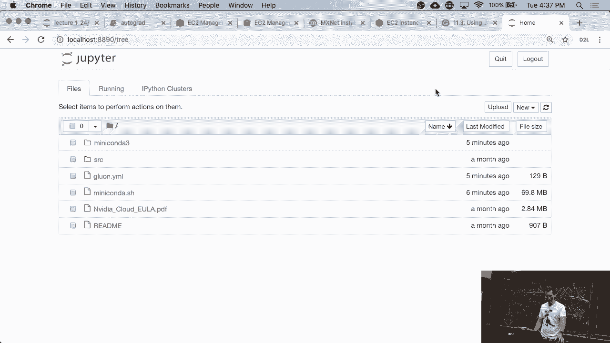

本节课中我们一起学习了在AWS云平台上配置和使用GPU实例的完整流程。我们从登录控制台、选择深度学习AMI和P2 GPU实例开始，理解了竞价实例的经济模型和风险。随后，我们为实例添加了持久化存储，通过SSH密钥安全连接到实例，并在实例上安装了正确的CUDA版本和Conda环境。最后，我们通过SSH端口转发在本地浏览器中访问了云端的Jupyter Notebook，并学会了如何配置独立的数据盘来保存重要工作。记住，使用完毕后及时终止实例是控制成本的关键。通过将这些步骤脚本化，你可以高效地重复这一过程。